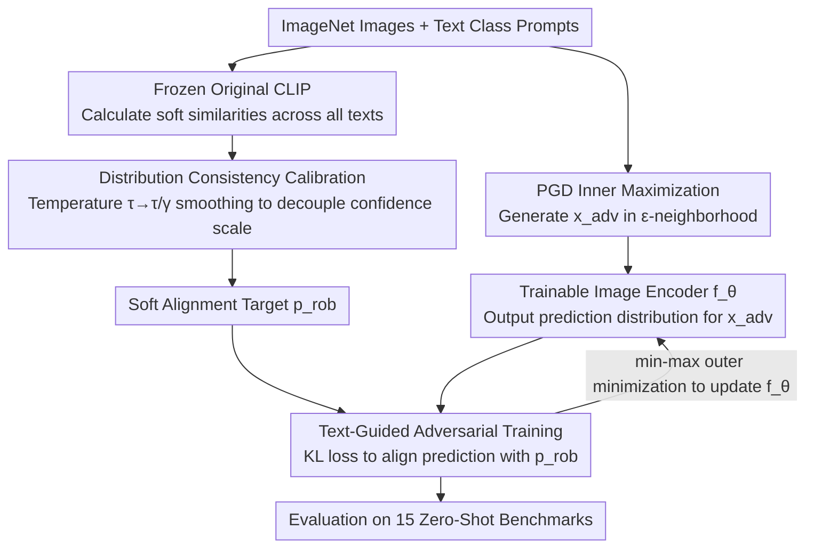

# AGFT: Alignment-Guided Fine-Tuning for Zero-Shot Adversarial Robustness of Vision-Language Models

**Conference**: CVPR 2026  
**arXiv**: [2603.29410](https://arxiv.org/abs/2603.29410)  
**Code**: [GitHub](https://github.com/YuboCui/AGFT)  
**Area**: Multimodal VLM / Adversarial Robustness  
**Keywords**: Adversarial Robustness, Vision-Language Models, Zero-Shot Generalization, Alignment Guidance, Distribution Consistency Calibration

## TL;DR
AGFT proposes an alignment-guided fine-tuning framework that enhances zero-shot adversarial robustness of VLMs through text-guided adversarial training and distribution consistency calibration. By preserving the pre-trained cross-modal semantic structure, it achieves an average robust accuracy of 46.57% across 15 zero-shot benchmarks, surpassing SOTA by 3.1 percentage points.

## Background & Motivation
**Background**: VLMs such as CLIP demonstrate strong zero-shot capabilities but are extremely vulnerable to adversarial perturbations (CLIP robust accuracy is only 6.24% under zero-shot conditions).

**Limitations of Prior Work**:
   - Existing methods (TeCoA, GLADIATOR) employ classification-guided adversarial fine-tuning, using hard label supervision to push features toward target classes.
   - This approach **disrupts the pre-trained cross-modal alignment structure**, distorting fine-grained semantic correspondence between images and text, which leads to a decline in zero-shot generalization.

**Key Challenge**: Enhancing adversarial robustness requires modifying the visual feature space, yet these modifications typically destroy the cross-modal semantic structure CLIP relies on for generalization. How to balance "robustness" and "alignment"?

**Key Insight**: Instead of fine-tuning the VLM as a classifier, this work maintains its essence as a cross-modal alignment model—using probability predictions from the original model as soft supervision to guide adversarial features to align with text embeddings.

**Core Idea**: Replacing hard labels with soft alignment distributions + temperature calibration to eliminate confidence scale mismatch = adversarial training that preserves cross-modal structures.

## Method

### Overall Architecture
AGFT maintains the CLIP network architecture and modifies the supervision target of adversarial training from hard labels to a "soft alignment distribution." The pipeline follows a standard min-max adversarial training: the inner loop uses PGD within an $\epsilon$-neighborhood to generate the hardest adversarial samples $\mathbf{x}_{adv}$, while the outer loop fine-tunes the image encoder to ensure its predictions on adversarial samples match the target distribution. The uniqueness lies in this target distribution—it is provided by a **frozen original CLIP** as the soft similarity distribution of the image across all candidate texts, which is then smoothed via temperature calibration to serve as the soft supervision $\mathbf{p}_{rob}$. Only the image encoder is updated (text encoder frozen), and final evaluation is performed on 15 zero-shot datasets. The full min-max objective function is:

$$\min \mathbb{E}_{\mathbf{x} \in \mathcal{D}}\Big[\max_{\mathbf{x}_{adv} \in B(\mathbf{x}, \epsilon)} L(\mathbf{x}_{adv}, \mathbf{t}, \mathbf{p}_{rob}, \tau)\Big]$$

The diagram below illustrates the complete data flow from adversarial sample generation and soft target extraction from the frozen CLIP to the encoder fine-tuning:

### Key Designs

**1. Text-Guided Adversarial Training: Using Soft Probability Distributions Instead of Hard Labels**

Methods like TeCoA and GLADIATOR treat adversarial fine-tuning as a classification problem supervised by hard labels of the correct class. This focus on "right/wrong" discards the relative similarities between the image and other text categories, which is essential to CLIP's cross-modal alignment. AGFT utilizes the frozen original CLIP to calculate a soft probability distribution for each image across all candidate texts as the adversarial training target. Specifically, the similarity between the original model's image $x^i$ and text $t^j$ is normalized by temperature $\tau$:

$$p_{orig}^{i,j} = \frac{\exp(\cos(f_{\theta_{orig}}(x^i), f_\phi(t^j)) / \tau)}{\sum_k \exp(\cos(f_{\theta_{orig}}(x^i), f_\phi(t^k)) / \tau)}$$

During training, a KL divergence loss forces the prediction distribution of the updated image encoder $f_\theta$ on $x_{adv}$ to match this soft target $L = -\mathbb{E}_{i,j}[p_{rob}^{i,j} \log \frac{\exp(\cos(f_\theta(x_{adv}^i), f_\phi(t^j))/\tau)}{\sum_k ...}]$. Because the soft distribution encodes how similar an image is to every text, the fine-tuned feature space is constrained to the semantic structure consistent with the original CLIP, improving robustness without distorting alignment.

**2. Distribution Consistency Calibration: Decoupling Semantic Structure and Confidence Scale via Temperature Scaling**

Directly using $p_{orig}$ as a target carries a hidden risk—it inherits the pre-trained model's confidence scale (absolute magnitude of logits), which may not be suitable for the robust feature space. AGFT scales the temperature from $\tau$ to $\tau/\gamma$ ($\gamma \in (0,1]$) when calculating the target distribution to make it smoother:

$$p_{rob}^{i,j} = \frac{\exp(\cos(f_{\theta_{orig}}(x^i), f_\phi(t^j)) / (\tau/\gamma))}{\sum_k \exp(\cos(f_{\theta_{orig}}(x^i), f_\phi(t^k)) / (\tau/\gamma))}$$

Increasing the effective temperature suppresses over-confident peaks, effectively separating "relative semantic relations" from "confidence scale." Only the former remains as the supervision signal. This step ensures that the soft supervision is not contaminated by scale noise. Since the method only modifies the target distribution without changing the architecture or adding modules, it enhances robustness while preserving CLIP’s alignment.

### Loss & Training
- Fine-tune image encoder only (full parameters), freeze text encoder.
- SGD, lr=$4 \times 10^{-4}$, cosine decay, 10 epochs.
- Adversarial training uses 2-step PGD, $\epsilon \in \{1/255, 2/255, 4/255\}$.
- Hyperparameters $\gamma = 0.4$, $\tau = 1/180$.

## Key Experimental Results

### Main Results (PGD-20, $\epsilon=1/255$ Zero-Shot Robust Accuracy)

| Method | Caltech101 | CIFAR10 | Food101 | ImageNet | STL10 | Avg (15 datasets) |
|------|-----------|---------|---------|----------|-------|------------|
| CLIP (No Defense) | 21.27 | 10.31 | 4.06 | 1.13 | 33.10 | 6.24 |
| TeCoA | 71.83 | 59.85 | 29.01 | 41.29 | 83.33 | 38.51 |
| GLADIATOR | 73.34 | 67.89 | 34.92 | 44.53 | 86.53 | 43.46 |
| **AGFT** | **82.23** | **71.72** | **44.76** | 44.95 | **88.52** | **46.57** |

### Zero-Shot Clean Accuracy

| Method | Avg 15 (Clean) | Avg 15 (Robust) | Description |
|------|-------------------|------|------|
| CLIP | 66.20 | 6.24 | Strong clean performance but not robust |
| TeCoA | 56.93 | 38.51 | Significant clean accuracy drop |
| GLADIATOR | 60.34 | 43.46 | Better balance |
| **AGFT** | **61.35** | **46.57** | Optimal clean and robust performance |

### Key Findings
- AGFT outperforms all baselines in both robustness and clean accuracy, suggesting that maintaining alignment structures is a win-win strategy.
- Improvements are most significant on fine-grained datasets such as StanfordCars (+12.6%) and Food101 (+9.8%).
- It maintains its superiority under stronger attacks like C&W and AutoAttack.

## Highlights & Insights
- **Profound Core Insight**: Identifying that classification-guided fine-tuning disrupts cross-modal alignment, acting as a bottleneck for ZSAR performance.
- The analysis of temperature calibration provides a novel perspective by decoupling "semantic structure" and "confidence scale."
- Methodological simplicity: The approach fundamentally changes only the target distribution of adversarial training.

## Limitations & Future Work
- Validated only with ViT-B/32; effectiveness on larger architectures (e.g., ViT-L) requires verification.
- The temperature parameter $\gamma$ requires tuning and may vary across different domains.
- Robust accuracy remains relatively low on domain-specific datasets such as EuroSAT (16.25%).

## Related Work & Insights
- Shares similarities with knowledge distillation but aims at structure preservation rather than compression.
- Temperature calibration is inspired by label smoothing and temperature tricks in knowledge distillation.

## Rating
- Novelty: ⭐⭐⭐⭐ The shift from classification-guidance to alignment-guidance is clear and effective.
- Experimental Thoroughness: ⭐⭐⭐⭐⭐ Extremely comprehensive across 15 datasets, multiple attacks, and multiple baselines.
- Writing Quality: ⭐⭐⭐⭐⭐ Logical rigor in motivation derivation and methodological explanation.
- Value: ⭐⭐⭐⭐ Provides important insights for research into VLM adversarial robustness.

<!-- RELATED:START -->

## Related Papers

- [\[CVPR 2026\] TRivia: Self-supervised Fine-tuning of Vision-Language Models for Table Recognition](trivia_self-supervised_fine-tuning_of_vision-language_models_for_table_recogniti.md)
- [\[CVPR 2026\] Self-guided Semantic Inspection for Zero-Shot Composed Image Retrieval](self-guided_semantic_inspection_for_zero-shot_composed_image_retrieval.md)
- [\[CVPR 2026\] TANGO: Text-Anchored Guided Optimization for Robust Fine-tuning Vision-Language Models under Label Noise](tango_text-anchored_guided_optimization_for_robust_fine-tuning_vision-language_m.md)
- [\[CVPR 2026\] Bridging the Modality Gap in Compositional Zero-Shot Learning via Sparse Alignment and Unimodal Memory Bank](bridging_the_modality_gap_in_compositional_zero-shot_learning_via_sparse_alignme.md)
- [\[ICML 2026\] On the Adversarial Robustness of Large Vision-Language Models under Visual Token Compression](../../ICML2026/multimodal_vlm/on_the_adversarial_robustness_of_large_vision-language_models_under_visual_token.md)

<!-- RELATED:END -->
