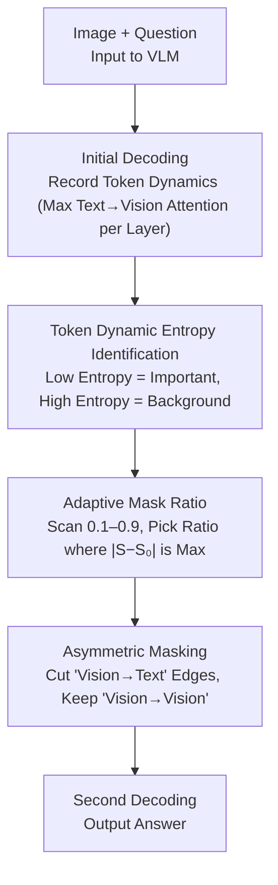

# Aligning What Vision-Language Models See and Perceive with Adaptive Information Flow

**Conference**: CVPR 2026  
**arXiv**: [2604.15809](https://arxiv.org/abs/2604.15809)  
**Code**: [https://cxliu0.github.io/AIF/](https://cxliu0.github.io/AIF/)  
**Area**: Multimodal VLM  
**Keywords**: Vision-Language Models, Information Flow Regulation, Token Dynamics, Causal Mask, Training-free  

## TL;DR

This paper identifies that the excessive attention of text tokens toward irrelevant vision tokens is the root cause of the "seeing but perceiving incorrectly" phenomenon in VLMs. It proposes Adaptive Information Flow (AIF), a training-free method based on token dynamic entropy that regulates information flow by modifying the causal mask at inference time to block irrelevant vision-to-text connections, enhancing the perceptual capabilities of various VLMs.

## Background & Motivation

**Background**: Vision-Language Models (VLMs) such as LLaVA and Qwen2.5-VL have demonstrated powerful capabilities across broad tasks like visual question answering (VQA), OCR, and object localization.

**Limitations of Prior Work**: Recent studies have found that VLMs suffer from a "seeing but perceiving incorrectly" issue—the model can correctly capture image regions relevant to the question but ultimately outputs a wrong answer. Existing improvement methods either require retraining (high computational cost) or rely on visual cropping (significantly increased inference time and ineffective for counting/relational reasoning).

**Key Challenge**: The information flow during the VLM decoding process is suboptimal. The cross-attention of text tokens is scattered across a large number of irrelevant background vision tokens, forming a spatially diffuse attention pattern that introduces noisy visual information and interferes with correct reasoning.

**Goal**: Improve VLM perception through inference-time information flow regulation without any training.

**Key Insight**: It is observed that vision tokens corresponding to target regions exhibit unique activation patterns (high activity) in specific layers of the LLM, whereas tokens in irrelevant regions show irregular activation patterns. Differences in these "token dynamics" can be utilized to identify important tokens.

**Core Idea**: Text tokens only need to interact with important vision tokens. By modifying the causal mask, the information flow from irrelevant vision tokens to text tokens is blocked, while the information flow between vision tokens is preserved to ensure no loss of image information.

## Method

### Overall Architecture

AIF addresses a specific phenomenon: VLMs often look at the right place but answer incorrectly. The root cause is that text tokens spread their attention uniformly over many irrelevant background vision tokens during decoding, causing noise to overwhelm useful signals. The proposed mechanism "rewires" the model at inference time so that text only communicates with a few key vision tokens. The pipeline consists of three steps: first, the model performs a standard decoding step while recording the intensity with which each vision token is attended to by text across layers (token dynamics); second, the entropy of token dynamics is used to distinguish signal tokens from background; finally, an adaptive mask ratio is selected to cut the "vision $\rightarrow$ text" edges for unimportant tokens in the causal mask (while keeping "vision $\rightarrow$ vision" connections), followed by a formal decoding pass. This process requires only one extra decoding step without changing model weights.

### Key Designs

**1. Token Dynamic Entropy Identification: Recognizing Important Tokens via Activation Patterns**

To cut irrelevant connections, one must first identify what is "irrelevant." AIF observes that vision tokens corresponding to target regions are strongly attended to by text tokens in specific LLM layers, with activations concentrated in a few layers. Background tokens are attended to sparsely and randomly across layers. Thus, the maximum attention $d_{v_i}^l = \max_j a_{i,j}^l$ for the $i$-th vision token across all text tokens at layer $l$ is collected into a cross-layer curve $\mathcal{D}_{v_i} = \{d_{v_i}^l\}_{l=1}^L$. Entropy is used to characterize the "concentration" of this curve:

$$\text{Ent}_{v_i} = \sum_{l=1}^{L} -\frac{d_{v_i}^l}{L \cdot \mu_{v_i}} \log\Big(\frac{d_{v_i}^l}{L \cdot \mu_{v_i}}\Big),\quad \mu_{v_i}=\frac{1}{L}\sum_{l} d_{v_i}^l$$

Low entropy indicates concentrated activation in specific layers—a characteristic of important tokens. High entropy indicates lack of pattern, likely representing background. Consequently, entropy serves as a natural importance filter separating signal from noise without labels or training.

**2. Adaptive Mask Ratio: Shifting Attention from Diffuse to Focused**

Once tokens are ranked by importance, a masking ratio must be determined. Different images and questions require different ratios; fixed thresholds risk either removing signals or leaving too much noise. AIF scans candidate ratios from 0.1 to 0.9. For each ratio, it calculates the entropy $S$ of the attention distribution over the remaining tokens and compares it to the original entropy $S_0$. It selects the ratio that maximizes $|S-S_0|$, representing the point where the attention distribution "tightens" most relative to the original state. Intuitively, masking too little leaves attention diffuse, while masking too much flattens key regions; an optimal ratio focuses the attention. Once selected, edges from discarded vision tokens to text tokens are set to $-\infty$ in the causal mask. This thresholds is image-specific, avoiding manual tuning.

**3. Asymmetric Masking: Cutting to Text while Preserving Vision-to-Vision Flow**

This is the fundamental difference between AIF and vision token pruning. Pruning removes tokens entirely, risking permanent loss of image information if a signal is misidentified. AIF only blocks "masked token $\rightarrow$ text token" edges. Attention between masked tokens and other vision tokens is preserved. Even if a token is judged unimportant for the current text, its local context can still pass through vision-to-vision pathways to other tokens. The overall image information remains intact; it simply no longer interferes with text reasoning. It filters interference, not information.

### Loss & Training

A completely training-free inference-time method. It requires only one additional decoding step to obtain token dynamics and generate the mask. The subsequent inference process remains identical to standard methods.

## Key Experimental Results

### Main Results

| Method | V* | RealWorldQA | MMStar | TextVQA | CountBench |
|------|-----|------------|--------|---------|------------|
| LLaVA-1.5-7B | 42.4 | 55.6 | 33.1 | 47.8 | 47.0 |
| **+ AIF (Ours)** | **50.3 (+7.9)** | **60.5 (+4.9)** | **39.5 (+6.4)** | **49.9 (+2.1)** | **50.1 (+3.1)** |
| Qwen2.5-VL-7B | 78.5 | 68.5 | 63.9 | 84.9 | 87.1 |
| **+ AIF (Ours)** | **84.8 (+6.3)** | **74.5 (+6.0)** | **70.9 (+7.0)** | **86.0 (+1.1)** | **89.5 (+2.4)** |

### Visual Grounding Results

| Method | RefCOCO Avg | RefCOCO+ Avg | RefCOCOg Avg |
|------|-------------|-------------|--------------|
| Qwen2.5-VL-7B | 89.3 | 80.1 | 87.2 |
| **+ AIF (Ours)** | **91.4 (+2.1)** | **82.7 (+2.6)** | **89.5 (+2.3)** |

### Key Findings

- Performance remains nearly unchanged after masking 90% of low-$\mu_{v_i}$ tokens, but masking only 10% of high-$\mu_{v_i}$ tokens leads to a 50%+ performance drop, confirming that only a few vision tokens significantly impact output.
- AIF achieves a 7.0 gain on MMStar for Qwen2.5-VL-7B, allowing it to outperform GPT-4o and Qwen2.5-VL-72B on certain metrics.
- On grounding tasks, AIF even surpasses specialized grounding models like Grounding-DINO-L.
- Oracle experiments show a higher potential ceiling for information flow regulation (RealWorldQA: 55.6 $\rightarrow$ 61.6).

## Highlights & Insights

- **Information Flow as a Control Signal**: While prior works primarily used attention analysis for diagnosis and interpretation, this paper is the first to use it as a control signal to actively improve performance.
- **Training-free and Plug-and-play**: Consistently improves performance across various VLMs and tasks by simply modifying causal masks, demonstrating the universal value of information flow regulation.
- **Preservation of Vision-Vision Flow**: This design philosophy differentiates the method from brute-force token pruning, ensuring information integrity.

## Limitations & Future Work

- Requires one extra decoding step to obtain token dynamics, which incurs a non-zero (though minor) overhead.
- Selection of the adaptive threshold involves testing multiple candidate ratios, which may not be the optimal strategy.
- For tasks requiring global understanding (e.g., scene description), excessive masking might be counterproductive.
- Currently validated only on LLaVA-1.5 and Qwen2.5-VL; generalization to more models remains to be confirmed.

## Related Work & Insights

- **vs ViCrop**: ViCrop enhances perception by cropping and zooming into relevant regions, but inference time increases significantly and it is ineffective for relational reasoning. AIF uses mask modification with lower overhead and broader task effectiveness.
- **vs Vision Token Pruning**: Pruning completely removes tokens leading to information loss; AIF only blocks connections to text, preserving complete visual information.
- **vs Pei et al. / Wang et al.**: These works modify attention patterns via architecture or training; AIF only modifies them at inference time.

## Rating

- Novelty: ⭐⭐⭐⭐⭐ A unique perspective using information flow regulation as a training-free paradigm to improve VLMs.
- Experimental Thoroughness: ⭐⭐⭐⭐⭐ Covers VQA, OCR, grounding, counting, and hallucination across multiple tasks.
- Writing Quality: ⭐⭐⭐⭐⭐ Strong logical progression from discovery and analysis to method; depth in experimental analysis.
- Value: ⭐⭐⭐⭐⭐ High practicality as it significantly improves VLM performance without training.

<!-- RELATED:START -->

## Related Papers

- [\[CVPR 2026\] See What I Mean: Aligning Vision and Language Representations for Video Fine-grained Object Understanding](see_what_i_mean_aligning_vision_and_language_representations_for_video_fine-grai.md)
- [\[CVPR 2026\] See Less, See Right: Bi-directional Perceptual Shaping For Multimodal Reasoning](see_less_see_right_bi-directional_perceptual_shaping_for_multimodal_reasoning.md)
- [\[CVPR 2026\] Beyond What's Shared: Recovering Lost Unique Information from Intermediate Layers to Boost Multimodal Geo-Foundation Models](beyond_whats_shared_recovering_lost_unique_information_from_intermediate_layers_.md)
- [\[ACL 2026\] Revisit What You See: Revealing Visual Semantics in Vision Tokens to Guide LVLM Decoding](../../ACL2026/multimodal_vlm/revisit_what_you_see_revealing_visual_semantics_in_vision_tokens_to_guide_lvlm_d.md)
- [\[CVPR 2026\] LLMind: Bio-inspired Training-free Adaptive Visual Representations for Vision-Language Models](llmind_bio-inspired_training-free_adaptive_visual_representations_for_vision-lan.md)

<!-- RELATED:END -->
