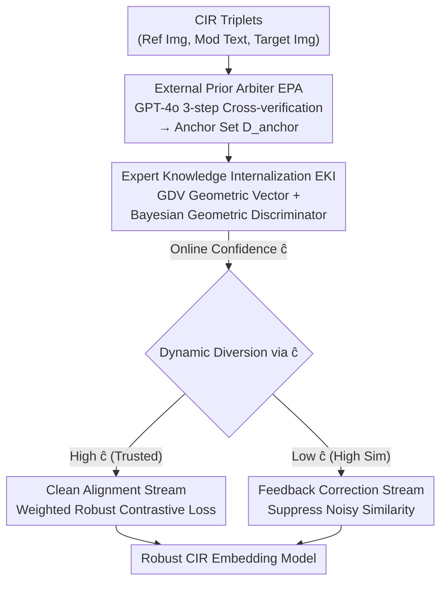

# Air-Know: Arbiter-Calibrated Knowledge-Internalizing Robust Network for Composed Image Retrieval

**Conference**: CVPR 2026  
**arXiv**: [2604.19386](https://arxiv.org/abs/2604.19386)  
**Code**: https://github.com/ZhihFu/Air-Know/ (Available)  
**Area**: Multimodal VLM / Composed Image Retrieval / Robust Learning from Noisy Labels  
**Keywords**: Composed Image Retrieval, Noisy Triplet Correspondence, MLLM Arbiter, Bayesian Geometric Discrimination, Dual-stream Correction

## TL;DR
Addressing the failure of the traditional "small-loss" assumption in Composed Image Retrieval (CIR) due to "partial matching" noise, this paper uses an MLLM to offline label a high-precision anchor set and distills it into a lightweight Bayesian proxy for online confidence estimation. By diverting training data into "Clean Alignment" and "Feedback Correction" streams, the method decouples the arbiter from the learner to avoid representation pollution, significantly outperforming existing SOTA in high-noise CIR settings.

## Background & Motivation

**Background**: Composed Image Retrieval (CIR) uses a "reference image + modification text" as a multimodal query to retrieve target images. However, the $(I_r, T_m, I_t)$ triplets are costly and subjective to label. Furthermore, automated labeling using large models introduces hallucinations, leading to training sets filled with mismatched pairs, formally defined by works like TME as the **Noisy Triplet Correspondence (NTC)** problem.

**Limitations of Prior Work**: Existing robust methods (e.g., TME) mostly adopt the **small-loss assumption** from cross-modal Noisy Correspondence Learning (NCL)—where clean samples yield low loss and noisy samples yield high loss—using GMMs to partition samples. However, NTC noise differs fundamentally: while traditional NCL deals with "completely mismatched pairs," NTC noise consists of **semantically continuous and ambiguous "partial matches."** For example, a triplet (Ref: Shirt, Text: Change to short sleeves, Target: T-shirt) is not "clean" because a T-shirt is not a short-sleeved shirt, yet they are highly correlated in attributes like "top" and "short sleeves." Models often assign very low loss to such samples due to "surface matching," erroneously misclassifying them as clean.

**Key Challenge**: When noise discrimination is unreliable and the model (learner) uses its own precarious output as an arbiter (e.g., GMM loss estimation), it falls into a fatal **self-dependent vicious cycle**: ① Pseudo-clean samples are wrongly trusted → ② The model is forced to align mismatched representations → ③ Representation collapse and degraded accuracy further worsen the GMM fitting. The root cause is the **entanglement of the arbiter and the learner**; decoupling them is essential to break the cycle.

**Key Insight**: MLLMs possess strong semantic understanding and serve as ideal external "ground-truth arbiters," but their inference overhead is too high for online batch processing during training. The core challenge becomes: **How to leverage MLLM expert judgment while bypassing its online computational cost?**

**Core Idea**: A three-stage paradigm of "Expert-Proxy-Diversion"—using an MLLM to offline label a small set of anchors (Expert), distilling the discriminative logic into a lightweight proxy arbiter (Proxy), and diverting data streams based on online confidence (Diversion) to completely separate the arbiter from the learner.

## Method

### Overall Architecture

Air-Know peels the noise discrimination task away from the main model into a three-stage pipeline. The **input** consists of CIR training triplets with NTC noise, and the **output** is a noise-robust multimodal embedding function $\mathcal{F}$. Three modules execute "Expert Labeling → Proxy Internalization → Data Diversion": (a) **EPA** uses GPT-4o to offline label a small number of triplets, creating a high-precision anchor set $\mathcal{D}_{anchor}$; (b) **EKI** trains a lightweight Bayesian discriminative proxy on this anchor set to internalize expert logic into an online "confidence scorer"; (c) **DSR** uses the confidence $\hat{c}$ from EKI as a dynamic gating signal to split the training set into a "Clean Alignment Stream" for optimizing the main model and a "Feedback Correction Stream" to rectify the base representation model. EKI is trained only during the warm-up phase and then frozen.

### Key Designs

**1. EPA (External Prior Arbiter): Using MLLM to build high-precision anchors offline**

To bypass the small-loss assumption, EPA employs GPT-4o for **three-step cross-verification** on a small random sample of triplets. Step 1: Deconstruct inputs by parsing visual content from $I_r, I_t$ and intent from $T_m$. Step 2: Compare and Reason by inferring the "actual visual change" $\Delta T_I$ between $I_r$ and $I_t$, then performing **cross-verification** for semantic consistency with $T_m$. Step 3: Decide by outputting a binary label $y_i = MLLM(I_r, T_m, I_t) \in \{0,1\}$, resulting in an anchor set $\mathcal{D}_{anchor}$. Since this is done **offline** for only a small subset, it achieves expert-level accuracy without online inference costs and successfully identifies "partial matches."

**2. EKI (Expert Knowledge Internalization): Distilling expert logic into a lightweight proxy**

EKI creates an online proxy for the expert. First, it performs **feature engineering** by constructing a **Geometric Deconstruction Vector (GDV)** from multimodal features $\mathbf{z}_q$ and $\mathbf{z}_t$:

$$\mathbf{z}_{GDV} = \text{Concat}(\mathbf{z}_q,\ \mathbf{z}_t,\ \mathbf{z}_q - \mathbf{z}_t,\ \mathbf{z}_q \odot \mathbf{z}_t)$$

The difference vector $\mathbf{z}_q - \mathbf{z}_t$ encodes global differences, while the Hadamard product $\mathbf{z}_q \odot \mathbf{z}_t$ encodes fine-grained commonalities. Second, a **Bayesian Geometric Discriminator** $f_{\mathbf{W}}$ learns a non-linear boundary in the GDV space. To prevent ill-conditioning from sparse anchors, the model uses Bayesian inference $p(\mathbf{W}|\mathcal{D}_{anchor})$ approximated via a variational distribution $q_\theta(\mathbf{W})$. During training, **MC Dropout** is used with $T$ forward passes to obtain a reliable confidence score $\hat{c}=\frac{1}{T}\sum_{t=1}^{T}\sigma(f_{\mathbf{W}_t}(\mathbf{z}_{GDV}))$.

**3. DSR (Dual-Stream Correction): Dynamic gating for alignment and representation correction**

DSR uses $\hat{c}$ as a **dynamic gating signal**. The **Clean Alignment Stream** uses high-confidence samples to learn discriminative features via a weighted robust contrastive loss:

$$\mathcal{L}_{\text{Align}} = -\frac{1}{B}\sum_{i,j\neq i}^{B}\hat{c}_i \cdot \log\Big(1 - \frac{\exp(s(\mathbf{z}_{q,i}, \mathbf{z}_{t,j})/\tau)}{\sum_j^B \exp(s(\mathbf{z}_{q,i}, \mathbf{z}_{t,j})/\tau)}\Big)$$

The **Feedback Correction Stream** identifies "hard noise samples" with low $\hat{c}_i$ but high similarity and explicitly forces the model to reduce their similarity:

$$\mathcal{L}_{\text{Recon}} = \frac{1}{C}\sum_{i=1}^{B}(1-\hat{c}_i)\cdot \max\{(s(\mathbf{z}_{q,i}, \mathbf{z}_{t,i}) - \alpha)/\tau,\ 0\}$$

This stream actively corrects the representation space instead of simply discarding noise.

### Loss & Training

The total loss is $\mathbf{\Theta}^* = \arg\min_{\mathbf{\Theta}}(\mathcal{L}_{Align} + \lambda \mathcal{L}_{Recon})$, where $\lambda$ is a balancing hyperparameter (0.5 for CIRR, 0.6 for FashionIQ). A **two-stage training** strategy is adopted: Stage 1 trains EKI using the anchor set, and Stage 2 freezes EKI to train DSR. The backbone is BLIP-2 with Q-Former features.

## Key Experimental Results

Evaluated on FashionIQ and CIRR across noise levels (0%, 20%, 50%, 80%).

### Main Results

FashionIQ Validation Set (Avg. Recall@K, %):

| Noise Rate | Metric | Air-Know | Next Best Baseline | Note |
|------------|--------|----------|--------------------|------|
| 0%         | AVG.   | 65.73    | 65.29 (HABIT)      | Slight lead without noise |
| 20%        | AVG.   | 65.45    | 64.38 (HABIT)      | +1.07 Gain |
| 80%        | AVG.   | 59.73    | 59.07 (INTENT)     | Advantage holds at high noise |

CIRR Test Set (Avg(R@5, Rsub@1), %):

| Noise Rate | Air-Know | Next Best Baseline | Note |
|------------|----------|--------------------|------|
| 0%         | 80.73    | 82.01 (TME)        | ⚠️ Lagged behind TME in clean settings |
| 20%        | 80.40    | 79.74 (TME)        | Transition to lead |
| 80%        | 76.90    | 75.97 (INTENT)     | +0.93 Gain |

### Ablation Study

| Configuration | FashionIQ R@10 | CIRR R@K | Note |
|---------------|----------------|----------|------|
| Full model    | 55.18          | 80.24    | Integrated Air-Know |
| w/o EPA       | 53.99          | 79.41    | Internal logic suffers without external arbiter |
| w/o GDV       | 52.80          | 79.66    | Deconstruction components are essential |
| w/o Dropout   | 53.71          | 79.48    | MC Dropout is critical for boundary modeling |
| w/o DSR       | 49.53          | 77.95    | Significant drop without dual-stream decoupling |

### Key Findings
- **Decoupling is core**: Removing the dual-stream structure (D#13) results in a heavy performance drop, verifying that separating the arbiter from the learner is the primary driver of success.
- **Noise utilization**: The Feedback Correction stream prevents "representation pollution" by turning hard noise into negative examples.
- **Robustness at a cost**: Air-Know lags slightly in 0% noise settings (CIRR), as it is specialized for NTC scenarios.

## Highlights & Insights
- **Cost-effective Expertise**: Converting an "expensive online expert" into an "offline labeler + online proxy" is a highly transferable paradigm for leveraging LLMs in training.
- **Geometric Deconstruction**: The GDV's use of differences ($\mathbf{z}_q-\mathbf{z}_t$) and commonality ($\mathbf{z}_q\odot\mathbf{z}_t$) explicitly exposes matching evidence for the discriminator.
- **Breaking the Cycle**: The work identifies and addresses the "vicious cycle" of self-dependency in noise robust learning, offering a logically consistent solution.

## Limitations & Future Work
- **Performance Trade-off**: Lagging in clean (0% noise) CIRR settings suggests the model prioritizes robust over peak clean performance.
- **Dependency on Closed Models**: EPA relies on GPT-4o; future work could explore open-source MLLMs for better reproducibility.
- **Sampling Efficiency**: The fixed anchor set could be improved via active sampling to select the most informative triplets for MLLM labeling.

## Related Work & Insights
- **vs. TME (CVPR'25)**: While TME defines NTC, it still relies on the small-loss assumption via GMM. Air-Know bypasses this by introducing an independent MLLM-derived confidence score.
- **vs. Bayesian Inference**: Air-Know applies Variational Inference (VI) to the problem of sparse anchor sets, using MC Dropout to approximate a robust geometric decision boundary.

## Rating
- Novelty: ⭐⭐⭐⭐ 
- Experimental Thoroughness: ⭐⭐⭐⭐ 
- Writing Quality: ⭐⭐⭐⭐ 
- Value: ⭐⭐⭐⭐

<!-- RELATED:START -->

- TME: Triplet Match-Enhancer for Composed Image Retrieval, CVPR 2025.
- HABIT: Harnessing Ambiguity in Triplets for Robust CIR, AAAI 2026.

<!-- RELATED:END -->

## Related Papers

- [\[CVPR 2026\] ConeSep: Cone-based Robust Noise-Unlearning Compositional Network for Composed Image Retrieval](conesep_cone-based_robust_noise-unlearning_compositional_network_for_composed_im.md)
- [\[CVPR 2026\] G-MIXER: Geodesic Mixup-based Implicit Semantic Expansion and Explicit Semantic Re-ranking for Zero-Shot Composed Image Retrieval](g_mixer_geodesic_mixup_based_implicit_semantic_expansion_for_zero_shot_cir.md)
- [\[CVPR 2026\] ReCALL: Recalibrating Capability Degradation for MLLM-based Composed Image Retrieval](recall_recalibrating_capability_degradation_for_mllm-based_composed_image_retrie.md)
- [\[CVPR 2026\] Self-guided Semantic Inspection for Zero-Shot Composed Image Retrieval](self-guided_semantic_inspection_for_zero-shot_composed_image_retrieval.md)
- [\[CVPR 2026\] STiTch: Semantic Transition and Transportation in Collaboration for Training-Free Zero-Shot Composed Image Retrieval](stitch_semantic_transition_and_transportation_in_collaboration_for_training-free.md)

<!-- RELATED:END -->
