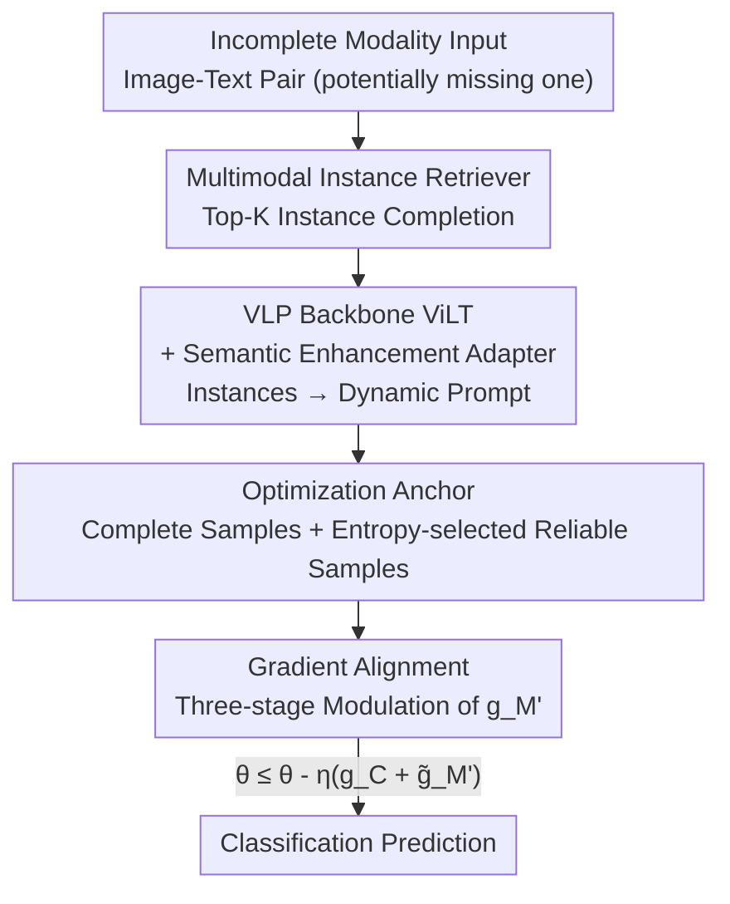

# Anchor-Guided Gradient Alignment for Incomplete Multimodal Learning

**Conference**: CVPR 2026  
**Paper**: [CVF Open Access](https://openaccess.thecvf.com/content/CVPR2026/html/Guan_Anchor-Guided_Gradient_Alignment_for_Incomplete_Multimodal_Learning_CVPR_2026_paper.html)  
**Code**: Yes (The paper states "available at this repository", specific link not provided ⚠️ subject to the original text)  
**Area**: Multimodal VLM / Incomplete Multimodal Learning  
**Keywords**: Incomplete Multimodal Learning, Gradient Alignment, Optimization Anchor, Modality Reconstruction, Curriculum Learning

## TL;DR
Addressing the learning imbalance problem where "reconstructed samples dominate optimization and suppress the representation of complete samples" under high missing rates, ANGA constructs optimization anchors using complete samples and aligns the gradients of reconstructed samples toward these anchors (three-stage modulation within a conical region). Coupled with a Semantic Enhancement Adapter that generates dynamic prompts from retrieved instances, it consistently outperforms SOTAs like RAGPT on three datasets.

## Background & Motivation
**Background**: Incomplete Multimodal Learning (incomplete MML) aims to make robust predictions despite missing modalities due to sensor failure, transmission errors, or privacy constraints. Current mainstream approaches fall into three categories: modality-invariant learning, VLP-based prompting, and modality reconstruction. Modality reconstruction (especially retrieval-augmented methods like RAGPT) has become dominant, using visible modalities to retrieve semantically similar instances from a memory bank to "fill in" missing modalities.

**Limitations of Prior Work**: These reconstruction methods focus solely on "recovering missing modalities" but ignore a critical phenomenon—**learning imbalance under high missing rates**. The authors conducted a toy experiment on HateMemes (70% text missing): after training with the RAGPT paradigm, they evaluated performance separately for "complete samples" and "reconstructed samples." They found a significant gap between these groups and their respective upper bounds (trained on each subset individually)—**the performance of complete samples was far below its potential upper bound, while reconstructed samples were relatively close to theirs.**

**Key Challenge**: Reconstructed samples contain amplified semantic noise. Due to their large quantity in mini-batches at high missing rates, their gradients dominate the parameter update direction, biasing the model toward "accommodating noise." Consequently, the clean representations learned from complete samples are weakened. The fundamental issue is not the accuracy of the reconstruction, but **who dictates the optimization**.

**Goal**: To rebalance the contributions of complete and reconstructed samples to the optimization without sacrificing the information gain from reconstruction, pulling the performance of complete samples back to its expected level while mitigating the semantic deficiency of reconstructed samples.

**Key Insight**: Since the problem lies in gradients being biased by noisy samples, the authors approach it from an **optimization/gradient perspective**—treating the gradients of complete samples as a "trustworthy reference direction" and forcing the gradients of reconstructed samples not to deviate too far from it. To the authors' knowledge, this is the first study to investigate learning imbalance under missing modalities from an optimization perspective.

**Core Idea**: Construct an "optimization anchor" using complete samples (plus a small number of trustworthy reconstructed samples) and align the gradients of the remaining reconstructed samples with the anchor—retaining consistent components, pulling back divergent ones, and suppressing opposing ones. Additionally, a semantic enhancement adapter is used to compensate for the semantic thinness of reconstructed samples.

## Method

### Overall Architecture
ANGA overlays a **gradient-level rebalancing mechanism** onto a standard "retrieval reconstruction + VLP classification" pipeline. Inputs are image-text pairs with potential missing modalities, and the output is a classification prediction. The workflow is: first, a Multimodal Instance Retriever (MIR) retrieves Top-K similar instances from a memory bank to reconstruct missing modalities. The reconstructed (and complete) samples are fed into a ViLT-based multimodal Transformer, where a Semantic Enhancement Adapter (SEA) generates dynamic prompts from retrieved instances to inject into MSA layers. During training, gradients within a batch are decoupled into "complete/reconstructed." Complete samples and trustworthy reconstructed samples (selected via entropy) construct an optimization anchor $g_A$. The gradients of the remaining reconstructed samples $g_{M'}$ are aligned with $g_A$ before parameters are updated. MIR follows prior work, while the true contributions lie in the optimization anchor, gradient alignment, and SEA.

### Key Designs

**1. Multimodal Instance Retriever (MIR): Completing Modalities via Retrieval**

This follows the reconstruction framework of prior work (e.g., RAGPT). For a missing image, the text tokens $T_i$ are encoded via a CLIP text encoder to get $e_i^{(t)}=\Phi^{(t)}(T_i)$. This serves as a query to retrieve Top-K instances from a memory bank $M$ via cosine similarity:

$$\mathcal{N}_i = \underset{r\in M}{\text{Top-}K}\left(\frac{e_i^{(t)\top}e_r^{(t)}}{\|e_i^{(t)}\|_2\|e_r^{(t)}\|_2}\right)$$

The "missing modality" of retrieved instances is mean-pooled as the reconstruction reference. The memory bank is built from the training set. While MIR solves "information loss," it is the source of semantic noise that leads to learning imbalance—necessitating gradient-level intervention.

**2. Optimization Anchor: Finding a Clean and Stable Reference**

To address the "reconstructed gradient dominance," ANGA **decouples** gradients for the complete subset $C$ and reconstructed subset $M$ within each mini-batch: $g_C=\nabla_\theta\frac{1}{|C|}\sum_{i\in C}\ell_i$ and $g_M=\nabla_\theta\frac{1}{|M|}\sum_{i\in M}\ell_i$. While $g_C$ is clean, it lacks coverage at high missing rates. Thus, **reliable reconstructed samples are selectively included**: prediction entropy $H(\tilde x_i)=-\sum_{j=1}^k \hat y_{i,j}\log\hat y_{i,j}$ measures reliability; lower entropy indicates higher confidence and priority for inclusion.

To ensure stability, a **curriculum strategy** controls the volume and pace of inclusion. Samples are ranked by entropy $\tilde D^m_{rank}$, and a linear function $\lambda(z)=\min\!\big(\lambda_{max},\,\lambda_{min}+\frac{\lambda_{max}-\lambda_{min}}{Z_{grow}}z\big)$ determines the top-$\lambda$ proportion to be merged into the anchor set $A_z = C\cup\{\tilde x_i\mid \tilde x_i\in\tilde D^m_{rank},\,i\le\lfloor\lambda(z)\cdot N^m\rfloor\}$ at epoch $z$. The final anchor gradient is $g_A=\nabla_\theta\frac{1}{|A_z\cap B|}\sum_{i\in(A_z\cap B)}\ell_i$.

**3. Gradient Alignment: Three-stage Modulation via Conical Region**

For reconstructed gradients $g_{M'}$ ($M'=M-(A_z\cap B)$) not in the anchor set, $g_A$ serves as the direction reference. The cosine similarity $\text{sim}(g_{M'},g_A)$ is calculated, and a "safe cone" is defined by a threshold $\tau=\cos\theta$ (half-angle $\theta\in(0,\pi/2)$):

- **Inside the cone ($\text{sim}\ge\tau$)**: Directions are consistent; retain original $\tilde g_{M'}\leftarrow g_{M'}$.
- **Outside but positively correlated ($0<\text{sim}<\tau$)**: Decompose $g_{M'}$ into a parallel component $g^\parallel_{M'}=\frac{g_{M'}\cdot g_A}{\|g_A\|_2^2}g_A$ and an orthogonal component $g^\perp_{M'}=g_{M'}-g^\parallel_{M'}$. Shrink the orthogonal component by a factor $\alpha=\kappa_{max}\frac{\|g^\parallel_{M'}\|_2}{\|g^\perp_{M'}\|_2}$ where $\kappa_{max}=\tan\theta=\frac{\sqrt{1-\tau^2}}{\tau}$. This pulls the gradient back to the cone boundary.
- **Opposite to the anchor ($\text{sim}<0$)**: Conflicting gradients cause drift; suppress via $\tilde g_{M'}\leftarrow 0$.

The update becomes $\theta\leftarrow\theta-\eta(g_C+\tilde g_{M'})$. This geometric modulation acts as a "guardrail" to prevent noise from biasing the optimization while retaining useful signals.

**4. Semantic Enhancement Adapter (SEA): Dynamic Prompts for Context**

SEA generates context-aware dynamic prompts for each instance (both complete and reconstructed) using the retrieval pool $\mathcal{N}_i$. For text, the target sequence $T_i$ acts as a query, while retrieved texts $T_i^R$ act as key/value in cross-attention:

$$\tilde P^t_i=\text{softmax}\!\left(\frac{f^Q_t(T_i)f^K_t(T_i^R)^\top}{\sqrt{d}}\right)f^V_t(T_i^R)$$

Similar processing for the image side yields $\tilde P^v_i$. Adaptive pooling produces instance-specific dynamic prompts $P^t_i,P^v_i\in\mathbb{R}^d$ injected into the MSA layers of the multimodal Transformer. Unlike static prompts, SEA prompts provide instance-specific knowledge.

### Loss & Training
Classification uses cross-entropy $L_{ce}=-\frac{1}{N}\sum_i y_i^\top\log\hat y_i$ ($N=N^c+N^m$). Backbone is pre-trained ViLT; prompts are inserted at the 2nd MSA layer ($b=2$). Key hyperparameters: Curriculum stage $Z_{grow}=5$, sample ratio bounds $\lambda_{min}=0.1, \lambda_{max}=0.3$, cosine threshold $\tau=0.2$, retrieval count $K\in\{1,3,5,7,9\}$. Optimizer: AdamW, $\eta=10^{-3}$, weight decay $10^{-5}$, batch size 64, single RTX 4090.

## Key Experimental Results

### Main Results
Three benchmarks: HateMemes (10K pairs), MM-IMDb (25,959 pairs), Food-101 (90,688 pairs). Uniform 70% missing rate, comparing against 13 baselines.

| Dataset | Metric | Scenario | RAGPT (Prev. SOTA) | ANGA | Gain |
|--------|------|------|----------------|------|------|
| HateMemes | AUROC | Text Missing | 64.10 | **68.54** | +4.44 |
| HateMemes | AUROC | Image Missing | 62.57 | **63.42** | +0.85 |
| HateMemes | AUROC | Both Missing | 63.47 | **65.12** | +1.65 |
| MM-IMDb | F1-Micro | Text Missing | 55.16 | **57.28** | +2.12 |
| Food101 | ACC | Text Missing | 75.53 | **77.23** | +1.70 |
| Food101 | ACC | Both Missing | 76.94 | **78.47** | +1.53 |

ANGA consistently ranks first. Analysis: Modality-invariant methods lose specific cues; VLP prompts are input-agnostic; reconstruction methods improve information but introduce noise—ANGA bridges the gap through optimization rebalancing.

### Ablation Study
Incremental components (MIR / GA / SEA) under 70% text missing:

| MIR | GA | SEA | HateMemes AUROC | MM-IMDb F1 | Food101 ACC | Note |
|:---:|:--:|:---:|:---:|:---:|:---:|------|
| ✗ | ✗ | ✗ | 59.38 | 49.62 | 68.53 | Dummy padding, severe info loss |
| ✓ | ✗ | ✗ | 64.63 | 54.17 | 74.86 | Retrieval completion, +5.25 AUROC |
| ✓ | ✓ | ✗ | 66.82 | 56.32 | 77.01 | GA +2.19 AUROC, mitigates drift |
| ✓ | ✗ | ✓ | 67.31 | 55.74 | 76.89 | SEA alone is effective |
| ✓ | ✓ | ✓ | **68.54** | **57.28** | **77.23** | Full model, optimal |

### Key Findings
- **MIR provides the largest information gain** but is the noise source; GA adds +2.19 on top, proving "optimization rebalancing" is a neglected yet effective factor.
- **$\tau$ Sensitivity**: Performance peaks at $\tau=0.2$; a moderate cone area best mitigates imbalance, while an overly narrow cone restricts generalization.
- **$K$ Insensitivity**: Retrieval count $K$ has minimal impact, but any $K$ is superior to dummy-padding.
- **Robustness**: On HateMemes, ANGA maintains the highest AUROC and lowest decay across all missing rates.

## Highlights & Insights
- **Reframing IMML from "reconstruction accuracy" to "optimization dominance"**: The toy experiment quantifying the suppression of complete samples is the central "aha" moment of the paper.
- **Clever three-stage gradient modulation**: The geometric retain/pull-back/suppress operations provide a closed-form scaling factor to keep gradients on the cone boundary, which is more refined than simple clipping or projection and transferable to other noisy training contexts.
- **Entropy-driven curriculum anchor**: Using prediction entropy as a reliability measure + linear curriculum to gradually include samples is a robust way to adapt self-training logic for anchor construction.
- **Plug-and-play**: GA can be integrated into existing IMML frameworks as an "optimization layer patch."

## Limitations & Future Work
- **Limited Scope**: Verified only on image-text pairs, ViLT backbone, and classification tasks. Extension to more modalities or generative tasks is unproven.
- **Memory Bank Dependency**: Retrieval quality depends on the training set pool; performance may degrade for out-of-distribution or long-tail classes.
- **Hyperparameter Tuning**: $\tau$ requires calibration; a self-adaptive $\tau$ mechanism is missing.

## Related Work & Insights
- **vs. RAGPT**: RAGPT stops at information completion; ANGA addresses the resulting learning imbalance, leading to a +4.44 AUROC gain on HateMemes.
- **vs. Modality-invariant Learning**: ANGA retains modality-specific cues rather than forcing a shared space that discards information.
- **vs. OGM (Multimodal Imbalance)**: Prior works focus on balancing modality contributions in full settings; ANGA is the first to study imbalance between **complete and reconstructed samples**.

## Rating
- Novelty: ⭐⭐⭐⭐⭐ First to identify and solve the "reconstructed dominance" imbalance via gradient alignment.
- Experimental Thoroughness: ⭐⭐⭐⭐ Extensive benchmarks and sensitivity analyses, though limited to image-text classification.
- Writing Quality: ⭐⭐⭐⭐⭐ Clear motivation via toy experiments and self-consistent mathematical derivation.
- Value: ⭐⭐⭐⭐ A plug-and-play optimization patch with potential utility beyond IMML (e.g., noisy labels).

<!-- RELATED:START -->

## Related Papers

- [\[CVPR 2026\] Rethinking Cross-Modal Anchor Alignment for Mitigating Error Accumulation](rethinking_cross-modal_anchor_alignment_for_mitigating_error_accumulation.md)
- [\[CVPR 2026\] Dual-Modality Anchor-Guided Filtering for Test-time Prompt Tuning](dual-modality_anchor-guided_filtering_for_test-time_prompt_tuning.md)
- [\[CVPR 2026\] Octopus: History-Free Gradient Orthogonalization for Continual Learning in Multimodal Large Language Models](octopus_history-free_gradient_orthogonalization_for_continual_learning_in_multim.md)
- [\[CVPR 2026\] Towards Dynamic Modality Alignment in Multimodal Continual Learning](towards_dynamic_modality_alignment_in_multimodal_continual_learning.md)
- [\[ICCV 2025\] G2D: Boosting Multimodal Learning with Gradient-Guided Distillation](../../ICCV2025/multimodal_vlm/g2d_boosting_multimodal_learning_with_gradient-guided_distillation.md)

<!-- RELATED:END -->
