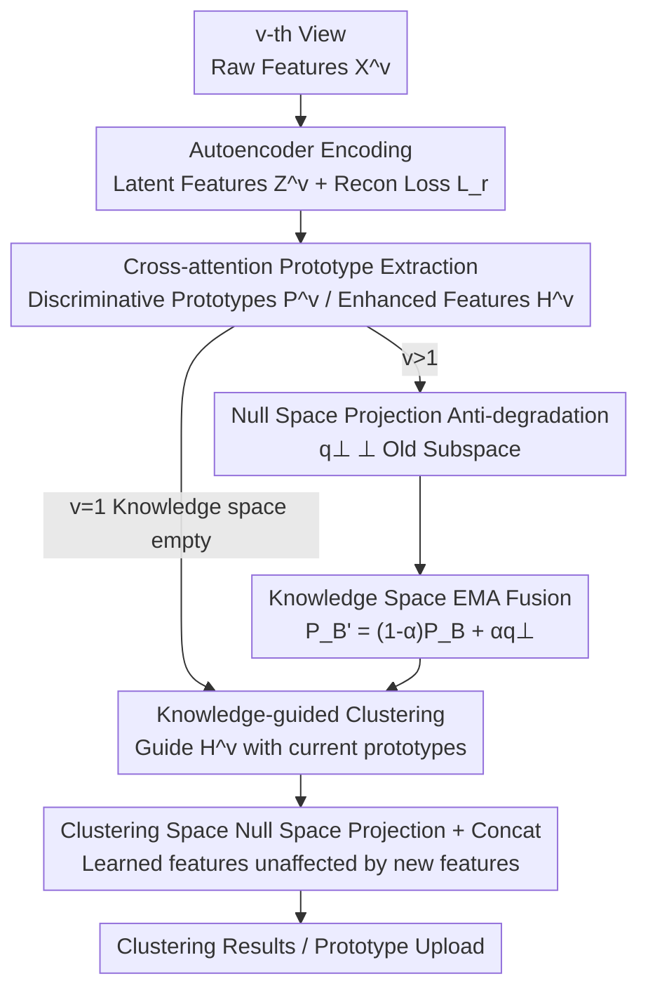

# Anti-Degradation Lifelong Multi-View Clustering

**Conference**: CVPR 2026  
**Paper**: [CVF Open Access](https://openaccess.thecvf.com/content/CVPR2026/html/Li_Anti-Degradation_Lifelong_Multi-View_Clustering_CVPR_2026_paper.html)  
**Code**: https://github.com/lee-xingfeng/ALMC/  
**Area**: Multi-View Clustering / Lifelong Learning  
**Keywords**: Multi-view clustering, Lifelong learning, Null space projection, Knowledge degradation, Streaming views  

## TL;DR
Addressing the "streaming views arriving over time" scenario, ALMC projects the prototypes of each new view onto the **null space** (orthogonal direction) of the old knowledge subspace before fusion. This mathematically ensures that new knowledge does not overwrite old knowledge, achieving SOTA results on six benchmarks (e.g., ALOI-10 ACC improved from 87.4% to 90.9%).

## Background & Motivation
**Background**: Multi-view clustering (MVC) integrates multiple heterogeneous views (e.g., physiological signals, medical records, and images in medical diagnosis) to mine the shared structure of samples. Prevalent methods are categorized into subspace, graph, multi-kernel, and deep learning, with deep MVC receiving the most attention due to its strong non-linear representation capabilities.

**Limitations of Prior Work**: Most deep MVC methods implicitly assume that "all views are available at the beginning." However, in real-world deployment, views arrive **continuously and dynamically** in a stream (e.g., video, thermal imaging, and audio collected from distributed sensors in smart surveillance). Processing such data streams requires a **lifelong learning** framework rather than a static model. Existing streaming methods like LSVC (rule-based knowledge base updates) and DSVC (aligning prototype distributions to mitigate drift) attempt to align new and old knowledge through consistency alignment or knowledge distillation, but they **cannot fundamentally prevent knowledge degradation**.

**Key Challenge**: The significant differences between views create a natural conflict between "learning new knowledge" and "preserving old knowledge." Previously learned knowledge is compressed into prototypes; incremental updates cause new prototypes to slide, overwrite, and distort earlier information within the **same representation space**. These contaminated prototypes then guide subsequent views, causing errors to **accumulate** throughout the lifelong learning process, eventually leading to severe degradation of clustering results. Consistency alignment methods are merely "post-hoc adjustments," where new knowledge inevitably interferes with the learned representation space.

**Goal**: Design a lifelong multi-view clustering framework that **grows stably** over view streams with "zero interference" to old knowledge.

**Key Insight**: Replace "post-hoc alignment" with **null space projection** from linear algebra—constrain the prototype updates of each new view to the orthogonal complement (null space) of the old knowledge subspace. This ensures that new knowledge is geometrically orthogonal to old knowledge at the moment of update, backed by theoretical proofs.

## Method

### Overall Architecture
ALMC processes a view stream $\{X^i\}_{i=1}^{V}$ ($V$ views, $N$ samples). Each view arrives sequentially; once trained, its prototype knowledge is "uploaded" to a persistent **knowledge space** for reuse by subsequent views. The processing pipeline for a single view is: first, use an **autoencoder** to encode raw features into latent representations $Z^v\in\mathbb{R}^{N\times d}$ (with a decoder for reconstruction to suppress redundancy); then, use MLP + **cross-attention** to extract more discriminative prototypes $P^v$ and enhanced features $H^v$. When $v>1$, the new prototype is projected into the **null space** of the old knowledge subspace before being fused into the knowledge space via EMA. Simultaneously, prototypes $P_B$ stored in the knowledge space calibrate the feature distribution of the current view through a **knowledge-guided loss**. Finally, in the **clustering space**, null space projection and concatenation are applied to each new view's features to ensure that learned features are not contaminated by new ones.

### Key Designs

**1. Null Space Projection Anti-degradation: Orthogonal Updates to Prevent Overwriting**

This mechanism addresses the issue of "new prototypes overwriting old knowledge." Given an operator $A$, its null space is the set of vectors satisfying $Av=0$, denoted as $\text{Null}(A)=\{v\in V: Av=0\}$. In the knowledge space, when $v>1$, let the stored prototype knowledge be $P_B$ and the current prototype be $P_n$. The goal is to project $P_n$ onto the null space of $P_B$. Lemma 1 proves that $P_B$ and $P_B(P_B)^T$ share the same left null space. Thus, computing the projection on the $d\times d$ matrix $P_B(P_B)^T$ is more efficient: perform SVD to get $U,\Lambda,U^T$, **remove columns corresponding to non-zero eigenvalues** to get sub-matrix $\hat U$ (whose columns span the orthogonal complement), and the projection matrix is:

$$P=\hat U\hat U^T,\qquad q^{\perp}=PP_n\in S^{\perp}.$$

Lemma 2 further proves that for any old prototype $p\in S$, $p^T q^{\perp}=0$. Thus, $q^{\perp}$ is orthogonal to all old prototypes and carries only new information. Unlike "post-hoc alignment" in LSVC/DSVC, null space projection limits the increment to the orthogonal direction before the update occurs. The **interference is strictly zero**, as supported by both experiments and theory.

**2. Cross-attention Prototype Extraction: Refining Discriminative Prototypes**

Mapping latent features $Z^v$ to prototypes $U^v$ solely via MLP is insufficient for capturing shared discriminative knowledge. ALMC introduces cross-attention to mutually enhance prototypes and features:

$$A^v=\text{Softmax}\!\left(\frac{(W_Z^v Z^v)^T W_U^v U^v}{\sqrt{d}}\right),\quad P^v=U^v+A^v W_H'^v Z^v,\quad H^v=Z^v+A^v W_P'^v U^v.$$

This yields more discriminative prototypes $P^v$ and enhanced features $H^v$, providing high-quality inputs for null space projection and knowledge guidance.

**3. Knowledge Space EMA Fusion + Knowledge-guided Clustering: Stable Knowledge Accumulation**

The projected prototype $q^{\perp}$ is fused into the knowledge space via EMA: $P_B'=(1-\alpha)P_B+\alpha q^{\perp}$. The paper proves that projecting $P_B'$ back onto the old subspace $S$ yields $P_S(P_B')=(1-\alpha)P_B$. This means EMA only scales the magnitude of old prototypes by $(1-\alpha)$ without changing their direction, while the orthogonal $q^{\perp}$ has zero projection on the old subspace. Knowledge accumulates stably over time: $P_B^t=(1-\alpha)^t P_B+\sum_{k=0}^{t-1}(1-\alpha)^k q^{\perp}_{t-k}$.

The knowledge-guided loss $L_g$ measures the similarity between current features and stored prototypes: $M(h_i^v,p_j^v)=\exp(S(h_i^v,p_j^v))$. The probability $G_{i,j}$ that the $j$-th prototype contains the $i$-th feature is $G_{i,j}=\frac{\exp(S(h_i^v,p_j^v))}{\sum_{k=1}^{K}\exp(S(h_i^v,p_k^v))}$, with loss $L_g=\frac{1}{KN}\sum_{j=1}^{K}\sum_{i=1}^{N}\log G_{i,j}$.

### Loss & Training
The total objective is a weighted sum of reconstruction loss and knowledge-guided loss:

$$L=\beta L_r+\gamma L_g,$$

where $L_r=\lVert X^v-F_{\Phi^v}^v(E_{\theta^v}^v(X^v))\rVert_2^2$ ($E, F$ are encoder/decoder) suppresses redundancy. Each view is trained for 200 epochs with a batch size of 256 and a learning rate of 1e-4 using the Adam optimizer.

## Key Experimental Results

### Main Results
Compared against 8 deep MVC and 2 streaming clustering methods (LSVC, DSVC) on 6 benchmarks. ALMC achieves the best performance on 5 datasets and second-best on NUS.

| Dataset | Metric | ALMC (Ours) | Prev. SOTA | Gain |
|--------|------|-----------|----------|------|
| ALOI-10 | ACC | **90.90** | 87.38 (ICMVC) | +3.52 |
| ALOI-10 | ARI | **83.37** | 78.74 (DSVC) | +4.63 |
| OutdoorScene | ACC | **64.26** | 61.79 (APADC) | +2.47 |
| ALOI-100 | ACC | **82.62** | 80.53 (DSVC) | +2.09 |
| Aloideep3v | ACC | **88.18** | 88.17 (FMCSC) | +0.01 |
| Oxford4 | ACC | **36.87** | 36.30 (DSVC) | +0.57 |

### Ablation Study
The framework contains three components: Reconstruction ($L_r$), Knowledge Space (Null space projection), and Knowledge-guided Learning ($L_g$).

| Configuration | ALOI-10 | OutdoorScene | ALOI-100 | Description |
|------|---------|--------------|----------|------|
| Model I | 52.81 | 40.51 | 61.98 | w/o $L_g$ + Null space projection |
| Model II | 76.92 | 55.69 | 77.33 | w/o Null space projection |
| Model III | 81.28 | 56.29 | 60.95 | w/o Reconstruction loss $L_r$ |
| Model IV | 82.21 | 55.80 | 81.31 | Replace Null space with consistency loss |
| Full Model | **90.90** | **64.26** | **82.62** | Complete model |

### Key Findings
- **Null space projection is critical**: Removing it (Model II) drops ALOI-10 ACC from 90.9% to 76.9%. Even replacing it with distribution consistency loss (Model IV) only reaches 82.2%, proving "orthogonal updates" are superior to "post-hoc alignment."
- **Knowledge-guided loss $L_g$ contributes most**: Removing both $L_g$ and projection (Model I) causes a drop to 52.8%.
- **Stability**: ALMC's performance rises steadily as views increase on OutdoorScene, unlike LSVC which fluctuates. It is also robust to the arrival order of views.

## Highlights & Insights
- **Algebraic Constraints for Anti-forgetting**: Guarantees $p^T q^{\perp}=0$ via null space projection, making interference mathematically zero. This is more thorough than "soft" constraints like EWC or distillation.
- **Computational Efficiency**: SVD is performed on a small $d\times d$ matrix rather than the high-dimensional prototype matrix, keeping projection costs manageable.
- **Dual-space Protection**: Prevents degradation in both the knowledge space (prototypes) and the clustering space (features).

## Limitations & Future Work
- Null space projection requires sufficient dimensions in the orthogonal complement; if the number of views is extremely high, the null space might be exhausted.
- Evaluation is limited to traditional multi-view datasets (handcrafted or shallow features like LBP/RGB/GIST) with small sample sizes. Scalability to large-scale, real-world long video streams remains to be verified.

## Related Work & Insights
- **vs LSVC**: LSVC uses rule-based updates, which are unstable under distribution shifts. ALMC uses geometric updates for steady growth.
- **vs DSVC**: DSVC relies on consistency alignment which loses information. ALMC utilizes all historical knowledge and prevents degradation at the source.
- **vs General Lifelong Learning**: ALMC shifts the constraint from the parameter space to the representation space via orthogonality, providing a "harder" guarantee of knowledge preservation.

## Rating
- Novelty: ⭐⭐⭐⭐⭐ Systematically addresses degradation in streaming MVC via null space projection with theoretical grounding.
- Experimental Thoroughness: ⭐⭐⭐⭐ Includes 6 datasets and 10 baselines, though dataset scales are relatively small.
- Writing Quality: ⭐⭐⭐⭐ Motivations and mechanisms are clear, backed by lemmas and proofs.
- Value: ⭐⭐⭐⭐ The anti-degradation paradigm offers transferable guidance for lifelong representation learning.

<!-- RELATED:START -->

<!-- RELATED:END -->

## Related Papers

- [\[CVPR 2026\] Multi-Hierarchical Contrastive Spectral Fusion for Multi-View Clustering](multi-hierarchical_contrastive_spectral_fusion_for_multi-view_clustering.md)
- [\[CVPR 2026\] Scalable Multi-View Subspace Clustering with Tensorized Anchor Guidance](scalable_multi-view_subspace_clustering_with_tensorized_anchor_guidance.md)
- [\[CVPR 2026\] Reliable Clustering Number Estimation for Contrastive Multi-View Clustering](reliable_clustering_number_estimation_for_contrastive_multi-view_clustering.md)
- [\[CVPR 2026\] Learning Anchor in Dual Orthogonal Space for Fast Multi-view Clustering](learning_anchor_in_dual_orthogonal_space_for_fast_multi-view_clustering.md)
- [\[CVPR 2026\] Imbalanced View Contribution Evaluation and Refinement for Deep Incomplete Multi-View Clustering](imbalanced_view_contribution_evaluation_and_refinement_for_deep_incomplete_multi.md)

<!-- RELATED:END -->
