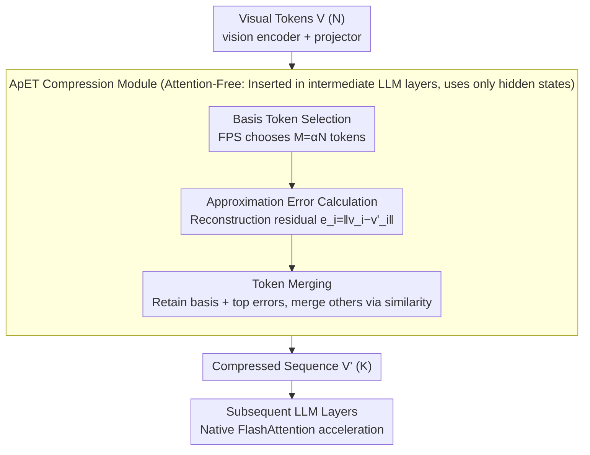

# ApET: Approximation-Error Guided Token Compression for Efficient VLMs

**Conference**: CVPR 2026  
**arXiv**: [2602.19870](https://arxiv.org/abs/2602.19870)  
**Code**: [MaQianKun0/ApET](https://github.com/MaQianKun0/ApET)  
**Area**: Multimodal VLM  
**Keywords**: Token Compression, Visual Token Redundancy, Approximation Error, FlashAttention Compatibility, VLM Acceleration

## TL;DR

From an information-theoretic perspective, this paper proposes a visual token importance evaluation method based on linear approximation reconstruction error. It does not rely on attention weights, making it naturally compatible with FlashAttention. On LLaVA-1.5, it maintains 95.2% performance while compressing 88.9% of visual tokens.

## Background & Motivation

**Background**: Current mainstream VLMs (e.g., LLaVA, InternVL) encode images into hundreds or even thousands of visual tokens for LLM processing. A 336×336 image produces 576 tokens in LLaVA-1.5, and high-resolution schemes can exceed 2,000. However, research indicates severe redundancy; truly "key tokens" for downstream tasks may only account for 10-20%.

**Key Challenge**: The computational complexity of LLM self-attention is $O(n^2)$, where $n$ is sequence length. Visual tokens occupy the majority of the sequence length (typically >70%), so reducing their count lowers computation near-quadratically. This is exacerbated in multi-frame video tasks where sequences easily exceed 10K.

**Limitations of Prior Work**: Existing mainstream methods (FastV, FitPrune, VisionZip, etc.) evaluate importance via intermediate LLM attention weights, but they suffer from two major flaws:

   **(a) Positional Bias**: LLM attention distributions exhibit significant positional bias. Due to causal masking, tokens later in the sequence are naturally attended to more frequently, resulting in higher scores regardless of actual information content. Experiments show that position alone can predict over 60% of attention rankings.

   **(b) FlashAttention Incompatibility**: FlashAttention is standard for LLM acceleration as it avoids storing full attention matrices. Attention-weight-based pruning requires reading the full $n \times n$ matrix, conflicting with FlashAttention's design. Disabling FlashAttention to use these methods can lead to a net decrease in speed.

**Key Insight**: If a token can be linearly reconstructed by other tokens with small approximation error, it carries little unique information and is "redundant." Conversely, a high reconstruction error indicates "important" unique information. This measure only requires token feature vectors and avoids attention calculations entirely.

**Core Idea**: While some attention-free methods exist (e.g., ToMe via similarity, LOOK-M via KV cache compression), their importance standards remain heuristic. ApET provides a principled measure based on approximation theory.

## Method

### Overall Architecture

ApET addresses the contradiction between severe visual token redundancy and the inability to prune based on attention weights. It judges importance through information theory: if a token can be linearly reconstructed from others, it is compressed. A compression module is inserted into an intermediate LLM layer (e.g., Layer 16 of LLaVA). The process involves three steps: selecting $M$ "basis tokens" from $N$ visual tokens, calculating the linear reconstruction error for non-basis tokens as an importance score, and retaining the tokens with the largest errors plus the basis tokens. Remaining tokens are merged into the nearest retained tokens via similarity-based average merging. The shortened sequence $V' \in \mathbb{R}^{K' \times d}$ is fed into subsequent layers. The mechanism uses only hidden states, ensuring FlashAttention compatibility.

### Key Designs

**1. Basis token selection**

To determine reconstruction capability, a set of basis tokens must be established. ApET selects $M$ basis tokens from $N$ visual tokens. Three strategies were explored: **FPS (Furthest Point Sampling)** greedily selects tokens furthest from the current set to ensure spatial diversity (complexity $O(NM)$); **DPC (Density Peak Clustering)** selects tokens with high local density and distance from higher-density points; and random sampling as a baseline. FPS proved most stable. The basis size is set to $M = \lfloor \alpha \cdot N \rfloor$, with $\alpha=0.1$ as a compromise between quality and overhead.

**2. Approximation Error Calculation**

For each non-basis token $v_i$ and basis matrix $B \in \mathbb{R}^{M \times d}$, the optimal linear reconstruction coefficient is $w_i^* = (B^\top B)^{-1} B^\top v_i$. The reconstruction is $\hat{v}_i = B w_i^*$, and the approximation error is:

$$e_i = \|v_i - \hat{v}_i\|_2 = \|v_i - B(B^\top B)^{-1}B^\top v_i\|_2$$

This represents the projection length of $v_i$ onto the orthogonal complement of the basis column space. Higher error indicates more unique information. Unlike attention weights, this metric is immune to positional bias from causal masks. Computationally, $(B^\top B)^{-1}$ is calculated once ($M \times M$ inversion where $M \ll N$), making it highly efficient (~1ms for $N=576$).

**3. Token Merging**

After determining importance, the $M$ basis tokens and top-$(K-M)$ tokens with the highest errors are retained. For the $(N-K)$ tokens to be removed, ApET finds the most similar retained token to each and performs **average merging** within groups. This strategy preserves some information from "pruned" tokens, providing a "low-loss" compression. Ablations show that merging provides a 2-3pp boost over direct dropping at extreme compression rates (<10%).

**4. Attention-Free Design**

ApET only utilizes token hidden states. It can be inserted after the vision encoder or within intermediate LLM layers (e.g., Layer 2, where tokens have interacted through some attention layers). The compressed sequence then proceeds with FlashAttention, gaining further acceleration from reduced sequence length.

## Key Experimental Results

### Main Results: LLaVA-1.5-7B Image Understanding

| Method | Tokens Retained | VQAv2 | GQA | TextVQA | POPE | MM-Vet | Avg. Retention |
|---|---|---|---|---|---|---|---|
| Original Model | 576 | 78.5 | 62.0 | 58.2 | 85.9 | 31.1 | 100% |
| FastV | 192 | 76.8 | 60.5 | 55.1 | 83.2 | 28.7 | 96.3% |
| VisionZip | 192 | 77.1 | 61.0 | 56.3 | 84.5 | 29.4 | 97.8% |
| **ApET** | **192** | **77.3** | **61.2** | **56.8** | **84.7** | **29.8** | **98.0%** |
| FastV | 64 | 72.1 | 56.3 | 48.7 | 78.4 | 24.2 | 88.5% |
| VisionZip | 64 | 73.5 | 57.8 | 50.2 | 80.1 | 25.6 | 91.0% |
| **ApET** | **64** | **74.6** | **58.5** | **51.9** | **81.3** | **26.8** | **92.8%** |

At 192 tokens (33% retention), ApET leads VisionZip by 0.2pp. At 64 tokens (11% retention), the advantage increases to 1.8pp.

### Video Understanding (LLaVA-1.5 Multi-frame)

| Method | Retention Rate | MSVD-QA | MSRVTT-QA | ActivityNet-QA | Avg. Retention |
|---|---|---|---|---|---|
| Original Model | 100% | 70.8 | 58.3 | 47.2 | 100% |
| FastV | 20% | 68.1 | 55.7 | 44.8 | 95.5% |
| ToMe | 20% | 69.0 | 56.2 | 45.3 | 96.5% |
| **ApET** | **20%** | **70.5** | **58.0** | **47.5** | **100.4%** |

Performance slightly improves (100.4%) at 20% tokens in video tasks, as redundant tokens are removed and the LLM focuses on key frames, reducing noise.

### Ablation Study

| Basis Selection | Error Metric | Merging Strategy | VQAv2 (64 tok) | GQA (64 tok) |
|---|---|---|---|---|
| FPS | L2 Recon Error | Weighted Merge | **74.6** | **58.5** |
| Random | L2 Recon Error | Weighted Merge | 73.2 | 57.1 |
| DPC | L2 Recon Error | Weighted Merge | 74.3 | 58.2 |
| FPS | Cosine Dist | Weighted Merge | 73.8 | 57.6 |
| FPS | L2 Recon Error | Direct Drop | 72.1 | 56.0 |
| FPS | Attention Weight | Weighted Merge | 71.5 | 55.8 |

### Key Findings

- **Approximation Error vs. Attention**: The correlation between importance rankings of these two is only 0.42 (Kendall's τ). Approximation error focuses on information uniqueness, while attention focuses on contextual relevance.
- **Positional Bias Evidence**: 65% of top-10% attention tokens are concentrated in the latter half of sequences, while ApET's top tokens are uniformly distributed.
- **Compression Layer**: Compression at Layer 2 is optimal. Layer 0 is ineffective as features have not yet matured through interaction.
- **Speedup**: On an A100, 576→64 token compression with FlashAttention yields a 2.1× speedup; FastV yields only 1.6× due to disabling FA at one layer.

## Highlights & Insights

- **Information-Theoretic Design**: Uses linear approximation error for importance measurement with clear theoretical intuition (irreducibility = uniqueness).
- **Engineering Practicality**: Solves FlashAttention compatibility, a major hurdle for the deployment of prior compression methods.
- **Video "Denoising" Effect**: The performance gain after compression in video VLM suggests new directions for token management.
- **Minimal Overhead**: The compression module itself takes ~1ms, which is negligible compared to LLM inference.

## Limitations & Future Work

- Verification is limited to LLaVA-1.5 (7B/13B); larger models (e.g., InternVL2-76B) are not yet tested.
- Linear approximation assumes redundancy structures are linear; non-linear feature relationships might be underestimated.
- Basis selection (FPS) ignores spatial priors (e.g., adjacent patches being more likely redundant).
- Fixed compression at Layer 2; layer-wise adaptive compression remains unexplored.

## Related Work & Insights

- **Token Pruning**: FastV and FitPrune are direct competitors; ApET achieves better results without requiring attention weights.
- **Token Merging**: ApET borrows the merging step from ToMe but drives it with a different importance metric.
- **KV Cache Compression**: Methods like SnapKV are orthogonal to token compression and could be combined with ApET.
- **Insight**: The approximation error approach could potentially extend to text token compression in LLMs for structured or repetitive templates.

## Rating

- Novelty: ⭐⭐⭐⭐
- Experimental Thoroughness: ⭐⭐⭐⭐
- Writing Quality: ⭐⭐⭐⭐⭐
- Value: ⭐⭐⭐⭐

<!-- RELATED:START -->

## Related Papers

- [\[CVPR 2026\] OmniZip: Audio-Guided Dynamic Token Compression for Fast Omnimodal Large Language Models](omnizip_audio-guided_dynamic_token_compression_for_fast_omnimodal_large_language.md)
- [\[CVPR 2026\] EvoComp: Learning Visual Token Compression for Multimodal Large Language Models via Semantic-Guided Evolutionary Labeling](evocomp_learning_visual_token_compression_for_multimodal_large_language_models_v.md)
- [\[CVPR 2026\] FlashCache: Frequency-Domain-Guided Outlier-KV-Aware Multimodal KV Cache Compression](flashcache_frequency_kv_cache_compression.md)
- [\[CVPR 2026\] UniCompress: Token Compression for Unified Vision-Language Understanding and Generation](unicompress_token_compression_for_unified_vision-language_understanding_and_gene.md)
- [\[CVPR 2026\] Efficient Document Parsing via Parallel Token Prediction](efficient_document_parsing_via_parallel_token_prediction.md)

<!-- RELATED:END -->
