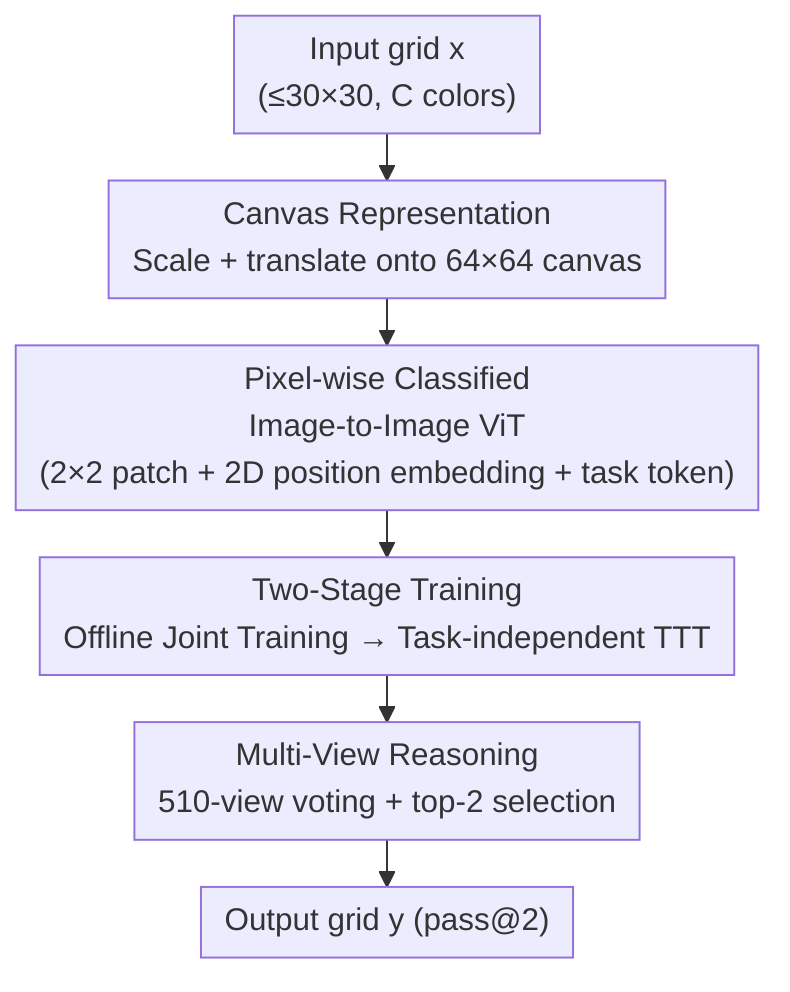

# ARC Is a Vision Problem!

**Conference**: CVPR 2026  
**Paper**: [CVF Open Access](https://openaccess.thecvf.com/content/CVPR2026/html/Hu_ARC_Is_a_Vision_Problem_CVPR_2026_paper.html)  
**Code**: https://github.com/lillian039/VARC  
**Area**: Visual Reasoning / Abstract Reasoning / Vision Transformer  
**Keywords**: ARC, Abstract Reasoning, Image-to-Image Translation, Test-Time Training, Visual Prior

## TL;DR
This work from MIT (Kaiming He's group) reformulates the ARC abstract reasoning benchmark, traditionally treated as a "language/sequence reasoning" task, as an **image-to-image translation** problem. Using a standard ViT with only 18M parameters trained from scratch, combined with a "canvas representation + translation/scale augmentation + test-time training" pipeline, it achieves 54.5% on ARC-1 (60.4% with ensembling). This matches the human average and significantly outperforms recurrent reasoning models also trained from scratch.

## Background & Motivation
**Background**: ARC (Abstraction and Reasoning Corpus) is a benchmark for measuring core intelligence in "abstracting rules from extremely few examples." Each task provides only 2-4 demonstration pairs $(x,y)$, and the model must infer the output for unseen test inputs. Mainstream approaches follow two paths: first, flattening the grid into text tokens for in-context few-shot learning using LLMs (relying on massive pre-trained commonsense); second, recent recurrent reasoning models (HRM, TRM) trained from scratch solely on ARC data using iterative recursive reasoning.

**Limitations of Prior Work**: ARC puzzles are **inherently visual**—low-level concepts like reflection, symmetry, and gravity are rooted in the visual and physical world, yet almost no one has approached them from a visual perspective. The LLM route flattens 2D grids into 1D token sequences, discarding the natural 2D spatial structure of images. Recurrent models, while not relying on large-scale pre-training, still draw inspiration from language modeling. Even worse, the only early work applying ViT to ARC (ViT-ARC) could only overfit to individual tasks in the training set, **failing completely to generalize to unseen tasks**, failing to address the "few-shot, cross-task" essence of ARC.

**Key Challenge**: ARC tasks are organized in a "few-shot, multi-task" manner—400 training tasks and 400 completely new test tasks, each independently defined by a few pairs of examples. The language paradigm neither leverages visual priors (2D locality, translation/scale invariance) nor relies on massive external corpora for commonsense. Meanwhile, naively feeding grids as images into a ViT leads to memorization overfitting and failure to learn spatial patterns due to the small number of color tokens (only about 10).

**Goal**: Under the controlled setting of training "from scratch, using only ARC data," inject visual priors into a standard vision model to enable genuine generalization to unseen tasks.

**Key Insight**: Since ARC concepts originate from the visual world, treat them strictly as image understanding problems—specifically casting the "input grid $\rightarrow$ output grid" mapping as pixel-wise classification, akin to image-to-image translation in semantic segmentation.

**Core Idea**: Treat each ARC task as an image-to-image translation problem, use a "canvas" representation to endow grids with the geometric properties of natural images, and apply a standard ViT with from-scratch training combined with test-time training for generalization.

## Method

### Overall Architecture
The input of VARC is a grid $x$ of maximum size $30\times30$ with each cell taking one of $C\approx10$ colors, and the output is a homomorphic grid $y$. The goal is to predict the color class for each pixel. The pipeline consists of four main parts: first, placing the original grid onto a fixed-size (e.g., $64\times64$) "canvas" via random scaling and translation to equip it with geometric properties of natural images; second, using a standard ViT for image-to-image mapping, conditioned on a "task token" to distinguish different tasks; third, executing two-stage training—offline joint training of a weight-shared network across all 400 training tasks, followed by test-time training (TTT) on each new task during inference for adaptation; finally, aggregating predictions under different augmentations via multi-view reasoning to output pass@2 results.

### Key Designs

**1. Canvas representation: converting discrete grids into "natural images" using a large canvas**

Directly feeding an $H\times W$ grid into a ViT as an image poses a fatal issue: if one patch corresponds to one original pixel, the token vocabulary size is only $C\approx10$, making the model prone to memorizing rather than learning spatial rules. VARC defines a predefined large canvas (e.g., $64\times64$) and places the original grid on it using geometric transformations, filling the rest of the canvas with an extra background color (the $(C+1)$-th color). The key benefit is: when patch size is $2\times2$, a single patch can span multiple colors, making the theoretical cardinality as high as $O(C^{2\times2})$—the token space explodes exponentially from a dozen, forcing the model to learn local spatial configurations instead of memorizing single pixels. In ablation studies, this step alone ($1\times1$ patch on $32^2$ $\rightarrow$ $2\times2$ patch on $64^2$) brings a 2.4 percentage point improvement (43.0 $\rightarrow$ 45.4). Even if it only introduces one pixel of translation space, multi-color patches significantly enrich the data space for learning.

**2. Translation and scaling augmentations: explicitly injecting geometric invariance from vision**

The true power of the canvas container lies in making classic visual data augmentations naturally applicable. **Scale augmentation**: given the original grid, a random scaling factor $s$ (integer) is chosen, and each pixel is duplicated to $s\times s$ (similar to nearest-neighbor interpolation, since ARC "colors" are not continuous and cannot use bilinear interpolation). **Translation augmentation**: the scaled grid is randomly placed at different locations on the canvas, ensuring all pixels remain visible. These two force the model to learn underlying mappings invariant to geometric transformations. Empirically, translation pushes the accuracy from 45.4 to 48.3 (+2.9), and scaling contributes the most, jumping +6.2 points (48.3 $\rightarrow$ 54.5). The authors point out the reason: while translation invariance can be partially covered by patchification (a special convolution), **ViT has almost no inductive bias for scale invariance**, so scale augmentation fills the exact gap the model lacks.

**3. Image-to-image ViT + 2D Position Embeddings: pixel-wise classification for abstract mapping**

By formulating the task as pixel-wise classification, VARC learns a network $f_\theta$ that takes image $x_i$ conditioned on a learnable task token of the target task, and outputs the class distribution for each pixel, optimized with pixel-wise cross-entropy:

$$L(\theta) = \mathbb{E}_{T,i}\big[D\big(y_i,\, f_\theta(x_i \mid T)\big)\big]$$

The architecture uses a standard ViT: the canvas is partitioned into non-overlapping patches (default $2\times2$). Since ARC pixels represent discrete indices rather than continuous values, each color index is first mapped to a learnable continuous embedding before patch projection. An easily overlooked but critical detail is the **2D position embedding**: images are inherently two-dimensional, and naively treating patches as a 1D sequence discards the 2D structure. VARC employs separable 2D position embeddings (half of the channels encode horizontal coordinates, and the other half encode vertical coordinates), applicable to both absolute position and RoPE relative position. Ablation studies show that replacing 2D RoPE with 1D RoPE on a strong baseline of $54.5$ leads to a drop of 3.5 points (54.5 $\rightarrow$ 51.0), showing that explicit 2D modeling is necessary, not just a minor addition. The authors also verified that replacing ViT with a U-Net (a classic convolutional network for image-to-image) yields decent accuracy, supporting the claim that "this is a vision problem" is independent of specific architectures.

**4. Two-stage training (offline joint training + task-independent TTT): learning world commonsense first, then adapting on-the-fly for new tasks**

The "few-shot, multi-task" nature of ARC means a static model cannot be expected to generalize directly. VARC uses two stages: **Offline training** jointly trains a weight-shared network on the demonstration pairs of all 400 training tasks, where each task is assigned a task conditioning token (the inference samples of the training set are used only for validation, not training). To expand the dataset, 1000 pairs per task are sampled from RE-ARC, totaling about 400k sample pairs. **Test-time training (TTT)**: given a completely new task $T$, the model is temporarily fine-tuned on its 2-4 demonstration pairs—the new task token is randomly initialized, and augmentations like flipping, rotation, and color permutation are applied (each treated as an auxiliary task with an independent embedding). The entire TTT process takes about 70 seconds per task on a single GPU, followed by pure feed-forward inference without any recursion. An counter-intuitive finding is that **performing TTT independently for each test task yields about 10 points higher accuracy than joint TTT across all test tasks**—the authors speculate that joint TTT causes the model to overfit to the test tasks, thereby forgetting the offline-learned visual commonsense.

### A Complete Example
Let's trace an "unseen test task": given 2-4 demo pairs (e.g., demonstrating "reflecting the shape along the diagonal") and an inference input $x_\text{infer}$:
① First, perform TTT for this task: randomly initialize a new task token, pair the demo pairs with auxiliary tasks like flipping/rotation/color permutation, apply translation/scale augmentations on the canvas, and fine-tune for about 70 seconds.
② Inference: place $x_\text{infer}$ on the canvas under 510 different scale+translation views, feed each view through ViT to get a pixel-wise prediction. Since the same original position may correspond to multiple pixels on the canvas (due to scaling), average pooling is applied across all softmax outputs at that position to obtain a single-view prediction.
③ Multi-view aggregation: perform majority voting on the output grids of the 510 views (two grids are "consistent" only if they are identical pixel-for-pixel; the winner is the one consistent with the most other grids), keeping the top-2 highest voted predictions as the pass@2 answers. Figure 6 in the paper visualizes how the prediction for $x_\text{infer}$ gradually converges from a blur to the correct grid during TTT.

## Key Experimental Results

### Main Results
ARC-1 / ARC-2 system-level comparison (pass@2, %); VARC is trained completely from scratch using only ARC data:

| System | Parameters | ARC-1 | ARC-2 |
|------|--------|-------|-------|
| Deepseek R1 (LLM) | 671B | 15.8 | 1.3 |
| o3-mini-high (LLM) | N/A | 34.5 | 3.0 |
| GPT-5 (LLM) | N/A | 44.0 | 1.9 |
| Grok-4-thinking (LLM) | 1.7T | 66.7 | 16.0 |
| HRM (Recurrent Model) | 27M | 40.3 | 5.0 |
| TRM (Recurrent Model) | 7M | 44.6 | 7.8 |
| **VARC (ViT Single Model)** | 18M | **54.5** | 8.3 |
| **VARC (Ensemble ViT+U-Net)** | 73M | **60.4** | 11.1 |
| avg. human | - | 60.2 | - |

Takeaways: In the "trained from scratch" arena, the 18M VARC outperforms the 7M TRM by about 10 points on ARC-1 (relative improvement >20%). The ensembled 60.4% matches the average human level of 60.2%, while the model size is several orders of magnitude smaller than top-tier LLMs, without relying on any web-scale data.

### Ablation Study
Step-by-step additions of visual priors (ViT-18M, ARC-1 eval, %); each row builds incrementally on the previous:

| Configuration | Accuracy | Incremental Description |
|------|--------|----------|
| (a) Naive Baseline | 26.8 | All components b-f removed |
| (b) +2D Absolute Position Embedding | 32.8 | 2D position modeling |
| (c) +2D RoPE | 43.0 | Relative position in 2D |
| (d) 1×1@32² → 2×2@64² patch | 45.4 | Patches span multiple colors, token space explodes exponentially |
| (e) +Translation Augmentation | 48.3 | Free translation on canvas |
| (f) +Scale Augmentation | 54.5 | Scale invariance, which ViT lacks the most |

Visual priors collectively bring a **27.7 point** improvement (a $\rightarrow$ f), among which canvas-related designs (c $\rightarrow$ f) contribute 11.5 points.

Other key ablations:
- **2D vs 1D Position Embedding**: Replacing 2D RoPE with 1D RoPE on the strong baseline drops performance from 54.5 to 51.0 ($-3.5$).
- **Multi-view Reasoning** (Table 2): Single-view pass@1 35.9 $\rightarrow$ Multi-view pass@1 49.8 $\rightarrow$ Multi-view pass@2 54.5. In ARC, missing a single pixel ruins the entire solution, so voting benefits are much more pronounced than in ordinary segmentation tasks.
- **TTT Strategies** (Figure 9): Offline training vs. no offline (54.5 vs. 26.4, though 26.4 suggests some tasks can be solved *tabula rasa*); independent TTT outperforms joint TTT by about 10 points.

### Key Findings
- **Scale augmentation is the single most impactful visual prior (+6.2)** because the ViT architecture itself has almost zero inductive bias for scale invariance, which must be supplemented via augmentation.
- **Independent TTT > Joint TTT by ~10 points**: Joint training instead overfits to test tasks and forgets offline-acquired commonsense, indicating that "few and specialized" is safer than "many and generalized" in test-time adaptation.
- **Scalable but subject to overfitting**: 18M ViT is the sweet spot. 66M ViT shows higher training accuracy but degraded generalization (53.0 < 54.5 in Table 1). The authors explicitly state that future research should focus on generalization rather than fitting capacity.
- **Task embeddings possess semantic structure**: t-SNE of the 400 task tokens shows semantically similar tasks (e.g., coloring, AND/OR/XOR logic) cluster together, showing that the model indeed learns task relationships.

## Highlights & Insights
- **Paradigm shift of "(Re)framing changes everything"**: The core innovation is not a new module, but casting ARC from a "language/sequence problem" to "image-to-image translation," enabling 2D spatial priors to naturally take root. This reframing contribution is more inspiring than stacking complex architectures.
- **Clever token-explosion trick with canvas + patch**: Using $2\times2$ patches expands the token vocabulary from ~10 to $O(C^4)$, essentially using "spatial composition" to counter "color memorization." This is transferable to visual modeling of any discrete symbolic grid.
- **Sober diagnosis of scale invariance**: The authors clearly distinguish that "patchification can partially cover translation invariance, but is powerless for scale," explaining why scale augmentation brings the largest gain. This precise localization of inductive bias gaps is highly commendable.
- **Counter-intuitive value of "independent > joint TTT"**: Suggests that in test-time adaptation, stronger assumptions (accessing multiple tasks at once) do not necessarily yield better results; overtraining and catastrophic forgetting are real risks.

## Limitations & Future Work
- **Author acknowledgment**: Overfitting occurs when model scale reaches 66M, making generalization the core bottleneck; absolute accuracy on ARC-2 remains quite low (VARC only achieves 8.3-11.1, far below ARC-1), showing that harder abstract tasks are far from solved.
- **Reliance on Test-Time Training**: Each new task requires ~70 seconds of TTT + 510-view inference. While runnable on a single GPU, it still poses considerable deployment overhead compared to pure feed-forward inference; TTT is essentially "learning a small model on-the-fly for each task", showing accumulated costs at scale.
- **Ceiling of pure vision**: The authors also point out that human reasoning does not rely solely on language or vision. VARC represents a "complementary visual perspective." For abstract concepts requiring linguistic or symbolic mediation, pure image-to-image translation might be limited—multimodal fusion is the natural next step.
- **Potential improvements**: Directly encoding visual priors other than scale/translation (e.g., rotation/reflection invariance) into the architecture rather than relying on augmentation, or explicitly leveraging the semantic structure of task embeddings for cross-task knowledge transfer could further enhance generalization.

## Related Work & Insights
- **vs. LLM approaches (DeepSeek/o3/GPT-5/Grok-4)**: They flatten grids into text tokens, relying on web-scale pre-training for commonsense. VARC is trained completely from scratch on ARC data with a model several orders of magnitude smaller. The advantage is avoiding external data and leveraging visual priors; the disadvantage is still being outperformed by the strongest LLMs (e.g., Bespoke-Grok-4's 79.6/29.4) on harder benchmarks like ARC-2.
- **vs. Recurrent Reasoning Models (HRM, TRM)**: Also trained from scratch, but they rely on iterative recursive reasoning, inspired by language modeling. VARC takes a pure feed-forward visual route, with its 18M model outperforming the 7M TRM by about 10 points on ARC-1, proving the visual paradigm's superiority in controlled settings.
- **vs. ViT-ARC**: Early work also used ViT but could only fit individual tasks in the training set, failing to generalize to unseen tasks and ignoring the ARC protocol. VARC resolves the "few-shot cross-task generalization" with its canvas representation + two-stage training (offline + TTT), which is a fundamental difference.
- **vs. Classic Visual Reasoning (CLEVR/VQA/neuro-symbolic VLM)**: Those protocols use identical task instances across training and testing, relying on a perception module + linguistic recursive module. ARC features a multitude of distinct tasks with only a few examples each; VARC solves it as segmentation-style pixel-wise classification.

## Rating
- Novelty: ⭐⭐⭐⭐⭐ Completely reframing ARC from a language paradigm to an image-to-image visual problem is a textbook example of reframing innovation.
- Experimental Thoroughness: ⭐⭐⭐⭐⭐ Step-by-step ablation of visual priors + TTT strategies + architecture/scale comparison + system-level benchmarking, representing a complete chain of evidence.
- Writing Quality: ⭐⭐⭐⭐⭐ Highly clear arguments, especially the deep analysis of inductive bias gaps, following Kaiming He's hallmark concise and clean style.
- Value: ⭐⭐⭐⭐⭐ Matching average human performance and outperforming same-setting recurrent models with an 18M from-scratch model opens a new visual path for abstract reasoning.

<!-- RELATED:START -->

## Related Papers

- [\[ACL 2026\] A Survey of Deep Learning for Geometry Problem Solving](../../ACL2026/multimodal_vlm/a_survey_of_deep_learning_for_geometry_problem_solving.md)
- [\[ICLR 2026\] GeoBench: Rethinking Multimodal Geometric Problem-Solving via Hierarchical Evaluation](../../ICLR2026/multimodal_vlm/geobench_rethinking_multimodal_geometric_problem-solving_via_hierarchical_evalua.md)
- [\[ACL 2025\] Unsolvable Problem Detection: Evaluating Trustworthiness of Large Multimodal Models](../../ACL2025/multimodal_vlm/unsolvable_problem_detection.md)
- [\[CVPR 2026\] Beyond Layer-Wise Merging: Chain-of-Merging for Vision-Language Models](beyond_layer-wise_merging_chain-of-merging_for_vision-language_models.md)
- [\[ICCV 2025\] Pi-GPS: Enhancing Geometry Problem Solving by Unleashing the Power of Diagrammatic Information](../../ICCV2025/multimodal_vlm/pi-gps_enhancing_geometry_problem_solving_by_unleashing_the_power_of_diagrammati.md)

<!-- RELATED:END -->
