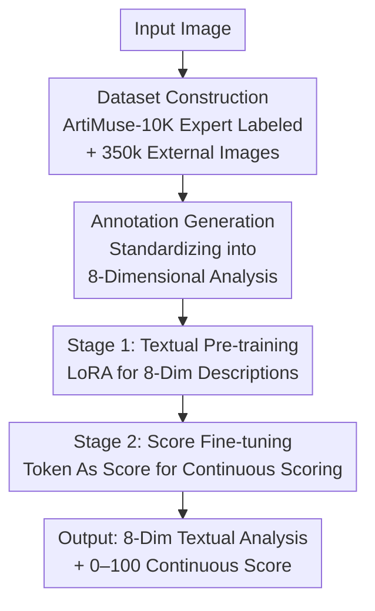

# ArtiMuse: Fine-Grained Image Aesthetics Assessment with Joint Scoring and Expert-Level Understanding

**Conference**: CVPR 2026  
**Paper**: [CVF Open Access](https://openaccess.thecvf.com/content/CVPR2026/html/Cao_ArtiMuse_Fine-Grained_Image_Aesthetics_Assessment_with_Joint_Scoring_and_Expert-Level_CVPR_2026_paper.html)  
**Code**: The paper states that the model and dataset will be released; no specific link is provided in the text (⚠️ Subject to official release)  
**Area**: Multimodal VLM / Image Aesthetics Assessment  
**Keywords**: Image Aesthetics Assessment, Multimodal Large Language Models, Token As Score, Expert-Annotated Dataset, Joint Scoring

## TL;DR
ArtiMuse utilizes an InternVL-3-8B based Multimodal Large Language Model (MLLM) to simultaneously output 8-dimensional fine-grained expert aesthetic textual analysis and a continuous aesthetic score. By introducing "Token As Score," the model integrates continuous scoring into discrete LLM token generation. It also introduces ArtiMuse-10K, the first dataset with 10,000 expert-annotated samples per dimension, achieving SOTA performance on multiple aesthetic scoring benchmarks.

## Background & Motivation
**Background**: Image Aesthetics Assessment (IAA) addresses whether an image is beautiful and why. It operates at a higher level than Image Quality Assessment (IQA), which focuses on blur or noise, as IAA involves subjective dimensions such as composition, color harmony, and emotional expression. Current trends have shifted from early regression networks (e.g., TANet, AesMamba) to MLLMs, which exhibit stronger generalization and perceptual capabilities by combining visual and linguistic modeling.

**Limitations of Prior Work**: Three specific shortcomings are identified. First, **modality bias**: existing MLLM methods are either score-only or text-only. Second, **lack of fine-grained attribute decomposition**: most models provide only a global score, insufficient for aesthetic diagnosis. Third, **weak datasets**: existing IAA datasets are often small, coarse-grained, annotated by non-experts, or biased toward photography while lacking design or AIGC content.

**Key Challenge**: MLLMs are natively designed for **discrete token generation**, whereas aesthetic scores are **continuous values**. Mapping continuous scores to discrete labels (e.g., "good/bad") leads to quantization loss, while direct numerical string output (Text As Score) often results in severe hallucinations.

**Goal**: To develop a unified model that provides (1) 8-dimensional interpretable expert-level textual analysis and (2) a precise continuous aesthetic score in a single forward pass, supported by high-quality expert-annotated data.

**Key Insight**: Dense mapping of 0–100 continuous scores to **existing discrete tokens** in the LLM vocabulary (Token As Score) without expanding the vocabulary. A two-stage LoRA training strategy ("text first, scoring second") preserves linguistic capabilities while infusing aesthetic priors from ArtiMuse-10K.

## Method

### Overall Architecture
ArtiMuse employs a three-stage data-training pipeline designed to distill expert aesthetic judgment into an MLLM. Given an input image, the model outputs 8-dimensional structured analysis and a continuous score (0–100). The process includes **data collection and processing** (10k expert-labeled images + 350k external images), **annotation generation** (standardizing sparse data into 8-dimensional structures), and **two-stage training** (textual pre-training → score fine-tuning). The base model is InternVL-3-8B with LoRA applied to the LLM component.

### Key Designs

**1. ArtiMuse-10K: First Fine-Grained Expert-Annotated Aesthetic Dataset**

This directly addresses the limitation of weak datasets. The authors collaborated with experts (3–30+ years experience) to define 8 interpretable dimensions: Composition & Design, Visual Elements & Structure, Technical Execution, Originality & Creativity, Subject Matter & Communication, Mood & Viewer Response, Overall Gestalt, and Comprehensive Evaluation. The dataset covers 10,000 images across 5 major categories (Graphic Design, 3D Design, AIGC, Photography, Painting/Calligraphy). Unlike prior datasets, it includes low-quality samples to mitigate the "positive bias" commonly found in modern LLMs.

**2. Adaptive Annotation Generation: Scalable Structured Analysis**

To supplement the 10k expert samples, 350k external images with sparse captions were processed via an info-streamlined generation mechanism. **Type 1 (Score-only)**: MLLM generates 8-dimensional analysis based on known scores. **Type 2 (Partial comments)**: MLLM expands sparse expert comments into structured analysis. **Type 3 (Expert-curated)**: Human experts provide ground truth analysis. High-value Type 3 data ensures reliability, while Type 1/2 provide scale.

**3. Token As Score: Dense Mapping of Continuous Scores**

This is the primary technical contribution. 101 existing discrete tokens from the LLM vocabulary are selected to represent scores 0–100, denoted as `[Aes_Score_Token_i]`. Short, ordered tokens (e.g., dual-character combinations) are used to avoid vocabulary expansion. During inference, the continuous score is calculated as the **expected value** of the probability distribution over these 101 tokens:

$$S_{Aes} = \sum_{i=0}^{100} i \cdot p_i = \sum_{i=0}^{100} i \cdot \frac{e^{l_i}}{\sum_{j=0}^{100} e^{l_j}}$$

where $l_i$ and $p_i$ represent the logit and softmax probability of the $i$-th score token. This approach minimizes quantization loss compared to coarse-grained leveling (e.g., Q-Align) and avoids the hallucinations inherent in "Text As Score" methods.

**4. Two-Stage LoRA Training: Balancing Text and Scoring**

To avoid the conflict between textual understanding and numerical regression, training is split into two phases. **Stage 1 (Textual Pre-training)** focuses on structural 8-dimensional analysis using all captioned data. **Stage 2 (Score Fine-tuning)** targets the specific score tokens. Using LoRA in both stages preserves the aesthetic priors learned in Stage 1, whereas full fine-tuning or joint training tends to degrade performance.

### Loss & Training
The model uses standard GPT cross-entropy loss. Base model: InternVL-3-8B. Stage 1: Batch size 128, LR 4e-5, 1 epoch. Stage 2: Batch size 128, LR 2e-5, 2 epochs. Training was conducted on 4 A100-80G GPUs. Stage 1 took ~5 hours; Stage 2 took 10 minutes on ArtiMuse-10K and ~4 hours on the 2M-sample AVA dataset.

## Key Experimental Results

### Main Results: Aesthetic Scoring (SRCC/PLCC)
ArtiMuse leads across multiple benchmarks, particularly on PARA and ArtiMuse-10K.

| Dataset | Metric | ArtiMuse | Q-Align (Runner-up) | Gain (PLCC) |
|--------|------|----------|---------------|------|
| AVA | SRCC/PLCC | 0.827 / 0.826 | 0.822 / 0.817 | +0.009 |
| PARA | SRCC/PLCC | 0.936 / 0.958 | 0.913 / 0.888 | +0.070 |
| TAD66K | SRCC/PLCC | 0.510 / 0.543 | 0.501 / 0.531 | +0.012 |
| FLICKR-AES | SRCC/PLCC | 0.814 / 0.837 | 0.798 / 0.818 | +0.019 |
| ArtiMuse-10K | SRCC/PLCC | 0.614 / 0.627 | 0.551 / 0.573 | +0.054 |

### Structured Textual Analysis (Selection Rate via Gemini-2.0-flash and Humans)
ArtiMuse outperforms competitors across all 8 dimensions in human and model-based preference tests.

| Dimension | AesExpert | QwenVL | InternVL | ArtiMuse |
|------|-----------|--------|----------|----------|
| Composition & Design | 0.0% | 12.7% | 10.4% | **76.9%** |
| 8-Dim Average | 0.1% | 14.3% | 14.5% | **71.1%** |
| Human Preference | 1.5% | 11.5% | 19.2% | **67.8%** |

### Ablation Study (SRCC/PLCC on AVA)

| Configuration | SRCC/PLCC | Note |
|------|-----------|------|
| (h) Full Model | 0.827 / 0.826 | Stage 2 LoRA + Token As Score(100) |
| (d) Full LLM FT | 0.816 / 0.814 | Erodes textual aesthetic priors |
| (e) Joint Training | 0.821 / 0.820 | Inferior to two-stage approach |
| (f) Text As Score | 0.820 / 0.819 | Numerical hallucinations |
| (g) Level As Score | 0.820 / 0.818 | Coarse granularity (Q-Align style) |

### Key Findings
- **Data Composition is Critical**: Removing the score-captioned subset leads to a performance drop in PLCC (0.826 → 0.627).
- **Two-Stage > Joint/Full FT**: Low-rank constraints in LoRA help retain Stage 1 knowledge while learning scoring.
- **Token As Score Sweet Spot**: 100 tokens provide sufficient granularity without excessive complexity; reusing existing ordered tokens outperforms newly added or unordered tokens.

## Highlights & Insights
- **Unified Paradigm**: First model to provide both 8-dimension expert diagnostics and precise continuous scores in one pass.
- **Transferable "Token As Score" Trick**: Treating continuous regression as an expected value calculation over existing tokens is a zero-cost method applicable to any scalar output task (quality, age, etc.) in MLLMs.
- **Addressing Positive Bias**: Using expert ground truth and maintaining low-quality samples in training sets is a practical data-centric solution to MLLM "over-praising."

## Limitations & Future Work
- **Limitations**: The model is diagnostic but does not yet provide actionable **improvement suggestions** (how to fix an image).
- **Inherent Bias**: Aesthetic definitions remain expert-subjective; cross-cultural or niche artistic styles may need further coverage.
- **Evaluation**: Relying on Gemini as a "judge" for textual analysis may introduce the judge model's own biases.

## Related Work & Insights
- **vs. Q-Align**: Q-Align uses "Level As Score" (5 discrete bins), which is coarse; ArtiMuse's 101-token distribution is finer and offers textual diagnostics.
- **vs. AesExpert**: AesExpert provides expert-style comments but **cannot output scores**.
- **vs. Regression Models**: These models lack interpretability; ArtiMuse exceeds them in zero-shot generalization by leveraging linguistic comprehension.

## Rating
- Novelty: ⭐⭐⭐⭐ The expected value over existing tokens is clever; the dataset is a significant contribution.
- Experimental Thoroughness: ⭐⭐⭐⭐⭐ Comprehensive coverage across 5 scoring benchmarks and 8 textual dimensions.
- Writing Quality: ⭐⭐⭐⭐ Clear logical flow from constraints to solutions.
- Value: ⭐⭐⭐⭐⭐ The dataset and scoring paradigm serve as "ready-to-use" infrastructure for AIGC evaluation and photography education.

<!-- RELATED:START -->

## Related Papers

- [\[CVPR 2026\] Beyond Global Similarity: Multi-Conditional Retrieval for Fine-Grained Cross-Modal Understanding](beyond_global_similarity_multi-conditional_retrieval_for_fine-grained_cross-moda.md)
- [\[ACL 2025\] FRACTAL: Fine-Grained Scoring from Aggregate Text Labels](../../ACL2025/others/fractal_fine-grained_scoring_from_aggregate_text_labels.md)
- [\[CVPR 2026\] Rethinking BCE Loss for Multi-Label Image Recognition with Fine-Tuning](rethinking_bce_loss_for_multi-label_image_recognition_with_fine-tuning.md)
- [\[CVPR 2026\] Rethinking Knowledge Transfer in Image Quality Assessment: A Perceptual Preference Structure Alignment Perspective](rethinking_knowledge_transfer_in_image_quality_assessment_a_perceptual_preferenc.md)
- [\[CVPR 2026\] From Pixel to Precision: Enhancing Handwritten Mathematical Expression Recognition with Image-Level Reward](from_pixel_to_precision_enhancing_handwritten_mathematical_expression_recognitio.md)

<!-- RELATED:END -->
