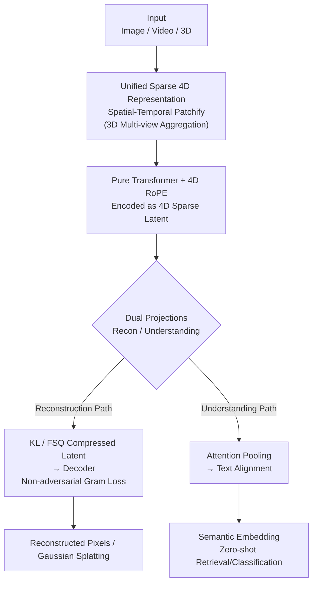

# AToken: A Unified Tokenizer for Vision

**Conference**: CVPR 2026  
**Paper**: [CVF Open Access](https://openaccess.thecvf.com/content/CVPR2026/html/Lu_AToken_A_Unified_Tokenizer_for_Vision_CVPR_2026_paper.html)  
**Code**: None (Apple, unpublished)  
**Area**: Multimodal VLM / Vision Tokenizer  
**Keywords**: Unified vision tokenizer, 4D representation, Reconstruction and understanding, Non-adversarial training, Progressive curriculum

## TL;DR
AToken unifies the encoding of images, videos, and 3D assets into a shared sparse 4D latent space. Utilizing a pure Transformer with non-adversarial Gram loss, it achieves high-fidelity reconstruction and semantic understanding simultaneously. A single model achieves performance competitive with specialized methods across three modalities (Image 0.21 rFID / 82.2% ImageNet, Video 3.01 rFVD, 3D 28.3 PSNR / 90.9% accuracy).

## Background & Motivation
**Background**: Language models achieve universality across tasks like coding, reasoning, and translation largely due to simple tokenizers like BPE that map all text into a unified token space. In contrast, vision tokenizers remain highly fragmented—specializing either in reconstruction (SD-VAE, VQGAN, Cosmos) or understanding (CLIP, SigLIP2, VideoPrism), and are typically locked to a single modality.

**Limitations of Prior Work**: The authors identify three specific obstacles. First, **the trade-off between reconstruction and understanding**: VAE-based tokenizers preserve pixel details but lack semantics, while understanding-oriented encoders have semantics but cannot reconstruct content; hybrid approaches (VILA-U, UniTok) only support images. Second, **architectural bottlenecks**: Convolutional tokenizers saturate as parameters scale, while Transformer-based tokenizers suffer from the instability of GAN-based adversarial training. Third, **modality silos**: Video tokenizers cannot handle 3D, and 3D tokenizers (e.g., Trellis-SLAT) cannot leverage massive image/video pre-training data.

**Key Challenge**: Visual data possesses inherent "abstraction layer conflicts" (generation requires low-level details, understanding requires high-level semantics) and "format conflicts" (2D grids / temporal sequences / various 3D representations). Without a shared representation, vision systems cannot achieve the cross-task and cross-data transferability seen in language models.

**Goal**: To build a truly universal vision tokenizer—one architecture and one set of weights covering (1) image/video/3D modalities, (2) reconstruction and understanding tasks, and (3) both continuous and discrete tokens.

**Key Insight**: All visual modalities can be mapped into a single 4D (time + 3D space) coordinate space, with each modality activating different subspaces. This allows a single encoder to process all data without architectural changes.

**Core Idea**: Use "Sparse 4D Representation + Pure Transformer + Non-adversarial Gram Loss + Progressive Curriculum" to turn vision tokenization into a unified interface similar to language tokenization.

## Method

### Overall Architecture
AToken takes images, videos, or 3D assets of arbitrary resolution/duration as input and outputs a sparse 4D latent consisting of "feature-coordinate" pairs. This latent can be restored to pixels via a decoder (reconstruction) or aligned with text via attention pooling (understanding). The pipeline consists of four steps: **spatial-temporal patchify** of any modality into a unified 4D space, encoding with a **pure Transformer encoder (with 4D RoPE)** extended from SigLIP2, and **dual complementary projections**—one for dimension reduction with KL/FSQ for reconstruction, and one for attention pooling for text alignment. The model is trained via a **progressive four-stage curriculum** (Image → Video → 3D → Quantization).

> Note: The four-stage curriculum is a training schedule spanning the entire architecture and is detailed in Key Design 4.

### Key Designs

**1. Unified Sparse 4D Representation: One format for Image/Video/3D**

To address "format conflicts," AToken decomposes every modality into a set of feature-coordinate pairs $z=\{(z_i,p_i)\}_{i=1}^{L}$, where $z_i\in\mathbb{R}^C$ is the latent at position $p_i=[t,x,y,z]$. This is a **sparse** representation: images lie on the $(x,y)$ plane where $t=z=0$, videos expand along the time axis ($z=0$), and 3D assets are "surface voxels" in $(x,y,z)$ space where $t=0$. For 3D, the authors follow Trellis-SLAT: multi-view cameras are rendered from spherical coordinates, each view is patchified, and features for each voxel in a $64^3$ grid are obtained by back-projecting and aggregating features from relevant views. Consequently, 3D no longer requires specialized encoders and can reuse representations pre-trained on massive image/video data.

**2. Pure Transformer + 4D RoPE + Dual Projections: One encoder, two tasks**

To address the stability and scalability of Transformers, AToken uses a pure Transformer for both the encoder and decoder (27 layers each, $d=1152$, 16 heads). It extends SigLIP2 from 2D to 4D in two ways: first, patch embedding is generalized from $p\times p$ to spatial-temporal blocks $t\times p\times p$, with **temporal dimension weights initialized to zero** to preserve original image features. Second, **4D RoPE** is added to every attention layer, providing relative position awareness across $(t,x,y,z)$ while maintaining SigLIP2's semantic priors and native resolution capabilities. Images are treated as single-frame videos ($T=1$). For 3D, an additional layer outputs Gaussian Splatting parameters (each position generates $K$ Gaussians, constrained by $x_i^k=p_i+\tanh(o_i^k)$ to ensure local consistency). **Dual projections** allow a single encoding to support pixel-level reconstruction via $z_r=W_r(z)$ (with KL or FSQ) and semantic understanding via attention pooling $\bar z$ and projection $z_s=W_s(\bar z)$.

**3. Non-adversarial Gram Matrix Reconstruction Loss: Avoiding GAN Instability**

To avoid the instability of GANs in Transformer tokenizers, the authors eliminate adversarial training. Their diagnostic analysis shows that in rFID errors, the **covariance (representing second-order statistics like texture/style) contributes 86.6%**, while the mean accounts for only 13.4%. They directly optimize the feature covariance using a **Gram matrix loss** $G(F)=FF^\top$. Image reconstruction utilizes four complementary losses:

$$\mathcal{L}^{I}_{rec}=\lambda_1\mathcal{L}_1+\lambda_{LPIPS}\mathcal{L}_{LPIPS}+\lambda_{GRAM}\mathcal{L}_{GRAM}+\lambda_{CLIP}\mathcal{L}_{CLIP}$$

$\mathcal{L}_1$ provides pixel supervision, LPIPS handles perceptual similarity, Gram captures texture, and the CLIP term ensures semantic consistency. For efficiency, video and 3D only use $\mathcal{L}_1$, relying on cross-modal transfer from images for detail. The total loss is $\mathcal{L}=\lambda_{rec}\mathcal{L}_{rec}+\lambda_{sem}\mathcal{L}_{sem}+\lambda_{KL}\mathcal{L}_{KL}$. The authors demonstrate that while GAN-based discriminators eventually collapse the generator's rFID, the Gram loss remains stable and superior.

**4. Progressive Four-stage Curriculum: Growing from Images to Video to 3D**

To prevent interference between modalities, AToken uses a four-stage curriculum, initializing each stage from the previous checkpoint: **Stage 1: Image** (Start from SigLIP2, add reconstruction, 32D latent) → **Stage 2: Video** (Expand latent to 48D for motion, increase resolution, use temporal tiling + KV-cache) → **Stage 3: 3D** ($64^3$ voxels + Gaussian Splatting) → **Stage 4: Quantization** (Optional FSQ discretization). Gradient accumulation and round-robin sampling balance distillation and reconstruction across modalities. This curriculum reveals that multimodal training **enhances** single-modal performance.

### Loss & Training
Semantic loss for images uses **distillation**: minimizing the KL divergence between the model's vision-text similarity distribution and that of a frozen SigLIP2: $\mathcal{L}^{I}_{sem}=\mathrm{KL}(\mathrm{softmax}(\tau^{-1}s_{teacher})\,\|\,\mathrm{softmax}(\tau^{-1}s_{student}))$. For video and 3D, SigLIP's sigmoid loss is used for stability. Training used 256 H100 GPUs, AdamW ($\beta_1{=}0.9, \beta_2{=}0.95$, weight decay 0.1), peak LR $3\times10^{-4}$ with cosine annealing, and a 0.1x LR multiplier for the pre-trained encoder. Weights: $\lambda_{rec}{=}0.2, \lambda_{sem}{=}1.0, \lambda_{KL}{=}10^{-8}$. Internal reconstruction: $\lambda_1{=}1.0, \lambda_{LPIPS}{=}10, \lambda_{GRAM}{=}10^3, \lambda_{CLIP}{=}1.0, \tau{=}2.0$.

## Key Experimental Results

### Main Results
Cross-modal unified evaluation (ImageNet, TokenBench/MSR-VTT, Toys4k). AToken is the only tokenizer covering all three modalities:

| Modality | Metric | AToken-So/C (Stage 3) | Baseline | Description |
| :--- | :--- | :--- | :--- | :--- |
| Image | rFID↓ / Acc↑ | **0.21** / **82.2%** | UniTok 0.36 / 78.6% | Wins in both recon and understanding |
| Video | rFVD↓ / R@1↑ | **3.01** / 40.2% | Wan2.2 3.19 | Competitive with specialized Video VAEs |
| 3D | PSNR↑ / Acc↑ | **28.28** / **90.9%** | Trellis-SLAT 26.97 PSNR | Excels in both recon and classification |

The discrete version, AToken-So/D, remains competitive (Image 0.38 rFID / 82.2%, 3D 91.3% Acc), serving as the first universal discrete tokenizer for three modalities.

### Ablation Study
Performance across curriculum stages (for the same continuous model So/C) reveals cross-modal positive transfer:

| Stage | Image PSNR↑ / rFID↓ | Video PSNR↑ / rFVD↓ | Description |
| :--- | :--- | :--- | :--- |
| Stage 1 (Image only) | 28.77 / 0.26 | — | Single-modal baseline |
| Stage 2 (+Video) | 29.55 / 0.25 | 35.63 / 3.63 | Image performance improves with video |
| Stage 3 (+3D) | **29.72 / 0.21** | **36.07 / 3.01** | Image rFID drops 19% and Video rFVD drops 17% |

**Capacity Ablation**: The Base model (192M) suffered **catastrophic interference** when scaled to multiple modalities (ImageNet rFID worsened from 0.323 to 0.483). The So400m (800M) model showed consistent improvement.

### Key Findings
- **Multimodal training is a gain, not a burden**: Adding video and 3D improved image reconstruction from 0.26 to 0.21 rFID. Video rFVD improved by 17% due to the geometric inductive bias from 3D data.
- **Capacity Threshold**: Below ~200M, modalities compete destructively for representation space; at ~800M, they become complementary.
- **Plug-and-play Downstream**: Replacing the Oryx-ViT in SlowFast-LLaVA-1.5-7B with a frozen AToken improved 7 image understanding benchmarks (RW-QA +1.3%, SQA +1.0%) and VideoMME (64.5% vs 63.9%). On the generation side, AToken achieved 1.56 gFID (near VAVAE's 1.35) and 78.46% on the VBench T2V benchmark.

## Highlights & Insights
- **rFID Error Decomposition**: Quantifying that "covariance accounts for 86.6%" of error and then designing the Gram loss creates a solid logical loop, far more convincing than trial-and-error loss selection.
- **Zero-init Temporal Weights**: This low-cost trick for upgrading 2D pre-trained models to 4D ensures the model starts with the exact features of the original image encoder.
- **Sparse 4D Representation Abstract**: This unified "feature-coordinate" approach is elegant and allows 3D tasks to leverage massive image/video pre-training.
- **Evidence of Cross-modal Synergy**: The discovery of cross-modal gain and the capacity threshold provides direct guidance for building unified vision foundation models.

## Limitations & Future Work
- **Not yet a true omnimodel**: Due to compute constraints, AToken was only validated on downstream tasks separately rather than being integrated into a single model for both understanding and generation.
- **Redundancy in Latents**: The 48D latent may be redundant for single-task synthesis (e.g., Image-to-3D), where specialized 8-channel methods might be more efficient.
- **Closed Source**: Use of internal datasets and 256 H100s makes reproduction difficult. Future work could explore avoiding the capacity threshold at smaller scales.

## Related Work & Insights
- **vs UniTok / VILA-U**: These unify reconstruction and understanding but only for images. AToken extends this to video/3D via sparse 4D representation and achieves better image metrics.
- **vs Trellis-SLAT**: Trellis-SLAT is 3D-specific. AToken achieves comparable quality using unified patches and surpasses it in 3D classification via cross-modal pre-training.
- **vs ViTok**: AToken avoids the adversarial instability of GAN-based Transformer tokenizers by using Gram loss.
- **vs SD-VAE / VQGAN**: These only compress and do not understand. AToken provides semantic alignment for free at similar compression ratios.

## Rating
- Novelty: ⭐⭐⭐⭐⭐ First unified tokenizer for image/video/3D covering both recon and understanding.
- Experimental Thoroughness: ⭐⭐⭐⭐⭐ Comprehensive coverage across modalities and downstream tasks with counter-intuitive findings on cross-modal gain.
- Writing Quality: ⭐⭐⭐⭐⭐ Clear chain of reasoning from problem to design to verification.
- Value: ⭐⭐⭐⭐ Provides a viable path for a universal vision tokenizer, though the lack of open-source status limits immediate impact.

<!-- RELATED:START -->

## Related Papers

- [\[CVPR 2026\] Rosetta Stone for Unified MLLMs: A Unified Tokenizer to Decipher Understanding and Generation](rosetta_stone_for_unified_mllms_a_unified_tokenizer_to_decipher_understanding_an.md)
- [\[NeurIPS 2025\] UniTok: A Unified Tokenizer for Visual Generation and Understanding](../../NeurIPS2025/multimodal_vlm/unitok_a_unified_tokenizer_for_visual_generation_and_understanding.md)
- [\[CVPR 2026\] Modeling Cross-vision Synergy for Unified Large Vision Model](modeling_cross-vision_synergy_for_unified_large_vision_model.md)
- [\[CVPR 2026\] Thinking with Programming Vision: Towards a Unified View for Thinking with Images](thinking_with_programming_vision_towards_a_unified_view_for_thinking_with_images.md)
- [\[CVPR 2026\] UniCompress: Token Compression for Unified Vision-Language Understanding and Generation](unicompress_token_compression_for_unified_vision-language_understanding_and_gene.md)

<!-- RELATED:END -->
