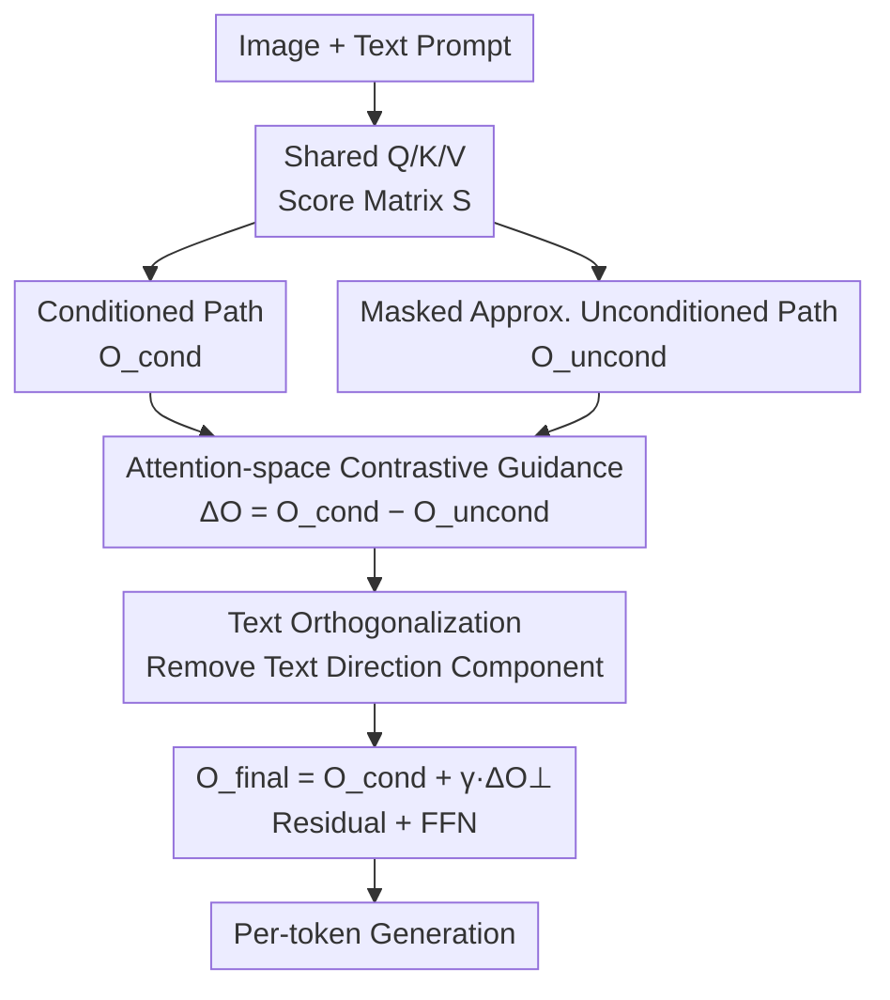

# Attention-space Contrastive Guidance for Efficient Hallucination Mitigation in LVLMs

**Conference**: CVPR 2026  
**arXiv**: [2601.13707](https://arxiv.org/abs/2601.13707)  
**Code**: None  
**Area**: Multimodal VLM / Hallucination Mitigation  
**Keywords**: LVLM Hallucination, Contrastive Guidance, Attention Space, Training-free, Single-pass

## TL;DR
ACG reformulates LVLM hallucination mitigation as "contrastive guidance in attention space": it approximates a "text-only" attention path using masks within the **same forward pass**, calculates the difference from the normal "image-conditioned" path to guide generation, and applies an orthogonal projection to eliminate the "textual direction" component from the difference signal. This reduces hallucinations on CHAIR / POPE to levels lower than 2-pass contrastive decoding while maintaining a latency of only approximately 1.19×.

## Background & Motivation
**Background**: Although Large Vision-Language Models (LVLMs) are proficient in captioning, VQA, and instruction following, they still "hallucinate"—confidently describing objects not present in the image. Mainstream mitigation strategies fall into two categories: model modification (RLHF / contrastive fine-tuning), which requires parameter access and expensive retraining; and training-free inference-time methods. The most relevant to this work is **logit-level contrastive decoding / classifier-free guidance (VCD, PAI, CFG series)**—which run inputs for both "conditioned" and "unconditioned/weakly-conditioned" states, comparing their logits to penalize language-biased completions.

**Limitations of Prior Work**: Logit-level methods have two major drawbacks. First, they intervene only at the **final layer output logits**, by which time internal cross-modal representations are already formed, making them "after-the-fact" remedies. Second, obtaining a "no-image" reference signal typically requires **one or two additional forward passes** (2-pass or even 3-pass), nearly doubling decoding latency. Another route involving attention-level intervention is closer to the "lesion," but most such methods rely on extra forward passes, offline causal analysis to locate heads, or heuristic patches for specific empirical patterns.

**Key Challenge**: The root cause of hallucination is that **language priors override visual evidence** (the model "fills in" objects based on co-occurrence statistics), and recent evidence suggests this bias primarily occurs in **Multi-Head Attention (MHA) modules** rather than MLPs. However, existing training-free methods either fail to intervene at the source (logit-level) or do so at the cost of multiple forward passes—making it difficult to achieve both "intervention at the correct location" and "maintaining single-pass efficiency."

**Goal**: To construct contrastive "image-conditioned vs. unconditioned" paths within a single forward pass at the attention layer and use the difference as a per-token guidance direction for correction.

**Key Insight**: The authors observe that since the "no-image" state is essentially "visual evidence being erased, causing the model to revert to language priors," it is unnecessary to run a separate unconditioned forward pass. Instead, by **masking visual keys in the current token's attention scores**, one can approximate this text-only path within the same computation graph.

**Core Idea**: Use "masked visual keys" to approximate unconditioned attention output in a single pass for contrastive guidance ($O_{\text{final}}=O_{\text{cond}}+\gamma\cdot(O_{\text{cond}}-O_{\text{uncond}})$); then use orthogonal projection to remove the component in the difference vector parallel to the text-only direction, eliminating biases introduced by the mask approximation.

## Method

### Overall Architecture
ACG is a training-free, inference-time, single-pass guidance mechanism acting directly on the self-attention layers of LLaMA-style language decoders. The input is an image + text prompt, and the output is a token-by-token caption/answer. The difference lies in: at each decoding step and each (enabled) attention layer, ACG does not directly use the standard attention output $O_{\text{cond}}$. Instead, it constructs an additional unconditioned path $O_{\text{uncond}}$, orthogonalizes the difference between the two, and adds it back with strength $\gamma$ before proceeding to output projection and residual connections.

The pipeline (corresponding to Algorithm 1): First, compute shared $Q,K,V$ after RMSNorm → Compute conditioned output $O_{\text{cond}}$ using all keys → Compute unconditioned output $O_{\text{uncond}}$ on the **same score matrix** using a mask to "shield visual keys" → Perform text orthogonalization on the difference vector $\Delta O=O_{\text{cond}}-O_{\text{uncond}}$ to obtain $\Delta O_\perp$ → $O_{\text{final}}=O_{\text{cond}}+\gamma\Delta O_\perp$ → Output projection + Residual + FFN. The key is that the "unconditioned path" reuses the $Q,K,V$ and score matrix from the same forward pass, adding negligible computation.

### Key Designs

**1. Attention-space Contrastive Guidance: Moving Intervention to the Source in a Single Pass**

The pain point of logit-level contrastive decoding is that it is an "after-the-fact" fix at the output layer requiring extra passes. ACG moves contrastive logic into the self-attention layers, as cross-modal bias originates in the MHA. For a response token $q$, two outputs are defined: $O_{\text{cond}}$ is the standard output where $q$ attends to all keys; $O_{\text{uncond}}$ is the "image-agnostic" output. The output is $O_{\text{final}}=O_{\text{cond}}+\gamma(O_{\text{cond}}-O_{\text{uncond}})$. To avoid extra forward passes like PAI/VISTA, ACG computes $Q,K,V$ and $S=\frac{QK^\top}{\sqrt{d_k}}$ once: $O_{\text{cond}}=\mathrm{softmax}(S)V$; for $O_{\text{uncond}}$, it reuses $S$ and applies a binary mask to the **query of the last text token** $i^\star$—if key $j$ is a visual token, $M_{i^\star j}=-\infty$, else $0$. Thus, $O_{\text{uncond}}=\mathrm{softmax}(S+M)V$. This "shuts down" visual contributions within the same graph, reducing contrastive guidance to a single pass.

**2. Text Orthogonalization: Eliminating Approximation Bias for Stability at Large $\gamma$**

Mask approximation is not identical to a true "unconditioned forward pass." The authors identify two sources of bias: ① **Context Leakage**—earlier layers may have injected visual info into $Q,K_{\text{text}},V_{\text{text}}$, so masking at layer $l$ cannot replicate a pure text-only state; ② **Softmax Redistribution**—after masking visual keys, attention mass that should have fallen on them is redistributed to text tokens, amplifying text-text correlation. Consequently, $\Delta O=O_{\text{cond}}-O_{\text{uncond}}$ mixes the "desired visual correction" with "text-induced distortion." ACG treats $O_{\text{uncond}}$ as the primary text direction and geometrically subtracts its parallel component from $\Delta O$: normalize $u=\frac{O_{\text{uncond}}}{\|O_{\text{uncond}}\|_2+\epsilon}$, then project onto the orthogonal subspace $\Delta O_\perp=\Delta O-\langle\Delta O,u\rangle u$. This allows stable guidance even at higher $\gamma$, reducing CHAIR$_i$ by nearly half compared to non-orthogonalized versions at the same F1 (see Table 5).

### A Complete Example
Using LLaVA-1.5 to generate a caption: as decoding progresses, the vanilla model tends to "hallucinate" as it relies more on language priors. While processing a response token, ACG computes $O_{\text{cond}}$ and masks its attention to visual tokens to get $O_{\text{uncond}}$. The difference $\Delta O$ points towards the "correction provided by the image" but contains text distortion. After orthogonalization removes the text component, $O_{\text{final}}$ is pushed back toward visual evidence. Qualitatively, while the baseline hallucinations at the end of a sentence, ACG correctly mentions a "brick floor" and identifies a "beach" scene—intervening just before errors accumulate at the output layer.

## Key Experimental Results

### Main Results
On POPE (Object existence discrimination, higher is better), ACG achieves the highest Avg. Acc. across three models, with significant gains in the Adversarial split (where negative samples are semantically related to real objects, most likely to trigger language bias):

| Model | Method | Avg. Acc. |
|------|------|-----------|
| LLaVA-1.5 | Regular | 84.83 |
| LLaVA-1.5 | VCD | 85.38 |
| LLaVA-1.5 | PAI | 84.91 |
| LLaVA-1.5 | VISTA | 83.03 |
| LLaVA-1.5 | **ACG** | **86.03** |
| MiniGPT-4 | Regular | 76.31 |
| MiniGPT-4 | **ACG** | **76.70** |
| Qwen-VL | Regular | 85.51 |
| Qwen-VL | **ACG** | **86.98** |

On CHAIR (Object hallucination in open-ended captions, lower is better; F1, higher is better), ACG achieves the lowest CHAIR$_i$ across two length budgets:

| Model | Method | CHAIR$_s$ (128) | CHAIR$_i$ (128) | F1 (128) |
|------|------|-----------------|-----------------|----------|
| LLaVA-1.5 | Regular | 56.2 | 18.3 | 70.6 |
| LLaVA-1.5 | PAI | 25.6 | 7.6 | 75.9 |
| LLaVA-1.5 | VISTA | 31.0 | 10.5 | 76.6 |
| LLaVA-1.5 | **ACG** | **21.0** | **4.8** | 74.4 |
| MiniGPT-4 | VISTA | 18.8 | 5.9 | 71.0 |
| MiniGPT-4 | **ACG** | **10.8** | **3.3** | 68.0 |

Efficiency comparison (LLaVA-1.5, CHAIR max 128, greedy decoding) highlights ACG's single-pass advantage:

| Method | Intervention | Passes | Latency (s) | CHAIR$_i$ |
|------|----------|----------|-------------|-----------|
| Regular | – | 1-pass | 2.81 (1.00×) | 18.3 |
| VCD | Logit | 2-pass | 5.54 (1.97×) | 17.0 |
| PAI | Logit+Attn | 2-pass | 6.42 (2.28×) | 7.6 |
| VISTA | Latent | 3-pass | 5.55 (1.98×) | 10.5 |
| **ACG-Fast** | Attention | 1-pass | 2.96 (1.05×) | 7.3 |
| **ACG-Full** | Attention | 1-pass | 3.34 (1.19×) | **4.8** |

ACG-Full achieves the lowest CHAIR$_i$=4.8 with only 1.19× latency, outperforming the 2-pass PAI in both accuracy and speed. ACG-Fast (guiding only the first 8 layers) retains most gains with a near-vanilla 1.05× overhead.

### Ablation Study
Comparing ACG with and without orthogonalization at **matched F1** levels (object fidelity):

| Config | $\gamma$ | F1 ↑ | CHAIR$_s$ ↓ | CHAIR$_i$ ↓ |
|------|------|------|-------------|-------------|
| ACG (w/ Ortho) | 2.1 | 77.6 | 34.2 | 7.6 |
| ACG (w/o Ortho) | 1.2 | 77.4 | 38.8 | 9.7 |
| ACG (w/ Ortho) | 2.4 | 74.4 | **21.0** | **4.8** |
| ACG (w/o Ortho) | 1.3 | 74.0 | 30.4 | 8.8 |

At the ≈74 F1 point, orthogonalization reduces CHAIR$_i$ from 8.8 to 4.8 (approx. 1.8× lower), proving that mask approximation introduces bias that can be filtered out geometrically without sacrificing fidelity.

Layer Analysis: Analyzing blocks shows that Early (1–8) layers significantly reduce hallucination with small $\gamma$. The All-layer configuration is strongest, while late-stage blocks require very large $\gamma$ and yield weaker gains. This confirms that cross-modal interactions are primarily established in early layers.

### Key Findings
- **Orthogonalization is the core driver of gain**: It nearly halves CHAIR$_i$ at equivalent F1, proving the presence of approximation bias and the effectiveness of geometric correction.
- **Early layers are most critical**: Effectiveness of small $\gamma$ in early layers justifies ACG-Fast (first 8 layers) and suggests cross-modal bias forms early in decoding.
- **$\gamma$ trade-off**: CHAIR$_i$ decreases as $\gamma$ increases up to ≈2.4; beyond that, F1 drops sharply and captions become too short.
- **Generalization**: Efficiently reduces hallucinations and improves F1 in larger models like LLaVA-NeXT 7B/13B and maintains performance in generic tasks (MMHal, MMMU, MathVista).

## Highlights & Insights
- **Creating unconditioned paths within a single pass is the cleverest move**: Unlike traditional contrastive decoding requiring multiple passes, ACG folds this into one by masking visual keys on the final query and reusing the same score matrix.
- **Orthogonalization as honest error correction**: Instead of treating mask approximation as a perfect unconditioned path, the authors acknowledge biases (leakage and redistribution) and use lightweight projection to fix them—an approach transferable to other ablation-based methods.
- **Per-token, dynamic guidance**: Unlike latent steering's static vectors, ACG's direction is calculated token-by-token from attention differences, better fitting varying hallucination risks.
- **Adjustable tiers**: ACG-Full vs. ACG-Fast offers a "quality vs. cost" knob for deployment.

## Limitations & Future Work
- **Model-specific $\gamma$ tuning**: Sensitive to architecture (LLaVA 2.4 vs MiniGPT-4 0.3), requiring manual sweeps for new models.
- **Imperfection of unconditioned approximation**: Context leakage means the "unconditioned" state still contains remnants of image info; orthogonalization is a mitigation, not a total fix.
- **Single-query masking**: Masking only the query of the last token might not be granular enough for complex multi-object scenes.
- **Benchmark scope**: Evaluation remains centered on COCO-style (POPE/CHAIR) benchmarks; more diverse real-world safety-sensitive domains are yet to be explored.

## Related Work & Insights
- **vs. VCD (Logit-level)**: ACG moves contrast to attention space in 1-pass, achieving lower CHAIR$_i$ (4.8 vs 17.0) and lower latency (1.19× vs 1.97×).
- **vs. PAI (Logit + Attention)**: PAI remains a 2-pass method (2.28× latency); ACG wins on both accuracy and speed via mask approximation.
- **vs. VISTA (Latent steering)**: VISTA adds pre-calculated static vectors in 3-pass; ACG is dynamic and 1-pass.
- **vs. Heuristic Intervention**: Unlike methods targeting specific "hallucination heads" via offline analysis, ACG provides a unified, objective-driven contrastive target.

## Rating
- Novelty: ⭐⭐⭐⭐ 
- Experimental Thoroughness: ⭐⭐⭐⭐ 
- Writing Quality: ⭐⭐⭐⭐ 
- Value: ⭐⭐⭐⭐ 

<!-- RELATED:START -->

## Related Papers

- [\[ICML 2026\] LBR/LBP: Language Bias in LVLMs — From In-Depth Analysis to Simple and Effective Mitigation](../../ICML2026/multimodal_vlm/language_bias_in_lvlms_from_in-depth_analysis_to_simple_and_effective_mitigation.md)
- [\[CVPR 2026\] Where Does Vision Meet Language? Understanding and Refining Visual Fusion in MLLMs via Contrastive Attention](where_does_vision_meet_language_understanding_and_refining_visual_fusion_in_mllm.md)
- [\[CVPR 2026\] WikiCLIP: An Efficient Contrastive Baseline for Open-domain Visual Entity Recognition](wikiclip_an_efficient_contrastive_baseline_for_open-domain_visual_entity_recogni.md)
- [\[CVPR 2026\] SVHalluc: Benchmarking Speech-Vision Hallucination in Audio-Visual Large Language Models](svhalluc_benchmarking_speech-vision_hallucination_in_audio-visual_large_language.md)
- [\[CVPR 2026\] Multimodal Continual Instruction Tuning with Dynamic Gradient Guidance](multimodal_continual_instruction_tuning_with_dynamic_gradient_guidance.md)

<!-- RELATED:END -->
