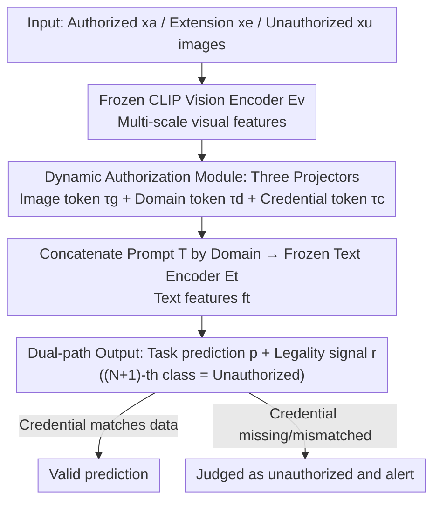

# Authorize-on-Demand: Dynamic Authorization with Legality-Aware Intellectual Property Protection for VLMs

**Conference**: CVPR 2026  
**Paper**: [CVF Open Access](https://openaccess.thecvf.com/content/CVPR2026/html/Wang_Authorize-on-Demand_Dynamic_Authorization_with_Legality-Aware_Intellectual_Property_Protection_for_VLMs_CVPR_2026_paper.html)  
**Code**: https://github.com/LyWang12/AoD-IP  
**Area**: Multi-modal VLM / Model IP Protection / Usability Authorization  
**Keywords**: Model IP Protection, VLM, Dynamic Authorization, Credential Token, Non-transferable Learning  

## TL;DR
AoD-IP adds three lightweight projectors to a frozen CLIP and uses a "credential token" to lock authorized domains so they can only be activated with a specific key. This allows on-demand hot-swapping of new authorized domains after deployment without retraining the backbone, while outputting a "legality signal" during each inference to detect unauthorized access. It achieves near-zero loss on authorized domains and significant accuracy collapse on unauthorized domains across multiple cross-domain benchmarks.

## Background & Motivation
**Background**: VLMs (e.g., CLIP) are expensive to train and possess high commercial value, making "Model IP Protection" a necessity. Existing protection methods fall into two categories: **ownership verification** (watermarking, fingerprinting) for post-hoc traceability after model leakage, and **usability authorization** (non-transferable learning, domain isolation frameworks like CUTI-Domain / CUPI-Domain / NTL) which actively ensures the model is valid only on authorized domains.

**Limitations of Prior Work**: While usability authorization provides proactive protection, it **hard-codes the authorized domains during training**. If a new customer, data source, or deployment scenario arises, incorporating the new domain typically requires retraining the entire backbone, which is computationally expensive and cumbersome. Furthermore, output for unauthorized input is often an **uncontrollable black box**; models may provide high-confidence incorrect predictions for unauthorized data, lacking security and interpretability.

**Key Challenge**: There is a fundamental conflict between the "rigidity" of protection mechanisms (static authorized domains) and the "dynamic nature" of real-world deployment (evolving domains). Additionally, the single-path design focusing only on "task prediction" loses the critical security information of "whether the input is authorized."

**Goal**: (1) Enable the authorization of domains to be specified or switched by the user on-demand after training without retraining; (2) Enable the model to explicitly provide a "legality judgment" for each input during inference.

**Key Insight**: The authors abstract authorization as a "key"—binding a specific **credential token** to the authorized domain. Effective predictions are only unlocked when "data + matching credential" are provided simultaneously. The owner manages the keys, and adding a new authorized domain only requires issuing a new key while keeping the backbone unchanged.

**Core Idea**: Use a credential token, which can be issued on-demand by the owner, as a "domain key." This transforms authorization from a static training-time structure to a dynamic deployment-time lookup and integrates "legality" as the $(N{+}1)$-th category in the classification head.

## Method

### Overall Architecture
AoD-IP is built on a frozen CLIP with only three lightweight projectors being trained. During training, three types of data are fed: authorized domain $x_a$, extension domain $x_e$ (simulating "future authorized domains"), and unauthorized domain $x_u$. Images pass through a frozen visual encoder $E_v$ to obtain visual features $f^v=[f^v_a,f^v_e,f^v_u]$. An image projector $P_{img}$ and a domain projector $P_{dom}$ generate image tokens $(\tau^g_a,\tau^g_e,\tau^g_u)$ and domain-discriminative tokens $(\tau^d_a,\tau^d_e,\tau^d_u)$, respectively. The encryption projector $P_{enc}$ outputs a unique credential token $\tau^c_a$ only for authorized domains. These tokens are concatenated to form text prompts used by the frozen text encoder $E_t$ to get text features $f^t$. Finally, prediction $p$ is calculated via similarity between $f^v$ and $f^t$, with legality judged by the same classification head.

During inference, only shared modules ($E_v, E_t, P_{img}, P_{dom}$) are retained, while the **encryption projector $P_{enc}$ remains private to the owner**—acting as the key-issuing factory. Users provide the owner-issued credential token with their data: a match (Case A) yields a valid prediction, while missing or mismatched tokens (Case D–F) result in an "unauthorized" judgment and alert. When a new domain needs authorization (Case B–C), the owner simply issues a new credential using $P_{enc}$ without retraining.

### Key Designs

**1. Authorize-on-Demand Formalization and Extension Domains: Enabling "Post-hoc Hot-swapping"**

Existing methods lock authorized domains $D_a$ at training. The authors reformulate the task by defining extension domains $D_e=\{D_{e1},\dots,D_{eN}\}$, constrained by $D_a \perp D_e \perp D_u$ (statistically independent, shared label space $Y$). The goal is $F(X_k)\to Y$ for user-selected $k \in \{a, e_1, \dots, e_N\}$ and $F(X_u)\perp Y$. Extension domains are generated by applying **random style perturbations** to authorized domains to create "hard-to-distinguish" domain shifts. These hard cases tighten the authorization boundary in the latent space. Extension domains serve two purposes: simulating unknown real-world domains and **rehearsing "future authorized domains"** during training so they can be activated via new credentials without backbone modification.

**2. Dynamic Authorization Module: Credential Token as a "Domain Key"**

This module consists of three projectors: $P_{img}$ compresses visual features into image tokens $\tau^g$, $P_{dom}$ generates domain tokens $\tau^d$, and $P_{enc}$ **only receives deep features $f^v_a$ to output** a specific credential token $\tau^c_a$ for the authorized domain. The prompt is:

$$T_a = [\tau^c_a,\ \tau^g_a,\ \tau^d_a]$$

For unauthorized/extension domains, two types of "illegal access" are simulated: (1) **Missing credentials** (incomplete token set); (2) **Mismatched credentials** (applying $\tau^c_a$ to unauthorized tokens $T_e=[\tau^c_a,\tau^g_e,\tau^d_e]$). Since attackers lack matching credentials, the model learns to allow access only when the credential perfectly fits the data. $P_{enc}$ is kept private, making it the "key factory" for on-demand authorization.

**3. Dual-path Output: Legality as the $(N+1)$-th Class**

AoD-IP outputs an $(N+1)$-dimensional vector $p_i$ for each domain $i$: the first $N$ dimensions are task classes, and the **$(N+1)$-th dimension represents the "unauthorized" class**. The legality signal is:

$$r_i = \begin{cases} 1, & \arg\max(p_i)\neq C_{unauth}\\ 0, & \arg\max(p_i)=C_{unauth}\end{cases}$$

This allows a single forward pass to answer both "what is the input" and "is it authorized," allowing users to filter potential unauthorized usage.

**4. Loss & Training: Misclassification Penalty + KL Domain Separation**

The total objective is:

$$\mathcal{L} = \mathcal{L}^a_{ce} - \lambda_1\cdot\mathcal{L}^{a\to u}_{ce} + \mathcal{L}^u_{ce} + \mathcal{L}^e_{ce} - \mathcal{L}_{kl}$$

$\mathcal{L}^a_{ce}$ ensures task accuracy on authorized domains; $\mathcal{L}^{a\to u}_{ce}$ is a **misclassification penalty** to prevent authorized samples from being labeled as unauthorized; $\mathcal{L}^u_{ce}$ and $\mathcal{L}^e_{ce}$ push unauthorized/extension samples toward the $(N+1)$-th class. Finally, $\mathcal{L}_{kl}=\mathrm{KL}(f^t_a\,\|\,f^t_e)$ separates the text feature distributions of authorized and extension domains to prevent boundary overlap.

## Key Experimental Results

Experiments used Office-31, Office-Home-65, and Mini-DomainNet. Metrics include $Drop_a$ (smaller is better), $Drop_u$ (larger is better), $W_{u-a}$ (weighted difference), $D_{u-a}$ (cross difference), and legality accuracy $R_a/R_e/R_u$.

### Main Results: Authorized Intact, Unauthorized Collapsed (Office-Home-65 Mean, Table 4)

| Metric | Meaning | AoD-IP |
|------|------|--------|
| $Drop_a$ ↓ | Authorized Domain Accuracy Loss | 0.13% |
| $Drop_u$ ↑ | Unauthorized Domain Accuracy Collapse | 74.57% |
| $W_{u-a}$ ↑ | Comprehensive Trade-off | 63.47% |
| $R_a/R_e/R_u$ | Legality Accuracy | Mostly >90% (81.9%–100%) |

Unprotected SL-CLIP easily transfers to unauthorized domains; AoD-IP causes a 74.57% average drop for unauthorized domains while suffering nearly zero damage (0.13%) to authorized ones.

### vs. Prev. SOTA: Leading Comprehensive Metrics (Table 5)

| Dataset | Metric | CUPI | HNTL | SOPHON | IP-CLIP | **AoD-IP** |
|--------|------|------|------|--------|---------|------------|
| Office-31 | $W_{u-a}$ ↑ | 73.60 | 69.69 | 72.67 | 74.84 | **79.27** |
| Office-Home-65 | $W_{u-a}$ ↑ | 52.78 | 33.03 | 31.77 | 55.10 | **63.47** |
| Mini-DomainNet | $W_{u-a}$ ↑ | 53.05 | 33.62 | 30.22 | 54.68 | **58.49** |

HNTL can suppress unauthorized accuracy but causes authorized accuracy to collapse ($Drop_a$ up to 28.83%). AoD-IP achieves the best balance across all datasets.

### Key Findings
- **The Authorization-Unauthorized Trade-off is the Decisive Factor**: Many methods achieve high $Drop_u$ by sacrificing authorized performance; AoD-IP maintains a very low $Drop_a$ (0.13%).
- **Reliable Legality Judgment**: High $R$ scores indicate that the $(N+1)$-th class stably identifies unauthorized input.
- **Effectiveness of Extension Domains**: The model successfully predicts extension domains when authorized while suppressing unauthorized ones, validating the hot-swappable credential mechanism.

## Highlights & Insights
- **Turning "Authorization" into an Issuable Key**: The combination of credential tokens and private $P_{enc}$ shifts authorization from a static training structure to a dynamic lookup, enabling new domain authorization without retraining.
- **Lightweight Legality Judgment with $(N+1)$-th Class**: By adding a single dimension to the classification head, the model provides security signals with almost zero extra cost.
- **Hard Extension Domains via Style Perturbation**: Creating narrow distribution boundaries through style shifts without external data effectively tightens the authorization space.

## Limitations & Future Work
- **Task Scope**: Limited to cross-domain **image classification**; needs validation on VQA or generation tasks.
- **Idealized Security Model**: Assumes $P_{enc}$ is private and credentials are not leaked/copied. The robustness against credential extraction or replay attacks is not discussed.
- **Lack of Component-wise Ablation**: The relative contribution of $\mathcal{L}_{kl}$, the misclassification penalty, and extension domains is not explicitly decoupled in the main text.

## Related Work & Insights
- **vs. CUTI-Domain / CUPI-Domain**: These use hierarchical isolation but are **static at training**. AoD-IP allows on-demand activation at the cost of a credential.
- **vs. HNTL / NTL**: These often suffer from massive authorized accuracy drops ($Drop_a$ 28.8% for HNTL), whereas AoD-IP keeps it at 0.13%.
- **vs. Watermarking**: Watermarking is for post-hoc ownership; AoD-IP belongs to "usability authorization," proactively intercepting unauthorized use.

## Rating
- Novelty: ⭐⭐⭐⭐ Transforms static authorization into dynamic credential issuance with integrated legality signals.
- Experimental Thoroughness: ⭐⭐⭐⭐ Comprehensive benchmarks and scenarios, but lacks component-level ablation and security robustness tests.
- Writing Quality: ⭐⭐⭐⭐ Clear frameworks and logic, though loss weight notation has slight ambiguity.
- Value: ⭐⭐⭐⭐ Addresses the engineering pain point of retraining for new domains, significant for commercial VLM deployment.

<!-- RELATED:START -->

## Related Papers

- [\[CVPR 2026\] On Token's Dilemma: Dynamic MoE with Drift-Aware Token Assignment for Continual Learning of Large Vision Language Models](on_tokens_dilemma_dynamic_moe_with_drift-aware_token_assignment_for_continual_le.md)
- [\[ACL 2026\] CARES: Context-Aware Resolution Selector for VLMs](../../ACL2026/multimodal_vlm/cares_context-aware_resolution_selector_for_vlms.md)
- [\[CVPR 2026\] Echoes of Ownership: Adversarial-Guided Dual Injection for Copyright Protection in MLLMs](echoes_of_ownership_adversarial-guided_dual_injection_for_copyright_protection_i.md)
- [\[ICML 2026\] Task-Aware Structured Memory for Dynamic Multi-modal In-Context Learning](../../ICML2026/multimodal_vlm/task-aware_structured_memory_for_dynamic_multi-modal_in-context_learning.md)
- [\[CVPR 2025\] Vision-Language Model IP Protection via Prompt-based Learning](../../CVPR2025/multimodal_vlm/vision-language_model_ip_protection_via_prompt-based_learning.md)

<!-- RELATED:END -->
