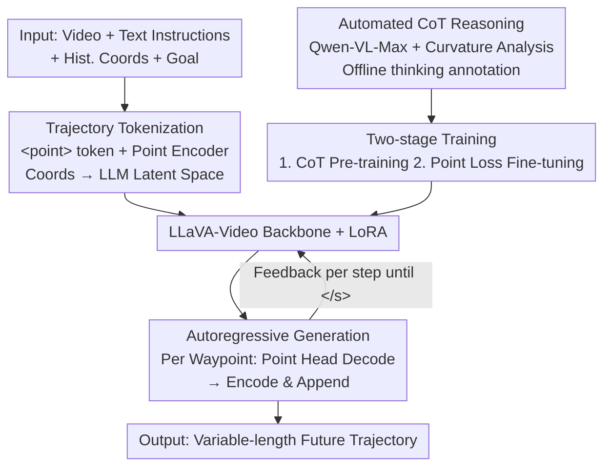

# AutoTraces: Autoregressive Trajectory Forecasting via Multimodal Large Language Models

**Conference**: CVPR 2026  
**Paper**: [CVF Open Access](https://openaccess.thecvf.com/content/CVPR2026/html/Wang_AutoTraces_Autoregressive_Trajectory_Forecasting_via_Multimodal_Large_Language_Models_CVPR_2026_paper.html)  
**Code**: Not disclosed  
**Area**: Multimodal VLM  
**Keywords**: Trajectory prediction, Multimodal LLM, Autoregressive generation, Trajectory tokenization, Social navigation  

## TL;DR
AutoTraces extends a multimodal LLM (LLaVA-Video) by introducing a `<point>` token with a corresponding Point Encoder/Head representation. This maps 2D waypoints into the LLM latent space, allowing the model to predict future robotic trajectories point-by-point through native autoregressive mechanisms. Combined with automatically generated Chain-of-Thought (CoT) reasoning and two-stage training, it outperforms SOTA models on the SCAND dataset in long-horizon, cross-scenario, and variable-length forecasting.

## Background & Motivation
**Background**: In crowded environments like shopping malls or campuses, mobile robots must predict safe trajectories that comply with social norms. The field has shifted from manual rules and Deep Reinforcement Learning (DRL) to **imitation learning**. Models like ViNT, NoMad, and CityWalker use learnable Transformer decoders combined with scene imagination or diffusion policies to regress **fixed-length** future trajectories directly from historical data and visual observations.

**Limitations of Prior Work**: These end-to-end imitation learning models generalize poorly to open-world environments due to the limited diversity of expert demonstrations and the lack of human-like reasoning. Another approach utilizes LLMs; however, early LLM solutions (treating coordinates as text digits) suffer from extremely low token efficiency and weak spatio-temporal modeling. Subsequent methods projecting structured data into LLMs via task-specific encoders (e.g., UrbanGPT) are often **non-autoregressive**, spitting out entire sequences at once via a static special token, which fundamentally limits temporal dynamic modeling and variable-length prediction.

**Key Challenge**: To leverage the contextual reasoning of LLMs for modeling complex human behavior, continuous physical coordinates must be integrated into the discrete token world of LLMs. However, "textualized coordinates" destroy efficiency, while "non-autoregressive encoders" break the autoregressive generation mechanism that LLMs excel at. Neither approach effectively preserves the LLM generative paradigm while accurately expressing coordinates.

**Goal**: Design a trajectory representation that seamlessly integrates into the LLM token space while **preserving native autoregressive decoding** to support long-horizon, cross-scenario, and variable-length social trajectory prediction.

**Key Insight**: Treat each waypoint as a "new modal token" by using a unified `<point>` placeholder token to mark positions. Numerical values are encoded into point embeddings via a lightweight encoder and decoded back to coordinates via a Point Head. This extends the autoregressive mechanism to physical coordinate space without modifying the Transformer architecture.

**Core Idea**: Replace text digits with a learnable trajectory tokenization system ("`<point>` token + point embedding"). This allows the LLM to "generate trajectories" point-by-point, similar to text generation, while incorporating automatically generated CoT reasoning for social commonsense.

## Method

### Overall Architecture
AutoTraces is built upon the multimodal video LLM **LLaVA-Video**. It formalizes social trajectory forecasting as a **multimodal conditional sequence generation task**. At time $t$, the agent receives historical RGB observations $o_{t-L:t}$, historical positions $x_{t-L:t}$ (where $L=8$), and a goal point $g$ to generate $T$ future waypoints $x_{t+1:t+T}$ (where $T$ varies between 5–10 to adapt to different robot speeds).

The pipeline functions as follows: Input video is processed by a Vision Encoder, and historical waypoints are processed by a **Point Encoder**, forming an embedding sequence for the LLM. This is fed into LLaVA-Video (with LoRA) along with text prompts. The model autoregressively outputs `<point>` tokens. The hidden state of each token is decoded into a 2D coordinate by the **Point Head**, which is then re-encoded by the Point Encoder and appended back to the input sequence until an `</s>` end-of-sequence token is generated. Training occurs in two stages: Stage 1 uses automatically generated CoT text for "reasoning knowledge" pre-training, and Stage 2 introduces the `<point>` modality for trajectory regression fine-tuning.

### Key Designs

**1. Trajectory Tokenization: Integrating Coordinates into LLM Latent Space**

This addresses the inefficiencies of textualized coordinates. AutoTraces expands the LLaVA-Video vocabulary by introducing a unified `<point>` token to represent any 2D waypoint, with `<point_start>` and `<point_end>` marking trajectory boundaries. Trajectories are treated as a new output modality. Instead of using text characters, a lightweight **Point Encoder** (Transformer-style positional encoding + MLP) maps physical coordinates into the LLM latent space: $e_{t-i}=\mathrm{PointEncoder}(x_{t-i})$, where $x_{t-i}\in\mathbb{R}^2$ and $e_{t-i}\in\mathbb{R}^D$. This ensures trajectory, vision, and text tokens exist in the same feature space. The **Point Head** symmetrically decodes predicted waypoint embeddings: $\hat{x}_{t+k}=\mathrm{PointHead}(\hat{e}_{t+k})$. This architecture operates within the LLM's native space without altering the Transformer, using only one token per waypoint.

**2. Autoregressive Generation: Feedback Loop for Variable Lengths**

Unlike non-autoregressive methods that output fixed-length sequences, AutoTraces preserves native autoregressive decoding. The model generates the precise number of future `<point>` tokens specified in the prompt. Each generated `<point>` hidden state is immediately decoded into a coordinate, re-encoded, and appended to the input sequence to inform the next prediction. While the mathematical form is $\{\hat{e}_{t+1},\dots,\hat{e}_{t+T}\}=\mathrm{LLM}(E_t,V_t,P_t)$, the implementation is a rolling point-by-point process. This "point-level autoregressive" approach naturally aligns historical and future waypoints, enhancing cross-domain generalization.

**3. Automated CoT Reasoning: Vision-based Thinking without Manual Labels**

To enable social commonsense reasoning, the authors inject Chain-of-Thought as an intermediate representation. Using **Qwen-VL-Max**, CoT text is generated from visual observations and trajectory data by providing future ground-truth, history, and video. The process incorporates **trajectory curvature analysis**: future trajectories are sliced into segments and classified into discrete meta-actions (e.g., `straight`, `left`, `right`). The reasoning follows a two-part paradigm: "Environment/Obstacle Analysis" followed by "Action Derivation." This ensures navigation decisions are visually grounded and logically traceable.

**4. Two-stage Training + Point Regression Loss**

Stage 1 optimizes the LoRA layers and Text Head using standard cross-entropy $\mathcal{L}_{\mathrm{LLM}}$ to generate CoT rationales, decoupling reasoning acquisition from coordinate prediction. Stage 2 introduces the `<point>` modality. Since cross-entropy is unsuitable for continuous coordinate magnitudes, an L1 trajectory point loss provides direct regression supervision:

$$\mathcal{L}_{\text{point}}=\frac{1}{F}\sum_{i=t+1}^{t+F}\|x_i-\hat{x}_i\|_1,\qquad \mathcal{L}_{\text{total}}=\mathcal{L}_{\text{point}}+\mathcal{L}_{\text{LLM}}$$

$\mathcal{L}_{\mathrm{LLM}}$ ensures sequence structure and length correctness, while $\mathcal{L}_{\text{point}}$ ensures coordinate accuracy.

## Key Experimental Results

### Main Results
Evaluated on the **SCAND** dataset for 5–10 step predictions (1s/step) using L2 (Average Displacement Error) and L1 metrics:

| Method | T=5 L2↓ | T=5 L1↓ | T=8 L2↓ | T=10 L2↓ | T=10 L1↓ |
|------|---------|---------|---------|----------|----------|
| GNM | 0.895 | 1.122 | 1.456 | 1.708 | 2.164 |
| ViNT | 0.908 | 1.106 | 1.435 | 1.714 | 2.132 |
| CityWalker | 0.862 | 1.096 | 1.240 | 1.407 | 1.806 |
| LLaVa-Video (Text Coords) | 1.007 | 1.242 | 1.548 | 1.963 | 2.412 |
| **AutoTraces (Ours)** | **0.674** | **0.856** | **0.923** | **1.089** | **1.384** |

AutoTraces reduces L2 error by 0.181m at T=5 compared to GNM, and by 0.318m at T=10 compared to CityWalker. In cross-scenario tests (indoor GoStanford, outdoor RECON), autoregressive methods outperformed non-autoregressive baselines.

### Efficiency
For longer horizons (T=12–20), Metrics include Instruction Execution Accuracy (**IEAcc**) and Tokens Per Result (**TPR**):

| Metric (T=12) | LLaVa-Video | AutoTraces |
|------|------|------|
| L2@S (m)↓ | 1.653 | **1.611** |
| IEAcc↑ | 40.34% | **99.92%** |
| TPR↓ | 375.64 | **25.00** |

AutoTraces achieves 99.92% IEAcc with only 1/8 of the data fine-tuned for one epoch, with 15x higher efficiency than text-based methods.

### Ablation Study
Comparison of L2 error on SCAND:

| Configuration | T=5 L2 | T=8 L2 | T=10 L2 |
|------|--------|--------|---------|
| Full | 0.674 | 0.923 | 1.089 |
| w/o CoT | 0.690 | 0.978 | 1.145 |
| LLaVa-Video (Text) | 1.007 | 1.548 | 1.963 |

### Key Findings
- **Learnable token representation is the primary gain**: Even without CoT, `<point>` tokenization reduces T=10 L2 from 1.963 to 1.145.
- **Autoregressive vs. Single Prediction**: Autoregressive feedback is significantly more stable in unseen domains (e.g., RECON).
- **Visualization**: AutoTraces identifies turning tendencies where most non-LLM models fail.

## Highlights & Insights
- **Coordinates as a New Modality**: Using `<point>` tokens instead of text allows room for continuous signal outputs (time series, pose, control) in LLMs.
- **Symbolic Curvature CoT**: Slicing trajectories into meta-actions (left/straight/right) creates a cheap, effective supervision recipe for spatial tasks.
- **Efficiency**: Achieving 99.92% IEAcc with minimal fine-tuning demonstrates that point encoding significantly lowers the cost of domain adaptation.

## Limitations & Future Work
- **Performance in Zigzag Scenarios**: Modeling complex multi-agent interactions in crowded, overlapping paths remains a challenge.
- **Dependency on Teacher VLM**: The quality of CoT depends on Qwen-VL-Max; noise in offline generation could impact training.
- **Real-time Deployment**: The latency of an autoregressive 7B LLM for point-by-point decoding in real-world robotics was not fully explored.

## Related Work & Insights
- **vs. ViNT/CityWalker**: those use fixed-length regression; AutoTraces uses variable-length autoregressive generation with CoT.
- **vs. LLaVa-Video (Text Coords)**: AutoTraces is far more efficient and avoids instruction-following failures (e.g., wrong sequence length).
- **vs. UrbanGPT**: Non-autoregressive models flatten temporal dynamics; AutoTraces maintains sequence integrity via point-by-point feedback.

## Rating
- Novelty: ⭐⭐⭐⭐
- Experimental Thoroughness: ⭐⭐⭐⭐
- Writing Quality: ⭐⭐⭐⭐
- Value: ⭐⭐⭐⭐

<!-- RELATED:START -->

## Related Papers

- [\[CVPR 2026\] Diffusion Guided Chain-of-Vision for Large Autoregressive Vision Models](diffusion_guided_chain-of-vision_for_large_autoregressive_vision_models.md)
- [\[CVPR 2026\] UVU: Improving Multimodal Understanding via Vision-Language Unified Autoregressive Paradigm](uvu_improving_multimodal_understanding_via_vision-language_unified_autoregressiv.md)
- [\[CVPR 2026\] MASQuant: Modality-Aware Smoothing Quantization for Multimodal Large Language Models](masquant_modality-aware_smoothing_quantization_for_multimodal_large_language_mod.md)
- [\[ACL 2026\] iReasoner: Trajectory-Aware Intrinsic Reasoning Supervision for Self-Evolving Large Multimodal Models](../../ACL2026/multimodal_vlm/ireasoner_trajectory-aware_intrinsic_reasoning_supervision_for_self-evolving_lar.md)
- [\[CVPR 2026\] Grounding Everything in Tokens for Multimodal Large Language Models](grounding_everything_in_tokens_for_multimodal_large_language_models.md)

<!-- RELATED:END -->
