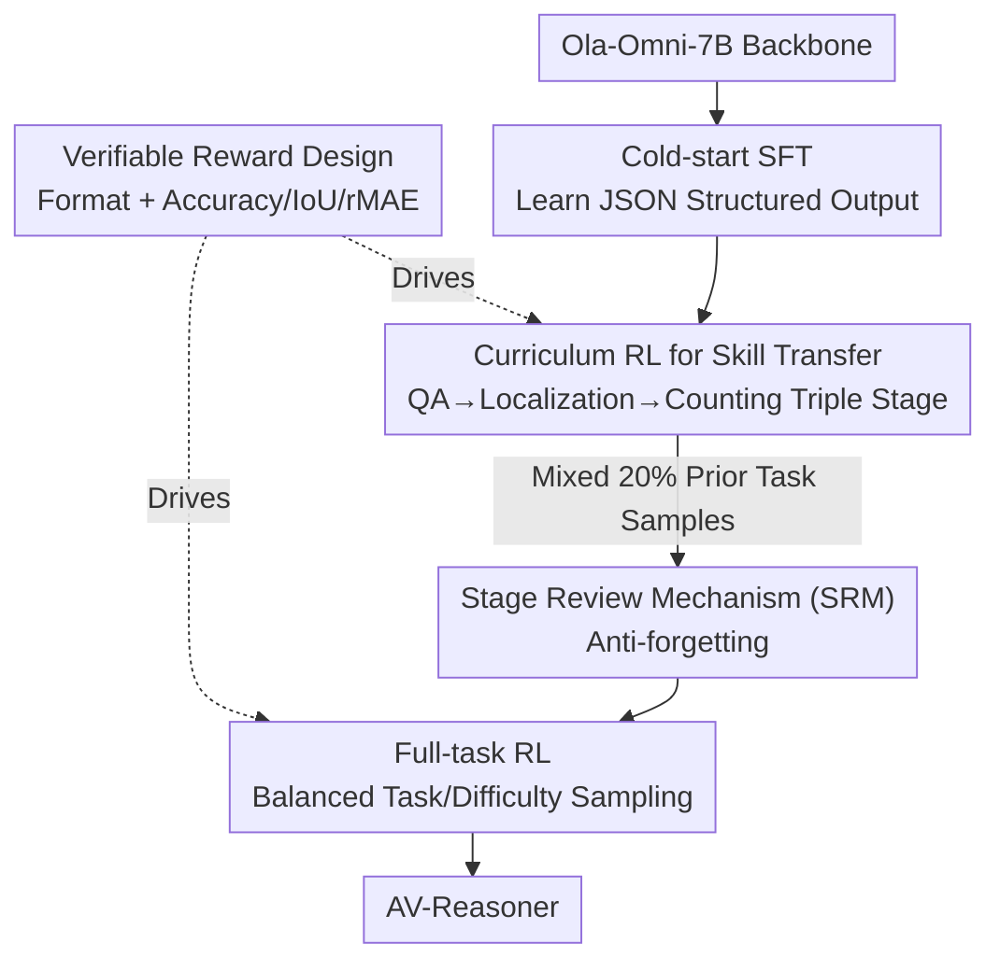

# AV-Reasoner: Improving and Benchmarking Clue-Grounded Audio-Visual Counting for MLLMs

**Conference**: CVPR 2026  
**Paper**: [CVF Open Access](https://openaccess.thecvf.com/content/CVPR2026/html/Lu_AV-Reasoner_Improving_and_Benchmarking_Clue-Grounded_Audio-Visual_Counting_for_MLLMs_CVPR_2026_paper.html)  
**Code**: Not provided (TBD)  
**Area**: Multimodal VLM  
**Keywords**: Audio-visual counting, Multimodal Large Language Models, GRPO reinforcement learning, Curriculum learning, Clue-grounded evaluation  

## TL;DR
Addressing the "counting deficiency" in multimodal large language models (MLLMs), this work introduces CG-AV-Counting—the first interpretable counting benchmark for long videos across audio-visual modalities with fine-grained "counting clue" annotations. Simultaneously, it proposes AV-Reasoner, which leverages GRPO and curriculum learning to **transfer** counting capabilities from related tasks such as localization and QA. While achieving SOTA on several audio-visual reasoning benchmarks, the paper honestly identifies that explicit reasoning in the language space offers little help out-of-distribution.

## Background & Motivation
**Background**: Counting serves as an effective probe for testing the fine-grained alignment and reasoning capabilities of MLLMs. It requires models to perform "detection-localization-aggregation" for instances across frames or scenes, demanding more precise spatiotemporal grounding than coarse-grained video QA. However, existing counting benchmarks remain rudimentary.

**Limitations of Prior Work**: The authors categorize defects in existing benchmarks into four categories: ① **Videos are too short** (most clips < 1 minute, failing to test long-term temporal accumulation); ② **Closed-set queries** (pre-defined question sets allow models to exploit surface-level correlations); ③ **Lack of clue annotations** (providing only the final count, making it difficult to distinguish if the model is truly counting or using heuristics); ④ **Single-modality evaluation** (mostly visual input only, ignoring audio-visual fusion).

**Key Challenge**: Counting capability itself suffers from data scarcity. Manually annotating "where and when each counted instance appears" is extremely costly, leading to a shortage of both high-quality benchmarks and training data. Simply increasing supervised counting data is often ineffective.

**Goal**: The objective is twofold: (a) To create a benchmark for "white-box" diagnosis of whether a model is actually counting; (b) To improve the model's counting capability despite the scarcity of counting-specific data.

**Key Insight**: For (a), the authors introduce "clue-grounded" evaluation—annotating timestamps or bounding boxes for each instance as evidence, enabling both black-box (answer accuracy) and white-box (evidence accuracy) diagnostics. For (b), since counting data is scarce, the model does **not learn counting directly**. Instead, it transfers capabilities from tasks like temporal localization, spatial localization, and QA, which are data-rich but share underlying mechanisms.

**Core Idea**: Use "clue-grounded + dual-protocol" evaluation to make counting transparent, and use "curriculum reinforcement learning for capability transfer" to bypass data scarcity, allowing the model to develop generalizable counting reasoning through related tasks.

## Method

### Overall Architecture
The work provides two complementary contributions. **The first is the CG-AV-Counting benchmark**: Based on 497 long videos (>10 mins) from CG-Bench, it includes 1,027 multimodal counting questions and 5,845 fine-grained clues across three stages of manual annotation. It covers objects/events/attributes and five "reference-query" modality combinations. **The second is the AV-Reasoner model**: Using Ola-Omni-7B as the backbone, it employs a three-stage pipeline (Cold-start SFT → Curriculum RL with Stage Review → Full-task RL) and uses verifiable rewards to transfer counting skills from related tasks.

The training pipeline for AV-Reasoner is shown below:

### Key Designs

**1. CG-AV-Counting Benchmark and White-box Counting Score (WCS): Diagnosing Counting Proficiency**

To address the limitations of existing benchmarks, this work uses a three-stage annotation pipeline (Gemini auto-generates candidate questions → manual preview to determine answers → clue annotation based on target type). The evaluation uses dual protocols. Black-box evaluation looks at end-to-end answers using `Long Acc` (full video), `Ref Acc` (reference interval only), OBOA (One-By-Off Accuracy), MAE, and RMSE.

The novel contribution is the **White-box Counting Score (WCS)**, which multiplies localization accuracy by counting correctness, forcing the model to provide both correct evidence and correct counts:

$$\text{WCS} = \frac{1}{K}\sum_{k=1}^{K}\sqrt{LA_k \times CAP_k}\times 100\%$$

Where $K$ is the number of instance clusters; $LA_k=\frac{1}{|GT_k|}\sum_j \text{IoU}(\text{Pred}_k, GT_k)$ is the average localization accuracy after greedy matching; and $CAP_k=\max\big(0,\,1-\frac{\big||\text{Pred}_k|-|GT_k|\big|}{|GT_k|}\big)$ is the counting penalty term. This formula ensures that if the count is significantly off, the WCS collapses even if localization is decent. Human WCS is 71.93, while Gemini 2.5 Pro only achieves 6.71, exposing the substantial gap in current models.

**2. Curriculum Reinforcement Learning (CB-RL) for Capability Transfer**

The scarcity of counting data is the fundamental pain point. The authors observe that counting requires "audio-visual understanding + temporal localization + spatial localization," which can be learned from data-rich tasks like AVQA, UnAV, and RepCount. Tasks are organized into a curriculum—**(1) QA → (2) Localization → (3) Counting**—and trained sequentially using GRPO to stabilize underlying skills before transferring them to counting.

To improve efficiency, **offline data filtering** is applied: Before each epoch, the reference model performs 5 rollouts per sample. Samples where the model is 5/5 correct (too easy) or where average IoU > 0.9 are discarded. Ablations show that while SFT improves in-distribution performance on DVD-Counting (41.50), it drops on out-of-distribution (OOD) CG-AV (from 17.92 to 15.00), whereas grounding-stage RL significantly boosts CG-AV Long Acc, proving that improvements stem from localization transfer.

**3. Verifiable Reward Design: Rule-based Rewards vs. Step-level Annotation**

GRPO does not rely on step-level rewards; it requires rule-verifiable rewards. This work designs format and performance rewards for QA, localization, and counting. For format, QA and counting use a **General Format Reward** (reasoning in `<think>` and answer in `<answer>`). Localization uses a **JSON Format Reward**. For performance: QA uses **Accuracy Reward**; localization uses **IoU Reward**; and counting uses **relative MAE Reward**:

$$R_{rMAE} = 1 - \min\!\Big(1.0,\ \frac{|\text{Pred}-GT|}{GT}\Big)$$

When ground truth is 0, it degrades to accuracy-based reward. This separates format compliance from task correctness, providing continuous gradient signals for counting deviations.

**4. Stage Review Mechanism (SRM) + Full-task RL: Countering Catastrophic Forgetting**

Curriculum learning often suffers from forgetting earlier simple tasks. The authors use **SRM** by mixing **20%** of prior stage samples into subsequent stages. This is followed by **Full-task RL (FT-RL)** to balance performance across all datasets. Ablations show that training all tasks simultaneously with GRPO causes counting to fail (CG-AV Long Acc of only 10.42). CB-RL with SRM and FT-RL achieves the best result (21.03) while maintaining high performance across QA and localization.

### Loss & Training
**GRPO** (Group Relative Policy Optimization) is used throughout, with KL constraints against the reference model. The sequence is: Cold-start SFT (on AVTG, ARIG, and counting tasks to learn JSON output) → CB-RL (QA→Localization→Counting curriculum with 20% SRM and 5-rollout filtering) → FT-RL (balanced sampling of all tasks).

## Key Experimental Results

### Main Results
There is a massive gap between current models and human performance. Closed-source models are slightly stronger than open-source ones, and **audio-visual models are often outperformed by vision-only models** (e.g., UnifiedIO-2 XXL, VideoLLaMA2.1-AV are lower than visual baselines), revealing weaknesses in quantitative reasoning for fusion strategies. White-box WCS scores are universally low.

| Model | Modality | Long Acc↑ | Ref Acc↑ | WCS↑ |
|------|------|-----------|----------|------|
| Human | A+V | 85.00 | 91.53 | 71.93 |
| Gemini 2.5 Pro | A+V | 40.80 | 47.42 | 6.71 |
| Gemini 2.5 Flash | A+V | 36.90 | 41.48 | 4.20 |
| Qwen3-Omni-30B (Best Open) | A+V | 30.77 | 37.39 | 1.32 |
| Ola-7B (AV-Reasoner Base) | A+V | 17.92 | 25.33 | 0.84 |

AV-Reasoner shows comprehensive improvements over the Ola-Omni base and reaches SOTA on several benchmarks (e.g., MusicAVQA 85.01 vs. PAVE 82.30; DVD-Counting 44.00 vs. Video-R1 34.50):

| Model | DVD Acc↑ | CG-AV Long↑ | CG-AV Ref↑ | WCS↑ |
|------|----------|-------------|------------|------|
| Ola-Omni (Base) | 16.50 | 17.92 | 25.33 | 0.84 |
| AV-Reasoner | 43.50 (+27.0) | 22.30 (+4.4) | 35.83 (+10.5) | 1.11 |
| AV-Reasoner-Thinking | 44.00 | 21.03 | 34.08 | 1.68 |

### Ablation Study
Stage-by-stage decomposition (Tab. 5/6, OOD on CG-AV) demonstrates the necessity of the transfer route and anti-forgetting mechanisms.

| Config | DVD Acc↑ | CG-AV Long↑ | Note |
|------|----------|-------------|------|
| Base (Ola-Omni) | 16.50 | 17.92 | Backbone |
| SFT | 41.50 | 15.00 | In-dist gain, **OOD drop** (overfitting) |
| + CB-RL(QA) | 23.00 | 16.55 | Mitigates overfitting |
| + CB-RL(Grounding) | 34.50 | 18.21 | **Localization transfer as main driver** |
| + CB-RL(Counting) | 43.00 | 20.84 | Counting-specific boost |
| + FT-RL (Full) | 44.00 | 21.03 | Balanced final result |
| SFT + GRPO (Joint) | 31.50 | 10.42 | **Simultaneous training → Counting fails** |

### Key Findings
- **Localization capability transfer is the primary driver of counting improvement**: In OOD CG-AV, Long Acc jumped most significantly after the grounding stage (from 16.55 to 18.21).
- **Curriculum order + review are indispensable**: Simultaneous training collapses counting performance. SRM and FT-RL are needed to prevent forgetting.
- **Explicit reasoning (Thinking) can backfire OOD**: While GRPO improves internal reasoning, forcing `<think>` tokens can amplify hallucinations OOD. AVHBench A2V fell from 84.45 to 82.45. Errors in intermediate steps propagate to the final answer.

## Highlights & Insights
- **WCS combines localization and counting via a square root term**, preventing models from "cheating" by getting one right without the other. It characterizes "actual counting" better than simple accuracy.
- **The "don't learn counting directly if data is scarce" transfer strategy is reusable**: Any fine-grained task with high annotation costs can be decomposed into base skills (localization/QA) and trained via curriculum RL.
- **Offline 5-rollout data filtering** is an efficient trick: Removing samples where the model is already perfect focuses compute on informative, difficult samples.
- **Demystifying "Explicit CoT is always better"**: The work empirically shows that explicit reasoning increases risks OOD due to semantic drift.

## Limitations & Future Work
- Authors admit **reasoning in the language space has limited OOD benefits**; more robust cross-domain reasoning mechanisms are needed. Explicit thinking tends to cause hallucinations.
- Counting capability relies on transfer, meaning generalization to entirely "unseen" counting scenarios remains questionable (not explicitly tested).
- Although the benchmark is long-video and multimodal, attribute counting contains only 14 samples, limiting the statistical robustness of that sub-category.
- Metrics across benchmarks (Long/Ref/WCS) have different scales and should not be compared directly.

## Related Work & Insights
- **vs. Existing Counting Benchmarks (DVD-Counting / VideoNIAH / WorldSense)**: Most are short videos, visual-only, and lack clues. This work provides long videos, AV-joint queries, and **exclusive fine-grained clue annotations with a white-box protocol**.
- **vs. Video-R1 / Visual-RFT (GRPO Multi-modal Reasoning)**: While also using GRPO, this work designs **curriculum transfer + stage review** to handle counting data scarcity.
- **vs. Audio-Visual Alignment Models (Video-SALMONN / Meerkat / Crab)**: These focus on feature fusion; AV-Reasoner uses RL to convert "alignment ability" into "quantitative reasoning ability," outperforming them on most AV tasks.

## Rating
- Innovation: ⭐⭐⭐⭐⭐ Filling the gap with clue-grounded benchmarks and WCS; novel capability transfer RL.
- Experimental Thoroughness: ⭐⭐⭐⭐ Extensive SOTA verification and ablations; however, attribute samples are limited.
- Writing Quality: ⭐⭐⭐⭐ Clear motivation-pain point-solution chain; honest reporting of negative thinking results.
- Value: ⭐⭐⭐⭐⭐ Provides both an interpretable benchmark and a reusable training paradigm for data-scarce tasks.

<!-- RELATED:START -->

## Related Papers

- [\[CVPR 2026\] CodePercept: Code-Grounded Visual STEM Perception for MLLMs](codepercept_code-grounded_visual_stem_perception_for_mllms.md)
- [\[CVPR 2026\] SVHalluc: Benchmarking Speech-Vision Hallucination in Audio-Visual Large Language Models](svhalluc_benchmarking_speech-vision_hallucination_in_audio-visual_large_language.md)
- [\[CVPR 2026\] Benchmarking Single-Factor Physical Video-to-Audio Generation](benchmarking_single-factor_physical_video-to-audio_generation.md)
- [\[CVPR 2026\] IPR-1: Interactive Physical Reasoner](ipr-1_interactive_physical_reasoner.md)
- [\[CVPR 2026\] TempR1: Improving Temporal Understanding of MLLMs via Temporal-Aware Multi-Task Reinforcement Learning](tempr1_improving_temporal_understanding_of_mllms_via_temporal-aware_multi-task_r.md)

<!-- RELATED:END -->
