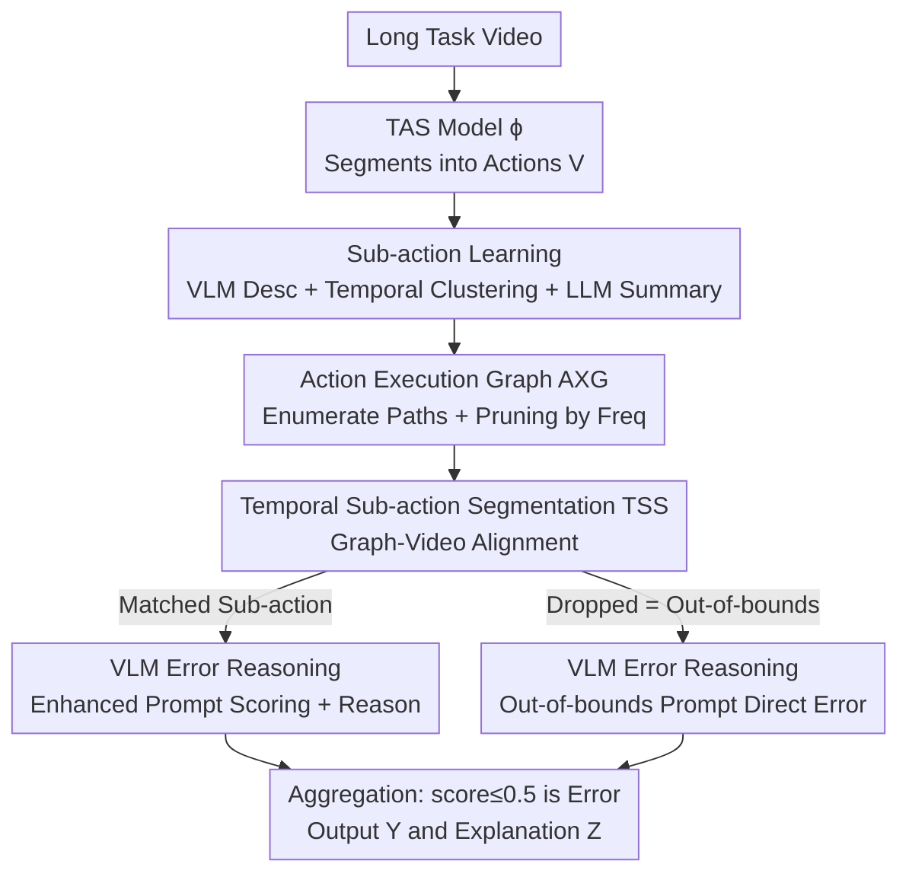

# AXG-Reasoner: Error Detection and Explanation in Long Task Videos with Vision-Language Models

**Conference**: CVPR 2026  
**Paper**: [CVF Open Access](https://openaccess.thecvf.com/content/CVPR2026/html/Lee_AXG-Reasoner_Error_Detection_and_Explanation_in_Long_Task_Videos_with_CVPR_2026_paper.html)  
**Code**: https://github.com/robert80203/AXG-Reasoner  
**Area**: Multimodal VLM / Video Understanding  
**Keywords**: Error reasoning, long task videos, vision-language models, temporal action segmentation, sub-action graphs  

## TL;DR
To address the challenge of "detecting and explaining user operation errors in long task videos," this paper utilizes a frozen VLM combined with an automatically constructed "Action Execution Graph (AXG)" and temporal action segmentation. By decomposing each action segment into fine-grained sub-actions and querying the VLM only on keyframes of these sub-actions, the model focuses on sparse spatial-temporal error clues. It achieves SOTA performance in error explanation and detection on EgoPER and CaptainCook4D, significantly surpassing VLM baselines.

## Background & Motivation
**Background**: A core capability of virtual task assistants (e.g., helping with cooking or experiments) is identifying and explaining user errors to provide corrective guidance. This has led to research on "error understanding." Existing works primarily focus on error detection and recognition, often relying on action feature prototypes or learned task graphs to judge correctness.

**Limitations of Prior Work**: Error **explanation** (explaining "why this step is wrong") remains largely unresolved. Direct application of VLMs is ineffective because errors in long task videos are often spatially and temporally subtle: spatially, it might be the wrong tool (a knife instead of a spoon, where the two small objects differ minimally); temporally, it might be a very short segment (dropping a tea bag and picking up another). When facing long videos, VLMs are overwhelmed by dense "correct action" cues and fail to focus on sparse error signals, leading to degraded detection and explanation.

**Key Challenge**: First, **attention mismatch**—correct cues are dense while error cues are sparse in long videos, causing VLM attention to be dominated by correct parts. Second, **computational constraints**—VLMs can only process a few frames per query, and current keyframe selection methods (like hierarchical trees) do not specify "which precise actions must be executed correctly in those frames." Third, **coarse prompt granularity**—querying a VLM with a high-level action like "put tea bag in mug" forces the model to internally decompose it into "grab/unwrap/extract/place," leading to uncontrollable outputs.

**Goal**: Perform error reasoning in long task videos using a frozen VLM = error detection (segment-wise 0/1 classification) + error explanation (natural language reasoning), while remaining data-efficient.

**Key Insight**: The authors observe that error frames in Temporal Action Segmentation (TAS) outputs are **almost always classified into an action class rather than the background** (measured at >80%), because errors and correct actions are highly similar. Therefore, one can first use a TAS trained only on normal videos to cut the long video into action segments, and then further decompose each action segment into **sub-actions**. This allows the VLM to reason over short, information-dense sub-action clips.

**Core Idea**: Use an automatically constructed "Action Execution Graph (AXG)" from training videos to decompose coarse actions into fine-grained sub-action sequences. By aligning the video to the graph, sub-action segments are isolated. The VLM is then queried only on sub-action keyframes using enhanced prompts containing sub-action names—transforming "long video error reasoning" into "short clip correctness judgment," which VLMs excel at.

## Method

### Overall Architecture
The input is a long task video containing multiple actions where some frames may be erroneous; the outputs are segment-wise error labels $Y=(y_1,\dots,y_N)$ and text explanations $Z=(z_1,\dots,z_N)$. The pipeline consists of **offline graph construction** and **online inference**.

Offline Phase (using only normal, error-free training videos): A standard TAS model $\phi$ is trained to segment videos into action segments. Then, sub-actions for each action are automatically learned from training videos to build an AXG for **each action**—a directed acyclic graph where nodes are sub-actions and edges encode valid "predecessor $\rightarrow$ successor" execution sequences. Each path from source $s$ to sink $s'$ represents a legal sub-action sequence. The AXG is training-free and can be plugged into any TAS and VLM.

Online Phase: For a test video, $\phi$ generates action segments $V=(v_1,\dots,v_N)$, where $v_n=(a_n,t^s_n,t^e_n)$. For each non-background segment, **Graph-to-Video (G2V) alignment** is performed using the corresponding AXG to partition it into sub-action segments (**TSS**). Finally, keyframes are sampled from each sub-action segment, and a VLM provides scores and reasons, which are aggregated into segment-level error detection and explanation.

### Key Designs

**1. Sub-action Learning: Automatic refinement from unlabeled training videos**

Directly addresses the third challenge—manual sub-action annotation is expensive, while coarse prompts yield uncontrollable output. A fully automatic pipeline is designed: for a ground-truth action segment in training videos, frames are sampled every $\beta$ frames. A VLM with prompt $P_{action}$ ("Describe what this person is doing and the names of objects they interact with") generates descriptions and object names, encoded into text embeddings via Sentence-BERT.

The innovation is **temporal-aware clustering**: direct clustering of text embeddings mixes segments like "holding kettle before pouring" and "holding kettle after pouring" due to semantic similarity despite different temporal contexts. The authors add a sinusoidal encoding of the normalized temporal position—$t_{loc}=\mathrm{round}\!\left(\frac{t-t_s}{t_e-t_s}\times 100\right)$, where $t,t_s,t_e$ are timestamps of the frame and segment start/end—to the text embeddings before K-means. After clustering, **cluster pruning** removes clusters smaller than $T_k/K$ (where $T_k$ is the total count) to discard noise. Finally, an LLM selects up to 5 most common objects $O_k$ to summarize the action descriptions $C_k$ into a sub-action name.

**2. AXG Construction: Pruning via training frequency**

To define **legal execution orders**, an initial graph $G^o_i$ for action $i$ is built by enumerating all possible sub-action sequences. Then, G2V alignment and **pruning based on training frequency** are applied to obtain $G_i$. For each training segment, G2V alignment identifies the optimal path. Only sequences appearing $\ge \left\lfloor \frac{N_i}{M_i} \right\rfloor$ times are kept ($N_i$ is total training segments for action $i$, $M_i$ is the number of paths appearing at least once). This retains consistent flows and discards outliers, resulting in a robust, representative AXG.

**3. Temporal Sub-action Segmentation (TSS): Aligning segments to the graph**

For a test segment $v_n$ of action $a_n=i$, G2V alignment using $G_i$ partitions it into sub-action segments. This step also serves as a **preliminary error signal**: each resulting segment is either **matched to a sub-action** or **dropped**. A drop signifies an operation that does not belong to any legal flow (out-of-bounds), marking it as an error candidate.

**4. Dual Prompt VLM Error Reasoning: Handling "Subtle" vs. "Out-of-bounds" errors**

Keyframes $\alpha$ are sampled from each sub-action segment for VLM $F$. Two prompt sets are used based on TSS results:
- For **matched** segments, which might contain subtle spatial/temporal errors (e.g., spoon vs. knife), enhanced prompt $P^c$ is used: "You are performing sub-action $\langle subaction\rangle$ of $\langle action\rangle$. Given images, output a score 0-1 and a reason." Injecting the sub-action name solves the uncontrollable output problem.
- For **dropped** segments, considered out-of-bounds, prompt $P^r$ is used: "You are performing $\langle action\rangle$ and made an error. Describe the error." The score is set to 0.

Aggregation: If **any sub-action score $\le 0.5$**, the action segment $v_n$ is labeled as an error ($y_n=1$). The explanation $z_n$ is the concatenation of all sub-action descriptions. This "strict" aggregation allows catching errors even if only one short sub-action fails.

## Key Experimental Results

### Main Results
Datasets: EgoPER (5 tasks, 386 videos) and CaptainCook4D (5 tasks). VLMs: Qwen2.5-VL-32B and InternVL3.5-14B (frozen). Error explanation is evaluated by LLM-based semantic similarity (%). Error detection uses segment-level F1, with Normal (N.) and Error (E.) classes averaged as F1@$\gamma$.

Error Explanation (on GT action segments, All column, %):

| Dataset | VLM | Naive | VTREE | AXG (Ours) |
|--------|------|-------|-------|------|
| EgoPER | Qwen2.5-VL | 3.6 | 5.0 | **17.4** |
| EgoPER | InternVL3.5 | 19.8 | — | **24.6** |
| Cook4D | Qwen2.5-VL | 4.0 | 3.0 | **19.2** |
| Cook4D | InternVL3.5 | 18.0 | — | **21.2** |

Error Detection (on TAS predicted segments, F1@.5, %):

| Dataset | Method | TAS | VLM | F1@.5 |
|--------|------|-----|-----|-------|
| EgoPER | GTG2Vid | GTG2Vid | N/A | 33.0 |
| EgoPER | AXG | GTG2Vid | Qwen2.5-VL | **33.4** |
| EgoPER | AXG | GTG2Vid | InternVL3.5 | 31.8 |
| Cook4D | GTG2Vid | GTG2Vid | N/A | 16.2 |
| Cook4D | AXG | GTG2Vid | Qwen2.5-VL | **28.5** |
| Cook4D | AXG | GTG2Vid | InternVL3.5 | **29.0** |

AXG improves F1@0.5 by ~13% over naive baselines and achieves SOTA in error detection, nearly doubling performance over GTG2Vid on CaptainCook4D (16.2 $\rightarrow$ 28.5/29.0).

### Ablation Study
- **Impact of $K$ (Clusters)**: Increasing $K$ generally improves explanation as actions are decomposed into finer grains, but detection score varies by task. $K=5$ is the chosen default.
- **Sub-action Level Explanation**: Even for actions with only one sub-action, TSS improves explanation (EgoPER: 25.0 vs Naive 18.4) by better isolating error frames.

### Key Findings
- **Error frames reside in action segments**: >80% of error frames are classified into actions rather than background, justifying the focus on action segments.
- **Trade-off in Normal (N.) Segments**: AXG tends to over-label normal segments as errors, leading to a slight drop in N.-class F1, but overall F1 remains superior—favoring recall over precision in error detection.

## Highlights & Insights
- **Dimensionality Reduction**: The core insight is that VLMs struggle with sparse errors in long videos but excel at judging short clips. AXG+TSS "divides and conquers" the problem.
- **"No-Match = Error"**: Out-of-bounds errors are caught for "free" as alignment residuals during G2V alignment.
- **Temporal-aware Clustering**: Adding sinusoidal temporal encodings to text embeddings is a simple, effective trick to distinguish semantically similar but chronologically distinct sub-actions.
- **Training-free and Plug-and-play**: AXG optimizes no parameters and avoids expensive manual sub-action labels via LLM summarization.

## Limitations & Future Work
- **Over-labeling**: The tendency to over-report errors (false positives) may be problematic in high-stakes scenarios like medical guidance.
- **TAS Dependency**: Error detection accuracy relies heavily on the underlying TAS model quality.
- **Hyperparameter Sensitivity**: The pipeline involves several heuristics (clustering number $K$, pruning thresholds, sampling rates) which may require tuning across datasets.
- **Evaluation Bias**: Relying on LLMs for semantic similarity scores in explanation evaluation introduces potential evaluator bias.

## Related Work & Insights
- **vs GTG2Vid**: While GTG2Vid is a trained discriminative framework, AXG is training-free and provides natural language explanations.
- **vs VIDEOTREE**: VIDEOTREE uses hierarchical trees for frame selection but lacks explicit process modeling, resulting in poorer frame selection for error reasoning compared to AXG.

## Rating
- Novelty: ⭐⭐⭐⭐ Solid combinatorial innovation using AXG, G2V alignment, and dual prompts.
- Experimental Thoroughness: ⭐⭐⭐⭐ Extensive ablations and multi-VLM testing, though explanation scores are low overall.
- Writing Quality: ⭐⭐⭐⭐ Clear motivation and well-structured pipeline descriptions.
- Value: ⭐⭐⭐⭐ Practical for virtual assistants and interpretable feedback systems.

<!-- RELATED:START -->

## Related Papers

- [\[CVPR 2026\] Understanding Task Transfer in Vision-Language Models](understanding_task_transfer_in_vision-language_models.md)
- [\[CVPR 2026\] Thinking With Videos: Multimodal Tool-Augmented Reinforcement Learning for Long Video Reasoning](thinking_with_videos_multimodal_tool-augmented_reinforcement_learning_for_long_v.md)
- [\[CVPR 2026\] IPR-1: Interactive Physical Reasoner](ipr-1_interactive_physical_reasoner.md)
- [\[CVPR 2026\] Activation Matters: Test-time Activated Negative Labels for OOD Detection with Vision-Language Models](activation_matters_test-time_activated_negative_labels_for_ood_detection_with_vi.md)
- [\[CVPR 2026\] LVLM-Aided Alignment of Task-Specific Vision Models](lvlm-aided_alignment_of_task-specific_vision_models.md)

<!-- RELATED:END -->
