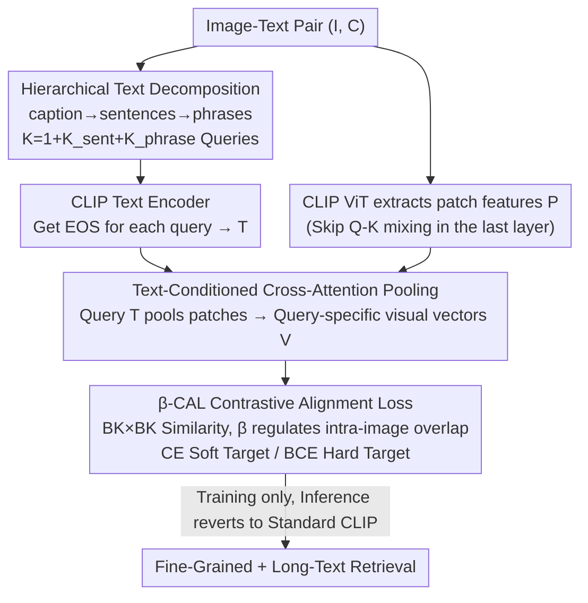

# β-CLIP: Text-Conditioned Contrastive Learning for Multi-Granular Vision-Language Alignment

**Conference**: CVPR 2026  
**Paper**: [CVF Open Access](https://openaccess.thecvf.com/content/CVPR2026/html/Zohra_b-CLIP_Text-Conditioned_Contrastive_Learning_for_Multi_Granular_Vision-Language_Alignment_CVPR_2026_paper.html)  
**Code**: https://github.com/fzohra/B-CLIP  
**Area**: Multimodal VLM  
**Keywords**: CLIP Fine-Tuning, Fine-Grained Alignment, Text-Conditioned Attention Pooling, Contrastive Learning, Long-Text Retrieval  

## TL;DR
β-CLIP decomposes a long description into a three-layer hierarchy of text queries ("full caption → sentences → phrases"). It utilizes cross-attention to dynamically aggregate these queries into query-specific visual features. A contrastive loss with $\beta$ adjustment ($\beta$-CAL) is introduced to handle the inherent semantic overlap between these hierarchical features. Without using any hard negatives, it improves fine-grained retrieval (FG-OVD Hard) to 30.9% and Urban1K retrieval to 91.8/92.3%, establishing a new SOTA under the "no hard negative" setting.

## Background & Motivation
**Background**: CLIP uses a global image vector to align with a caption, demonstrating strong performance in zero-shot retrieval/classification and serving as a common vision/language backbone for generative models. However, it faces two structural bottlenecks: the text encoder has a fixed window of 77 tokens, and the contrastive objective only learns "whole image $\leftrightarrow$ whole sentence" coarse alignment, lacking a mechanism to directly bind specific visual regions to fine-grained text segments.

**Limitations of Prior Work**: Even when fine-tuned with long, detailed captions, CLIP lags in fine-grained tasks. Existing modifications follow two paths: (1) Explicit region-text alignment (e.g., RegionCLIP, FG-CLIP), which relies on massive region boxes and hard negatives (FG-CLIP uses 1.6B captions + 40M regions + 10M hard negatives), leading to heavy data engineering costs. (2) Patch-text alignment using similarity heuristics or trainable modules. However, text-conditioned pooling methods like FLAIR require conditional pooling during both training **and inference**, breaking the deployment advantage of CLIP's offline image feature caching.

**Key Challenge**: Information in long captions is inherently **multi-granular**. As observed in DreamLIP, individual sentences in long captions often describe only parts of the image (specific objects or scenes). Once text is decomposed by granularity for visual feature pooling, these pooled features exhibit **semantic overlap** (e.g., the phrase "bird's beak" is a subset of the sentence "a bird with closed wings"). Since cross-attention inevitably retains contributions from contextual patches, the pooled results are "contextualized by global semantics" rather than pure local regions. Using a standard contrastive loss becomes problematic: treating different granularity features from the same image as negatives causes contradictions, while treating them as positives dilutes query specificity.

**Goal**: (1) Enable CLIP to densely probe visual features at multiple text granularities to enhance fine-grained understanding; (2) Design a contrastive objective that explicitly regulates the trade-off between "query-specific precision $\leftrightarrow$ intra-image context integration" to handle semantic overlap; (3) Revert to standard CLIP during inference to maintain caching efficiency.

**Key Insight**: The authors adopt the text-conditioned attention pooling from FLAIR but extend it to "hierarchical queries" and use it **only during training**. Multi-granular conditional pooling serves as a dense supervisory signal during training and is discarded during inference to return to standard CLIP.

**Core Idea**: Construct multi-granular image-text pairs through "hierarchical text decomposition + text-conditioned cross-attention pooling," and use a $\beta$-parameterized contrastive loss to serve as a tunable knob for overlap intensity between features of the same image, allowing the model to sharpen local features without losing context.

## Method

### Overall Architecture
Given an image-text pair $(I, C)$, β-CLIP decomposes the caption into three semantic scales: the full caption (global), $K_{\text{sent}}$ sentences (coarse-grained), and $K_{\text{phrase}}$ phrases (fine-grained), totaling $K = 1 + K_{\text{sent}} + K_{\text{phrase}}$ queries. Each query is passed through the CLIP text encoder to obtain the EOS representation, resulting in a multi-scale text matrix $T \in \mathbb{R}^{K \times D}$. On the image side, CLIP ViT extracts patch features $P$. Each text query then dynamically pools patches via cross-attention into a **query-specific visual vector** $v_k$. Finally, flattened $T$ and $V$ are used to compute similarities for symmetric training via the $\beta$-CAL loss (available in CE or BCE forms). For a batch of $B$ images, the similarity matrix is $BK \times BK$, meaning the actual number of negatives per image far exceeds the nominal batch size. During inference, the conditional pooling branch is discarded, and the model reverts to standard CLIP (using CLS token + caption) for efficient caching.

### Key Designs

**1. Hierarchical Text Decomposition: Creating dense supervisory signals by decomposing long captions**

The pain point is that CLIP's contrastive objective only learns coarse "whole image $\leftrightarrow$ whole sentence" alignment, causing fine-grained local details in long captions to be blurred into a global vector. β-CLIP decomposes the caption into three scales: the caption level $t_{\text{cap}} = f_{\text{text}}(C)$ for global context; the sentence level $\text{split}(C)$ into $K_{\text{sent}}$ sentences $\{t^i_{\text{sent}} = f_{\text{text}}(s_i)\}$ for coarse granularity; and the phrase level using spaCy dependency parsing to extract $K_{\text{phrase}}$ noun/verb phrases $\{t^j_{\text{phrase}} = f_{\text{text}}(p_j)\}$ for the finest local semantics.

A key detail: Since the CLIP text encoder is trained with causal masking, tokens from the original long caption cannot be reused directly. **Each query must be encoded independently to obtain its own EOS token**; otherwise, phrase representations would be contaminated by preceding context in the long sentence. This decomposition turns "one sentence" into $K$ progressive probes, where finer phrases force the model to localize specific objects. Ablations show that increasing $K$ from 6 (1 caption + 5 sentences) to 36 (adding 30 phrases) improves FG-OVD Hard by +1.7 and Medium/Easy by +4.1/+4.0, confirming that phrase-level features assist in fine-grained localization.

**2. Text-Conditioned Cross-Attention Pooling: Allowing queries to select relevant patches (Training only)**

To extract corresponding visual features for multi-granular queries, β-CLIP first extracts patch tokens using CLIP ViT. Following previous work, it **skips the Q-K mixing of patch tokens in the final ViT attention block** to preserve patch locality: $[v_{\text{CLS}}; P] = f_{\text{vision}}(I)$, where $P=[p_1,\dots,p_N]$ ($N=196$ for ViT-B/16). Cross-attention pooling is then applied, with text queries as Queries and patches as Keys/Values:

$$\mathbf{Q}_k = t_k \mathbf{W}_Q,\quad \mathbf{K} = P\mathbf{W}_K,\quad \mathbf{V} = P\mathbf{W}_V,\quad \alpha_k = \mathrm{softmax}\!\Big(\frac{\mathbf{Q}_k\mathbf{K}^\top}{\sqrt{D/h}}\Big),\quad v_k = \alpha_k\mathbf{V}$$

Using $h=8$ attention heads, this Transformer block is modified to **skip the first residual connection outside the multi-head self-attention**, normalizing the attention-weighted value vectors and passing them through a 2-layer MLP before adding the residual. The output $V=[v_1,\dots,v_K]$ consists of query-specific visual representations where each $v_k$ focuses on visual regions relevant to $t_k$.

The critical difference from FLAIR is that β-CLIP uses this **only during training** as a dense supervision signal. During inference, this entire block is discarded, and the model reverts to the standard CLIP CLS token. This "distills" fine-grained alignment capability into the backbone without sacrificing the ability to cache image features offline.

**3. $\beta$-CAL Contrastive Alignment Loss: Tuning the "Precision $\leftrightarrow$ Context" trade-off**

This is the core contribution, addressing the side effect of cross-attention: since features retain contextual patch contributions, phrase features $v^{\text{phrase}}_j$ might contain parts of sentence features $v^{\text{sent}}_i$. Standard contrastive losses either treat intra-image features as negatives (contradictory) or as positives (diluting specificity). The β-CAL solution is to **treat all features from the same image as positives while regulating their "positive strength" with $\beta \in [0,1]$**. For $B$ images, a flattened similarity matrix $S \in \mathbb{R}^{BK \times BK}$ is constructed, where $S_{ij} = v_i^\top t_j / \tau$.

- **Soft Target (CE form)**: Target weights are set as $w_{ij}=1$ (exact match $i=j$), $\beta$ (intra-image but $i \neq j$), or $0$ (inter-image negative). These are row-normalized into a soft distribution $p_{ij} = w_{ij} / \sum_l w_{il}$. Symmetric cross-entropy $\mathcal{L}^{\text{CE}}_{\beta\text{-CAL}}$ is calculated. At $\beta=0$, only diagonal matches are active (sharpening local features); as $\beta \to 1$, intra-image positives compete equally.
- **Hard Target (BCE form)**: Labels are strictly binary $y_{ij}=1$ (intra-image) or $0$ (inter-image). However, **inter-image negatives are weighted as 1, while intra-image off-diagonal terms are weighted as $\beta$**. This uses $\beta$ to down-weight the gradient contribution of contextual positives rather than modifying the label.

$\beta$ determines the proportion of target mass assigned to "self-match" vs. "other intra-image positives," with the diagonal proportion defined as $f_{\text{diag}} = 1 / (1 + (K-1)\beta)$. $\beta \to 0$ favors long-text retrieval but sacrifices fine-grained precision; $\beta \to 1$ promotes cross-scale consistency but dilutes specific signals. The total loss includes the standard CLIP global loss: $\mathcal{L}_{\text{total}} = \mathcal{L}_{\beta\text{-CAL}} + \mathcal{L}_{\text{global}}$.

## Key Experimental Results

Training: Fine-tuned on a filtered subset of ShareGPT4V-1.24M using AdamW. Learning rates: 1e-5 for pre-trained parameters, 1e-3 for new Transformer blocks. Effective batch size = 2048. 10 epochs. Position embedding interpolation (LongCLIP) was used to extend the window.

### Main Results: Fine-Grained + Long-Text Retrieval (ViT-B/16, R@1)

| Task | Metric | CLIP | FineCLIP | SmartCLIP | β-CLIP(CE, K=36) | β-CLIP(BCE, K=36) |
|------|------|------|----------|-----------|------------------|-------------------|
| FG-OVD | Hard | 12.0 | 26.8 | 18.9 | **30.9** | 20.1 |
| FG-OVD | Medium | 23.1 | 49.8 | 37.0 | **55.4** | 38.5 |
| FG-OVD | Easy | 22.2 | 50.4 | 37.9 | **60.4** | 34.2 |
| Urban-1k | T2I | 53.2 | – | 87.4 | 89.0 | **91.8** |
| Urban-1k | I2T | 67.5 | – | 90.0 | 88.6 | **92.3** |
| DCI | T2I | 43.0 | 34.4 | 64.5 | 59.9 | **65.1** |

- The CE variant outperforms the region-aligned FineCLIP across all FG-OVD difficulties (Hard/Medium/Easy/Trivial by +4.1/+5.6/+10.0/+8.4) using only 1.2M data and no hard negatives, **closing 55% of the performance gap between CLIP and FG-CLIP**.
- The BCE variant sets a new SOTA on Urban-1k (91.8/92.3), dominating in long-text retrieval. The two variants complement each other.

### Ablation Study

**Effect of β-CAL Objective (K=6, β=0.5 vs. Naive Fine-tuning)**

| Configuration | FG-OVD Hard | U-1k T2I | Description |
|------|-------------|----------|------|
| Single Positive K=1 (Global only) | 22.0 | 88.6 | Naive FT, no conditional pooling |
| Multi-Positive K=6 (Global only) | 19.7 | 89.0 | Multi-positive without text-conditioning |
| CE K=1, β=0 | 22.0 | 88.4 | Conditional pooling, no hierarchy |
| CE K=6, β=0.5 | **29.2** | 87.9 | Hierarchy + β-CAL, Hard gains significantly |
| BCE K=6, β=0.5 | 20.6 | **91.8** | BCE variant, superior for long-text |

**Trade-off between Precision and Context (K=36)**

| Configuration | FG-OVD Hard | U-1k T2I |
|------|-------------|----------|
| CE, β=0 | 3.6 | 90.7 |
| CE, β=0.5 | **30.9** | 89.0 |
| CE, β=1 | 30.8 | 88.7 |
| BCE, β=0 | 14.8 | 91.9 |
| BCE, β=1 | 20.2 | 92.0 |

### Key Findings
- **Hierarchy, not data, drives gains**: β-CLIP outperforms other methods trained on ShareGPT4V-1M (Long-CLIP, SmartCLIP), indicating that improvements stem from multi-granular conditional pooling.
- **CE and BCE respond differently to $\beta$**: CE relies heavily on $\beta > 0$ for fine-grained separation (Hard 3.6 $\to$ 30.9); BCE is naturally weaker at fine-grained separation but is unaffected by $\beta$ regarding long-text retrieval.
- **Larger K improves fine-grained performance (CE)**: As $K$ increases from 6 to 36, FG-OVD metrics rise; however, BCE plateaus or declines as $K$ increases because it averages focus across matches, weakening discrimination.
- **TCI Inference Upper Bound**: Using ground-truth captions to condition images during inference (TCI) pushes CE/K=6 on U-1k to 99.1%, highlighting the potential of conditional pooling.

## Highlights & Insights
- **Turning "Semantic Overlap" into a Tunable Knob**: Instead of avoiding hierarchical overlap, β-CAL models it as a continuous knob $\beta$ for "intra-image positive strength."
- **Train-Time Use, Test-Time Discard**: Using text-conditioned pooling as a dense supervisory signal during training and discarding it at inference allows for fine-grained alignment without sacrificing image caching efficiency.
- **Implicit Negative Multiplier**: The $BK \times BK$ similarity matrix ensures that negative signals are much denser than the nominal batch size without needing explicit hard-negative mining.
- **CE vs. BCE Division**: Softmax (CE) forces competition between intra-image positives, favoring exact matching and fine-grained tasks. Sigmoid (BCE) treats them independently, favoring aggregate focus and long-text retrieval.

## Limitations & Future Work
- **Lack of a Universal Variant**: CE excels at fine-grained tasks, while BCE excels at long-text; users must choose based on the task.
- **Dependency on External Parsers and LLM Captions**: Phrase extraction relies on spaCy, and captions are synthetic (ShareGPT4V), meaning quality propagates from these tools.
- **GT-dependent TCI results**: The largest gains from conditioning require ground-truth text at inference, which is not available in standard retrieval settings.
- **Future Directions**: Exploring adaptive $\beta$ and $K$; hybrid objectives combining CE and BCE; and distilling conditional pooling capabilities more effectively to close the gap with the TCI upper bound.

## Related Work & Insights
- **vs. FLAIR**: Both use text-conditioned attention pooling, but FLAIR is single-query and requires conditioning at inference. β-CLIP uses multi-granular hierarchy and discards the pooling at inference, significantly outperforming FLAIR on FG-OVD (Hard 30.9 vs. 13.3).
- **vs. FG-CLIP**: FG-CLIP relies on massive region boxes and 10M hard negatives. β-CLIP achieves 55% of the performance delta using only 1.2M data without region supervision or hard negatives.
- **vs. DreamLIP**: DreamLIP uses sub-captions for multi-positive contrastive learning. β-CLIP replaces simple cosine pooling with trainable cross-attention and handles overlap explicitly via β-CAL.

## Rating
- Novelty: ⭐⭐⭐⭐ β-CAL modeling semantic overlap as a knob and the "train-only" conditional pooling strategy are clever, though individual components build on existing ideas.
- Experimental Thoroughness: ⭐⭐⭐⭐⭐ Comprehensive evaluation across three retrieval types and multi-dimensional ablations (β, K, loss, TCI).
- Writing Quality: ⭐⭐⭐⭐ Clear motivation and loss derivation; strong analysis of the CE/BCE distinction.
- Value: ⭐⭐⭐⭐ A strong baseline for "no hard negative" settings with a practical engineering trade-off for deployment.

<!-- RELATED:START -->

## Related Papers

- [\[CVPR 2026\] MuCo: Multi-turn Contrastive Learning for Multimodal Embedding Model](muco_multi-turn_contrastive_learning_for_multimodal_embedding_model.md)
- [\[CVPR 2026\] M3Grounder: Mask-Based Multi-Span and Multi-Granular Grounding for Document QA](m3grounder_mask-based_multi-span_and_multi-granular_grounding_for_document_qa.md)
- [\[CVPR 2026\] Multi-Hierarchical Contrastive Spectral Fusion for Multi-View Clustering](multi-hierarchical_contrastive_spectral_fusion_for_multi-view_clustering.md)
- [\[AAAI 2026\] HiMo-CLIP: Modeling Semantic Hierarchy and Monotonicity in Vision-Language Alignment](../../AAAI2026/multimodal_vlm/himo-clip_modeling_semantic_hierarchy_and_monotonicity_in_vi.md)
- [\[CVPR 2026\] TIPSv2: Advancing Vision-Language Pretraining with Enhanced Patch-Text Alignment](tipsv2_patch_text_alignment.md)

<!-- RELATED:END -->
