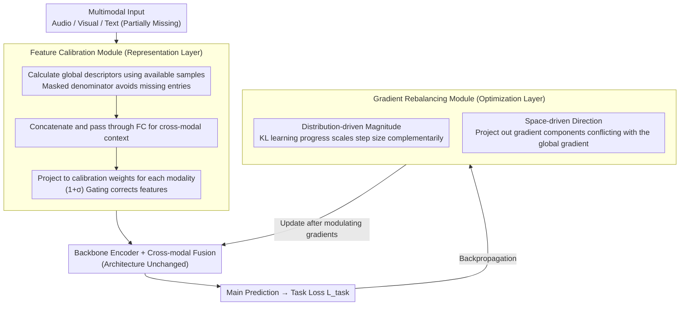

# BALM: A Model-Agnostic Framework for Balanced Multimodal Learning under Imbalanced Missing Rates

**Conference**: CVPR 2026  
**arXiv**: [2603.19718](https://arxiv.org/abs/2603.19718)  
**Code**: [https://github.com/np4s/BALM_CVPR2026.git](https://github.com/np4s/BALM_CVPR2026.git)  
**Area**: Multimodal Learning / VLM  
**Keywords**: Multimodal Learning, Missing Modality, Imbalanced Missing Rate, Gradient Rebalancing, Feature Calibration

## TL;DR
BALM proposes a model-agnostic, plug-and-play framework to address multimodal learning under **Imbalanced Missing Rates (IMR)**. By employing a Feature Calibration Module (FCM) to align representations across different missing patterns and a Gradient Rebalancing Module (GRM) to balance the optimization dynamics of each modality from both distributional and spatial dimensions, BALM consistently improves the robustness of various backbone networks across multiple multimodal emotion recognition benchmarks.

## Background & Motivation

**Background**: Significant progress has been made in multimodal learning (Audio + Visual + Text). However, in real-world scenarios, sensor failures, recording noise, or acquisition costs often lead to **partial or complete modality missing**.

**Imbalance Caused by Missing Modalities**:
   - **Shared Missing Rate (SMR)** Assumption: Current methods often assume all modalities are lost with the same probability, which is an unrealistic simplification.
   - **Imbalanced Missing Rate (IMR)**: Real-world scenarios involve different modalities missing at different rates (e.g., 70% missing for audio but only 30% for text).

**Double Challenges Brought by IMR**:
   - **(1) Representation Imbalance**: Heterogeneous missing patterns distort the feature distribution of each modality, hindering consistent cross-modal fusion.
   - **(2) Learning Imbalance**: Gradients are dominated by high-availability modalities, leading to optimization bias and underfitting of low-availability modalities.
   - Gradient contribution is proportional to the availability rate: $\frac{\partial \mathcal{L}}{\partial \theta_m} \propto (1 - r_m)$.

**Limitations of Prior Work**:
   - Alignment methods (e.g., contrastive learning) and generative methods (modality reconstruction) usually assume SMR or require full data during training.
   - Modality imbalance methods (re-sampling, gradient modulation) mostly assume all modalities are fully available.
   - Few methods **simultaneously handle both missing data and imbalance**.

**Core Idea**: Perform rebalancing at both the representation layer (feature calibration) and the optimization layer (gradient rebalancing), integrating these as plug-and-play modules into any existing backbone.

## Method

### Overall Architecture
BALM aims to solve multimodal learning under "Imbalanced Missing Rates (IMR)". This condition causes two simultaneous issues: the feature distribution of frequently missing modalities is distorted, dragging down the fusion performance; and gradients are monopolized by high-availability modalities, leaving low-availability ones underfitted. BALM's approach integrates two complementary plug-and-play modules into any backbone network to rebalance from both the representation and optimization perspectives. In the forward pass, data enters the **Feature Calibration Module (FCM)**. Before entering the encoder, FCM uses global statistics from all available modalities to pull features distorted by missingness back to a normal distribution. These are then passed to the original backbone for encoding, fusion, and prediction. In the backward pass, the **Gradient Rebalancing Module (GRM)** intervenes during loss backpropagation, modulating the magnitude and direction of the gradients of each modality before updating the parameters. This process does not change the backbone architecture or attempt to reconstruct missing modalities.

### Key Designs

**1. Feature Calibration Module (FCM): Correcting distorted features using global context rather than reconstruction**

This targets "Representation Imbalance." When a modality is frequently missing, its feature distribution shifts globally, and this shift persists through cross-modal fusion. Instead of "generating" missing information, FCM uses global statistics of all available modalities to "correct" existing features. First, it calculates a global descriptor for each modality over available samples. A mask $e_i^m$ is used in the denominator to sum only existing samples, preventing missing positions from polluting the mean:

$$x_{glob}^m = \frac{\sum_i \tilde{x}_i^m}{\varepsilon + \sum_i e_i^m}$$

The descriptors are concatenated and passed through an FC layer to extract cross-modal context $x_{global} = \text{ReLU}(\mathbf{F}_{global}([x_{glob}^{m_1}, ..., x_{glob}^{m_M}]))$, which is then projected into individual calibration weights $w_{cal}^m = \mathbf{F}_{cal}^m(x_{global})$. Finally, it acts on the original features via a gating mechanism: $\hat{x}_i^m = (1 + \sigma(w_{cal}^m)) \odot \tilde{x}_i^m$. The form $1 + \sigma(\cdot)$ ensures calibration is an "amplification/contraction" rather than a complete rewrite. Distorted modalities (typically low-availability ones) receive larger corrections, while healthy ones remain nearly unchanged, aligning distributions without introducing reconstruction errors.

**2. Gradient Rebalancing Module (GRM): Preventing optimization monopoly through magnitude and direction**

This targets "Learning Imbalance." The paper identifies the root cause as gradient contribution being proportional to modality availability ($\frac{\partial \mathcal{L}}{\partial \theta_m} \propto (1 - r_m)$). High-availability modalities naturally dominate optimization. GRM attaches a lightweight unimodal prediction head (two FC layers, dimensions matching the main head) to each modality. Their outputs measure learning speed and directional conflict, followed by a two-step modulation.

The magnitude modulation is distribution-driven: KL divergence measures the distance between unimodal predictions and the multimodal reference $\mathcal{D}_{KL}^m = \sum_i \text{KL}(\hat{y}_i^m \| \hat{y}_i)$. The decrease in this distance between adjacent steps, $\Delta_{KL}^m = \mathcal{D}_{KL}^{m^{(t-1)}} - \mathcal{D}_{KL}^{m^{(t)}}$, represents the "learning progress." Fast learners are already "good enough," while slow learners need more focus. The modulation coefficient is the "complementary" proportion of its progress relative to all modalities:

$$\mu^m = \rho \frac{\sum_{m' \neq m} \Delta_{KL}^{m'}}{\sum_{m'} \Delta_{KL}^{m'}}$$

The update step is scaled as $\theta_{(t+1)}^{\phi^m} = \theta_{(t)}^{\phi^m} - \alpha \mu^m \frac{\partial \mathcal{L}}{\partial \theta_{(t)}^{\phi^m}}$.

The directional modulation is space-driven, addressing blind spots of magnitude modulation: even if magnitudes are balanced, conflicting gradient directions can cancel each other out. Space-driven modulation uses prediction head gradients to approximate the global gradient $\nabla_{pred}$ and unimodal gradients $\nabla_{pred}^m$, detects directional conflicts, and projects out conflicting components to ensure coordination. These two dimensions are complementary: distribution-driven modulation decides "who moves further," while space-driven modulation ensures "don't move in opposite directions."

### Loss & Training
- Main task loss $\mathcal{L}_{task}$ (Cross-Entropy or L1, depending on the backbone).
- FCM introduces no additional loss, only modifying input features to the encoder.
- GRM introduces no additional loss, only scaling/projecting gradients during backpropagation.
- The framework is entirely plug-and-play and does not change the backbone architecture.

## Key Experimental Results

### Main Results (IEMOCAP, 6 IMR Configurations, $(r_A, r_L, r_V)$)

| Method | (0.3,0.5,0.7) Acc | (0.5,0.3,0.7) Acc | (0.7,0.3,0.5) Acc | Average Stability |
|------|-------------------|-------------------|-------------------|----------|
| MMIN | 55.97 | 56.40 | 55.87 | High Consistency, Low Performance |
| SDR-GNN | 59.46 | 58.53 | 55.14 | High Fluctuation |
| Mi-CGA | 58.84 | 60.50 | 58.84 | Medium |
| MoMKE | 55.39 | 60.18 | 58.26 | High Fluctuation |

(BALM, as a plugin, improves the performance and stability of all backbones, as detailed in the full paper tables.)

### Ablation Study (Contribution of BALM Modules)

| Configuration | Description |
|------|------|
| FCM Only | Alleviates representation imbalance, improves feature quality of weak modalities. |
| GRM Only | Balances optimization dynamics, prevents dominance by strong modalities. |
| FCM + GRM (Full) | Both are complementary, achieving best performance and stability. |

### Key Findings
- Traditional missing modality methods perform inconsistently under IMR (e.g., SDR-GNN accuracy fluctuates by 4.3% across different IMR configurations).
- BALM consistently enhances various backbones (Standard MER models, imbalance-specific models, and missing modality methods).
- Distribution-driven and space-driven modulations are complementary; using only one is less effective than the combination.
- FCM shows more significant improvements for low-availability modalities, while GRM effectively suppresses overfitting in high-availability modalities.

## Highlights & Insights
- **Formalization of the IMR problem** is very clear—deriving IMR from SMR and quantifying the imbalance degree $\Delta_{IMR}$ and gradient bias.
- **Plug-and-play design** is highly practical—no backbone modification required, only two lightweight modules added.
- **Dual-dimension rebalancing** (representation + optimization) addresses the two root causes of the problem simultaneously.
- The concept of using **global context calibration** instead of modality reconstruction is elegant—it doesn't try to "generate" missing info but "corrects" existing info.

## Limitations & Future Work
- Experiments primarily focus on Multimodal Emotion Recognition (MER); generalization to other tasks (e.g., VQA, video understanding) requires verification.
- FCM global descriptors are batch-level statistics, which may be unstable with small batch sizes.
- GRM’s distribution-driven modulation relies on multimodal predictions as a reference; if the fusion itself is biased, the reference may be unreliable.
- Behavior under extreme missing rates (e.g., >90%) has not been fully analyzed.

## Related Work & Insights
- OGM-GE (Peng et al.) is a pioneer in gradient modulation for modality imbalance.
- MMIN and Mi-CGA are representative missing modality learning methods, but they do not specifically address IMR.
- BALM's gradient rebalancing strategy could be generalized to broader multi-task or multi-branch learning scenarios.
- The shift from SMR to IMR provides meaningful guidance for the research community.

## Rating
- Novelty: ⭐⭐⭐⭐ The IMR problem is well-defined and the dual-module design is self-consistent, though individual technical components are relatively standard.
- Experimental Thoroughness: ⭐⭐⭐⭐ Coverage across multiple benchmarks, backbones, and IMR configurations is extensive.
- Writing Quality: ⭐⭐⭐⭐ Mathematical derivations are rigorous, and the formalization of IMR is valuable.
- Value: ⭐⭐⭐⭐ A model-agnostic framework with direct significance for real-world deployment.

<!-- RELATED:START -->

## Related Papers

- [\[CVPR 2026\] Label What Matters: Modality-Balanced and Difficulty-Aware Multimodal Active Learning](label_what_matters_modality-balanced_and_difficulty-aware_multimodal_active_lear.md)
- [\[CVPR 2026\] MOON2.0: Dynamic Modality-balanced Multimodal Representation Learning for E-commerce Product Understanding](moon20_dynamic_modality-balanced_multimodal_representation_learning_for_e-commer.md)
- [\[ICML 2026\] Calibrated Multimodal Representation Learning with Missing Modalities](../../ICML2026/multimodal_vlm/calibrated_multimodal_representation_learning_with_missing_modalities.md)
- [\[CVPR 2026\] DPL: Decoupled Prototype Learning for Enhancing Robustness of Vision-Language Transformers to Missing Modalities](dpl_decoupled_prototype_learning_for_enhancing_robustness_of_vision-language_tra.md)
- [\[CVPR 2026\] MuCo: Multi-turn Contrastive Learning for Multimodal Embedding Model](muco_multi-turn_contrastive_learning_for_multimodal_embedding_model.md)

<!-- RELATED:END -->
