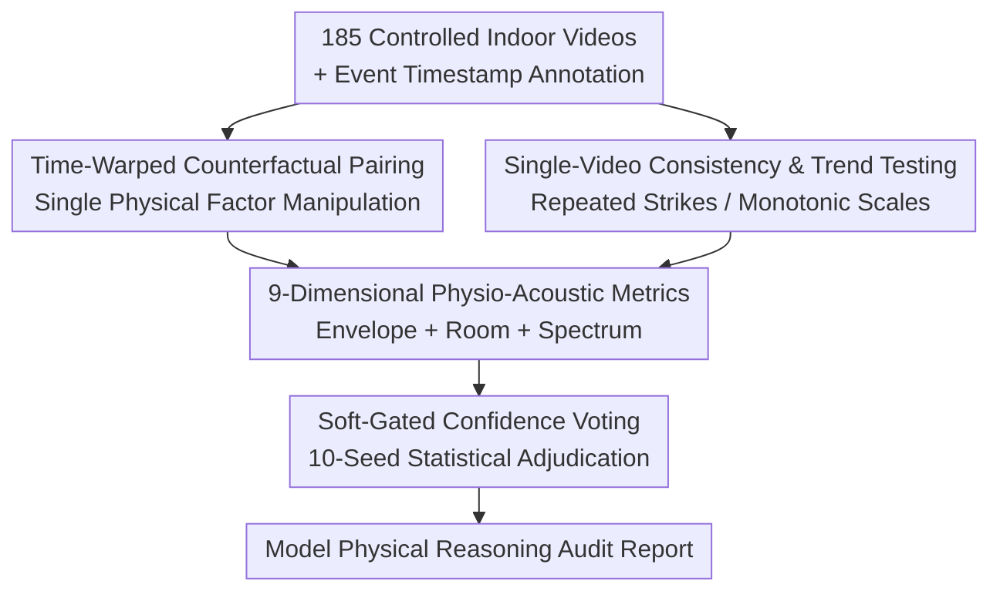

# Benchmarking Single-Factor Physical Video-to-Audio Generation

**Conference**: CVPR 2026  
**arXiv**: [2605.30339](https://arxiv.org/abs/2605.30339)  
**Code**: https://research.nvidia.com/labs/cosmos-lab/flatsounds/ (Project Homepage)  
**Area**: Multimodal / Audio Generation / Benchmark  
**Keywords**: Video-to-audio generation, Physical correctness, Counterfactual evaluation, Temporal alignment, Acoustic metrics

## TL;DR
This paper introduces FlatSounds—a benchmark that audits the **physical reasoning capabilities** of video-to-audio (V2A) models using "single-factor counterfactual intervention + single-video pattern testing." It reveals that current SOTA models actually "copy" physics and semantics from text captions rather than learning them from pixels, and stronger captions lead to poorer temporal alignment.

## Background & Motivation
**Background**: Video-to-audio (V2A) generation is regarded as a critical testing ground for "world models." A model that truly understands the world should "simulate a physics engine in its mind" upon seeing a metal spoon strike glass, synthesizing sounds determined by geometry, material, and collision dynamics. Recently, models like MMAudio, Hunyuan-V2A, FoleyCrafter, and ThinkSound have been able to produce highly realistic-sounding tracks.

**Limitations of Prior Work**: However, the "success" of these models is measured almost exclusively by distribution-level or semantic-level metrics (FAD, CLAP, ImageBind). These metrics only capture **surface-level auditory plausibility** and evade a fundamental question: do the models capture the dynamics of "why and how sound arises from physical interactions"? Generating a plausible "ding" does not mean the model has established a correct internal physical model of glass.

**Key Challenge**: Existing benchmarks measure **correlation rather than causal responsiveness**. They use unconstrained sets of web videos like AudioSet or VGGSound, which lack paired ground truth and preclude causal intervention analysis. Furthermore, artificially creating interventions through video manipulation remains an unsolved challenge. In other words, no one has systematically asked: "If I only change the striker from metal to wood, or only change the fullness of a container, does the generated sound modulate in the correct direction?"

**Goal**: To construct an evaluation framework capable of **controlled causal intervention**, systematically manipulating a single physical factor to observe if the acoustic output (attack time, fundamental frequency, etc.) modulates correctly, while measuring physical correctness and temporal alignment separately.

**Key Insight**: The authors leverage established theories in acoustics and psychoacoustics—how object geometry, material stiffness, and boundary conditions determine sound textures (modal resonances determine pitch, high-frequency damping determines timbre)—and use the Just Noticeable Difference (JND) as a perceptual threshold to select a set of **objective, perceptually relevant** acoustic measures to quantify "physical understanding."

**Core Idea**: Use "time-warped, aligned counterfactual video pairs" to isolate single physical variables, and then audit whether the generated audio changes in the correct direction relative to the video $\Delta$ using physics-based directional consistency metrics, shifting from "measuring auditory plausibility" to "measuring physical causality."

## Method

### Overall Architecture
FlatSounds is not a new model, but a **benchmark + physical perception metrics**. Its input is a black-box V2A model to be audited (video in, audio out), and its output is a set of interpretable physical and temporal scores. The pipeline consists of four steps: first, collecting 185 controlled short videos of indoor everyday objects making sounds with manually labeled event timestamps; second, pairing videos with similar acoustic properties into "fact-counterfactual pairs" (changing only one physical factor) and applying time-warping for alignment, while reserving a separate set for "single-video pattern tests"; third, measuring directional changes following intervention across nine acoustic dimensions and alignment across three temporal metrics; finally, using a "soft-gate + statistical voting across 10 random seeds" mechanism to convert directional correctness into a Confidence score, producing an audit report for each model.

### Key Designs

**1. Time-Warped Counterfactual Pairing: Truly Isolating "Single Physical Factors"**

To determine if a model possesses physical causality, the cleanest method is a controlled experiment—changing one variable while holding everything else constant. However, video is not a controlled experiment: if a scene is re-recorded with a different material, the timing and rhythm of strikes will almost never be identical, and timing differences themselves contaminate acoustic metrics. The authors resolve this via **time-warping**: manually labeled sound event moments are set as anchors, and the timeline is stretched or compressed between anchors so that the peaks of the counterfactual video fall exactly on the target timestamps of the factual video, with frames resampled accordingly. In such a pair, the only systematic difference is the manipulated factor (material / fullness / environment / action). Pairs require the counterfactual video to contain at least as many hits as the factual one, and at least one metric from Sec. 3.2 with an "expected direction of change" is annotated for each pair. A total of 178 paired tests were constructed from the 185 videos.

**2. Single-Video Consistency & Trend Testing: Probing Internal Consistency Without Pairing**

Some physical properties can be verified within a single video. The authors designed **single-video pattern tests**: one category is "internal consistency" (repeatedly striking the same object should yield stable acoustic features; a robust coefficient of variation is compared against a JND-based threshold to judge "no change"); the other is "directional trends" (e.g., pressing piano keys from low to high should result in monotonically increasing fundamental frequency). For sequences with $n \geq 3$ strikes, Spearman's rank correlation $\rho$ is used to judge monotonicity, with thresholds adapted to sequence length ($|\rho| \geq 0.40$ for $n \leq 4$, $0.30$ for $5 \leq n \leq 7$, and $0.25$ for longer); for $n=2$, the sign of the difference is used directly. This batch includes 90 single-video tests, which together with the 178 paired tests, form 268 FlatSounds-Physics test cases.

**3. 9-Dimensional Physio-Acoustic Metrics: Replacing Distribution Scores with Perceptually Relevant Measures**

The authors do not demand **absolute** accuracy in pitch or attack time (which would be too strict and brittle); instead, they look at whether the **direction of change under controlled intervention** aligns with acoustic common sense. Metrics are grouped by physical meaning: ① Temporal Envelope—Attack Time (soft to hard materials decrease attack time), Decay Rate (damping against a table decays faster than when suspended), Temporal Modulation (shaking coins has stronger modulation than shaking sand); ② Room Acoustics—RT60 (reverberation time, reaching seconds in large halls), DRR (direct-to-reverberant energy ratio, lower in large halls); ③ Spectral & Pitch—F0 (fundamental frequency, corresponding to pitch), Spectral Centroid ("brightness," higher for hard materials), Spectral Flux ("roughness," higher for tearing vs. cutting paper), Spectral Rolloff (85% energy cutoff frequency, higher for dry vs. wet leaves). Each metric corresponds to a physical rule like "changing factor X → metric changes in direction Y," making the evaluation interpretable.

**4. Soft-Gated Confidence Voting: Ensuring Comparability Before Adjudication**

Directly observing directional changes has a pitfall: if the generated audio is far from the expected content (misaligned or semantically incorrect), comparing "directions" is meaningless. The authors use a **soft gate**: for each seed, a quality weight is calculated that balances temporal alignment and semantic plausibility (for paired comparisons, the minimum of the temporal and semantic terms from both factual and counterfactual sides is taken). Samples with poor synchronization or semantic errors are not discarded, but their influence is scaled down proportionally. The final Confidence is the "weighted proportion of seeds that satisfy the expected physical trend." Directions are only considered valid if they pass a significance threshold—increases/decreases are only counted if $|\Delta|$ exceeds a robust effect size threshold $\tau = \max(2\% \text{ of mean}, 25\% \text{ of robust\_std})$, otherwise they are marked as failures; "no change" requires the 95% confidence interval of the mean $\Delta$ to fall entirely within $[-\tau_{eq}, +\tau_{eq}]$. The adjudication is based on statistical voting across 10 random seeds to reduce the contingency of single sampling.

### Loss & Training
As a benchmark paper, no new models are trained. The only exception is the self-built **MMAudio-Phys**—developed using Omni-captioner with a custom prompt to collect "physics-aware captions," then fine-tuning MMAudio on this data to verify the hypothesis that "models rely on text to understand physics" (it indeed achieved the highest Physical Confidence). Temporal alignment metrics use an onset-strength detector (with envelope fallback) to perform event recall within adaptive time windows.

## Key Experimental Results

### Main Results
Evaluation targets: four SOTA models (FoleyCrafter, Hunyuan-V2A, MMAudio, ThinkSound) plus the authors' fine-tuned MMAudio-Phys; each tested under "with/without caption" conditions. The table below shows the overall FlatSounds-Physics results (higher is better for all metrics):

| Model | Confidence | Hit Coverage(%) | Perfect Align(%) | CLAP |
| :--- | :--- | :--- | :--- | :--- |
| MMAudio-Phys (w/ Caption) | **0.306** | 82.65 | 59.82 | 0.630 |
| Hunyuan-V2A (w/ Caption) | 0.305 | 90.21 | 69.31 | 0.633 |
| Hunyuan-V2A (w/o Caption) | 0.296 | **91.50** | **70.50** | 0.593 |
| MMAudio-Phys (w/o Caption) | 0.289 | 83.69 | 61.00 | 0.602 |
| ThinkSound (w/ Caption) | 0.228 | 74.81 | 51.52 | 0.573 |
| MMAudio (w/ Caption) | 0.226 | 75.02 | 52.03 | **0.642** |
| FoleyCrafter (w/ Caption) | 0.205 | 66.52 | 44.70 | 0.573 |

The highest Confidence is only 0.306—**all models perform poorly at physical reasoning**. MMAudio-Phys, fine-tuned with physics-aware captions, leads in average Confidence, suggesting that "feeding physical text" significantly boosts physical scores (supporting the claim that models rely on text rather than pixels).

### Temporal Alignment (FlatSounds-Single, 185 segments)

| Model | Hit Coverage(%)↑ | Timing Error(ms)↓ |
| :--- | :--- | :--- |
| Ground Truth | 97.12 ± 1.72 | 17.25 ± 2.64 |
| Hunyuan-V2A (w/o Caption) | **68.55 ± 3.52** | **44.34 ± 1.04** |
| Hunyuan-V2A (w/ Caption) | 65.21 ± 3.81 | 44.76 ± 1.01 |
| MMAudio-Phys (w/o Caption) | 56.46 ± 2.77 | 46.63 ± 1.05 |
| MMAudio-Phys (w/ Caption) | 50.69 ± 4.23 | 51.34 ± 1.09 |
| ThinkSound (w/ Caption) | 33.74 ± 3.61 | 53.66 ± 1.21 |
| MMAudio (w/ Caption) | 31.12 ± 3.85 | 57.67 ± 1.20 |

For every model, **removing the caption increases Hit Coverage and decreases Timing Error**—text competes for resources with precise visual timing. Even the best-performing Hunyuan-V2A remains far from the GT (97.12% / 17.25ms).

### Correlation with Human Preferences (vs. ELO, Spearman Absolute)

| Metric | Correlation | Metric | Correlation |
| :--- | :--- | :--- | :--- |
| **Confidence** | **0.9** | FAD-PASST | 0.7 |
| **Hit Coverage** | **0.9** | DeSync | 0.7 |
| **Perfect Align** | **0.9** | FAD-VGG | 0.6 |
| IB | 0.5 | CLAP | 0.2 |

The three physical/alignment metrics proposed in this paper achieve a correlation of 0.9 with human ELO ratings (from pairwise preference tests on 40 videos, with Hunyuan-V2A leading at 1556 and FoleyCrafter trailing at 1438), **outperforming all standard metrics** (DeSync at 0.7, CLAP at only 0.2), while being interpretable and fast to compute.

### Key Findings
- **The Core Paradox**: Captions generally improve semantic plausibility and Physical Confidence but **simultaneously damage temporal alignment**. This exposes a fundamental flaw in video encoders: models treat text as the primary source for "what to generate" (semantics) and downgrade video to a secondary source for "when to generate" (timing). Prioritizing text causes the loss of precise visual onset cues.
- **Difficulty Ranking**: Spectral metrics (Spectral Flux/Centroid/Rolloff) are the easiest, while **DRR is the most difficult**, followed by Decay Rate and Attack Time. This suggests models more easily capture frequency domain features than fine-grained temporal dynamics and room acoustics.
- Removing captions significantly drops both Physical Confidence and semantic quality, proving that "physical understanding" is not an emergent property of visual simulation, but rather a result of **stochastic parroting** when text prompts are present.

## Highlights & Insights
- **Time-warping is the key enabler for this counterfactual evaluation**: By stripping "timing noise" from acoustic metrics through anchor alignment, "single-factor attribution" becomes possible. This trick can be transferred to any multimodal causal evaluation requiring "all other variables held constant."
- **Soft-gating instead of hard-filtering is ingenious**: Inferior samples are downweighted rather than discarded, avoiding "zero samples to compare" while ensuring that only "aligned and semantically correct" samples dominate physical adjudication, making directional judgments meaningful.
- Replacing "absolute numerical accuracy" with "directional consistency + JND thresholds" transforms subjective physical understanding into an objectively testable statistical proposition that correlates strongly with human preference—providing a reusable paradigm for moving generative model evaluation from "measuring perception" to "measuring causality."
- The biggest "Aha!" moment: Realistic $\neq$ Physical understanding. A model that fools FAD/CLAP achieves a Confidence of only 0.3 on a "primary school physics" question like "how sound changes when the material is swapped," puncturing the narrative of "V2A as a world model."

## Limitations & Future Work
- **Author's Admission**: The benchmark only covers indoor, **single-factor** interventions and cannot measure complex physical interactions (simultaneous changes in force, material, and geometry) or complex real-world acoustic phenomena. Expanding this causal framework to more complex scenarios is a key future direction.
- Metrics rely on "cleanly identifying discrete vocalization events"—the dataset was intentionally restricted to sounds with clear onsets like strikes or short frictions (5-10s, intervals $\geq 0.5$s). It may not apply to continuous/ambient sounds or complex reverberant scenes.
- Time-warping might produce unnatural motion when timestamp differences are large (though the authors state no significant visual artifacts were observed, it remains a potential source of contamination). Annotation is semi-automatic with human verification, and the scale is limited to 185 segments.
- Improvement Ideas: Expanding single-factor to multi-factor control; introducing larger-scale and outdoor scenarios. More importantly, as the benchmark points toward video encoder deficiencies, future work could design visual representations that learn physics directly from pixels.

## Related Work & Insights
- **vs. AV-Benchmark / Movie Gen Audio Bench / Kling-Audio-Eval**: These established benchmarks package semantic (FAD/CLAP/ImageBind) and temporal (Synchformer/DeSync) metrics, but essentially measure "plausibility + correlation." FlatSounds fills the gap of **causal intervention**, asking whether the sound changes correctly when one physical factor is modified.
- **vs. Physical Benchmarks for Video Generation (PhysBench / PAI Bench / VLM-based evaluation)**: These audit concepts like quality and density in the visual domain; this paper extends the idea of **auditing physical reasoning** to the audio domain.
- **vs. Counterfactual/Causal Evaluation (VQA counterfactual intervention)**: This paper uses counterfactual intervention to diagnose "shortcut learning," exposing the "copying physics from text" shortcut—aligned with the goal of forcing models to learn true causal structures in VQA.
- **vs. ThinkSound (generating text CoTs before audio)**: Models that "architecturally rely on text" are precisely the ones most questioned here—FlatSounds was born to audit whether "visual physical grounding" is being ignored.

## Rating
- Novelty: ⭐⭐⭐⭐⭐ Introduces "counterfactual causal intervention + time-warped alignment" to V2A evaluation, systematically auditing physical causality for the first time with a sharp perspective.
- Experimental Thoroughness: ⭐⭐⭐⭐ Covers 5 models $\times$ 2 conditions $\times$ multiple metrics (VGGSound + FlatSounds), validated by human ELO; however, data is limited to 185 indoor single-factor segments.
- Writing Quality: ⭐⭐⭐⭐⭐ Motivation is progressive, metrics are clearly defined, and the core conclusion about "copying physics from text" is strongly supported by data.
- Value: ⭐⭐⭐⭐⭐ Effective at puncturing the "realism = physical understanding" narrative, redefining the central challenge of V2A as "making video encoders learn physics from pixels," which has a directional impact on the field.

<!-- RELATED:START -->

## Related Papers

- [\[CVPR 2026\] WEAVE: Unleashing and Benchmarking the In-context Interleaved Comprehension and Generation](weave_unleashing_and_benchmarking_the_in-context_interleaved_comprehension_and_g.md)
- [\[CVPR 2026\] PhyCritic: Multimodal Critic Models for Physical AI](phycritic_multimodal_critic_models_for_physical_ai.md)
- [\[CVPR 2026\] EgoAVU: Egocentric Audio-Visual Understanding](egoavu_egocentric_audio-visual_understanding.md)
- [\[CVPR 2026\] EMMA: Extracting Multiple physical parameters from Multimodal Data](emma_extracting_multiple_physical_parameters_from_multimodal_data.md)
- [\[CVPR 2026\] Rethinking MLLM Itself as a Segmenter with a Single Segmentation Token](rethinking_mllm_itself_as_a_segmenter_with_a_single_segmentation_token.md)

<!-- RELATED:END -->
