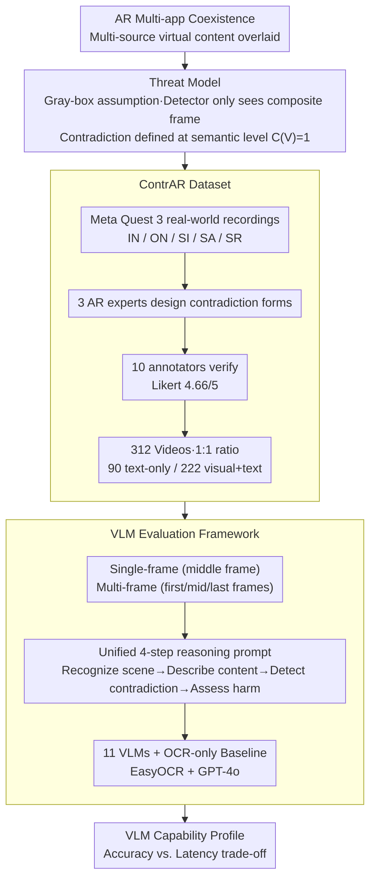

# Benchmarking Vision-Language Models under Contradictory Virtual Content Attacks in Augmented Reality

**Conference**: CVPR 2026 Findings  
**arXiv**: [2604.05510](https://arxiv.org/abs/2604.05510)  
**Code**: [GitHub](https://github.com/YM-Xiu/ContrAR-Dataset)  
**Area**: Multimodal / AR Security  
**Keywords**: Augmented reality security, semantic contradiction detection, VLM robustness, benchmark, AR attack

## TL;DR

The authors construct ContrAR, the first benchmark for contradictory virtual content attacks in AR environments (utilizing 312 real videos recorded via Meta Quest 3, verified by 10 annotators with an average Likert score of 4.66/5). They systematically evaluate the semantic contradiction detection capabilities of 11 VLMs (including GPT-5/Gemini-2.5/Grok-4). Findings show that GPT-5 achieves the highest accuracy (88.14%) but suffers from a 19s latency, while GPT-4o offers the best accuracy-latency balance (84.62%/7.26s). An OCR-only text baseline reaches only 56%, proving visual reasoning is indispensable.

## Background & Motivation

**Background**: In AR systems (e.g., Meta Quest 3), multiple applications simultaneously render virtual content, and users rely on this information for critical decisions (navigation, safety inspections, etc.). Existing AR content analysis focuses primarily on low-level rendering metrics (lighting consistency, depth alignment), while semantic consistency analysis remains largely unexplored.

**Limitations of Prior Work**: (1) Malicious applications can inject information that semantically contradicts other virtual content (e.g., an arrow pointing left while text says "turn right"), misleading users and jeopardizing safety; (2) VLMs excel in general semantic reasoning but have not been systematically evaluated in AR mixed reality scenarios; (3) There is a lack of standardized benchmark datasets to measure VLM detection capabilities against AR contradiction attacks.

**Key Challenge**: Semantic contradiction detection in AR requires multimodal reasoning capabilities—recognizing the visual and textual meanings of virtual objects while inferring logical consistencybetween them. However, current evaluations are limited to natural images/text, creating a significant gap with dynamic AR mixed reality environments.

**Goal**: To formally define the threat model for AR contradictory virtual content attacks, construct a standardized benchmark dataset, and systematically evaluate the detection capabilities and real-time performance of mainstream VLMs.

**Key Insight**: This work models AR semantic contradiction detection as a multimodal reasoning task for VLMs, utilizing real HMD recordings to build a standardized benchmark and provide the first capability profile of VLMs in this domain.

**Core Idea**: For the first time, a real AR video benchmark is used to reveal the performance boundaries and accuracy-latency trade-offs of VLMs in detecting contradictory virtual content.

## Method

### Overall Architecture

This paper does not train a new model; instead, it addresses an evaluative question: Can off-the-shelf VLMs detect a new safety threat—"self-contradictory virtual content"—in AR scenarios? The workflow consists of three steps: defining the attack boundaries via a **Threat Model** (capabilities of the attacker/detector), recording the **ContrAR Dataset** using Meta Quest 3 across five AR application categories with balanced positive/negative samples, and finally applying 11 mainstream VLMs to a unified **VLM Evaluation Framework**, compared against an OCR-only baseline.

### Key Designs

**1. Threat Model: Defining "Contradiction Attacks" at the Semantic Level via Gray-box Assumptions**

In AR systems, multiple apps overlay virtual content onto the same view independently. To formalize "malicious app injecting misleading information," the work defines attacker/detector boundaries. A gray-box assumption is adopted: the attacker is a standard user-level app rendering its own virtual objects without access to other apps or system layers. Similarly, the detection system operates at the user level, seeing only the final composite frame. Contradiction is defined semantically: given a set of virtual content $\mathcal{C} = \{c_1, \dots, c_n\}$ in a frame, if $I(c_i) \perp I(c_j)$ (two pieces of info are semantically mutually exclusive), the scene contains a contradiction attack ($C(V)=1$), otherwise 0. Defining the problem at the semantic level forces high-level reasoning rather than low-level rendering analysis.

**2. ContrAR Dataset: Real-world Recording + Human Verification**

To evaluate real VLM performance in AR, the authors record data using Meta Quest 3 across five application scenarios: Indoor Navigation (IN), Outdoor Navigation (ON), Safety Inspection (SI), Smart Apartment (SA), and Smart Retail (SR). Attack patterns were designed through structured brainstorming by 3 AR experts. Videos were cross-verified by 10 independent participants, achieving an average confidence score of 4.66/5. The dataset maintains a strict 1:1 ratio (156 contradictory vs. 156 non-contradictory videos) to prevent model guessing; 90 contain only text, while 222 contain both visual and text elements.

**3. VLM Evaluation Framework: Quantifying the Necessity of Visual Reasoning**

Two strategies are evaluated: single-frame (simulating real-time AR decisions) and multi-frame (providing temporal context via first/middle/last frames). All models use a unified prompt template to guide four-step reasoning: ① recognize physical scene → ② describe virtual content → ③ analyze contradictions → ④ judge harm level. Crucially, an OCR-only baseline is implemented (EasyOCR extraction + GPT-4o logic). If the baseline performs well, contradiction detection would be a simple text task; however, its low accuracy (56%) proves that visual semantic reasoning is necessary.

### Loss & Training

None. Pure inference evaluation. Commercial models are accessed via APIs; open-source models are run locally via HuggingFace.

## Key Experimental Results

### Main Results — VLM Accuracy and Latency

| Model | Strategy | Total Acc (%) | Latency (s) |
|------|------|------------|---------|
| GPT-5 | Single-frame | **88.14** | 19.29 |
| GPT-5 | Multi-frame | 85.58 | 23.78 |
| GPT-4.1 | Single-frame | 82.05 | 11.47 |
| GPT-4.1 | Multi-frame | 86.54 | 16.61 |
| GPT-4o | Single-frame | 79.17 | 5.92 |
| GPT-4o | Multi-frame | **84.62** | **7.26** |
| Gemini-2.5-Pro | Single-frame | 83.97 | 14.29 |
| Gemini-2.5-Flash | Single-frame | 79.81 | 9.90 |
| Grok-4 | Single-frame | 68.27 | 27.76 |
| Claude-Sonnet-4.5 | Multi-frame | 68.59 | 18.01 |
| Qwen-2.5-VL-72B | Multi-frame | 64.10 | 14.93 |
| OCR-Text GPT-4o | Single-frame | 56.41 | 4.58 |

### Accuracy by Scenario (Single-frame)

| Model | IN | ON | SI | SA | SR |
|------|---------|---------|---------|---------|---------|
| GPT-5 | 81.48 | 91.67 | 80.95 | **94.44** | 86.36 |
| GPT-4o | 83.33 | 86.67 | 71.43 | 77.78 | 75.76 |
| Gemini-2.5-Pro | 75.93 | **90.00** | **83.33** | 86.67 | 81.82 |
| Claude-Haiku-4.5 | 50.00 | 55.00 | 64.29 | 48.89 | 56.06 |

### Key Findings

- **GPT-5 achieves the highest accuracy but highest latency**: 88.14% accuracy vs. 19.29s latency makes it unsuitable for real-time AR.
- **GPT-4o represents the optimal balance**: 84.62% accuracy at 7.26s in multi-frame mode is most practical for commercial deployment.
- **OCR baseline fails (56.41%)**: The near-random performance demonstrates that visual semantic reasoning is the core capability that cannot be replaced by text-only solutions.
- **Multi-frame is not always superior**: GPT-5 (-2.56%) and Gemini-2.5-Pro (-7.37%) showed decreased accuracy with multi-frames, likely due to redundant information interfering with reasoning.
- **Significant gap in open-source models**: Qwen-2.5-VL-72B (64.10%) lags 24% behind GPT-5.
- **Scenario sensitivity**: State-indicator contradictions (Smart Apartment) are easiest to detect, while sign contradictions (Safety Inspection) are most difficult.

## Highlights & Insights

1. **Practical Value**: AR contradiction attacks are an emerging security threat. As AR ecosystems open up to multi-application coexistence, the risk of misleading content grows. This work provides the first formal definition and evaluation tool.
2. **Effective OCR Baseline**: The 56% result strongly validates that "visual reasoning cannot be replaced by text," providing clear guidance for technical directions.
3. **Engineering Trade-offs**: Provides first-hand data for AR security selection—GPT-4o for latency < 10s, GPT-5 for maximum accuracy.

## Limitations & Future Work

1. **Limited Data Scale**: 312 videos across 5 scenarios are insufficient to cover all possible AR attack patterns.
2. **Underutilization of Video Models**: Frame-based evaluation was used instead of native video VLMs due to API limits and computational costs.
3. **Unity Simulation**: A single application simulated both victim and attacker, which deviates slightly from real multi-app isolation scenarios.
4. **Lack of Defense Schemes**: As a benchmark paper, it identifies the problem but does not yet propose a lightweight detection model.
5. **Adversarial Evasion**: Attackers may design more subtle contradictions to deceive VLMs.

## Related Work & Insights

- **vs. BoardgameQA/Pan et al.**: Previous works focused on text-only contradiction detection; ContrAR extends this to multimodal AR scenarios, increasing complexity.
- **vs. MMIR**: MMIR studies visual-text inconsistencies in documents; ContrAR focuses on security threats in real-time mixed reality.
- **vs. AR Quality Assessment**: Moves beyond low-level rendering metrics (lighting/depth) to high-level semantic reasoning, representing a qualitative shift in AR security research.

## Rating

⭐⭐⭐⭐

- **Novelty** ⭐⭐⭐⭐: First to formalize AR contradiction attacks and build an evaluation benchmark.
- **Experimental Thoroughness** ⭐⭐⭐⭐: Comprehensive evaluation of 11 VLMs, 2 strategies, OCR baselines, and 5 scenarios.
- **Writing Quality** ⭐⭐⭐⭐: Well-defined threat model and clear experimental design.
- **Value** ⭐⭐⭐⭐: Fills a research gap by providing a standardized tool for the AR security community.

<!-- RELATED:START -->

## Related Papers

- [\[CVPR 2026\] ORIC: Benchmarking Object Recognition under Contextual Incongruity in Large Vision-Language Models](oric_benchmarking_object_recognition_under_contextual_incongruity_in_large_visio.md)
- [\[CVPR 2026\] GraphVLM: Benchmarking Vision Language Models for Multimodal Graph Learning](graphvlm_benchmark_vlm_graph_learning.md)
- [\[CVPR 2026\] SVHalluc: Benchmarking Speech-Vision Hallucination in Audio-Visual Large Language Models](svhalluc_benchmarking_speech-vision_hallucination_in_audio-visual_large_language.md)
- [\[CVPR 2026\] VLM-3R: Vision-Language Models Augmented with Instruction-Aligned 3D Reconstruction](vlm-3r_vision-language_models_augmented_with_instruction-aligned_3d_reconstructi.md)
- [\[CVPR 2026\] R4: Retrieval-Augmented Reasoning for Vision-Language Models in 4D Spatio-Temporal Space](r4_retrieval-augmented_reasoning_for_vision-language_models_in_4d_spatio-tempora.md)

<!-- RELATED:END -->
