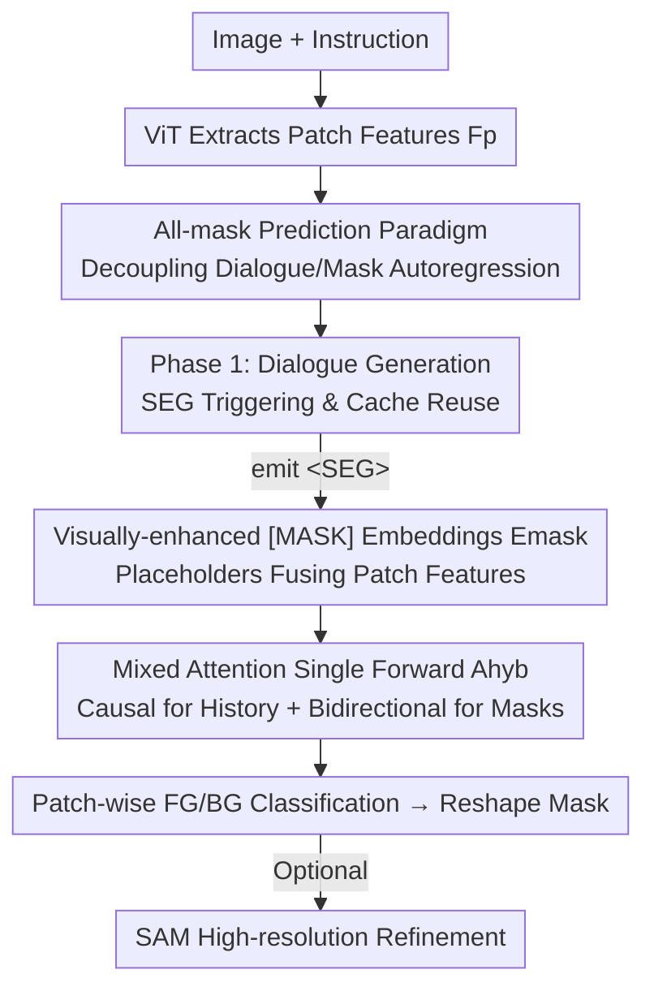

# Better, Stronger, Faster: Tackling the Trilemma in MLLM-based Segmentation with Simultaneous Textual Mask Prediction

**Conference**: CVPR 2026  
**Paper**: [CVF Open Access](https://openaccess.thecvf.com/content/CVPR2026/html/Liu_Better_Stronger_Faster_Tackling_the_Trilemma_in_MLLM-based_Segmentation_with_CVPR_2026_paper.html)  
**Code**: https://github.com/HKUST-LongGroup/STAMP  
**Area**: Multimodal VLM  
**Keywords**: MLLM Segmentation, Non-autoregressive, All-mask Prediction, Referring Expression Segmentation, Mixed Attention  

## TL;DR
STAMP reformulates MLLM-based segmentation as a parallel "cloze" classification task for all image patches. By simultaneously predicting the entire mask using a single non-autoregressive forward pass, it achieves high segmentation precision and fast inference speed without compromising conversational capabilities, effectively resolving the long-standing "dialogue/performance/speed" trilemma in MLLM segmentation.

## Background & Motivation
**Background**: Integrating segmentation into MLLMs is a major direction in unified vision tasks. Two main technical routes exist: 1) **Embedding prediction** (e.g., LISA), where the MLLM outputs the continuous embedding of a special token to drive an external SAM-style decoder; 2) **Next-token prediction**, where the mask is rewritten as a sequence of discrete textual tokens (e.g., polygon coordinates, CoT reasoning, or patch-wise FG/BG classification) for the MLLM to "describe" autoregressively.

**Limitations of Prior Work**: Both routes involve compromises. Embedding prediction introduces a pixel-level mask loss that conflicts with the language modeling objective, which **erodes the general dialogue capability of MLLMs**—for instance, LISA might fail to answer simple questions like "How many deer are in the image?" and instead output a segmentation mask. Furthermore, it requires an external decoder and is not decoder-free. Next-token prediction preserves dialogue by avoiding objective conflicts but is limited by its autoregressive nature: sparse outputs (polygon vertices) suffer from low precision as a single point error affects the entire mask, while rich outputs (CoT, patch-wise) result in extremely long sequences and unusable inference speeds.

**Key Challenge**: MLLMs are natively **serial text generators**, which are fundamentally ill-suited for 2D dense outputs like "dense, pixel-level masks." This leads to a trilemma: 1) maintaining dialogue capability, 2) high segmentation performance, and 3) fast inference speed. Existing paradigms can satisfy at most two of these requirements.

**Goal**: To achieve all three objectives simultaneously rather than choosing between them.

**Key Insight**: The authors observe that **if each mask token is defined as a "textual classification of a specific image patch,"** the supervision remains at the token level (preserving dialogue). Mapping mask tokens to image patches provides sufficiently rich representations (preserving performance). Crucially, the **number of mask tokens can be fixed to the number of patches**, transforming mask generation from "sequential generation" to "cloze filling": all placeholders can be predicted in a single parallel forward pass (preserving speed).

**Core Idea**: Propose **all-mask prediction**, which decouples autoregressive dialogue generation from **non-autoregressive** mask generation. Dialogue tokens are generated one by one, while the mask is generated by simultaneously filling all patch-wise FG/BG labels in a single forward pass.

## Method

### Overall Architecture
STAMP (Simultaneous Textual All-Mask Prediction) is a two-stage architecture that addresses the technical challenge of "when to generate the mask and where to place mask tokens."

**Phase 1 (Dialogue Generation)**: Given an image $I$ and instruction $T$, the ViT extracts $N$ patch features $F_p \in \mathbb{R}^{N \times D}$, which are concatenated with text embeddings and fed into the MLLM. The MLLM generates the response $R$ autoregressively. During this process, the model can emit a **standard special token `<SEG>` from the vocabulary**. Its appearance answers "when" (triggering segmentation) and "where" (determining the insertion point for mask placeholders). The KV cache generated during this stage is stored for subsequent use.

**Phase 2 (All-mask Generation)**: The appearance of `<SEG>` triggers this phase. The dialogue history preceding `<SEG>` is taken and followed by $N$ `[MASK]` placeholders (one per patch). The initial embedding of each placeholder **fuses the visual features of the corresponding patch with position encodings**, resulting in visually-enhanced mask embeddings $E_{\text{mask}}$. Using a **single non-autoregressive forward pass with mixed attention**, all placeholders are computed simultaneously. Finally, a linear classifier predicts FG/BG for each patch, which is reshaped into a patch-level mask. Optionally, a keypoint can be sampled to prompt a frozen SAM decoder for high-resolution refinement.

### Key Designs

**1. All-mask Prediction Paradigm: Transforming Segmentation from "Sequential Generation" to "Parallel Cloze"**
This is the core contribution. While prior paradigms either polluted dialogue with pixel losses or were slowed by autoregressive sequences, the authors define mask generation as **patch-wise textual classification** for $N$ patches. By fixing the number of mask tokens to the number of patches, mask generation becomes equivalent to "cloze filling" over predefined placeholders. This enables: token-level supervision (no conflicting pixel loss, preserving dialogue), one-to-one mapping between tokens and patches (rich representation, preserving performance), and fixed token counts for parallel prediction (preserving speed). This reduces inference steps for mask generation from $O(N_{\text{patches}})$ or $O(N_{\text{CoT}})$ to $O(1)$. It is inherently decoder-free and adapts dynamically to input resolutions.

**2. `<SEG>` Triggering and KV Cache Reuse: Localizing "When/Where" with a Standard Vocabulary Token**
To cleanly transition to mask generation within the dialogue flow, STAMP trains the MLLM to emit a `<SEG>` token at appropriate positions. Unlike LISA, which binds the `[SEG]` embedding to an external decoder, STAMP treats `<SEG>` as a **regular vocabulary entry** serving as a learned signal to trigger Phase 2. To avoid redundant computation, STAMP maintains a tuple $(\text{hist}_i, \text{cache}_i)$ for each `<SEG>`, where $\text{cache}_i$ stores the pre-computed KV states of all preceding tokens. Phase 2 loads this cache, eliminating the need for a redundant forward pass over history, which is a key source of its efficiency.

**3. Visually-enhanced `[MASK]` Embedding $E_{\text{mask}}$: Grounding Placeholders to Patches**
If placeholders were empty `[MASK]` tokens, the model would lack spatial correspondence. STAMP fuses the initial embedding of the $i$-th placeholder with the $i$-th visual patch feature $F_p$ and position encodings that mark its grid location. Thus, $E_{\text{mask}} = \text{Embed}([\text{MASK}]_{1..N}) + F_p$. Each mask token "knows" which pixel region it is responsible for. Removing $E_{\text{mask}}$ in ablation studies caused the most significant performance drop (cIoU 79.1 → 73.3), proving visual anchoring is vital.

**4. Mixed Attention $A_{\text{hyb}}$: Causal for History, Bidirectional for Masks**
Autoregressive methods suffer from unidirectional attention—predicting a token only allows it to "see" its left side. STAMP uses a custom attention mask $A_{\text{hyb}}$ to split the sequence: the dialogue history maintains standard **causal attention** (consistent with language modeling), while the $E_{\text{mask}}$ segment employs **bidirectional attention**, allowing each placeholder to see the entire dialogue context and all other placeholders. This enables the model to utilize rich 2D bidirectional spatial context for holistic, context-aware predictions in a single forward pass. Removing $A_{\text{hyb}}$ (reverting to causal attention) dropped cIoU from 79.1 to 76.2.

### Loss & Training
The model is trained end-to-end at the token level. The objective is the sum of the text generation loss $\mathcal{L}_{\text{text}}$ and the mask prediction loss $\mathcal{L}_{\text{mask}}$. The text loss is standard autoregressive cross-entropy:

$$\mathcal{L}_{\text{text}} = -\sum_{i=1}^{L} \log P(y_i \mid y_{<i}, I, T).$$

The mask loss is applied to the output logits of $E_{\text{mask}}$. Each token performs binary classification (FG/BG) for its patch, supervised by a combination of BCE and Dice losses:

$$\mathcal{L}_{\text{mask}} = \mathcal{L}_{\text{BCE}} + \mathcal{L}_{\text{Dice}}.$$

The final objective is $\mathcal{L} = \mathcal{L}_{\text{text}} + \mathcal{L}_{\text{mask}}$. The implementation is based on Qwen2-VL 2B / 7B (supporting dynamic resolution), with optional SAM-H refinement. The number of placeholders scales dynamically with resolution between 1024 and 1280. The 2B version undergoes full fine-tuning, while the 7B version uses LoRA.

## Key Experimental Results

### Main Results
In single-target referring expression segmentation (RefCOCO / RefCOCO+ / RefCOCOg, cIoU), STAMP-7B sets a new SOTA with an average of 80.7. Even the lightweight 2B version outperforms the previous best Text4Seg++. Notably, **STAMP-7B without SAM post-processing** (Token Prediction only, average 76.2) is competitive with older SOTA models using larger LLMs, indicating that gains stem from the architecture rather than just the backbone.

| Setting | LLM | RefCOCO val | RefCOCO+ val | RefCOCOg val(U) | Average |
|------|-----|------|------|------|------|
| Text4Seg++ (arXiv'25) | Qwen2-7B | 81.6 | 76.9 | 78.2 | 78.9 |
| **STAMP-2B** (Ours) | Qwen2-2B | 81.9 | 77.1 | 78.5 | **79.1** |
| **STAMP-7B** (Ours) | Qwen2-7B | 83.1 | 79.4 | 79.9 | **80.7** |
| STAMP-7B (w/o SAM) | Qwen2-7B | 78.1 | 74.7 | 75.7 | 76.2 |

In multi/no-target gRefCOCO, STAMP-7B leads with an average of 74.8, 3.3% higher than the strongest competitor. STAMP-7B without SAM (71.8) already surpasses the fully-equipped Text4Seg (71.5). On ReasonSeg, STAMP-2B averages 63.2, outperforming READ (61.1) despite having **no explicit CoT and a smaller backbone** (Qwen2-VL-2B).

Regarding visual understanding (VQA), STAMP-2B trained on mixed data performs **on par** with the Qwen2-VL-2B baseline (VQA-only) on benchmarks like MMBench/MMStar/ScienceQA. In contrast, the VQA capabilities of LISA-7B / READ-7B drop almost to zero. This quantitatively proves that the all-mask paradigm does not degrade dialogue capability. Moreover, mixed training slightly improved segmentation (RefCOCO val 81.9 → 82.2).

### Ablation Study
Single-target RES (cIoU) + Inference Time:

| Config | Input Size | cIoU | Time (s) | Note |
|------|---------|------|--------|------|
| STAMP-2B (Full) | 896×896 | 79.1 | 1.3 | Full Model |
| w/o $A_{\text{hyb}}$ | 896×896 | 76.2 | 1.3 | -2.9 without bidirectional attention |
| w/o $E_{\text{mask}}$ | 896×896 | 73.3 | 1.3 | -5.8 without visual enhancement (most critical) |
| w/o SAM | 896×896 | 75.3 | 0.9 | Faster but lower precision |
| STAMP-2B | 504×504 | 77.1 | 0.9 | Reduced resolution for speed |
| STAMP-7B | 896×896 | 80.7 | 2.4 | — |

### Key Findings
- **$E_{\text{mask}}$ is the major contributor**: Removing visual enhancement dropped cIoU by 5.8, proving that anchoring placeholders to their respective patches is essential. $A_{\text{hyb}}$ follows (-2.9), showing bidirectional context is vital.
- **Speed is comparable to embedding prediction paradigms**: Due to $O(1)$ single forward passes and KV cache reuse, STAMP's inference speed is in the same tier as LISA/READ and significantly faster than autoregressive methods like Seg-Zero/SegAgent.
- **Dynamic resolution is plug-and-play**: Models trained at 896 can be directly deployed at 504/726, allowing for a trade-off between marginal precision and significant speedups.
- **Positive transfer from mixed training**: High-level understanding enhances segmentation, suggesting the paradigm has potential for further scaling.

## Highlights & Insights
- **"Fixed length = Parallelizable" as the breakthrough**: Fixing the number of mask tokens to the patch count transforms autoregressive $O(N)$ into $O(1)$ cloze filling. This is the foundation for achieving speed and could be transferred to other dense prediction tasks slowed by autoregression (e.g., keypoints, depth, panoptic segmentation).
- **`<SEG>` as a standard token**: Using one token to encode "when to segment + where to insert placeholders" is a clean design that is decoder-free and does not interfere with language modeling.
- **Mixed Attention as an efficient trick**: Without changing the architecture—only modifying the attention mask—the model allows non-autoregressive placeholders to see each other, bypassing the inherent unidirectional limitations of autoregressive models.

## Limitations & Future Work
- The output is **patch-level FG/BG binary classification**, meaning granularity is limited by patch size. High-resolution boundaries still require optional SAM refinement; removing SAM leads to a ~3.8 gain loss (79.1 → 75.3).
- The binary FG/BG setup for **multi-class or instance-level** segmentation was not fully explored (experiments focused on referring/reasoning segmentation).
- placeholder count is tied to image patch count. As $N$ increases for very high resolutions, memory/compute for the single forward pass will rise. The upper bound for scalability needs further exploration.
- Future directions: Replacing binary classification with multi-class logits for panoptic/instance segmentation, or injecting sub-patch features into $E_{\text{mask}}$ to reduce reliance on SAM.

## Related Work & Insights
- **vs. Embedding Prediction (LISA / GSVA / READ)**: These use pixel-level loss to train an external SAM-style decoder. Speed is $O(1)$, but they suffer from dialogue pollution and are not decoder-free. STAMP is also $O(1)$ but keeps supervision at the token level, remaining decoder-free without losing dialogue capabilities.
- **vs. Next-token Prediction (VisionLLM / Seg-Zero / SegAgent / Text4Seg)**: These write masks as autoregressive sequences. Sparse coordinates are prone to error accumulation; rich outputs have excessively long sequences. STAMP uses non-autoregressive cloze filling to replace sequential generation with parallel prediction, achieving both speed and precision.
- **vs. Text4Seg (also patch-wise classification)**: Text4Seg performs patch-wise classification but still generates tokens autoregressively, hindered by sequence length. STAMP’s key differentiator is **bidirectional + single forward pass** for all patches.

## Rating
- Novelty: ⭐⭐⭐⭐⭐ Resolves the MLLM segmentation trilemma with "non-autoregressive cloze filling"—a paradigm shift rather than incremental.
- Experimental Thoroughness: ⭐⭐⭐⭐⭐ Comprehensive coverage of referring/reasoning/VQA/efficiency/ablation with both 2B and 7B scales.
- Writing Quality: ⭐⭐⭐⭐⭐ The trilemma framework is clear; the comparison tables and pipeline diagrams effectively convey motivation and methods.
- Value: ⭐⭐⭐⭐⭐ Solving dialogue, performance, and speed simultaneously has direct implications for unified multimodal dense prediction.

<!-- RELATED:START -->

## Related Papers

- [\[CVPR 2026\] Rethinking MLLM Itself as a Segmenter with a Single Segmentation Token](rethinking_mllm_itself_as_a_segmenter_with_a_single_segmentation_token.md)
- [\[ACL 2026\] ReGATE: Learning Faster and Better with Fewer Tokens in MLLMs](../../ACL2026/multimodal_vlm/regate_learning_faster_and_better_with_fewer_tokens_in_mllms.md)
- [\[CVPR 2026\] SPOT: Spatiotemporal Prompt Optimization for Motion-Stabilized MLLM-Guided Video Segmentation](spot_spatiotemporal_prompt_optimization_for_motion-stabilized_mllm-guided_video_.md)
- [\[CVPR 2026\] ANTS: Adaptive Negative Textual Space Shaping for OOD Detection via Test-Time MLLM Understanding and Reasoning](ants_adaptive_negative_textual_space_shaping_for_ood_detection_via_test-time_mll.md)
- [\[CVPR 2026\] MVP: Multiple View Prediction Improves GUI Grounding](mvp_multiple_view_prediction_improves_gui_grounding.md)

<!-- RELATED:END -->
