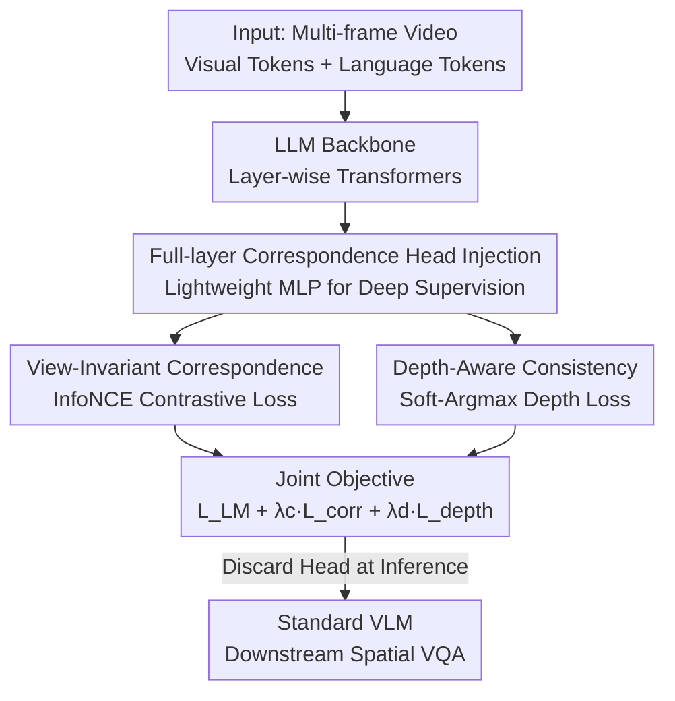

# Beyond 3D VQAs: Injecting 3D Spatial Priors into Vision-Language Models for Enhanced Geometric Reasoning

**Conference**: CVPR 2026  
**arXiv**: [2605.30231](https://arxiv.org/abs/2605.30231)  
**Code**: https://danielchyeh.github.io/GASP/ (Project Page)  
**Area**: Multimodal VLM / 3D Spatial Reasoning  
**Keywords**: Geometric Priors, Visual Correspondence, Depth Supervision, Spatial Reasoning, Deep Supervision

## TL;DR
GASP moves away from fine-tuning VLMs on 3D VQA data. Instead, it injects a lightweight "correspondence head" into every transformer layer of the LLM, using ground-truth point correspondence and depth from real video scenes for deep supervision. This improves the internal "cross-view matching" capability from <5% to over 70%, achieving 18~29% gains on spatial reasoning benchmarks like All-Angles and VSI-Bench with zero 3D VQA training.

## Background & Motivation
**Background**: There are two main approaches to equipping VLMs with 3D spatial reasoning: 1) SFT/RL fine-tuning on large-scale 3D VQA datasets (e.g., VILASR, SpatialMLLM, VG-LLM) or 2) using specialized external 3D vision encoders (e.g., VGGT) or explicit 3D inputs like point clouds, BEV maps, or segmented objects.

**Limitations of Prior Work**: VQA fine-tuning often causes models to memorize dataset-specific biases, learning only surface correlations. Experiments show these models gain significantly on in-domain benchmarks (VSI-Bench) but suffer consistent performance drops on out-of-domain benchmarks (MMSI-Bench, STI-Bench, SpaceVista), indicating poor generalization. External 3D encoders are bulky and rigid: they increase model size and slow down inference. Furthermore, since their training data and pipelines are often incompatible with standard VLMs, they are usually frozen, forcing the VLM to align with pre-computed, rigid external features.

**Key Challenge**: High-level VQA supervision teaches "text $\leftrightarrow$ visual pattern" associations rather than the geometric consistency of the world itself. Diagnostic analysis reveals the root cause is not the vision encoder, but the LLM backbone itself. Its pre-training corpus (web text) lacks fine-grained 3D geometric information, causing the internal visual self-attention $Q_V K_V^T$ to lack reliable cross-frame correspondence (PCK often <5%), with confidence negatively correlated with accuracy ($\rho\approx-0.22$).

**Goal**: To inject "geometric inductive biases" directly into the LLM's internal representations without Steiner QA supervision or external encoders, allowing the model to develop view-invariant correspondence that generalizes to downstream spatial reasoning.

**Key Insight**: Authentic spatial understanding is grounded in the ability to establish visual correspondence across views (object constancy). The visual self-attention matrix $Q_V K_V^T$ serves as a direct window into the spatiotemporal correspondence learned by the model—echoing findings in video diffusion models where QK-matching is a key metric for temporal consistency.

**Core Idea**: Use "ground-truth point correspondence + depth consistency" as fundamental geometric signals to deeply supervise the internal visual representations of every LLM layer, replacing 3D VQA supervision.

## Method

### Overall Architecture
GASP (Geometric-Aware Spatial Priors) takes standard VLM visual and language tokens as input. Its output is a standard VLM that is geometrically more aware but remains architecturally identical during inference. The approach involves attaching a lightweight "correspondence head" $\mathcal{H}_c$ to the output of **every layer** of the transformer blocks in the LLM backbone. During training, two geometric signals (contrastive loss for point correspondence + depth consistency loss) provide **deep supervision**, forcing geometric consistency at every stage of the representation. After training, this head is **entirely discarded**; during inference, the model behaves as a normal VLM without requiring any 3D inputs.

The vertical data flow of the pipeline is as follows:

### Key Designs

**1. Full-Layer Correspondence Head Injection: Spreading Geometric Supervision Across All LLM Layers**

If geometric consistency is only supervised at deeper layers, shallower layers continue to learn view-dependent features, creating a representation bottleneck. GASP attaches a lightweight 2-layer MLP correspondence head $\mathcal{H}_c$ to all 28 (Qwen2.5-VL-7B) or 32 (LLaVA-NeXT-Video-7B) layers. It projects visual tokens $V^{(l)}\in\mathbb{R}^{N\times d}$ into low-dimensional correspondence embeddings $\mathbf{E}=\mathcal{H}_c(V^{(l)})\in\mathbb{R}^{N\times d_{emb}}$. To provide a strong inductive bias while minimizing disruption to pre-trained representations, the weights of $\mathcal{H}_c$ are initialized using the **SVD decomposition of the same layer's query projection matrix**. Ablations confirm that full-layer supervision (1–32 / 1–28) is superior and more stable than injection in only shallow or deep layers. The authors explain that geometric consistency is inherently hierarchical: shallow layers match low-level features like edges, mid-layers reason about object parts, and deep layers maintain semantic-geometric alignment.

**2. View-Invariant Visual Correspondence: Teaching Object Constancy via Contrastive Learning**

This is the primary mechanism for injecting object constancy. Given an anchor point $\mathbf{p}_i^a$ in source frame $a$, the ground-truth correspondence $\mathbf{p}_i^b$ in target frame $b$ is the positive sample, while all other points in frame $b$ are negative samples. The correspondence head is trained using InfoNCE:

$$\mathcal{L}_i=-\log\frac{\exp(\langle\mathbf{e}_i^a,\mathbf{e}_i^b\rangle/\tau)}{\exp(\langle\mathbf{e}_i^a,\mathbf{e}_i^b\rangle/\tau)+\sum_{k\neq i}\exp(\langle\mathbf{e}_i^a,\mathbf{e}_k^b\rangle/\tau)}$$

where $\langle\cdot,\cdot\rangle$ is the cosine similarity of L2-normalized embeddings. Contrastive learning is chosen over coordinate regression because it learns view-invariant embeddings that scale with negative sample diversity and fit better in high-dimensional feature spaces.

**3. Depth-Aware 3D Consistency: Depth as Discriminative Regularization for Texture Ambiguity**

2D correspondence alone can fail when two objects share similar textures but different depths. GASP treats depth as a geometric regularizer rather than a regression target. It reuses the similarities from the contrastive loss to compute a soft matching distribution $\mathbf{A}_{ij}=\frac{\exp(\langle\mathbf{e}_i^a,\mathbf{e}_j^b\rangle/\tau)}{\sum_{k}\exp(\langle\mathbf{e}_i^a,\mathbf{e}_k^b\rangle/\tau)}$ and calculates the "expected depth" using a Soft-Argmax form: $\hat{d}_i^b=\sum_j\mathbf{A}_{ij}\cdot d_j^b$. It then constrains this using a scale-invariant relative error:

$$\mathcal{L}_{\text{depth}}=\frac{1}{N_{\text{valid}}}\sum_{i\in\text{valid}}\frac{|d_i^b-\hat{d}_i^b|}{d_i^b+\hat{d}_i^b+\epsilon}$$

When candidate depths differ ($d_{fg}\neq d_{bg}$), this loss penalizes matching them, forcing the model to learn lower similarity for visually similar instances at different 3D locations.

### Loss & Training
The final objective is a joint tri-fold loss: $\mathcal{L}_{\text{total}}=\mathcal{L}_{\text{LM}}+\lambda_c\mathcal{L}_{\text{corr}}+\lambda_d\mathcal{L}_{\text{depth}}$. Models start from Qwen2.5-VL-7B or LLaVA-NeXT-Video-7B and are fine-tuned using **LoRA rank=512**. Training data involves interleaved DL3DV geometric supervision (approx. 1.75M sequences) and LLaVA-Video-178K instruction data to prevent catastrophic forgetting. Training takes approximately 10 hours on 32 H200 GPUs.

## Key Experimental Results

### Main Results
Downstream spatial reasoning benchmarks (Table 1, key sub-tasks, in %):

| Backbone | Config | Camera Pose (All-Angles) | Object Counting (VSI) | Multi-view (BLINK) |
|------|------|------|------|------|
| LLaVA-NeXT-Video-7B | SFT Baseline | 22.7 | 23.5 | 42.1 |
| | + DL3DV VQA | 19.8 | 21.4 | 42.5 |
| | + GASP-Full | **40.9** | **52.5** | **57.1** |
| | Gain vs Baseline | ↑18.2 | ↑29.0 | ↑15.0 |
| Qwen2.5-VL-7B | SFT Baseline | 34.1 | 33.8 | 41.5 |
| | + GASP-Full | **52.8** | **41.6** | **53.4** |
| | Gain vs Baseline | ↑18.7 | ↑7.8 | ↑11.9 |

Notably, the DL3DV VQA baseline actually declines in performance on several key metrics, proving that GASP's gains stem from democratic geometric objectives rather than mere data exposure.

Internal Correspondence Analysis:

| Metric | Baseline | GASP-Full |
|------|----------|-----------|
| Peak Layer PCK | <5% | >70% |
| Conf-Acc Correlation $\rho$ | ≈−0.22 | ≈+0.62 |
| 24-frame Temporal Robustness | <5% (>8 frames collapse) | >85% |

### Ablation Study
LoRA rank and injection layers (Table 4, LLaVA-NeXT):

| Configuration | Avg.PCK | All-Angles | VSI | BLINK |
|------|---------|-----------|-----|-------|
| LoRA=64 | 8.4 | 30.1 | 28.5 | 44.9 |
| **LoRA=512** | **26.2** | **38.1** | **37.1** | **51.0** |
| LoRA=1024 | 28.6 | 37.2 | 34.8 | 48.7 |
| Layer 10-18 | 21.7 | 34.8 | 35.9 | 47.7 |
| Layer 25-32 | 25.8 | 39.1 | 36.5 | 49.3 |
| **All Layers** | **26.2** | 38.1 | **37.1** | **51.0** |

### Key Findings
- **Depth loss has an independent contribution**: GASP-Full consistently outperforms correspondence-only models in internal PCK and downstream tasks.
- **Internal PCK $\neq$ Downstream Performance**: Increasing LoRA rank improves PCK, but downstream performance peaks at 512 (LLaVA) / 128 (Qwen). Excessive rank can harm language capabilities.
- **Gains focus on prior-related tasks**: Camera pose and object counting show the largest gains because view-invariant features help maintain object identity across frames.

## Highlights & Insights
- **Diagnosis as a Starting Point**: The study quantifies the fact that standard VLM $Q_V K_V^T$ lacks geometric correspondence (PCK < 5%) before proposing a targeted solution.
- **Training-Only Correspondence Heads**: Deep supervision exists only during training. At inference, the model is architecturally identical to a standard VLM, resulting in zero additional overhead.
- **Depth as Discriminative Regularization**: Using Soft-Argmax as a geometric constraint rather than direct regression effectively resolves texture ambiguities.
- **Zero 3D VQA Data**: Challenging the mainstream assumption that large-scale 3D VQA data is necessary for spatial reasoning.

## Limitations & Future Work
- **Reliance on Pseudo-Ground-Truth Depth**: The quality of depth supervision limits the 3D consistency ceiling.
- **Small Cost in Action-Centric Tasks**: Geometric specialization leads to minor drops (1.9%) in tasks like NextQA which rely more on temporal dynamics.
- **Synergy with VQA Supervision**: Future work could explore combining geometric priors with complementary VQA supervision.

## Related Work & Insights
- **Comparison with 3D VQA Fine-tuning**: Unlike VILASR or SpatialMLLM, GASP avoids dataset bias and OOD degradation by supervising internal representations with low-level geometric signals.
- **Comparison with External 3D Encoders**: Unlike VGGT or point-cloud-based methods, GASP "recovers" 3D consistency within the LLM's own representations without external feature flows.
- **Insight from Video Diffusion**: Migrating the idea that "QK-matching is a key temporal consistency metric" to VLM diagnosis is a strong example of cross-domain inspiration.

## Rating
- Novelty: ⭐⭐⭐⭐⭐ 
- Experimental Thoroughness: ⭐⭐⭐⭐ 
- Writing Quality: ⭐⭐⭐⭐⭐ 
- Value: ⭐⭐⭐⭐ 

<!-- RELATED:START -->

## Related Papers

- [\[CVPR 2026\] Think with 3D: Geometric Imagination Grounded Spatial Reasoning from Limited Views](think_with_3d_geometric_imagination_grounded_spatial_reasoning_from_limited_view.md)
- [\[CVPR 2026\] Abstract 3D Perception for Spatial Intelligence in Vision-Language Models](abstract_3d_perception_for_spatial_intelligence_in_vision-language_models.md)
- [\[CVPR 2026\] HiSpatial: Taming Hierarchical 3D Spatial Understanding in Vision-Language Models](hispatial_taming_hierarchical_3d_spatial_understanding_in_vision-language_models.md)
- [\[CVPR 2026\] G$^2$VLM: Geometry Grounded Vision Language Model with Unified 3D Reconstruction and Spatial Reasoning](g2vlm_geometry_grounded_vision_language_model_with_unified_3d_reconstruction_and.md)
- [\[CVPR 2026\] Grounded 3D-Aware Spatial Vision-Language Modeling](grounded_3d-aware_spatial_vision-language_modeling.md)

<!-- RELATED:END -->
