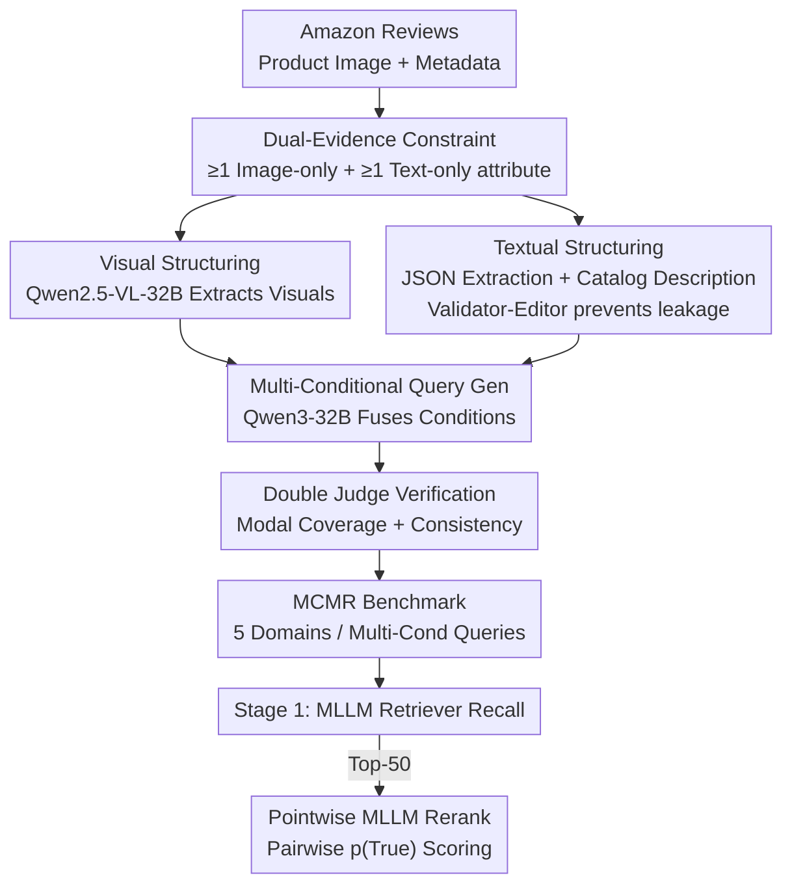

# Beyond Global Similarity: Multi-Conditional Retrieval for Fine-Grained Cross-Modal Understanding

**Conference**: CVPR 2026  
**Paper**: [CVF Open Access](https://openaccess.thecvf.com/content/CVPR2026/html/Lu_Beyond_Global_Similarity_Multi-Conditional_Retrieval_for_Fine-Grained_Cross-Modal_Understanding_CVPR_2026_paper.html)  
**Code**: https://github.com/EIT-NLP/MCMR  
**Area**: Fine-grained Cross-modal Retrieval  
**Keywords**: Multi-conditional Retrieval, Cross-modal Alignment, MLLM Retrieval, Dual-evidence Constraints, Pointwise Reranking  

## TL;DR
This paper introduces the MCMR benchmark—a fine-grained cross-modal product retrieval dataset that requires "simultaneous satisfaction of multiple complementary conditions across both image and text" for a match. It systematically evaluates mainstream MLLM retrievers and MLLM-as-Rerankers, finding that while current retrievers excel at coarse-grained recall, they struggle with multi-conditional reranking. Explicit pair-wise verification via pointwise reranking significantly improves top-tier ranking quality.

## Background & Motivation

**Background**: Mainstream cross-modal retrieval relies on dual-encoders like CLIP, ALIGN, and BLIP, which map images and text into a shared space for cosine similarity matching. Recently, "MLLM-as-embedding" approaches (e.g., VLM2Vec, MM-Embed, GME) have emerged, pooling MLLM last-layer hidden states into unified embeddings to support open-ended natural language instruction retrieval.

**Limitations of Prior Work**: These models are typically trained to align global semantics of "whole image-whole sentence." Captions are often vague summaries, leading models to favor global semantic consistency while exhibiting weak fine-grained cross-modal understanding. Critically, existing benchmarks fail to satisfy three properties required for complex retrieval: (i) fine-grained attribute reasoning, (ii) multi-conditional queries, and (iii) cross-modal evidence (conditions split between image and text). MS-COCO/Flickr30K only handle coarse alignment; FashionIQ/CIRR focus on single visual changes where most attributes are image-discernible (essentially unimodal); text-only multi-conditional retrieval (MultiConIR) keeps all evidence in text; MERIT uses interleaved queries but emphasizes visual comparison ("same style as product 1") rather than independent attribute specification, failing to separate image-dependent and text-dependent attributes.

**Key Challenge**: No existing benchmark simultaneously establishes "fine-grained + multi-conditional + dual-modal evidence." Consequently, it is impossible to diagnose whether models are performing constraint-aware compositional reasoning or simply relying on global similarity within a single modality.

**Goal**: To construct a retrieval benchmark that forces models to satisfy multiple fine-grained conditions dispersed across both image and text, and to quantify their modal dependencies and fine-grained shortcomings using a unified evaluation protocol.

**Key Insight**: The authors observe that if each product is designed such that some attributes are only image-discernible and others are only metadata-discernible, the task cannot be solved by a single modality, naturally forcing cross-modal fusion.

**Core Idea**: Redefine the retrieval task using "dual-evidence complementary constraints + all conditions AND logic." This is implemented via an LLM collaborative pipeline to generate verifiable multi-conditional natural language queries at scale, transforming cross-modal compositional reasoning into a measurable and diagnostic problem.

## Method

Instead of a new retrieval model, this paper constructs a new benchmark **MCMR (Multi-Conditional Multimodal Retrieval)** and defines its evaluation protocol. The method follows two lines: (1) Dataset design and production to test multi-conditional cross-modal reasoning; (2) A two-stage retrieval + reranking protocol. The atomic unit is "Product = Image + Long-form Metadata." A query is a first-person natural language description mixing visual and textual conditions; a candidate is a positive match only if **all** conditions are satisfied.

### Overall Architecture

Data originates from the Amazon Reviews (2023) corpus, covering Tops, Bottoms, Jewelry, Shoes, and Furniture. Products are filtered for "complementarity" to ensure unique attributes in each modality. A collaborative pipeline using "medium models for mass production + strong models for verification" extracts structured attributes and generates multi-conditional queries. Two stages of judges verify cross-modal coverage and consistency. Finally, MLLM retrievers perform initial recall, followed by pointwise MLLM reranking on the top-50.

### Key Designs

**1. Dual-Evidence Complementary Constraints: Forcing Multi-modal Processing**

Unlike FashionIQ or MultiConIR, MCMR mandates that each product contains **at least one fine-grained attribute inferable only from the image** (e.g., texture, layout, structural details) **and one inferable only from long-form metadata** (e.g., material, price, origin, fit). Formally, the query condition set $C=\{c_1,\dots,c_n\}$ is split into visual subset $C_v$ and textual subset $C_t$, both non-empty. A candidate $d$ is relevant if and only if:
$$\mathrm{rel}(q,d)=\bigwedge_{i=1}^{n}\mathbb{1}[d\models c_i]=1$$
This turns "cross-modal fusion" into a hard requirement rather than a soft preference.

**2. Collaborative LLM Construction Pipeline: Scale and Verification**

To generate thousands of verifiable queries, a pipeline is used: Qwen2.5-VL extracts structured visual summaries **strictly excluding functional or speculative content**; a JSON template extracts metadata into a textual portrait. Qwen3-32B then generates catalog-style descriptions (80–120 words) based **only on metadata**, with DeepSeek-R1-Distill-Qwen-32B acting as a "Validator-Editor" to prevent cross-modal leakage. Finally, Qwen3-32B generates first-person, multi-conditional "shopper" queries. Human evaluation (score 4.33 vs. 4.41 for humans) confirms the generation quality is near-human.

**3. Pointwise MLLM Reranking Protocol: Fixing the Ranking Ceiling**

Even with restricted candidate sets, first-stage retrievers struggle with top-1 accuracy under multiple conditions. The authors introduce a second-stage pointwise reranker: taking the **top-50** candidates from the strongest retriever, a Vision-Language MLLM is fed the "text query + candidate image + metadata" to output a binary relevance judgment. The score is the normalized logit for the `True` token:
$$s(q,d)=p(\texttt{True}\mid q, \text{img}_d, \text{meta}_d)$$
This allows the model to explicitly verify each condition one-by-one, significantly strengthening the top-tier ranking.

### Example
A shoe query might be: "I'm looking for men's brown leather high-top work boots, lace-up, with OrthoLite insoles, under $260." "Brown / High-top / Lace-up" are **visual conditions** $C_v$. "Leather / OrthoLite / <$260" are **textual conditions** $C_t$ hidden in metadata. A system ignoring text may find visually similar but expensive boots (False); a system ignoring images may find low-top versions (False).

## Key Experimental Results

Evaluations were zero-shot on A100 GPUs. Retrievers included GME-Qwen2-VL, LLaVE-7B, VLM2Vec, etc. Rerankers included Qwen2.5/3-VL series and InternVL3. The dataset includes ~3,997 queries and ~104,981 candidates.

### Main Results (Fused Image+Text, Recall@K)

| Model | Size | R@1 | R@10 | R@100 | nDCG@10 |
|------|------|-----|------|-------|---------|
| CORAL | 3B | **26.57** | **53.34** | 77.73 | 39.35 |
| LLaVE | 7B | 24.99 | 53.13 | **78.64** | 37.88 |
| MM-EMBED | 8B | 21.74 | 47.91 | 74.16 | 33.75 |
| GME-Qwen2VL | 7B | 21.23 | 45.74 | 73.52 | 32.48 |
| VLM2Vec | 4B | 1.83 | 7.03 | 18.96 | 4.02 |

Observation: Retrievers have low R@1 (18–27%) but high R@100 (73–79%), indicating they recall the correct items but cannot rank them accurately under multiple constraints.

### Ablation Study (Modality Removal, R@1 & R@10)

| Setting | Model | R@1 | R@10 | Observation |
|------|------|-----|------|------|
| Image-only | GME-Qwen2VL | 21.79 | 51.10 | Vision-dominant, minimal drop |
| Image-only | LLaVE | **0.90** | 3.93 | Collapses without text |
| Text-only | MM-EMBED | 12.98 | — | Text-side strongest but still weak |

### Key Findings
- **Vision is the dominant signal**: Text-only recall is generally weaker than image-only, though fusion outperforms image-only by 4–8 points, verifying the value of complementary metadata.
- **Strong Global Similarity != Robustness**: Models like LLaVE show heavy dependency on certain modalities (R@1 drops from 24.99 to 0.90 without text), suggesting they lack robust cross-modal grounding.
- **Rerankers concentrate gains at the top**: nDCG@1 sees the largest boost via pointwise reranking. Parameter size does not predict reranking performance; architecture and grounding (e.g., lychee-mm) are more critical.

## Highlights & Insights
- **Hard Constraints**: Using "Dual-evidence + AND logic" effectively prevents models from taking unimodal shortcuts, making the task a true test of cross-modal fusion.
- **Synthetic Data Quality**: The "Validator-Editor" loop for preventing modal leakage is a transferable technique for any benchmark requiring modal isolation.
- **Ranking Ceiling**: The gap between Stage 1 recall and Stage 2 reranking provides quantitative evidence for why "Recall + MLLM Rerank" is the preferred pipeline for complex retrieval.

## Limitations & Future Work
- **Ours**: This is a benchmark paper; no new retrieval/reranking model is proposed.
- **Domain**: Limited to e-commerce (Amazon); applicability to open-domain or non-attribute retrieval is unknown.
- **Scale**: Discrepancies exist between summary product counts (10,400) and table candidate totals (~105k) in the text.
- **Future**: Distilling pointwise reranking capabilities back into Stage 1 embeddings to improve efficiency.

## Related Work & Insights
- **vs FashionIQ**: FashionIQ focuses on single visual edits; MCMR requires multi-modal complementarity.
- **vs MultiConIR**: MultiConIR is text-only; MCMR splits evidence across modalities.
- **vs MERIT**: MERIT relies on visual comparison; MCMR is based on independent attribute specification and modal grounding.

## Rating
- Novelty: ⭐⭐⭐⭐ (First to combine fine-grained, multi-conditional, and dual-evidence requirements).
- Experimental Thoroughness: ⭐⭐⭐⭐ (Comprehensive ablation across modes and models).
- Writing Quality: ⭐⭐⭐⭐ (Clear motivation and findings).
- Value: ⭐⭐⭐⭐ (Provides a much-needed testbed for constraint-aware retrieval).

<!-- RELATED:START -->

## Related Papers

- [\[CVPR 2026\] POGA: Paraphrased and Oppositional Graph Alignment for Fine-Grained Cross-Modal Retrieval](poga_paraphrased_and_oppositional_graph_alignment_for_fine-grained_cross-modal_r.md)
- [\[CVPR 2026\] CoV-Align: Efficient Fine-grained Cross-Modal Alignment with Cohesive Visual Semantics Priority](cov-align_efficient_fine-grained_cross-modal_alignment_with_cohesive_visual_sema.md)
- [\[CVPR 2026\] Language-driven Fine-grained Retrieval](language-driven_fine-grained_retrieval.md)
- [\[CVPR 2026\] EagleNet: Energy-Aware Fine-Grained Relationship Learning Network for Text-Video Retrieval](eaglenet_energy-aware_fine-grained_relationship_learning_network_for_text-video_.md)
- [\[CVPR 2026\] Quota-Calibrated Fine-Grained Alignment with Context-Aware Marginals for Text-based Person Retrieval](quota-calibrated_fine-grained_alignment_with_context-aware_marginals_for_text-ba.md)

<!-- RELATED:END -->
