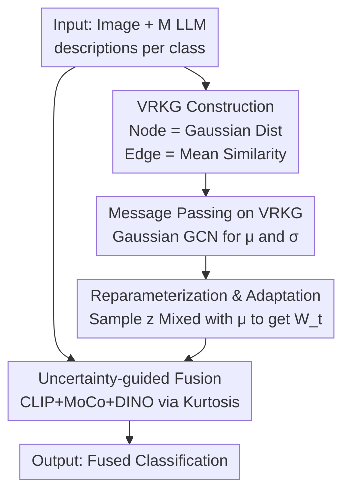

# Beyond Graph Model: Reliable VLM Fine-Tuning via Random Graph Adapter

**Conference**: CVPR 2026  
**Paper**: [CVF Open Access](https://openaccess.thecvf.com/content/CVPR2026/html/Jiang_Beyond_Graph_Model_Reliable_VLM_Fine_Tuning_via_Random_Graph_Adapter_CVPR_2026_paper.html)  
**Code**: None (not provided)  
**Area**: Multimodal VLM  
**Keywords**: VLM fine-tuning, text adapter, random graph model, Gaussian distribution nodes, few-shot classification  

## TL;DR
This work replaces the "one category = one deterministic vector" approach in VLM text adapters with "one category = one Gaussian distribution." It initializes distributions using diverse descriptions generated by LLMs, performs probabilistic message passing on the category graph, and incorporates a dynamic multi-backbone fusion scheme based on prediction certainty (kurtosis). The method consistently outperforms SOTA methods like GraphAdapter and AMU-Tuning in few-shot classification and OOD generalization across 11 datasets.

## Background & Motivation
**Background**: Adapting VLMs like CLIP to downstream tasks primarily follows two paths: prompt tuning (learning prompt tokens, requiring expensive gradient backpropagation through the text encoder) and adapter tuning (attaching lightweight modules to refine features after frozen encoder outputs, which is more efficient). CLIP-Adapter, TaskRes, Tip-Adapter, and GraphAdapter belong to the latter.

**Limitations of Prior Work**: Existing text adapters almost exclusively use a **deterministic** function to refine a fixed vector representation for each category. However, a single category possesses significant descriptive diversity in text—"cat" can be "A domestic feline," "A small furry animal with whiskers," or "A cat has sharp claws and erect ears." This descriptive variation carries rich discriminative semantics. Current methods either use a **single description** (TaskRes) or **average pool** multiple descriptions into one vector (CuPL series), both of which flatten this diversity and result in suboptimal solutions.

**Key Challenge**: There is a contradiction between deterministic single-vector representations and the inherent **distributional diversity** of category semantics. Furthermore, inter-class relationships are worth modeling in adapters, but existing graph methods (e.g., GraphAdapter) treat each class node as a deterministic vector, losing intra-class uncertainty.

**Goal**: To enable the adapter to simultaneously capture: ① the intra-class diversity/uncertainty of descriptions; and ② the structural relationships between categories—all while remaining differentiable and end-to-end trainable.

**Key Insight**: The authors upgrade category nodes from "deterministic vectors" to "Gaussian distribution nodes," introducing **random graph** modeling. In this framework, descriptive diversity is naturally carried by the distribution variance, while inter-class relationships are captured by graph edges, unifying both in a probabilistic graph.

**Core Idea**: Replace deterministic text adapters with "Vertex Random Knowledge Graph (VRKG) + Gaussian Graph Convolution + Reparameterization." The authors prove that the traditional GraphAdapter is a special case of this method when diversity $M=1$. Additionally, an Uncertainty-guided Multi-branch Fusion (UMF) scheme based on kurtosis is added to enhance reliability.

## Method

### Overall Architecture
The VRGAdapter takes an image and $M$ LLM-generated descriptions per category as input, outputting a fused classification prediction. It consists of two parallel pipelines: the **text-side VRGAdapter** (constructing class distributions $\to$ graph propagation $\to$ sampling adaptive text prototypes $\mathbf{W}_t$) and the **vision-side UMF** (generating predictions from CLIP and two auxiliary backbones, fused by certainty weights). Finally, logits are computed using the text prototypes and features from each vision branch and summed for the final prediction.

The text-side involves three sequential steps: first, use CuPL to generate $M=50$ descriptions per class via an LLM and estimate Gaussian distributions (mean = semantic center, variance = semantic diversity) after processing through the CLIP text encoder. The distributions and inter-class cosine similarity edges form the **VRKG**. Second, **Gaussian Graph Convolution** propagates information across the graph, allowing each node to absorb neighbor information to become a context-aware distribution. Finally, **reparameterization sampling** extracts text features from the refined distributions, which are residually mixed with the original means to obtain text prototypes $\mathbf{W}_t$. The vision-side UMF dynamically weights the CLIP zero-shot prediction and two auxiliary prototype classifier predictions based on their respective kurtosis (certainty).

### Key Designs

**1. VRKG Construction: Upgrading Categories to Gaussian Distribution Nodes**

To address the issue of single vectors flattening intra-class diversity, each category node $v_i$ is modeled as a Gaussian distribution $\mathcal{H}_i \sim \mathcal{N}(\boldsymbol{\mu}_i, \mathrm{diag}(\boldsymbol{\sigma}_i))$. The distribution parameters are estimated from $M$ CLIP-encoded LLM description features $\{\mathbf{T}_i^1,\dots,\mathbf{T}_i^M\}$:

$$\boldsymbol{\mu}_i = \frac{1}{M}\sum_{m=1}^{M}\mathbf{T}_i^m, \qquad \boldsymbol{\sigma}_i = \frac{1}{M}\sum_{m=1}^{M}(\mathbf{T}_i^m-\boldsymbol{\mu}_i)\odot(\mathbf{T}_i^m-\boldsymbol{\mu}_i)$$

The mean represents the semantic center, while the variance captures the "spread" of semantics across dimensions—classes with more diverse descriptions yield higher variance. Edge weights are defined as the cosine similarity between the **means** of two classes: $\mathbf{A}_{ij}=\cos(\boldsymbol{\mu}_i,\boldsymbol{\mu}_j)$. This "Vertex Random Knowledge Graph" (VRKG) uses deterministic edges for computational tractability. GraphAdapter is a special case where $M=1$ and variance collapses to 0.

**2. Gaussian Graph Convolution: Aggregate Neighbors for Distributions**

Standard GCNs cannot operate directly on Gaussian nodes. The authors employ **Gaussian Graph Convolution** to apply symmetric normalized adjacency aggregation to the mean and variance **separately**, ensuring the output remains a Gaussian distribution:

$$\boldsymbol{\mu}_i^{(l+1)} = \sigma\Big(\sum_{j\in\mathcal{N}(i)}(\mathbf{D}^{-1/2}\mathbf{A}\mathbf{D}^{-1/2})_{ij}\,\boldsymbol{\mu}_j^{(l)}\boldsymbol{\Theta}_\mu^{(l)}\Big),\quad \boldsymbol{\sigma}_i^{(l+1)} = \sigma\Big(\sum_{j\in\mathcal{N}(i)}(\mathbf{D}^{-1/2}\mathbf{A}\mathbf{D}^{-1/2})_{ij}\,\boldsymbol{\sigma}_j^{(l)}\boldsymbol{\Theta}_\sigma^{(l)}\Big)$$

where $\mathbf{D}$ is the degree matrix and $\boldsymbol{\Theta}$ are learnable weights. This step allows each category to become context-aware by observing related categories, refining both the semantic center and diversity (e.g., compressing variance for clear classes like 'buddha' while maintaining it for ambiguous ones like 'accordion').

**3. Reparameterization & Residual Adaptation: Trainable Text Prototypes**

To extract usable features, sampling $\mathbf{z}_i\sim\mathcal{N}(\boldsymbol{\mu}_i^{(L)},\mathrm{diag}(\boldsymbol{\sigma}_i^{(L)}))$ is required. To maintain differentiability, the **reparameterization trick** is used:

$$\mathbf{z}_i = \boldsymbol{\mu}_i^{(L)} + \boldsymbol{\epsilon}\odot\sqrt{\boldsymbol{\sigma}_i^{(L)}},\quad \boldsymbol{\epsilon}\sim\mathcal{N}(0,\mathbf{I})$$

Residual mixing with weight $\alpha$ (typically 0.7) combines original CLIP semantics with the sampled features: $\mathbf{w}_i=\alpha\boldsymbol{\mu}_i+(1-\alpha)\mathbf{z}_i$, forming the text prototype matrix $\mathbf{W}_t\in\mathbb{R}^{C\times D}$.

**4. Uncertainty-guided Multi-branch Fusion (UMF): Dynamic Weighting via Kurtosis**

Instead of static averaging, UMF estimates the **certainty** of each branch per sample. The three branches are: CLIP zero-shot $\mathbf{p}_\text{zs}$, and two auxiliary backbones (MoCo, DINO) using prototype classifiers with learnable residuals $\mathbf{p}_\text{Aux}^k$. Certainty is measured by **normalized kurtosis** $\kappa(\mathbf{p})=\big[\mathbb{E}((\mathbf{p}-\mu_\mathbf{p})/\sigma_\mathbf{p})^4\big]^\lambda$, where sharper logit distributions indicate higher confidence. Fusion is performed as:

$$\mathbf{p}_\text{bias}=\sum_{k=1}^{2}\kappa(\mathbf{p}_\text{Aux}^k)\cdot\mathbf{p}_\text{Aux}^k,\qquad \mathbf{p}_\text{fusion}=\kappa(\mathbf{p}_\text{zs})\cdot\mathbf{p}_\text{zs}+\beta\cdot\mathbf{p}_\text{bias}$$

### Loss & Training
The model is trained end-to-end using Cross-Entropy loss: $\mathcal{L}_\text{CE}=-\sum_{i=1}^{C}y_i\log\hat{\mathbf{p}}_\text{fusion}^i$. Optimization uses AdamW with a 0.001 learning rate and cosine decay over 50 epochs. Hyperparameters include $M=50$, $L=2$, and $\alpha=0.7$. The backbones are ResNet-50 versions of CLIP, MoCo, and DINO.

## Key Experimental Results

### Main Results
On ImageNet-1K few-shot classification (ResNet-50), VRGAdapter leads across all shots:

| Method | 1-shot | 2-shot | 4-shot | 8-shot | 16-shot |
|------|--------|--------|--------|--------|---------|
| GraphAdapter | 61.50 | 62.32 | 63.12 | 64.23 | 65.70 |
| CaFo | 63.80 | 64.34 | 65.64 | 66.86 | 68.79 |
| AMU-Tuning | 62.60 | 64.25 | 65.92 | 68.25 | 70.02 |
| **VRGAdapter** | **63.93** | **65.43** | **67.45** | **69.37** | **71.37** |

At 16-shot, it outperforms GraphAdapter by +5.67% and AMU-Tuning by +1.35%. OOD generalization results also show superiority:

| Backbone | Method | ImageNet-1K | -V2 | -Sketch |
|------|------|-------------|-----|---------|
| ViT-B/16 | AMU-Tuning | 74.98 | 65.42 | 50.37 |
| ViT-B/16 | **VRGAdapter** | **76.78** | **68.60** | **51.78** |

### Ablation Study
On ImageNet-1K (ResNet-50), with a CLIP prototype classifier baseline:

| VRGAdapter | AUX | UMF | 1-shot | 16-shot |
|:---:|:---:|:---:|--------|---------|
| | | | 59.42 | 64.46 |
| ✓ | | | 62.49 | 66.03 |
| | ✓ | | 60.27 | 69.84 |
| | ✓ | ✓ | 60.77 | 70.05 |
| ✓ | ✓ | ✓ | **63.93** | **71.37** |

### Key Findings
- **VRGAdapter provides the most gain in low-shot settings** (+3.07% at 1-shot), indicating that distributional modeling is critical when data is extremely scarce.
- Despite having 6.31M parameters, VRGAdapter is **25x faster in inference** than GraphAdapter (48ms vs 1.2s) while being more accurate.
- t-SNE visualizations confirm that diversity contracts for clear categories and remains high for ambiguous ones, improving class separability.

## Highlights & Insights
- **Encoding Diversity as Variance**: This is the core innovation—treating redundant LLM descriptions as second-order moment signals (variance) rather than noise, preserving more discriminative info than mean pooling.
- **Unified Perspective**: Framing GraphAdapter as a special case ($M=1$) of the random graph framework provides theoretical elegance.
- **Kurtosis as Certainty**: Using kurtosis to weight multi-backbone ensembles is a lightweight and effective alternative to entropy for sample-wise fusion.

## Limitations & Future Work
- Edge weights are simplified as "similarities of means," so the **edges themselves lack randomness**, which may limit inter-class relationship modeling.
- The Gaussian assumption might be too strong for categories with multi-modal semantics (e.g., polysemous words).
- UMF relies on extra backbones (MoCo, DINO) for peak performance; the pure gain of VRGAdapter without auxiliary models could be further clarified.

## Related Work & Insights
- **vs. GraphAdapter**: Both use graphs, but this work introduces Gaussian nodes and $M$ LLM descriptions, significantly improving over the deterministic single-description approach.
- **vs. Probabilistic Prompting (ProDA/PPAP)**: While they also use Gaussian distributions, they focus on **prompt tuning** (high overhead). This work applies it to **adapter tuning** with graph structures.
- **vs. AMU-Tuning/CaFo**: These use static fusion, whereas UMF provides dynamic per-sample weighting based on kurtosis.

## Rating
- Novelty: ⭐⭐⭐⭐ Introducing random graphs/Gaussian nodes to VLM adapters is a unique and effective perspective.
- Experimental Thoroughness: ⭐⭐⭐⭐ Extensive testing across 11 datasets and OOD scenarios, though missing dense tasks like segmentation.
- Writing Quality: ⭐⭐⭐⭐ Clear motivation and well-structured formulas.
- Value: ⭐⭐⭐⭐ Lightweight, fast inference, and robust gains in few-shot/OOD scenarios.

<!-- RELATED:START -->

<!-- RELATED:END -->

## Related Papers

- [\[CVPR 2026\] DynamicGTR: Leveraging Graph Topology Representation Preferences to Boost VLM Capabilities on Graph QAs](dynamicgtr_leveraging_graph_topology_representation_preferences_to_boost_vlm_cap.md)
- [\[CVPR 2026\] Structural Graph Probing of Vision-Language Models](structural_graph_probing_of_vision-language_models.md)
- [\[CVPR 2026\] GraphVLM: Benchmarking Vision Language Models for Multimodal Graph Learning](graphvlm_benchmark_vlm_graph_learning.md)
- [\[CVPR 2026\] VKG-QA: Visual Knowledge Graph-based Question Answer for Large Multimodal Models](vkg-qa_visual_knowledge_graph-based_question_answer_for_large_multimodal_models.md)
- [\[CVPR 2026\] CASPA: Graph-Structured Concept Anchors for Modality-Agnostic Adaptation in Vision-Language Models](caspa_graph-structured_concept_anchors_for_modality-agnostic_adaptation_in_visio.md)

<!-- RELATED:END -->
