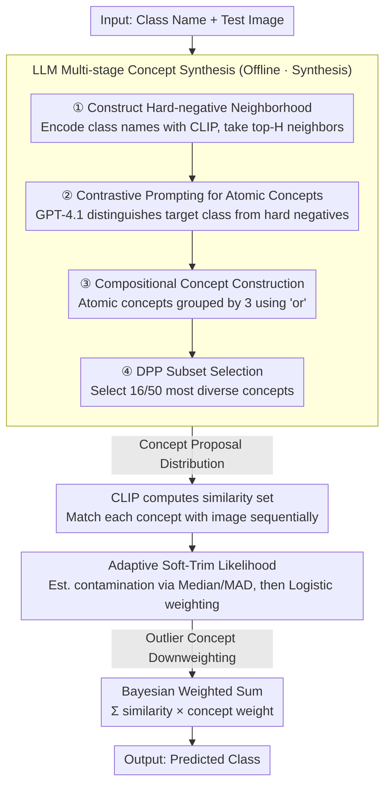

# Beyond Heuristic Prompting: A Concept-Guided Bayesian Framework for Zero-Shot Image Recognition

**Conference**: CVPR2026  
**arXiv**: [2603.07911](https://arxiv.org/abs/2603.07911)  
**Code**: [github.com/less-and-less-bugs/CGBC](https://github.com/less-and-less-bugs/CGBC)  
**Area**: Multimodal VLM  
**Keywords**: Zero-shot classification, CLIP, Bayesian inference, Concept guidance, Prompt engineering, Robust estimation

## TL;DR
Reformulates VLM zero-shot image recognition as a Bayesian framework. It constructs a concept proposal distribution through an LLM-driven multi-stage concept synthesis pipeline and utilizes an adaptive soft-trim likelihood function to suppress the influence of outlier concepts, outperforming SOTA methods across 11 classification benchmarks.

## Background & Motivation
1. VLMs such as CLIP achieve zero-shot classification via simple prompt templates (e.g., "A photo of {class}"), but performance is constrained by the heuristic design of prompt engineering.
2. Existing prompt enhancement methods (e.g., CuPL using LLMs to generate class descriptions) lack adaptability in fine-grained classification tasks (e.g., "2000 AM General Hummer SUV").
3. Prior methods lack a theoretical foundation—averaging the similarities of all enhanced prompts lacks a principled framework.
4. The similarity distribution between enhanced prompts and test images often exhibits skewness or heavy tails, posing a risk where outlier prompts can degrade accuracy.
5. Test-time augmentation methods (e.g., TPT, MTA) introduce significant computational overhead.
6. There is a need for a zero-shot classification framework that provides both theoretical guarantees and computational efficiency.

## Method

### Overall Architecture

CGBC reformulates zero-shot classification from ad-hoc prompt design into Bayesian marginalization over a concept space: the posterior of class $Y_i$ is weighted by a set of concepts $C_{i,j}$,

$$p(Y_i|X) \approx \sum_{C_{i,j} \in \mathcal{C}_i} p(Y_i|X, C_{i,j}) \cdot p(X|C_{i,j})$$

where $p(Y_i|X, C_{i,j})$ is derived from CLIP similarity, and $p(X|C_{i,j})$ is an adaptive soft-trim likelihood (acting as the concept weight). Consequently, the methodology is divided into two parts: one for **Concept Synthesis**—using an LLM to offline synthesize a set of high-quality, discriminative concepts as the concept proposal distribution; and another for **Concept Utilization**—suppressing outlier concepts that do not align with the image during Bayesian weighting. Once both are executed, inference involves only a single weighted sum with zero extra computation.

### Key Designs

**1. LLM-driven Multi-stage Concept Synthesis: Generating Distinguishable, Compositional, and Diverse Concepts**

Simple prompts ("A photo of {class}") and heuristic descriptions lack sufficient discriminative power for fine-grained categories (e.g., "2000 AM General Hummer SUV"). CGBC uses a four-step pipeline to enable an LLM to synthesize concepts that satisfy distinguishability, compositionality, and diversity:

1.  **Construct Hard-negative Neighborhood**: Use the CLIP text encoder to encode class names and identify the $H$ most similar classes for each target class.
2.  **Contrastive Prompting for Atomic Concepts**: Use GPT-4.1 Turbo to generate atomic concepts (50 per class) that can differentiate the target class from these hard negatives; deduplicate those with similarity > 0.9.
3.  **Compositional Concept Construction**: Randomly sample from the atomic concept pool and connect every 3 concepts using "or" to create 500 candidate compositional concepts.
4.  **DPP Subset Selection**: Use a Determinantal Point Process to select the 16 or 50 most diverse concepts from the 500 candidates.

The Key Insight in step 2 is using "contrastive hard negatives" rather than isolated descriptions, which forces the extraction of truly discriminative features; step 4 uses DPP instead of random selection to ensure that the remaining concepts are non-redundant.

**2. Adaptive Soft-Trim Likelihood: Automatic Downweighting of Outlier Concepts**

The similarity distribution between enhanced concepts and test images is often skewed or heavy-tailed. Outlier concepts can degrade accuracy—direct averaging (as in CuPL) suffers from this. The soft-trim likelihood robustly estimates the distribution center and dispersion, then assigns weights to each concept: calculate the median $m_i$ and MAD of the similarity set $\mathcal{S}_i$, estimate the contamination rate $\hat{\rho}_i = \frac{1}{M_i}\sum \mathbb{I}[|S_{i,j} - m_i| > \lambda \cdot \text{MAD}_i]$, and assign weights using a logistic form:

$$w_{i,j} = \sigma\left(-\log\frac{1-\hat{\rho}_i}{\hat{\rho}_i} \cdot \frac{|S_{i,j}-m_i| \cdot k}{\text{MAD}_i}\right)$$

Concepts further from the center receive lower weights, effectively "soft-cropping" outliers rather than hard-discarding them. This step is supported by theoretical foundations: the paper provides robustness guarantees (Theorem 1) and multi-class excess risk bounds (Corollary 1), proving that the estimation error is constrained by the contamination rate $\rho$, the number of concepts $M$, and the sigmoid slope $k$—meaning the influence of outlier concepts is provably controlled.

### Loss & Training

This method is training-free and requires no training: concepts are generated offline by an LLM and encoded by CLIP. Only a Bayesian weighted sum is performed during inference, resulting in no additional computational overhead.

## Key Experimental Results

### Main Results: Performance on 11 Zero-Shot Classification Datasets

| Method | SUN397 | Aircraft | EuroSAT | Cars | ImageNet | Avg. | Auxiliary |
|------|--------|----------|---------|------|----------|------|------|
| CLIP | 62.3 | 23.9 | 42.2 | 65.5 | 66.7 | 63.5 | (1,1) |
| CLIP+E | 65.1 | 23.7 | 47.7 | 66.3 | 68.4 | 64.4 | (1,80) |
| TPT | 65.4 | 23.1 | 42.9 | 66.4 | 68.9 | 65.1 | (64,1) |
| CuPL | — | — | — | — | — | ~65 | (1,~50) |
| **CGBC (M=16)** | **Ours** | **Ours** | **Ours** | **Ours** | **Ours** | **Ours** | (1,16) |

### Ablation Study

| Component | Impact after removal |
|------|-----------|
| Contrastive Prompting (vs. Independent) | Avg. decrease of 1-2%, higher impact on fine-grained datasets |
| Compositional Concepts (vs. Atomic only) | Avg. decrease of approx. 1% |
| DPP Selection (vs. Random) | Avg. decrease of approx. 0.5-1% |
| Soft-trim Likelihood (vs. Uniform Average) | Avg. decrease of 1-3%, highest impact on skewed distribution datasets |

### Key Findings
- CGBC consistently outperforms all zero-shot methods across 11 benchmarks without requiring test-time augmentation.
- A concept count of $M=16$ is already effective; $M=50$ provides further Gain but with diminishing marginal returns.
- Soft-trim likelihood provides the most significant improvement on datasets where obvious outlier concepts are present.

## Highlights & Insights
- Systematizes zero-shot classification for VLMs from a Bayesian perspective, elegantly unifying the prompt enhancement paradigm by treating concepts as latent variables.
- The three properties of the concept proposal distribution (distinguishability, compositionality, diversity) are rooted in cognitive science rather than ad-hoc design.
- Training-free; requires only offline concept generation and encoding, with zero extra computational overhead during inference.

## Limitations & Future Work
- Concept generation depends on the GPT-4.1 Turbo API, which poses a ceiling on concept quality.
- Theoretical assumptions (sub-Gaussianity, known contamination rate) may not be fully satisfied in practice.
- Only the ViT-B/16 backbone was validated; performance on larger vision encoders remains to be confirmed.

## Related Work & Insights
- Key difference from CuPL: CuPL heuristically averages all descriptions, while CGBC achieves adaptivity through Bayesian weighting.
- Difference from TPT/MTA: Real-time computational augmentation vs. CGBC's offline concepts and zero-overhead inference.
- The strategy of using DPP for concept selection is transferable to other scenarios requiring diverse sampling.

## Rating
- Novelty: ⭐⭐⭐⭐⭐ (Bayesian framework with theoretical guarantees, comprehensive concept synthesis pipeline)
- Experimental Thoroughness: ⭐⭐⭐⭐ (11 datasets, but only ViT-B/16)
- Writing Quality: ⭐⭐⭐⭐⭐ (Rigorous theoretical derivation, well-connected methodological motivation)
- Value: ⭐⭐⭐⭐ (Training-free with theoretical guarantees, high practicality)

<!-- RELATED:START -->

## Related Papers

- [\[CVPR 2026\] Self-guided Semantic Inspection for Zero-Shot Composed Image Retrieval](self-guided_semantic_inspection_for_zero-shot_composed_image_retrieval.md)
- [\[CVPR 2026\] Explaining CLIP Zero-shot Predictions Through Concepts](explaining_clip_zero-shot_predictions_through_concepts.md)
- [\[ECCV 2024\] Meta-Prompting for Automating Zero-Shot Visual Recognition with LLMs](../../ECCV2024/multimodal_vlm/meta-prompting_for_automating_zero-shot_visual_recognition_with_llms.md)
- [\[CVPR 2026\] SOTA: Self-adaptive Optimal Transport for Zero-Shot Classification with Multiple Foundation Models](sota_self-adaptive_optimal_transport_for_zero-shot_classification_with_multiple_.md)
- [\[CVPR 2026\] Beyond Missing Modalities: Hypergraph Guided Diffusion for Uncertainty-Aware Multimodal Emotion Recognition](beyond_missing_modalities_hypergraph_conditioned_diffusion_for_uncertainty-aware.md)

<!-- RELATED:END -->
