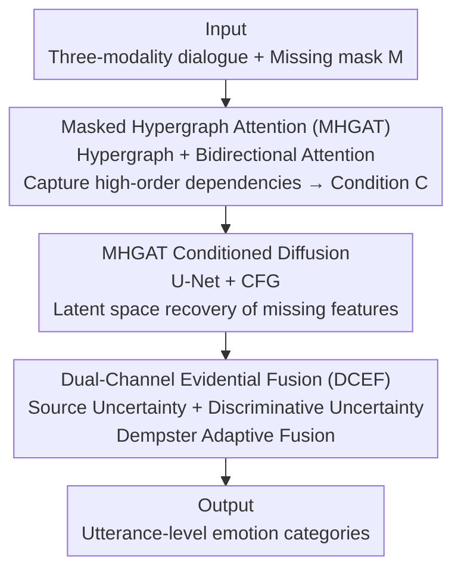

# Beyond Missing Modalities: Hypergraph Guided Diffusion for Uncertainty-Aware Multimodal Emotion Recognition

**Conference**: CVPR 2026  
**Paper**: [CVF Open Access](https://openaccess.thecvf.com/content/CVPR2026/html/Qiu_Beyond_Missing_Modalities_Hypergraph_Conditioned_Diffusion_for_Uncertainty-Aware_Multimodal_Emotion_CVPR_2026_paper.html)  
**Code**: https://github.com/wdqdp/HyperDiff  
**Area**: Multimodal VLM  
**Keywords**: Multimodal Emotion Recognition in Conversation (MERC), Missing Modalities, Hypergraph Attention, Conditional Diffusion, Evidential Fusion  

## TL;DR
To address the random loss of audio/text/visual modalities in Multimodal Emotion Recognition in Conversation (MERC), HyperEF utilizes a Masked Hypergraph Attention Network (MHGAT) to capture high-order multivariate dependencies within dialogues. This network serves as a condition to guide a diffusion model in completing missing modality features within the latent space. Finally, Dual-Channel Evidential Fusion (DCEF) quantifies uncertainty from both "feature source" and "discriminative" perspectives to adaptively fuse modalities, achieving new SOTA performance across all missing rates on IEMOCAP and MELD.

## Background & Motivation
**Background**: MERC aims to determine the speaker's emotion sentence-by-sentence in a dialogue. By fusing text, audio, and visual modalities, it provides richer emotional cues than unimodal approaches, serving as a key capability for human-computer interaction and mental health monitoring.

**Limitations of Prior Work**: In real-world scenarios, sensor failures or transmission errors cause random modality loss, significantly degrading performance. Current solutions generally fall into two categories: "fusion-space completion," which fills missing gaps in fused representations but lacks interpretability and quality; and "modality-space completion," which reconstructs latent features but struggles to ensure **semantic consistency between reconstructed features and the remaining modalities within the same utterance**.

**Key Challenge**: Ensuring semantic consistency requires modeling complex multivariate dependencies in dialogues—emotions are influenced by high-order relations in both the **modality dimension** (e.g., ambiguous text and flat tone supplemented by visual cues to infer "disgust") and the **contextual dimension** (e.g., the emotion of $u_3$ is strongly correlated with $u_1, u_4, \text{and } u_5$). Traditional Graph Neural Networks only model pairwise relations, and while hypergraphs can model multivariate relations, they often treat all nodes/hyperedges equally, failing to identify "which node is more important."

**Another Overlooked Issue**: Existing methods either treat all modalities equally or use fixed weights. However, in missing modality scenarios, the confidence of **features supplemented by generative models** naturally differs from **real available features**. Furthermore, discriminative confidence varies across samples, and fixed weights lead to blurred predictions.

**Core Idea**: Use masked hypergraph attention to capture high-order dialogue dependencies, which then guides a diffusion model for semantically consistent feature recovery (replacing blind reconstruction). Subsequently, use dual-channel evidence theory to adaptively fuse modalities across two decoupled axes: "source uncertainty + discriminative uncertainty" (replacing fixed-weight fusion).

## Method

### Overall Architecture
HyperEF (Hypergraph Diffusion and Evidence Fusion based Emotion Recognition) takes a dialogue with random modality loss as input: $N$ utterances, each with three modalities $u_i=\{u_i^t, u_i^v, u_i^a\}$, and a 0/1 mask $M$ marking availability. The output is the emotion category for each utterance. The pipeline consists of three serial stages:

1. **Masked Hypergraph Attention Network (MHGAT)**: Constructs a hypergraph using all $3N$ unimodal nodes, applies masked embeddings, and uses bidirectional attention to aggregate node representations carrying high-order context/modality information, which serve as condition $C$ for diffusion.
2. **MHGAT Conditioned Diffusion**: Guided by $C$, a U-Net noise prediction network performs denoising and recovery of missing modality features in latent space, using classifier-free guidance to ensure consistency with existing modalities.
3. **Dual-Channel Evidential Fusion (DCEF)**: Converts each modality's prediction into evidence (Dirichlet parameters). It estimates uncertainty from "feature source" and "discriminative" axes, then adaptively fuses evidence using Dempster's rule to output the final emotion.

### Key Designs

**1. MHGAT: Distinguishing Importance and Absence via Attentional Hypergraphs**

To address the limitations of pair-wise graphs and non-weighted hypergraphs, MHGAT constructs a hypergraph $H=(V,E)$ for a dialogue. $V$ consists of all $3N$ unimodal utterance nodes ($|V|=3N$). $E$ includes 3 context hyperedges $e^c$ (connecting all utterances of the same modality) and $N$ multimodal hyperedges $e^m$ (connecting the three modalities of the same utterance), where $|E|=N+3$. During construction, **missing nodes' hyperedge relations and positions are preserved, but their values are zeroed**. A masked embedding $v_i = v_i + \text{embedding}(M_i)$ is added to all nodes, allowing the network to identify missing modalities.

Aggregation proceeds bidirectionally in two steps (over 2 layers): "node $\to$ hyperedge" $e_j^{l+1}=\sigma(\sum_{v_i\in V_j}\alpha_{ji}W_1 v_i^l)$, followed by "hyperedge $\to$ node" $v_i^{l+1}=\sigma(\sum_{e_j\in E_i}\beta_{ij}W_2 e_j^{l+1})$. Attention scores $\alpha_{ji}, \beta_{ij}$ are calculated using LeakyReLU + concatenation. This forces the model to attend to strong emotional cues (e.g., "funny/like") while ignoring ambiguous ones (e.g., "Okay"), and automatically shift attention to other modalities when textual cues are insufficient. Hyperedges are initialized with learnable embeddings $e_j^{(0)}\sim\mathcal{N}(0,\sigma^2 I)$. Compared to a 2-layer Transformer, MHGAT achieves comparable or better accuracy with only 23% of the parameters.

**2. MHGAT Conditioned Diffusion: Guiding Denoising for Semantically Consistent Recovery**

Instead of completion in fusion space, HyperEF performs explicit recovery in the modality latent space via conditional diffusion. The node representations from MHGAT are concatenated along the modality dimension to form condition $C \in \mathbb{R}^{n \times 3d}$. This is fed into a U-Net noise prediction network where cross-attention injects the condition into intermediate features: $F^{(l+1)}=\text{Concat}(F^{(l)}, \text{CrossAttn}(F^{(l)}, \text{Linear}(C)))$. Training utilizes classifier-free guidance, randomly dropping the condition with probability $p$ to learn unconditional prediction. The objective is standard noise regression: $L=\mathbb{E}\big[\|\epsilon_\theta(x_t,C,p)-\epsilon\|^2\big]$.

During sampling, the conditional and unconditional predictions are combined to amplify the signal:

$$\hat\epsilon_\theta(x_t,C)=\epsilon_\theta(x_t,\varnothing)+w\cdot\big(\epsilon_\theta(x_t,C)-\epsilon_\theta(x_t,\varnothing)\big)$$

The reverse denoising follows $x_{t-1}=\tilde\mu_t(x_t,t,C)+\sigma_t z$, where $\tilde\mu_t=\frac{1}{\sqrt{\eta_t}}\big(x_t-\frac{1-\eta_t}{\sqrt{1-\bar\eta_t}}\hat\epsilon_\theta\big)$ and $\eta_t=1-\beta_t$. Since the condition carries high-order context/modality dependencies, the recovered feature distribution closely aligns with real features (as seen in t-SNE and low MSE/MMD), reducing semantic ambiguity.

**3. DCEF: Decoupling Uncertainty into Source and Discriminative Axes**

DCEF replaces the softmax classification head with a ReLU output to generate "evidence" $e$, corresponding to Dirichlet parameters $\alpha=e+1$. Traditional Dempster-Shafer Theory (DST) only uses vacuity (lack of total evidence), which fails to capture complex entanglements in multimodal data. DCEF decouples the Basic Probability Assignment (BPA) for the frame of discernment $\Omega$ into two axes:

- **Feature Source Layer** $m_s(\Omega)$: Quantifies reliability based on the MSE between predicted and actual noise in the final diffusion step $u=\|\epsilon-\epsilon_\theta(x_t,T,C)\|_2^2$, then maps via $m_s(\Omega)=a\cdot\text{Sigmoid}(b\cdot(u-\bar u))$. For real (non-recovered) features, $m_s(\Omega)$ is set to 0.
- **Discriminative Layer** $m_d(\Omega)$: Quantifies prediction ambiguity using normalized cross-entropy $m_d(\Omega)=-\frac{\sum_k P_k\log P_k}{\log K}$. Entropy was found to be the superior second axis through empirical comparison with vacuity, dissonance, and consonance.

The total BPA for the frame of discernment is combined as $m(\Omega)=\gamma\cdot m_d(\Omega)+m_s(\Omega)$, with $m(k)=(1-m(\Omega))P_k$. Modalities are then fused iteratively using Dempster’s combination rule. This automatically down-weights recovered modalities with low confidence.

### Loss & Training
A two-stage training strategy is adopted: ① Pre-train MHGAT conditioned diffusion for 100 epochs; ② Train the backbone for 50 epochs. The final objective adds two evidential constraints to cross-entropy: vacuity regularization $Vac(\alpha)=K/S$ and a KL divergence regularization $L_{KL}$ (to penalize fake evidence by pulling Dirichlet distributions of incorrect classes toward a uniform distribution):

$$L=\arg\min_{\alpha_i}\sum_{i=1}^n L_{CE}(P_i,y_i)+\lambda_1 L_{KL}(\alpha_i)+\lambda_2 Vac(\alpha_i)$$

Parameters were determined via Bayesian optimization: $\lambda_1=0.5$, $\lambda_2=0.8$, $\bar u=1.3$, $b=5$, $a=\frac{1}{7}$, $\gamma=0.2$.

## Key Experimental Results

### Main Results
HyperEF was compared against SOTA methods on IEMOCAP and MELD using a random missing protocol (missing rate $\kappa \in [0, 0.7]$). HyperEF achieved superior performance across **all datasets and all missing rates**. Selected Accuracy (%) on IEMOCAP4:

| Missing Rate | MMIN | GCNet | IMDer | CIF-MMIN | SDR-GNN | HyperEF |
|--------------|------|-------|-------|----------|---------|---------|
| 0.0          | 74.9 | 78.4  | 74.3  | 79.3     | 79.6    | **82.9 (↑3.3)** |
| 0.1          | 71.8 | 77.5  | 73.5  | 77.9     | 78.6    | **82.1 (↑3.5)** |
| 0.3          | 66.3 | 76.2  | 64.1  | 77.3     | 77.5    | **80.3 (↑2.8)** |
| 0.5          | 60.5 | 73.8  | 64.5  | 76.0     | 75.8    | **78.2 (↑2.2)** |
| 0.7          | 55.4 | 71.4  | 44.2  | 73.6     | 74.4    | **77.0 (↑2.6)** |

The advantage is even more pronounced at high missing rates on IEMOCAP6 (↑4.0 at $\kappa=0.6$). Wilcoxon signed-rank tests confirmed statistical significance ($p=0.0078$).

### Ablation Study
Ablation of objective function components (IEMOCAP4/MELD, $\kappa=0.3$, baseline $L_{CE}$ only):

| $L_{KL}$ | $Vac$ | IEMOCAP4 Acc. | MELD Acc. | Note |
|----------|-------|---------------|-----------|------|
| ✗        | ✗     | 76.85         | 55.06     | Cross-entropy only |
| ✗        | ✓     | 48.75         | 62.92     | IEMOCAP crash without $L_{KL}$ |
| ✓        | ✗     | 77.60         | 50.40     | MELD crash without $Vac$ |
| ✓        | ✓     | **80.31**     | **63.78** | Full model |

Ablation of uncertainty axes confirmed that using entropy (discriminative layer) as the second axis yielded the best Acc (63.78) on MELD.

### Key Findings
- $L_{KL}$ and $Vac$ are complementary and essential; removing one causes a collapse on different datasets, indicating that uncertainty sources vary by context.
- MHGAT is highly efficient, using 1.60M parameters (23% of Transformer's 6.83M) while being faster (0.82s per epoch).
- The performance gap widens as the missing rate increases, demonstrating the importance of semantically consistent feature reconstruction in severe loss scenarios.

## Highlights & Insights
- **Natural Coupling of Structure and Generation**: Using high-order context aggregated by hypergraphs as a condition for classifier-free guidance ensures the diffusion model "knows" the direction of emotion for completion, significantly outperforming blind reconstruction.
- **Masked Embeddings and Zero-Preservation**: Preserving missing nodes in the hypergraph while zeroing values and adding masked embeddings allows the network to explicitly perceive loss while maintaining topological structure.
- **Decoupled Uncertainty Axes**: Quantizing source reliability (via noise MSE) and discriminative ambiguity (via entropy) is a core insight. This evidential fusion framework is highly applicable to any system where partial inputs are supplemented by generative models.

## Limitations & Future Work
- Validation was limited to IEMOCAP and MELD (three modalities). Generalization to more modalities or non-dialogue scenarios remains to be tested.
- Two-stage training and 300-step diffusion sampling introduce computational overhead. End-to-end inference latency is subject to the complexity analyzed in the appendix.
- Axis decoupling and hyperparameters ($a, b, \gamma, \lambda$) were empirically determined; migration to new datasets may require re-tuning.

## Related Work & Insights
- **vs. Fusion-space Completion (GCNet / SDR-GNN)**: These methods supplement information in fused representations, whereas HyperEF recovers explicit modality latent features with significantly lower MSE/MMD.
- **vs. Modality-space Completion (MMIN / IMDer)**: Unlike IMDer, which uses score-based diffusion without high-order structural conditions, HyperEF preserves semantic consistency.
- **vs. Standard Hypergraph MERC**: Previous works treat nodes equally; MHGAT introduces bidirectional attention and masking to handle unequal contributions and missing modalities.

## Rating
- Novelty: ⭐⭐⭐⭐ Innovative combination of hypergraph-guided diffusion and dual-axis evidential fusion.
- Experimental Thoroughness: ⭐⭐⭐⭐ Covers 8 missing rates across multiple benchmarks with extensive ablation and significance testing.
- Writing Quality: ⭐⭐⭐⭐ Clear logic from motivation to experimentation, despite dense notation for uncertainty metrics.
- Value: ⭐⭐⭐⭐ Directly addresses the practical problem of missing modalities in MERC with transferable insights.

<!-- RELATED:START -->

## Related Papers

- [\[CVPR 2026\] DPL: Decoupled Prototype Learning for Enhancing Robustness of Vision-Language Transformers to Missing Modalities](dpl_decoupled_prototype_learning_for_enhancing_robustness_of_vision-language_tra.md)
- [\[ICML 2026\] Calibrated Multimodal Representation Learning with Missing Modalities](../../ICML2026/multimodal_vlm/calibrated_multimodal_representation_learning_with_missing_modalities.md)
- [\[CVPR 2026\] When to Think and When to Look: Uncertainty-Guided Lookback](when_to_think_and_when_to_look_uncertainty-guided_lookback.md)
- [\[ICCV 2025\] Synergistic Prompting for Robust Visual Recognition with Missing Modalities](../../ICCV2025/multimodal_vlm/synergistic_prompting_for_robust_visual_recognition_with_missing_modalities.md)
- [\[CVPR 2026\] Diffusion Guided Chain-of-Vision for Large Autoregressive Vision Models](diffusion_guided_chain-of-vision_for_large_autoregressive_vision_models.md)

<!-- RELATED:END -->
