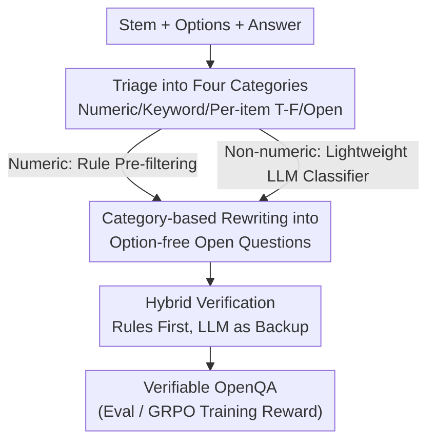

# Beyond Multiple Choice: Verifiable OpenQA for Robust Vision-Language RFT

**Conference**: CVPR 2026  
**Paper**: [CVF Open Access](https://openaccess.thecvf.com/content/CVPR2026/html/Liu_Beyond_Multiple_Choice_Verifiable_OpenQA_for_Robust_Vision-Language_RFT_CVPR_2026_paper.html)  
**Code**: [Project Page flageval-baai.github.io/ReVeL](https://flageval-baai.github.io/ReVeL/) (Committed to release code and data)  
**Area**: Multimodal VLM  
**Keywords**: Reinforcement Fine-Tuning (RFT), Verifiable Reward, OpenQA, MCQA Bias, GRPO  

## TL;DR
This paper demonstrates that the Multiple-Choice Question Answering (MCQA) format leaks option signals that models can exploit, leading to inflated evaluations and RFT learning "option-guessing" shortcuts. It proposes the ReVeL framework to automatically rewrite MCQA into "OpenQA that remains rule-verifiable" based on answer types. After fine-tuning with GRPO on 20k rewritten samples, OpenQA accuracy improved by approximately 6 percentage points without a drop in MCQA scores, while revealing that MCQA scores are inflated by up to 20 percentage points compared to OpenQA.

## Background & Motivation
**Background**: MCQA has long been the dominant data format for multimodal Large Language Model (MLLM) evaluation and Reinforcement Fine-Tuning (RFT using verifiable rewards) due to its constrained output space and deterministic automated scoring. Given a question and several options, the model outputs a letter, and a 0/1 reward is obtained through direct comparison, which is simple and scalable.

**Limitations of Prior Work**: The authors quantitatively expose the vulnerability behind this convenience through a series of experiments. First, after converting open-ended benchmarks (SimpleQA, VisualSimpleQA) into multiple-choice by adding 6 options, both open-source and closed-source models achieved accuracies significantly exceeding the theoretical upper bound: $\text{Acc}_{UB}=\text{Acc}_{Open}+(1-\text{Acc}_{Open})\cdot\frac{1}{K}$ ($K=6$). This indicates models utilize information within the options rather than actual knowledge. Second, after replacing the correct option with "None of the Above (NOTA)," the models' Chain-of-Thought often correctly excluded all wrong options but still picked an option they had just negated, with logical contradiction rates soaring from 18% in standard MCQA to 50%. Models also tended to reuse the original "correct letter" position, suggesting shallow memorization of position cues or test set contamination.

**Key Challenge**: MCQA accuracy relies heavily on the **set of options themselves** rather than just the knowledge and reasoning required by the question stem. In evaluation, this leads to overestimated capabilities. In training, it is even more dangerous: a large amount of visual reasoning RFT data is in MCQA format. Using outcome-based RL encourages "option-bound shortcuts" rather than transferable reasoning. Experiments show that RFT on Qwen2.5-VL using MCQA on MMMU increased MCQA scores while OpenQA scores actually dropped, further widening the MCQA–OpenQA gap.

**Goal**: Retain the core advantage of MCQA—being automatically verifiable at low cost—while switching both training and evaluation to an open-ended format that does not leak option signals. This aims to fix evaluation inflation and make RFT rewards reliable.

**Key Insight**: Directly using an LLM to remove options is insufficient. First, about half of the multiple-choice questions become ill-posed without options (e.g., "Which of the following statements is correct"). Second, relying entirely on an LLM as a judge is expensive and introduces variance. The authors observe that most answers are structured (numbers, keywords, item-wise truth values), and only a minority truly require semantic understanding.

**Core Idea**: Categorize MCQA by answer types and use "Rewriting + Hybrid Verification" instead of "LLM-only scoring." Deterministic rules are used wherever possible, reserving the LLM judge only for truly open-ended questions requiring semantic understanding.

## Method

### Overall Architecture
ReVeL (Rewrite-and-Verify by LLM) converts a "Stem + Options + Answer" MCQA item into an "Open-ended but verifiable" item through a three-stage pipeline. First, it performs **Triage** to determine the category of the answer (Numeric / Keyword / Per-item True-False / Truly Open). Second, it uses **Customized Rewriting** prompts per category to create an open-ended question without options while organizing a verifiable gold answer. Finally, in the **Hybrid Verification** stage, deterministic rules score the vast majority of questions, leaving only truly open-ended ones for the LLM judge. The core principle is to maximize the coverage of deterministic rule scoring and minimize LLM scoring.

### Key Designs

**1. Four-Category Triage: Separating Rule-based and Semantic-based Scoring**

The pain point is that open-ended evaluation either relies on rules (limited to short answers) or entirely on LLM judges (expensive and unstable). ReVeL uses a **rule pre-filter** to catch numeric questions where the answer is a quantity or ratio (e.g., `50kg`, `9.8×10⁻²³ m/s²`), which proceed directly to pattern matching. Remaining non-numeric questions are handled by a **lightweight LLM classifier** into three categories: Keywords (short tokens with limited variants like names or dates), Open Answers (single-sentence facts/descriptions), and Per-item True-False (questions heavily dependent on the option set, e.g., "Which of the following describes..."). The value of this division is that the first three types possess deterministic structures for precise rule-based scoring, restricting the expensive and variable LLM judge to a minimal subset.

**2. Customized Rewriting: Removing Options while Maintaining Verifiability and Semantic Fidelity**

Applying the same rewrite prompt to different answer types would lose semantics or verifiability. Therefore, a specialized strategy is assigned to each category. For Numeric: explicitly specify measurement units and format in the prompt (e.g., "Provide COP, Power(kW) separated by commas"), standardizing the answer to `4.87, 30.8`. For Keywords: **enumerate acceptable synonyms/variants** in the gold answer (e.g., `BMW OR Bayerische Motoren Werke OR BMW AG`), making rule matching both flexible and consistent. For Open Answers: rewrite into concise factual free-form questions (e.g., "What position did Goya hold when he created this?"), removing dependence on original options. For Per-item True-False: convert each option into a statement and require the model to output a comma-separated string of True/False (e.g., `True, False, False, False, False`), preserving the discriminative intent of MCQA while moving to a structured verifiable format.

**3. Hybrid Verification: Rule-First, LLM-as-Backup**

Relying entirely on LLM judges is costly and introduces subjective variance and false positives. ReVeL uses deterministic rules for numeric, keyword, and per-item true-false categories, calling the LLM judge only for truly open-ended questions. This hybrid design is a win-win: on 600 sampled responses, ReVeL achieved a scoring accuracy of 98.5%, higher than the 97.3% of a pure LLM judge (GPT-4o-mini), with the false positive rate (FPR) reduced from 2.0% to 0.3%. After rewriting, 70–96% of items across four benchmarks became purely rule-verifiable (up to 95.9% for EMMA). Rule-based scoring adds stricter constraints to the decision boundary, proving more stable than "soft" LLM judgments.

**4. Using ReVeL-OpenQA for GRPO Training: Shifting Reward Signals from "Option Guessing" to "True Reasoning"**

It was previously proven that RFT on MCQA reinforces option shortcuts and harms open-ended generalization. ReVeL is applied by rewriting existing visual reasoning RL datasets (ViRL, Mixed-R1) into OpenQA form. Qwen2.5-VL-3B/7B are then fine-tuned using GRPO, where rewards come from the verifiable scoring of the rewritten questions (primarily rule-based). Because rewards are no longer bound to option positions, the model is forced to learn transferable knowledge and reasoning rather than formatting shortcuts—this is the root cause for its performance gains on open-ended evaluations without sacrificing multiple-choice scores.

### An Example: How an MCQA Item is Rewritten and Scored
Example: Keyword category. Original: "What is the manufacturer of the vehicle in the picture?" Options: A. Mercedes Benz / B. FORD / C. BMW / D. HYUNDAI / E. None. Answer: C. The ReVeL triage identifies the answer as a short token with limited variants, categorizing it as Keywords -> Rewriting removes all options, keeping the question "What is the manufacturer of the vehicle in the picture?" -> Gold answer is enumerated as `BMW OR Bayerische Motoren Werke OR BMW AG`. During evaluation, the model generates the manufacturer name directly, and rule matching confirms accuracy if any variant is hit—no LLM intervention is needed, eliminating the "elimination method" shortcut while maintaining deterministic verification.

## Key Experimental Results

### Main Results: RFT Training Effects (ViRL Data, GRPO, 4 Benchmarks Aggregate)
| Model / Training Data | MCQA Avg | OpenQA Avg | Overall |
|------|------|------|------|
| Qwen2.5-VL-3B (Base) | 36.6 | 21.3 | 28.9 |
| + MCQA (ViRL) | 40.5 | 19.7 | 30.1 |
| + OpenQA (ReVeL) | 40.7 | **28.0** | **34.3** |
| Qwen2.5-VL-7B (Base) | 43.7 | 28.5 | 36.1 |
| + MCQA (ViRL) | 47.8 | 24.7 | 36.3 |
| + OpenQA (ReVeL) | 46.8 | **34.0** | **40.4** |

Key comparison: MCQA training caused the OpenQA score of the 7B model to drop from 28.5 to 24.7 (shortcut reinforcement), while ReVeL-OpenQA training pushed it to 34.0, with MCQA remaining at 46.8 (comparable to MCQA training). The overall score of 40.4 for the 7B model also surpasses open-source recipes like R1-OneVision-7B (31.3), Mixed-R1-7B (37.2), and VL-Rethinker-7B (37.5).

### Hybrid Verification vs. Pure LLM Judge (600 Samples, Scoring Accuracy)
| Dataset | Judge | Recall | PPV | FPR | Acc |
|--------|------|--------|-----|-----|-----|
| MME-RW | LLM | 93.5 | 98.6 | 1.4 | 95.9 |
| MME-RW | ReVeL | 95.7 | 100 | **0.0** | **98.0** |
| MMLU-Pro | LLM | 95.1 | 97.5 | 3.2 | 95.8 |
| MMLU-Pro | ReVeL | 100 | 100 | **0.0** | **100** |
| Overall | LLM | 96.4 | 97.2 | 2.0 | 97.3 |
| Overall | ReVeL | 96.8 | 99.6 | **0.3** | **98.5** |

### MCQA to OpenQA Score Inflation (Evaluation Perspective, Acc% / Drop in Brackets)
| Model | EMMA | MMMU | MME-RW | MMLU-Pro |
|-------|------|------|--------|----------|
| GPT-4o | 42.0→36.0 (6.0) | 79.2→59.5 (**19.8**) | 57.8→42.4 (15.4) | 84.6→67.6 (17.0) |
| GPT-4o-mini | 40.2→22.3 (**17.9**) | 65.3→51.6 (13.7) | 54.8→44.0 (10.9) | 75.4→64.4 (11.0) |
| R1-OneVision-7B | →(**24.2**) | — | — | — |

### Key Findings
- **MCQA training is detrimental**: For the 7B model, MCQA RFT pulled OpenQA down from 28.5 to 24.7, validating the "MCQA reward = shortcut reinforcement" hypothesis. ReVeL-OpenQA training increased open-ended scores on every benchmark without dropping MCQA performance.
- **Rule-based coverage is the core of efficiency**: After rewriting, 70–96% of questions became purely rule-verifiable (95.9% for EMMA). This hybrid verification is more accurate and cheaper than pure LLM judges.
- **Inflation is widespread and severe**: Even GPT-4o dropped 19.8 percentage points when switching from MCQA to OpenQA on MMMU. Open-source models dropped even more (R1-OneVision-7B dropped 24.2 on EMMA; InternVL3-8B dropped 27.9 on MMMU), indicating severe overfitting to the MCQA format.

## Highlights & Insights
- **Treating "evaluation format" itself as a research object**: The paper identifies how the MCQA format, often assumed harmless, contaminates both evaluation (inflation) and training (shortcuts). The experimental design—adding options, swapping to NOTA, and removing options—is rigorous.
- **"Rule-first, LLM-as-backup" as a reusable paradigm**: Rather than debating LLM judge accuracy, the focus is on structuring verifiable answers (Numeric/Keyword/Boolean lists) to limit the LLM to a minority of cases. This logic transfers to any RLVR (Reinforcement Learning from Verifiable Rewards) scenario.
- **Clever Per-item True-False rewriting**: Converting "Which of the following is correct" into independent True/False outputs for each statement eliminates option-position leakage while preserving the original discriminative intent.

## Limitations & Future Work
- **Reliance on LLM judges for Open questions**: Roughly 4–28% of items (e.g., 28.4% in MME-RW) fall into the "Open" category, where quality and cost are still constrained by the LLM judge.
- **Rewriting quality depends on the LLM and Classifier**: Triage uses a lightweight LLM. If classification fails or rewriting loses semantics, noise is introduced.
- **Completeness of synonym enumeration**: While variants improve recall, rare synonyms or multilingual expressions might still be misjudged as incorrect, representing a systematic downward bias for OpenQA accuracy.
- **Limited training scale**: RFT was only validated on 20k samples (including 5k ViRL) with Qwen2.5-VL-3/7B. Whether the superiority of OpenQA training holds for larger models and data scales remains to be tested.

## Related Work & Insights
- **Vs. Direct option removal for OpenQA eval**: Prior works found MCQA fragile and removed options, but about half the items became ill-posed and were discarded, and the rest still relied on LLM judges. ReVeL preserves semantics through category-based rewriting and moves most items to rule-based verification.
- **Vs. Strategies to mitigate MCQA bias (better distractors / more options / random order / select-all)**: These only weaken bias without changing the essence of "scoring based on options." ReVeL eliminates option leakage by switching to option-free verifiable OpenQA.
- **Vs. Pure LLM-as-a-judge evaluation**: Pure LLM judges are expensive, variable, and have higher false positives (2.0% FPR). ReVeL's hybrid approach reduces FPR to 0.3% and improves accuracy (98.5% vs 97.3%).
- **Vs. RFT on MCQA (VL-Rethinker / R1-OneVision / Mixed-R1)**: These recipes often include heavy MCQA data, reinforcing shortcuts. The 7B model trained via ReVeL-OpenQA outperforms them in open-ended aggregate scores.

## Rating
- Novelty: ⭐⭐⭐⭐⭐ Treats the evaluation format as a research object, revealing dual contamination of eval and training by MCQA.
- Experimental Thoroughness: ⭐⭐⭐⭐⭐ Comprehensive evidence chain across diagnostic experiments, training, and evaluation inflation across multiple benchmarks and scales.
- Writing Quality: ⭐⭐⭐⭐ Clear motivation and informative tables.
- Value: ⭐⭐⭐⭐⭐ Directly addresses the pain point of data format in verifiable reward RFT; method is highly reusable for RLVR data governance.

<!-- RELATED:START -->

## Related Papers

- [\[CVPR 2026\] CARE What Fails: Contrastive Anchored-REflection for Verifiable Multimodal Reasoning](care_what_fails_contrastive_anchored-reflection_for_verifiable_multimodal_reason.md)
- [\[CVPR 2026\] Dynamic Token Reweighting for Robust Vision-Language Models](dynamic_token_reweighting_for_robust_vision-language_models.md)
- [\[CVPR 2026\] Beyond Single Images: A Comprehensive Benchmark for Album-Level Vision-Language Understanding](beyond_single_images_a_comprehensive_benchmark_for_album-level_vision-language_u.md)
- [\[CVPR 2026\] Ramen: Robust Test-Time Adaptation of Vision-Language Models with Active Sample Selection](ramen_robust_test-time_adaptation_of_vision-language_models_with_active_sample_s.md)
- [\[CVPR 2026\] EMMA: Extracting Multiple physical parameters from Multimodal Data](emma_extracting_multiple_physical_parameters_from_multimodal_data.md)

<!-- RELATED:END -->
