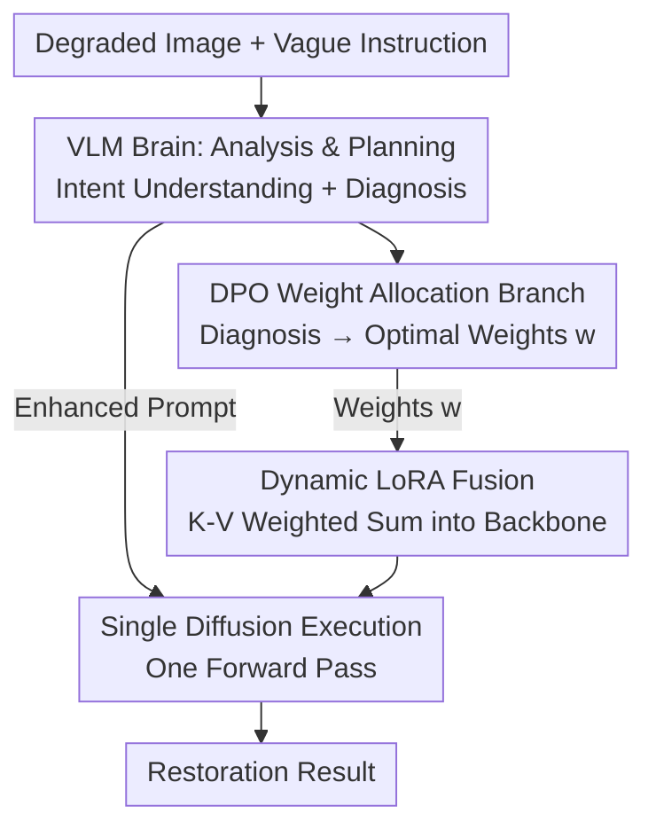

# Beyond Sequential Tools: A Unified VLM Agent System for Photographic Post-Processing via Dynamic Multi-Expert Fusion

**Conference**: CVPR 2026  
**Paper**: [CVF Open Access](https://openaccess.thecvf.com/content/CVPR2026/html/Xiong_Beyond_Sequential_Tools_A_Unified_VLM_Agent_System_for_Photographic_CVPR_2026_paper.html)  
**Code**: None  
**Area**: Multi-modal VLM / Agent / Image Restoration  
**Keywords**: VLM Agent, Image Restoration, LoRA Fusion, DPO, Diffusion Models  

## TL;DR
A VLM acts as the "brain" to diagnose multiple coupled degradations in an image and assign weights to corresponding expert LoRAs. These LoRAs are fused into a diffusion backbone once, enabling collaborative restoration (e.g., "deraining + dehazing + deblurring") in a **single forward pass**. This avoids the generalization issues of all-in-one models and the error accumulation inherent in sequential tool-calling agentic methods.

## Background & Motivation

**Background**: Real-world photographs often suffer from multiple "entangled" degradations—such as simultaneous noise, motion blur, and haze. Leading approaches have evolved through three generations: specialized models (separate models for deblurring/deraining) $\rightarrow$ all-in-one unified models (e.g., InstructIR, AutoDIR) $\rightarrow$ agentic systems (e.g., AgenticIR, 4KAgent using LLM/VLMs as agents to **sequentially dispatch** specialized tools).

**Limitations of Prior Work**: Each generation has critical weaknesses. Specialized models fail on mixed degradations. All-in-one models, trained on limited synthetic data, often collapse when encountering unseen real-world combinations. Recent agentic methods decompose tasks into independent sub-problems and call isolated models sequentially; however, artifacts and noise from one model are amplified by the next, leading to error accumulation (categorized as: cumulative artifacts, noise amplification, unrealistic smoothing, and content hallucination). Furthermore, sequential planning introduces high latency.

**Key Challenge**: Coupled degradations are inherently **collaborative** (e.g., dehazing and deblurring facilitate each other), but sequential pipelines treat them as independent problems to be solved one by one. This paradigm of "combinatorial search + isolated tools" fundamentally contradicts the nature of coupled degradation.

**Goal**: Replace the "combinatorial search of isolated tools" with a **single, collaborative execution step** that adaptively adjusts its behavior based on the specific types and severities of degradations present.

**Key Insight**: The authors propose a **"brain–hands–pen"** architecture: a VLM serves as the "brain" for intent understanding and degradation diagnosis; a pre-trained diffusion backbone acts as the versatile "hands"; and a set of expert LoRAs serve as composable "pens." A critical observation is that the low-rank updates of LoRAs are **linearly additive**, allowing multiple experts to be fused into the backbone simultaneously via weighted summation, bypassing the need for sequential model execution.

**Core Idea**: Replace "agent-based sequential dispatch of isolated tools" with "VLM diagnosis $\rightarrow$ dynamic LoRA weight allocation $\rightarrow$ weighted fusion into a diffusion backbone $\rightarrow$ single-pass restoration."

## Method

### Overall Architecture

The system aims to automatically identify and repair various degradations from an image and a vague instruction (e.g., "make it clearer"). The "brain–hands–pen" pipeline consists of three steps:

1. **Analysis & Planning**: The VLM Orchestrator (Qwen2.5-VL-72B, the "brain") processes both the image and the prompt to perform intent understanding and degradation diagnosis. it generates a structured restoration plan containing: (a) a semantically rich enhancement prompt optimized for the diffusion backbone, and (b) an expert LoRA dictionary where each LoRA is assigned a weight $w \in [0,1]$ corresponding to the diagnosed severity.
2. **Dynamic Expert Assembly**: Selected expert LoRAs are merged into the frozen diffusion backbone (Flux-Kontext, the "hands") via weighted summation, creating a customized model tailored for the specific input.
3. **Single execution**: This customized model generates the restored output in a **single forward pass**, conditioned on the enhanced prompt and the original image.

Precise weights are not directly prompted from the VLM (as small VLMs struggle with numerical precision). Instead, a lightweight **DPO weight allocation branch** is used: an MLP attached to frozen VLM features is trained via Direct Preference Optimization (DPO) to translate qualitative diagnoses into optimal numerical weights.

### Key Designs

**1. VLM Orchestrator Agent: Translating Vague Intent into Executable Plans**
The failure of sequential agentic methods stems from the lack of a "global vision" to diagnose all degradations at once. The Qwen2.5-VL-72B agent analyzes the image and text to infer user intent and performs a comprehensive "visual checkup," distinguishing between **global degradations** (noise, haze) and **local degradations** (motion blur) while assessing severity. The output includes an expanded enhancement prompt (e.g., expanding "low-light enhancement" into "improve brightness, exposure, and detail across the image to make text on signs legible") and specific LoRA weights.

**2. DPO Weight Allocation Branch: Aligning Qualitative Diagnosis with Human Preference**
To overcome the unreliability of zero-shot numerical estimation in VLMs, a lightweight MLP policy network $\pi_\theta$ is attached to the frozen VLM vision encoder features $x$. Continuous weight regression is framed as **discrete classification**: each LoRA weight $w \in [0,1]$ is discretized into $K$ bins (e.g., $K=10$). Under the assumption of expert independence, the log-probability of a weight combination $y$ is:

$$\log \pi_\theta(y|x) = \sum_{i=1}^{N} \log \pi_\theta(y_i|x)$$

Training involves two stages: **pre-training** the branch using VLM heuristic weights as pseudo-labels (creating a reference model $\pi_{\text{ref}}$), followed by **DPO** using human preference triplets $(x, y_w, y_l)$, where $y_w$ and $y_l$ represent winning and losing weight combinations for feature $x$:

$$\mathcal{L} = -\mathbb{E}\left[\log \sigma\!\left(\beta \log \frac{\pi_\theta(y_w|x)}{\pi_{\text{ref}}(y_w|x)} - \beta \log \frac{\pi_\theta(y_l|x)}{\pi_{\text{ref}}(y_l|x)}\right)\right]$$

**3. Dynamic LoRA Fusion (K-V only): Single-step Integration via Linear Additivity**
Each expert LoRA is trained on a specific task subset (denoising, deblurring, etc.) by **updating only the Key (K) and Value (V) projection matrices in self-attention, while freezing the Query (Q)**. Freezing Q preserves the pre-trained attention patterns of the backbone, forcing LoRAs to learn "new content" (restoration skills) without disrupting "attention structure." For an original matrix $W_{0,M}$, the fused matrix is:

$$W'_M = W_{0,M} + \sum_{i=1}^{N} w_i \cdot \Delta W_{i,M}, \quad M \in \{K, V\}$$

This weight addition has zero extra forward cost and enables single-pass inference.

### Loss & Training
Two-stage training:
1. **Expert Pool Training**: Each LoRA is trained on single-degradation datasets (10k–40k steps) while the backbone is frozen.
2. **Weight Branch Training**: 500 images are sampled for human preference labeling, followed by 2,000 steps of DPO training.

## Key Experimental Results

### Main Results

Evaluations on the **Real-1000** dataset (zero-shot) across three groups:

| Dataset | Metric | Ours | Next Best | Note |
|--------|------|------|----------------|------|
| Group 1 (Single) | PSNR ↑ | **22.90** | 21.72 (InstructIR) | Leading fidelity |
| Group 1 | LPIPS ↓ | **0.1711** | 0.2374 (InstructIR) | Substantially lower perceptual distance |
| Group 1 | MUSIQ ↑ | **60.67** | 57.70 (Qwen-Image) | Highest no-reference quality |
| Group 2 (Double) | PSNR ↑ | **21.10** | 18.79 (AutoDIR) | Advantage grows with complexity |
| Group 3 (Triple) | PSNR ↑ | **19.25** | 18.06 (AutoDIR) | Sequential agents (AgenticIR: 14.80) fail |

### Ablation Study

**Component Increments (Real-1000 Group 1)**:

| Config | PSNR | LPIPS | MUSIQ | Note |
|------|------|-------|-------|------|
| A (FLUX Backbone) | 17.69 | 0.4275 | 48.92 | Backbone struggles with low-light |
| A+B (+VLM Prompt) | 19.37 | 0.2967 | 51.35 | Brain clarification gains 1.7 dB |
| A+B+C (+Expert LoRA) | **22.90** | **0.1711** | **60.67** | The "Pen" adds 3.5 dB |

### Key Findings
- **Expert LoRAs ("Pens") provide the largest contribution**: A+B+C adds 3.5 dB over A+B, showing that specialized LoRAs are essential for domain-specific knowledge.
- **K-V only is superior to QKV**: Fusing QKV leads to a 0.65 dB drop compared to K-V only, confirming that freezing Q improves expert composability.
- **DPO alignment yields substantial gains**: Ours outperforms Heuristic ($\pi_{\text{ref}}$) by ~1 dB, proving that aligning weight allocation with human perception improves final quality.

## Highlights & Insights
- **The "brain–hands–pen" metaphor** is highly effective: clear role separation allows for hot-swappable "pens," making the system easily extensible to new degradations.
- **Compressing sequential agents into a single forward pass** via LoRA additivity is a significant paradigm shift, fundamentally eliminating error accumulation.
- **The K-V only trick** is highly transferable: freezing Q to preserve attention structure is a low-cost method to improve composability for any multi-adapter fusion task.

## Limitations & Future Work
- **Dependency on a 72B VLM** introduces high inference latency and memory costs. Although single-pass diffusion saves time, the orchestrator remains heavy.
- **Global weights** cannot handle spatially non-uniform degradations (e.g., haze on the left, clear on the right). Future work aims for region-based local expert fusion.
- **Expert pool coverage**: The system still relies on pre-trained LoRAs for specific types; unknown degradations may still prove challenging.

## Related Work & Insights
- **Vs All-in-one models**: These rely on limited synthetic data; **Ours** uses composable experts to inject specialized knowledge, achieving superior zero-shot generalization.
- **Vs Sequential Agentic IR**: Prior methods accumulate errors across isolated tool calls; **Ours** treats coupled degradations as a collaborative task solved in one pass.

## Rating
- Novelty: ⭐⭐⭐⭐⭐ Converts sequential agency into single-pass multi-expert fusion.
- Experimental Thoroughness: ⭐⭐⭐⭐ Extensive real/synthetic benchmarks, though lacks quantitative end-to-end latency tables.
- Writing Quality: ⭐⭐⭐⭐⭐ Clear metaphor and logical flow.
- Value: ⭐⭐⭐⭐⭐ Provides a practical, extensible paradigm for VLMs in low-level vision.

<!-- RELATED:START -->

## Related Papers

- [\[CVPR 2026\] Hierarchical Attacks for Multi-Modal Multi-Agent Reasoning](hierarchical_attacks_for_multi-modal_multi-agent_reasoning.md)
- [\[CVPR 2026\] CoRiM: Conflict-driven Risk Minimization for Dynamic Multimodal Fusion](corim_conflict-driven_risk_minimization_for_dynamic_multimodal_fusion.md)
- [\[CVPR 2026\] Multi-Hierarchical Contrastive Spectral Fusion for Multi-View Clustering](multi-hierarchical_contrastive_spectral_fusion_for_multi-view_clustering.md)
- [\[CVPR 2026\] ReCoFuse: Ultra-Robust Image Fusion via Restorative Multi-Modal Diffusion Reciprocal Coupling](recofuse_ultra-robust_image_fusion_via_restorative_multi-modal_diffusion_recipro.md)
- [\[CVPR 2026\] DSCA: Dynamic Subspace Concept Alignment for Lifelong VLM Editing](dsca_dynamic_subspace_concept_alignment_for_lifelong_vlm_editing.md)

<!-- RELATED:END -->

## Related Papers

- [\[CVPR 2026\] Unbiased Dynamic Multimodal Fusion](unbiased_dynamic_multimodal_fusion.md)
- [\[CVPR 2026\] Hierarchical Attacks for Multi-Modal Multi-Agent Reasoning](hierarchical_attacks_for_multi-modal_multi-agent_reasoning.md)
- [\[CVPR 2026\] CoRiM: Conflict-driven Risk Minimization for Dynamic Multimodal Fusion](corim_conflict-driven_risk_minimization_for_dynamic_multimodal_fusion.md)
- [\[CVPR 2026\] DSCA: Dynamic Subspace Concept Alignment for Lifelong VLM Editing](dsca_dynamic_subspace_concept_alignment_for_lifelong_vlm_editing.md)
- [\[CVPR 2026\] Multi-Modal Image Fusion via Intervention-Stable Feature Learning](multi-modal_image_fusion_via_intervention-stable_feature_learning.md)

<!-- RELATED:END -->
