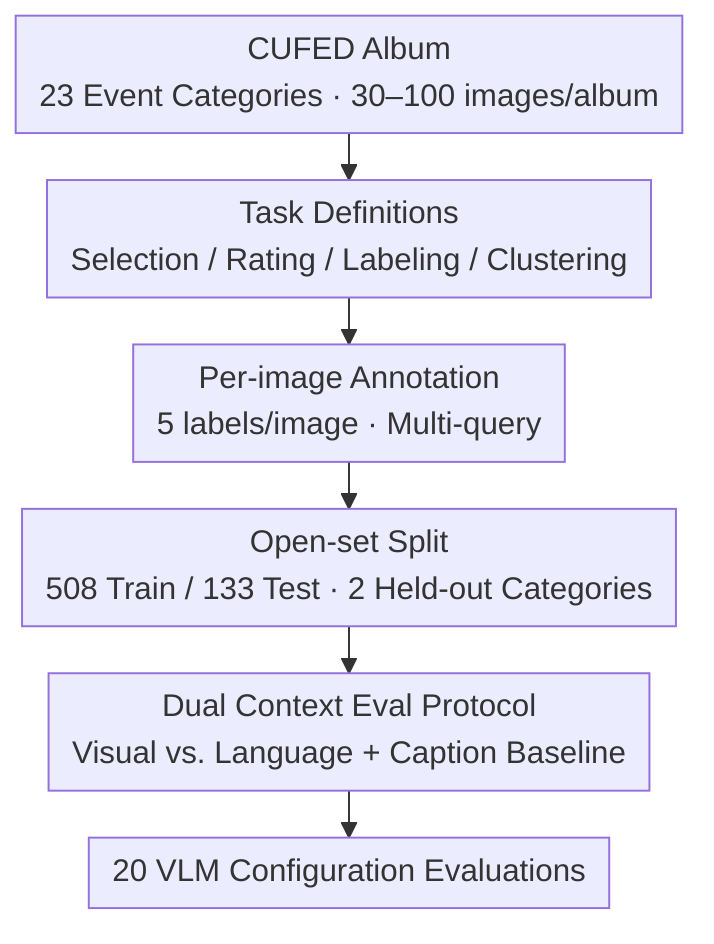

# Beyond Single Images: A Comprehensive Benchmark for Album-Level Vision-Language Understanding

**Conference**: CVPR 2026  
**Paper**: [CVF Open Access](https://openaccess.thecvf.com/content/CVPR2026/html/Huang_Beyond_Single_Images_A_Comprehensive_Benchmark_for_Album-Level_Vision-Language_Understanding_CVPR_2026_paper.html)  
**Code**: https://byu-vision.github.io/albumbench/ (Project Page)  
**Area**: Multimodal VLM  
**Keywords**: Album understanding, Multi-image VLM benchmark, User intent, Image grouping, Long context  

## TL;DR
This paper introduces AlbumBench, the first comprehensive benchmark for "album organization." It decomposes album operations into four tasks: intent selection, intent rating, group labeling, and group clustering. Evaluating 20 mainstream VLM configurations on 27,051 images across 641 albums reveals a significant gap between open-source and closed-source models. While "thinking" modes significantly improve grouping tasks at a high cost, VLMs perform marginally better than baselines that use only a single-sentence album description.

## Background & Motivation
**Background**: In 2024, approximately 1.9 trillion photos were taken (94% via mobile phones), naturally clustering into event-based albums such as "trips" or "weddings." While VLMs have advanced in multi-image understanding and appear to be natural candidates for automated album organization, existing VLM methods and datasets focus almost exclusively on single images, videos, or small image sets, with few benchmarks targeting the distribution of personal photo albums.

**Limitations of Prior Work**: Albums differ fundamentally from existing multi-image benchmarks. ① Albums contain both highly similar bursts and visually unrelated images with sparse temporal consistency—unlike videos where adjacent frames are nearly identical. ② Existing benchmarks (e.g., MuirBench avg. 4.3 images, MIBench, MileBench avg. 15.2 images) either involve too few images or focus on "needle-in-a-haystack" retrieval and closed-ended questions, failing to cover real-world scenarios like selecting photos based on user intent or clustering based on user criteria.

**Key Challenge**: The capabilities required for album organization—understanding **user intent** (selecting "romantic moments" vs. "guest interactions" for the same wedding yields different subsets) and **collective context** (the meaning of a flower bouquet differs between a graduation and a funeral)—are dimensions not systematically evaluated by current benchmarks. These require models to perform long-context reasoning over dozens or hundreds of non-temporally consistent images.

**Goal**: To formalize "album organization" into evaluable tasks, construct an annotated dataset, and systematically quantify the current performance and failure points of VLMs.

**Key Insight**: Tasks are designed based on actual actions performed by photographers and users—selection, rating, and semantic grouping—deliberately **stripping away aesthetic factors** (assuming aesthetics can be solved separately) to evaluate only the alignment with user intent and context.

**Core Idea**: The paper decomposes album operations into four quantifiable tasks along the dual axes of "Intent × Context," paired with a "Visual Context vs. Language Context" protocol to determine if VLMs effectively utilize visual information.

## Method
As a benchmark paper, the core contributions lie in the **task definitions, dataset construction, and evaluation protocols**.

### Overall Architecture
AlbumBench is constructed as a pipeline starting from public album data: using the CUFED dataset as raw material → defining four album tasks → labeling each image with 5 annotations → splitting into train/test sets with held-out open-set event types → applying "Visual Context / Language Context / Caption Baseline" feeding protocols to evaluate 20 VLM configurations. Input consists of an event album (30–100 images) and a user query; output includes photo subsets, ratings, or group labels.

### Key Designs

**1. Four Album Tasks: Quantifying Intent and Context Alignment**

**Intent Selection**: Given a query, select the best matching images; evaluated using F1, Precision, Recall, and mAP. **Intent Rating**: Assign a score of 0–3 (0=irrelevant, 3=perfect match) to each image; evaluated via Accuracy (exact match), MAE, and RMSE. **Group Labeling**: Categorize images into unique semantic groups given predefined labels; evaluated via ARI, NMI, mean Jaccard, and F1. **Group Clustering**: Similar to labeling but **without predefined labels**, requiring the model to determine grouping based on the collective context; uses the same metrics as labeling.

**2. Visual vs. Language Context Protocol + Caption Baseline**

To determine if models truly rely on vision, each task (except clustering) uses two modes. **Visual Context**: Provides all images in the album. **Language Context**: Provides a text description of the album and the target image. A **Caption Baseline** is added where models (e.g., Gemini-2.5-Pro) only see text captions and no images. This contrast measures the gain provided by additional visual information.

**3. Dataset and Open-set Split: 27,051 images / 641 albums**

Data is sourced from the CUFED dataset (derived from YFCC100M), covering 23 event types. Each album contains 30–100 images from a single time-bounded event. The set is split 80/20 into 508 training and 133 testing albums. Two event types ("Family Wedding" and "Beach Trip") are entirely removed from training to serve as open-set tests. ⚠️ The specific crowdsourcing details for the 5 annotations per image are provided in the supplementary material.

### Loss & Training
Ours is a pure evaluation benchmark. The primary engineering involves **unified prompting and post-processing**. Prompts were tuned for each VLM and converged into a single effective prompt. Models are required to output JSON; Gemini-2.5-Flash is used as a secondary stage post-processor (witnessing only text, not images) to fix parsing errors, bringing the failure rate near zero.

## Key Experimental Results

### Main Results
Evaluation results for 20 configurations under **Visual Context** (↑ is better; Clustering reports ARI; Rating reports Acc.):

| Model | Selection F1↑ | Rating Acc.↑ | Labeling ARI↑ | Clustering ARI↑ |
|------|---------|-----------|-----------|-----------|
| Qwen3-VL-235B (instruct) | 0.708 | 0.457 | 0.484 | 0.421 |
| Qwen3-VL-32B (thinking) | 0.677 | 0.547 | 0.646 | **0.558** |
| Qwen3-VL-235B (thinking) | 0.646 | 0.516 | 0.637 | 0.524 |
| GPT-5 (full thinking) | 0.653 | 0.566 | **0.661** | 0.529 |
| Gemini-2.5-Pro (thinking min) | 0.697 | 0.549 | 0.600 | 0.513 |
| Gemini-Caption-L (Text Baseline) | 0.703 | 0.580 | 0.585 | 0.498 |

Key Observations: ① **No single model dominates** across all tasks. ② Qwen3-VL-32B-Thinking leads in clustering. ③ **Thinking modes generally improve performance**, especially in grouping. ④ Strikingly, the text-only Gemini-Caption-L matches or exceeds the visual models in selection and rating.

Comparison of **Gemini backbone** across context protocols:

| Context Protocol | Selection F1↑ | Rating Acc.↑ | Labeling ARI↑ |
|-----------|---------|-----------|-----------|
| Visual Context (Full Album) | 0.697 | 0.549 | 0.600 |
| Language Context (Caption+Image) | 0.678 | 0.517 | 0.614 |
| Pure Caption Baseline | 0.703 | 0.580 | 0.585 |

Visual context provides only marginal gains in intent tasks and underperforms compared to language context in labeling, suggesting visual tokens are not effectively utilized.

### Ablation Study
Evaluation of instruction following failures in grouping tasks (Overlap% = multi-grouped; Missing% = unassigned):

| Configuration | Overlap%↓ | Missing%↓ | Notes |
|------|-----------|-----------|------|
| Qwen3-VL-8B (instruct) | 65.89% | 21.51% | High failure rate |
| Qwen3-VL-8B (thinking) | 2.31% | 3.85% | Significant drop after thinking |
| GPT-5 (thinking) | 0.00% | 0.78% | Nearly perfect |

### Key Findings
- **Thinking mode is critical for grouping**: Thinking models use a "decompose query + self-verify" process, which is essential for organizational tasks but computationally expensive.
- **VLMs underutilize visual data**: The performance parity with the caption baseline suggests that long-context visual tokens are often wasted or ignored.
- **Instruction following is a bottleneck**: Instruct models struggle with structure more than thinking models, especially when "overwhelmed" by high token counts in visual contexts.
- **Novel capability dimension**: Correlation with MMMU is moderate ($ρ \approx 0.6 \sim 0.8$ for visual tasks), indicating that album organization is a distinct skill set from standard multimodal reasoning.

## Highlights & Insights
- **Decoupling aesthetics from intent**: Focusing on objective intent alignment rather than subjective beauty makes the benchmark more robust.
- **The "Caption Mirror"**: Comparing against a text-only baseline reveals that current "multi-image" VLMs often rely on verbal reasoning rather than deep visual integration.
- **Open-set foresight**: Holding out specific event types provides a better test of generalization for real-world personal photos.

## Limitations & Future Work
- Understanding large albums remains expensive and slow due to the reliance on full thinking modes.
- Model efficiency in utilizing long-context visual tokens is low.
- There is a heavy dependency on prompt engineering and secondary LLM post-processing.
- **Future Work**: Exploring efficient album context compression and instruction tuning specifically for album organization.

## Related Work & Insights
- **Comparison with MuirBench/MIBench**: While previous benchmarks focus on closed-ended questions for a few images, AlbumBench targets open-ended selection and clustering for hundreds of images.
- **Comparison with MileBench**: MileBench explores long context but lacks the specific "autonomous organization" and "intent-driven selection" scenarios inherent to personal photo management.

## Rating
- Novelty: ⭐⭐⭐⭐⭐ 
- Experimental Thoroughness: ⭐⭐⭐⭐ 
- Writing Quality: ⭐⭐⭐⭐ 
- Value: ⭐⭐⭐⭐⭐ 

<!-- RELATED:START -->

## Related Papers

- [\[CVPR 2026\] MMLandmarks: a Cross-View Instance-Level Benchmark for Geo-Spatial Understanding](mmlandmarks_a_cross-view_instance-level_benchmark_for_geo-spatial_understanding.md)
- [\[CVPR 2026\] Beyond Layer-Wise Merging: Chain-of-Merging for Vision-Language Models](beyond_layer-wise_merging_chain-of-merging_for_vision-language_models.md)
- [\[CVPR 2026\] MCHDoc: A Comprehensive Benchmark for Reading Multi-Carrier Chinese Historical Documents](mchdoc_a_comprehensive_benchmark_for_reading_multi-carrier_chinese_historical_do.md)
- [\[CVPR 2026\] Is your VLM Sky-Ready? A Comprehensive Spatial Intelligence Benchmark for UAV Navigation](is_your_vlm_sky-ready_a_comprehensive_spatial_intelligence_benchmark_for_uav_nav.md)
- [\[ICLR 2026\] MME-Unify: A Comprehensive Benchmark for Unified Multimodal Understanding and Generation Models](../../ICLR2026/multimodal_vlm/mme-unify_a_comprehensive_benchmark_for_unified_multimodal_understanding_and_gen.md)

<!-- RELATED:END -->
