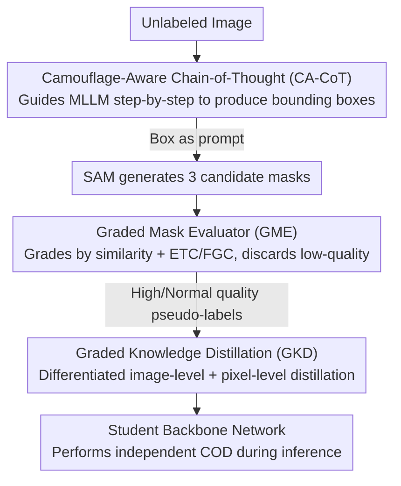

# Beyond Weak Supervision: MLLMs-Guided Graded Knowledge Distillation for Unsupervised Camouflaged Object Detection

**Conference**: CVPR 2026  
**Paper**: [CVF Open Access](https://openaccess.thecvf.com/content/CVPR2026/html/Chen_Beyond_Weak_Supervision_MLLMs-Guided_Graded_Knowledge_Distillation_for_Unsupervised_Camouflaged_CVPR_2026_paper.html)  
**Code**: None (Paper claims it will be released)  
**Area**: Multimodal VLM / Camouflaged Object Detection / Knowledge Distillation  
**Keywords**: Unsupervised Camouflaged Object Detection, MLLM, SAM, Chain-of-Thought, Graded Knowledge Distillation  

## TL;DR
Addressing the two major pain points of Unsupervised Camouflaged Object Detection (UCOD)—"weak supervision signals" and "poor utilization of pseudo-labels"—this paper employs a frozen teacher model composed of MLLM and SAM to generate high-quality pseudo-labels. Through a trio of designs—Camouflage-Aware Chain-of-Thought (CA-CoT), Graded Mask Evaluator (GME), and Graded Knowledge Distillation (GKD)—it ensures pseudo-label quality and distills knowledge based on quality differences to a student network. This approach significantly outperforms existing UCOD methods and demonstrates strong performance in zero-shot settings.

## Background & Motivation
**Background**: Camouflaged Object Detection (COD) aims to segment hidden objects that are highly integrated with their backgrounds. While fully supervised methods achieve impressive metrics, they rely on expensive pixel-level annotations. To reduce costs, weakly supervised (scribbles/points/boxes) and unsupervised (UCOD) approaches have emerged, with UCOD being the most attractive due to its complete independence from manual labeling.

**Limitations of Prior Work**: The authors categorize the shortcomings of existing UCOD methods into two issues. First, **weak supervision signals**—they fail to extract effective supervision from unlabeled data and rely heavily on self-supervised backbones like DINO, leading to poor flexibility and performance. Second, **poor utilization of pseudo-labels**—current distillation methods treat all samples and pixels equally. However, pseudo-label accuracy varies; treating them uniformly wastes good samples and is misled by bad ones, preventing the gap with fully supervised methods from closing.

**Key Challenge**: To move beyond DINO, foundation models (MLLM, SAM) can serve as teachers, but this introduces two new problems: MLLMs are not trained on camouflaged data and are prone to localization hallucinations and jitter; furthermore, serializing multiple foundation models leads to **cascading error** accumulation, producing extremely low-quality masks. Through experiments (Figure 2), the authors found that COD distillation follows the "quality over quantity" principle: performance begins to decline even with ~2% low-quality samples, and exceeds ~15% will cause the learning process to collapse. Thus, the teacher must not only generate labels but also **filter out poor labels**.

**Goal / Core Idea**: Construct a teacher-student framework, UCOD-MKD, using a pipeline of "MLLM provides boxes → SAM converts to masks → Graded filtering by quality → Differentiated distillation by quality." This transforms the zero-shot capabilities of foundation models into reliable unsupervised training signals. This is the first model in the COD field to support both zero-shot and unsupervised training simultaneously.

## Method

### Overall Architecture
UCOD-MKD adopts a teacher-student architecture. The **teacher model** consists of a fully frozen MLLM (Qwen2.5-VL-3B) and SAM (ViT-H), responsible for transforming unlabeled images into graded pseudo-labels. The **student model** is a trainable backbone (PVT V2) that learns to perform COD independently via distillation. At inference time, only the student network is required.

The data flow is a serial pipeline: the input image passes through CA-CoT to guide the MLLM in step-by-step reasoning to output a bounding box; the box serves as a prompt for SAM to generate 3 candidate masks; GME evaluates the quality of these masks, categorizing them into low/normal/high levels and discarding low-quality ones; finally, GKD uses the graded masks for differentiated image-level and pixel-level distillation into the student network.

### Key Designs

**1. Camouflage-Aware Chain-of-Thought (CA-CoT): Simulating human perception to mitigate MLLM hallucinations and jitter**

Since MLLMs are not specifically trained on camouflage data, direct localization leads to hallucinations and inaccurate boxes. CA-CoT decomposes the human perception process—"observe scene, infer species, coarse-to-fine localization"—into a five-step chain-of-thought, driving the MLLM via text prompts: STEP 1 analyzes the scene; STEP 2 infers possible camouflaged species; STEP 3 uses color/texture similarity for rough anchoring; STEP 4–5 focus on geometry like boundaries and shapes for precise bbox coordinates. Unlike CoVP in CVP, which only emphasizes the "camouflage" concept in prompts without true step-by-step reasoning, CA-CoT is a complete chain. A key advantage is its **near-zero additional cost**, as it uses pure text prompts without multiple image inference passes (unlike ProMaC). Ablations show that progressively adding STEP 1→4 reduces the MAE on CAMO from 0.205 down to 0.145.

**2. Graded Mask Evaluator (GME): Using "candidate mask similarity ≈ segmentation quality" for graded filtering**

Even with CA-CoT, some boxes are inaccurate, and cascading errors can cause SAM to output low-quality masks. GME observes that when a box is inaccurate, SAM is uncertain about excluding the background, causing high variance among the 3 candidates. Conversely, accurate boxes yield highly consistent candidates. Thus, **similarity between candidate masks is strongly correlated with segmentation quality**. Similarity is calculated using the average of IoU and SSIM: $\mathrm{SIM}(V^{k_1}_j,V^{k_2}_j)=\tfrac12\big(\mathrm{IoU}+\mathrm{SSIM}\big)$. The average similarity for three pairs is $S_j=\tfrac13\sum_{k_1<k_2}\mathrm{SIM}(V^{k_1}_j,V^{k_2}_j)$, with grading thresholds at 60% and 90%:

$$Q_j=\begin{cases}0,& S_j<0.6\ (\text{Low quality, discard})\\[2pt]1,& 0.6\le S_j<0.9\ (\text{Normal quality})\\[2pt]2,& S_j\ge0.9\ (\text{High quality, retain})\end{cases}$$

For the "Normal" grade, two types of failures are further filtered: "inverted response" (detecting background as foreground) is handled by **Edge Truncation Count (ETC)**; "fragmented response" is handled by **Fragmented Computation (FGC)**. Only masks passing both are retained. Ablations (Table 5) show that SIM, FGC, and ETC cumulatively reduce CAMO MAE from 0.145 to 0.081 with negligible overhead.

**3. Graded Knowledge Distillation (GKD): Differentiated instruction based on pseudo-label quality**

GKD applies differentiated distillation at two granularities. At the **image level**, samples are branched by $Q_j$: low-quality samples ($Q_j{=}0$) use self-distillation (SKD) via $L_1$ consistency $L_1(P_j,P_j')$ on augmentations; normal-quality ($Q_j{=}1$) use standard cross-entropy $L_{CE}(P_j,V_j)$; high-quality ($Q_j{=}2$) use a combination of CE, $L_1$, and MSE for stronger supervision:

$$L_{IeKD}=\begin{cases}L_1(P_j,P_j'),& Q_j=0\\[2pt]L_{CE}(P_j,V_j),& Q_j=1\\[2pt]L_{CE}(P_j,V_j)+L_1(P_j,V_j)+L_{MSE}(P_j,V_j),& Q_j=2\end{cases}$$

At the **pixel level**, because MLLM failures are mostly "over-localization," areas outside the box are highly reliable background. These are used as extra supervision $S$. Additionally, the uncertainty of candidates is calculated via entropy $E_i = -\bar V_i \log \bar V_i - (1 - \bar V_i) \log (1 - \bar V_i)$, and inverted to a weight map $M_i = 1 - E_i$ (higher stability yields higher weight). The final loss is:

$$L_{GKD}=\sum_i L_{IeKD}(P_i,V_i)\ast M_i+\sum_{i\in\tilde S}L_{IeKD}(P_i,S_i)$$

Where $\ast$ denotes element-wise multiplication and $\tilde S$ is the annotated region in $S$. Ablations show adding GKD atop GME further improves CAMO MAE from 0.081 to 0.071.

### Loss & Training
The teacher is frozen and does not participate in training; its inference is decoupled from student training. The student uses PVT V2, SGD (momentum 0.9, weight decay 5e-4), and triangular LR (peak 1e-3). Trained for 60 epochs with a batch size of 8 and 512×512 resize. Training takes ~7h on an RTX A6000; foundation model inference takes ~2h with ~11GB VRAM.

## Key Experimental Results

Datasets: CAMO, COD10K, NC4K. Metrics: MAE↓, S-measure (Sm↑), E-measure (Em↑), weighted F-measure ($F^w_\beta$↑).

### Main Results (Unsupervised Setting, NC4K / COD10K)

| Method | Supervision | Backbone | COD10K Em↑ | COD10K $F^w_\beta$↑ | NC4K Em↑ | NC4K $F^w_\beta$↑ |
|------|------|------|-----------|-----------|---------|---------|
| UCOS-DA (ICCVW'23) | U | DINO V1 | 0.751 | 0.482 | 0.824 | 0.637 |
| UCOD-DPL (CVPR'25) | U | DINO V1 | 0.822 | 0.577 | 0.851 | 0.680 |
| **UCOD-MKD (Ours)** | U | ResNet50 | 0.869 | 0.684 | 0.884 | 0.757 |
| **UCOD-MKD (Ours)** | U | PVT V2 | **0.908** | **0.740** | **0.918** | **0.803** |

Compared to the previous SOTA UCOD-DPL, this method improves on average by 42.6% (MAE), 14.0% (Sm), 9.2% (Em), and 22.5% ($F^w_\beta$), while **eliminating DINO dependency**. The PVT V2 version approximates or exceeds some weakly supervised methods (e.g., SAM-COD, PNet). It also achieves SOTA in zero-shot settings with fewer foundation models and only one inference pass, whereas ProMaC/GenSAM require 6/12 iterations.

### Ablation Study (Overall Components, CAMO / COD10K, MAE↓ / Em↑)

| Config | CAMO MAE↓ | CAMO Em↑ | COD10K MAE↓ | COD10K Em↑ |
|------|-----------|----------|-------------|------------|
| MLLM + SAM (Baseline) | 0.205 | 0.711 | 0.232 | 0.685 |
| + CA-CoT | 0.145 | 0.777 | 0.085 | 0.807 |
| + GME | 0.081 | 0.862 | 0.041 | 0.868 |
| + GKD (Full) | **0.071** | **0.875** | **0.031** | **0.908** |

### Key Findings
- **Quality over Quantity**: A small number of high-quality samples allows performance to surpass large batches of random samples; however, just ~2% low-quality samples begin to hinder performance, and >15% leads to collapse.
- **Significant Complementary Contributions**: CA-CoT reduces CAMO MAE by ~30%, GME further reduces it significantly, and GKD refines the final performance.
- **Efficiency**: The complete model has 60.3M parameters and 34.8 FPS, making it lighter and faster than the weakly supervised SAM-COD.

## Highlights & Insights
- **Consistency as a Proxy**: In unsupervised scenarios where ground truth is absent, using IoU+SSIM similarity between multiple SAM candidates serves as a zero-cost quality probe.
- **Operationalizing "Quality over Quantity"**: The paper transitions from an experimental observation to a concrete filtering rule (GME thresholds + ETC/FGC), creating a tight link between motivation and mechanism.
- **Dual-Granularity Distillation**: Utilizing out-of-box areas as reliable negative labels due to the "over-localization" characteristic and using entropy for pixel weighting provides a robust framework for handling pseudo-label noise.
- **Hybrid Capability**: Supports both zero-shot and unsupervised training, and is deployment-friendly by requiring only the lightweight student model for inference.

## Limitations & Future Work
- Teacher quality is capped by foundation models: if the MLLM fails to provide reasonable STEP 1–2 reasoning for extreme cases, CA-CoT cannot recover, and GME will simply discard the sample.
- GME thresholds (60%/90%) and ETC/FGC criteria are heuristic empirical values; their sensitivity across different datasets requires further exploration.
- The "over-localization" assumption may fail in complex scenes with multiple objects or objects touching image boundaries.

## Related Work & Insights
- **vs. UCOD-DPL (CVPR'25)**: DPL relies on DINO backbones and adversarial refinements; this work uses MLLM+SAM for stronger supervision and focuses on "graded filtering + differentiated distillation," leading to significant gains.
- **vs. ProMaC (Zero-shot)**: ProMaC requires 6 iterations and multi-image inputs; CA-CoT achieves superior results with a single-pass text-driven chain-of-thought.
- **vs. SAM-COD (ECCV'24, Weakly Supervised)**: SAM-COD focuses on prompt-adaptive distillation for single samples; this work identifies and acts upon the relative quality across samples through **cross-sample grading + selective distillation**.

## Rating
- Novelty: ⭐⭐⭐⭐⭐ First COD model to support both zero-shot and unsupervised training with clear mechanisms for CA-CoT, GME, and GKD.
- Experimental Thoroughness: ⭐⭐⭐⭐⭐ Comprehensive testing across three datasets and four metrics, including detailed ablation of each component and its impact on speed/hallucinations.
- Writing Quality: ⭐⭐⭐⭐ Clear logical chain from problem identification to mechanism design.
- Value: ⭐⭐⭐⭐⭐ The paradigm of converting foundation model zero-shot capabilities into reliable unsupervised supervision is highly transferable to other tasks.

<!-- RELATED:START -->

## Related Papers

- [\[CVPR 2026\] Boosting Vision-Language Models Towards Cross-Domain Incremental Object Detection](boosting_vision-language_models_towards_cross-domain_incremental_object_detectio.md)
- [\[CVPR 2026\] ADSeeker: A Knowledge-Grounded Reasoning Framework for Industry Anomaly Detection and Reasoning](adseeker_a_knowledge-grounded_reasoning_framework_for_industry_anomaly_detection.md)
- [\[CVPR 2026\] Uncertainty-Aware Knowledge Distillation for Multimodal Large Language Models](uncertainty-aware_knowledge_distillation_for_multimodal_large_language_models.md)
- [\[CVPR 2026\] Beyond Missing Modalities: Hypergraph Guided Diffusion for Uncertainty-Aware Multimodal Emotion Recognition](beyond_missing_modalities_hypergraph_conditioned_diffusion_for_uncertainty-aware.md)
- [\[CVPR 2026\] VLM4RSDet: Collaborative Optimization with Vision-Language Model for Enhancing Remote Sensing Object Detection](vlm4rsdet_collaborative_optimization_with_vision-language_model_for_enhancing_re.md)

<!-- RELATED:END -->
