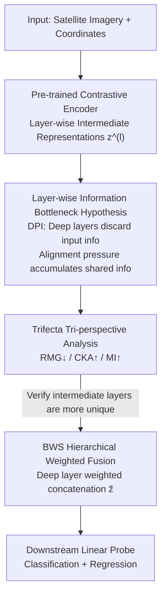

# Beyond What's Shared: Recovering Lost Unique Information from Intermediate Layers to Boost Multimodal Geo-Foundation Models

**Conference**: CVPR 2026  
**Paper**: [CVF Open Access](https://openaccess.thecvf.com/content/CVPR2026/html/Lee_Beyond_Whats_Shared_Recovering_Lost_Unique_Information_from_Intermediate_Layers_CVPR_2026_paper.html)  
**Code**: None  
**Area**: Multimodal VLM / Geo-Foundation Models / Contrastive Learning  
**Keywords**: Geo-foundation models, Contrastive learning, Information bottleneck, Hierarchical fusion, Modality-specific information  

## TL;DR
The authors observe that the intermediate layers of multimodal contrastive models (e.g., SatCLIP) retain modality-specific (unique) information that is discarded by the final alignment layers. Consequently, they propose BWS (Beyond What's Shared), which performs deep weighted concatenation of intermediate and final layer representations. Without any additional training objectives or external models, this single step leads to consistent performance gains across seven geospatial downstream tasks.

## Background & Motivation
**Background**: Geo-foundation models (GeoCLIP, SatCLIP, CSP) utilize contrastive learning (CL) to align satellite imagery and latitude/longitude coordinate pairs into a shared embedding space, subsequently using final layer representations for downstream tasks such as population estimation, temperature regression, and biome classification. This paradigm implicitly assumes that "cross-modal shared information is sufficient to cover all downstream tasks."

**Limitations of Prior Work**: This default assumption is known as the **multi-view redundancy hypothesis**, which posits that information shared between two modalities is both necessary and sufficient. However, geographic tasks vary significantly: some rely on spatial context identifiable only from coordinates, while others depend on surface features visible only in imagery. This **modality-specific (unique) information** is not present in the shared region. If downstream task-relevant information is not fully shared, contrastive models remain suboptimal.

**Key Challenge**: The InfoNCE loss acts only on the **final layers** of the two encoders. While it maximizes cross-modal similarity, it exerts no constraints on retaining modality-specific features; thus, unique information is silently suppressed during the alignment process. Existing remedies (adding mutual information regularization, explicitly decomposing shared/unique components, or using external models like SatMAE for retrieval-augmentation, e.g., RANGE) can preserve some unique information but require **additional training objectives, MI estimation, or external components**, making training more expensive and harder to tune.

**Key Insight**: The authors combine the classic understanding that "neural network hierarchical representations evolve from general to task-specific" with **Information Bottleneck (IB) theory**. The intuition is that since contrastive loss is applied only to the final layer, deeper layers become increasingly specialized for the alignment goal (more shared), while earlier layers, less constrained by this goal, retain more unique structures from the input. If this layerwise hierarchy exists, unique information is **already hidden within the model** and does not require additional training to "re-learn"—it simply needs to be extracted from intermediate layers.

**Core Idea**: Use "fused intermediate (more unique) and final (more shared) representations" instead of "final layer only" to obtain both shared and specific information with zero additional objectives.

## Method

### Overall Architecture
The BWS (Beyond What's Shared) narrative follows a two-step process: **verify, then utilize**. The first step formalizes multimodal contrastive training as a "shared information bottleneck," theoretically demonstrating that "deeper layers contain less input-specific information and more cross-modal shared information." This trend is quantified using three complementary perspectives (geometric, correlational, and information-theoretic) on real models. The second step is the method itself: since intermediate layers are rich in unique information and final layers are rich in shared information, representations from selected layers are combined via **deep weighted concatenation** to form an "information-rich geo-embedding" fed directly into a downstream linear probe.

The entire pipeline does not modify the pre-trained encoder, add training objectives, or introduce external models—it simply changes the **method of reading internal representations** of the trained encoder.

### Key Designs

**1. Layerwise Information Bottleneck Hypothesis: Formalizing where unique information is hidden**

The limitation was that previously, it was only empirically stated that "intermediate features are more general" without explaining why unique information disappears with depth in contrastive models. The authors derive this using IB theory. Standard IB frames representation learning as a trade-off between compression and prediction: $L_{IB} = I(X;Z) - \beta I(Z;Y)$. In a multimodal contrastive setting where modalities supervise each other, the objective becomes:

$$\min_{f_I,f_c}\ \big[I(I;z_I) + I(c;z_c)\big] - \beta\, I(z_I;z_c),$$

where the first two terms represent compression of each input modality, and the third term is the cross-modal alignment optimized by InfoNCE. Crucially, this trade-off is approximated layer-by-layer by deep encoders. Modeling each encoder as a Markov chain $I \to z_I^{(1)} \to \cdots \to z_I^{(L)}$, the **Data Processing Inequality (DPI)** dictates that input information decreases monotonically with depth: $I(I;z_I^{(1)}) \ge I(I;z_I^{(2)}) \ge \cdots \ge I(I;z_I^{(L)})$. Simultaneously, the final layer is pushed by InfoNCE to maximize $I(z_I^{(L)};z_c^{(L)})$. The superposition of these forces creates a hierarchy: **deep layers lose input-specific information and gain cross-modal shared information**. This transforms "extracting intermediate layers" from a trick into a theoretically grounded strategy.

**2. Trifecta Tri-perspective Analysis: Measuring the evolution of shared/unique info**

Theoretical assumptions are verified on SatCLIP using three complementary metrics to quantify alignment layer-by-layer, using one modality's final layer as a reference:

- **Geometric View: Relative Modality Gap (RMG)**: Measures geometric separation in embedding space, normalizing cross-modal distance by intra-modality distances: $RMG^{(l)} = \frac{\frac{1}{N}\sum_i d(z_I^{(L)},z_c^{(l)})}{\text{(intra-modality avg distance)} + \frac{1}{N}\sum_i d(z_I^{(L)},z_c^{(l)})}$. Higher RMG indicates weaker alignment.
- **Correlation View: CKA**: Uses Centered Kernel Alignment to measure structural similarity between representations; higher values indicate higher similarity.
- **Information View: Mutual Information (MI)**: Uses the KSG estimator to quantify how much information one modality contains about the other.

All three metrics yield a consistent conclusion: as depth increases, **RMG decreases, while CKA and MI increase**. This confirms that deeper layers are more aligned/shared, while intermediate layers retain more unique information. UMAP visualizations further support this: early layers show a large modality gap (weak alignment/high unique info), while final layers are tightly aligned.

**3. BWS Hierarchical Weighted Fusion: Capturing shared and unique info with zero overhead**

BWS concatenates layers using a **depth-dependent weight**. Given a subset of layers $S \subseteq \{1,\dots,L\}$:

$$\omega_l = \frac{e^{\alpha l}}{\sum_{k\in S} e^{\alpha k}},$$

The fused embedding is $\tilde{z} = \big[\omega_l\, z^{(l)}\big]_{l\in S}$. The hyperparameter $\alpha$ controls the bias: $\alpha>0$ favors deeper alignment-specialized layers (more shared), $\alpha<0$ favors earlier modality-specific structures (more unique), and $\alpha=0$ represents equal weighting. BWS **introduces no new parameters and no additional forward passes** (FLOPs remain identical); it simply reuses existing activations. It is model-agnostic and can be applied to CSP, GeoCLIP, or SatCLIP.

### Loss & Training
BWS **introduces no training objectives**. It reuses the base model's InfoNCE loss $L_{CL}$ (acting on the final layer). For SatCLIP, the image encoder is a MoCo-pretrained ResNet50 on Sentinel-2, and the coordinate encoder is a SIREN-MLP with spherical harmonic encoding. Downstream evaluation is performed strictly via **linear probing** to assess representation quality, reporting top-1 accuracy for classification and $R^2$ for regression.

## Key Experimental Results

### Main Results
Pre-trained on S2-100k (100,000 global Sentinel-2 images + coordinates), across 7 tasks: 3 classification (biome, ecoregions, country) and 4 regression (temperature, elevation, population, housing). BWS as a plug-and-play module (Table 1, $\alpha=0$):

| Model | Biome↑ | Ecoregions↑ | Country↑ | Temperature↑ | Elevation↑ | Population↑ | Housing↑ |
|------|--------|-------------|----------|--------------|------------|-------------|----------|
| CSP | 0.794 | 0.751 | 0.797 | 0.814 | 0.390 | 0.558 | 0.553 |
| **CSP + BWS** | **0.881** | **0.834** | **0.898** | **0.918** | **0.659** | **0.720** | **0.639** |
| GeoCLIP | 0.809 | 0.739 | 0.813 | 0.920 | 0.608 | 0.691 | 0.704 |
| **GeoCLIP + BWS** | **0.910** | **0.870** | **0.931** | **0.950** | **0.809** | **0.790** | **0.723** |
| SatCLIP | 0.848 | 0.779 | 0.826 | 0.818 | 0.668 | 0.685 | 0.400 |
| **SatCLIP + BWS** | **0.911** | **0.865** | **0.916** | **0.860** | **0.788** | **0.766** | **0.421** |
| RANGE | 0.931 | 0.894 | 0.938 | 0.894 | 0.842 | 0.791 | 0.449 |
| **RANGE + BWS** | **0.945** | **0.920** | **0.959** | **0.897** | **0.869** | **0.813** | **0.457** |

Notably, elevation $R^2$ jumps significantly (e.g., CSP 0.390 to 0.659), proving that unique information visible in images but hard to represent in shared coordinates is recovered. RANGE+BWS shows BWS is complementary to retrieval-augmented methods.

### Ablation Study

| Configuration | Key Metric (Avg. of 7 tasks) | Description |
|------|----------------------|------|
| SatCLIP + GeoCLIP (Concat) | 0.748 | Dimension-aligned strong baseline |
| SatCLIP + Random Projection | 0.750 | Rule out "larger dimension" effect |
| **SatCLIP + BWS** | **0.788** | Gain from hierarchical unique info |
| Multimodal Img (MoCo-R50)+BWS | 0.523 → **0.700** | Massive gain in multimodal setting |
| Unimodal Img (MoCo-R50)+BWS | 0.247 → 0.301 | Significantly smaller gain in unimodal |

$\alpha$ and Layer Selection (Table 3/4):
- **$\alpha=0.0$ (Equal weight)**: **Best performance**, as information is distributed across layers.
- **Middle Layers only**: Best single-layer performance (unique + some shared).
- **Late Layers only**: Worst performance (shared only, unique lost).

### Key Findings
- **Dimension is not the source of improvement**: Concat with other models or random projections yields ~0.75; BWS yields 0.788.
- **Multimodal is the main stage for BWS**: The gain in multimodal settings (+0.18) is far greater than in unimodal (+0.05).
- **Intermediate layers are strongest individually**: middle > early > late.
- **Deeper is better**: Increasing encoder depth from 3 to 20 layers consistently improves BWS performance.

## Highlights & Insights
- **Modality-specific info for free**: Unlike methods needing MI regularization or external libraries, BWS simply changes how internal activations are read—zero new parameters, zero extra FLOPs.
- **Theory + Empirical Loop**: Combined IB/DPI theory with three independent metrics (Geometry/Correlation/Information) for a robust argument.
- **Strong Portability**: The insight is applicable to any CLIP-style dual-tower model where downstream tasks might rely on non-shared info.

## Limitations & Future Work
- **Limitations**: Analysis is limited to visual-coordinate modalities; the evolution of info in 3+ modalities remains an open question.
- **Observations**: 1) Validated only via linear probing; fine-tuning performance remains untested. 2) Concat increases embedding dimension, which may affect storage/retrieval costs.
- **Future Directions**: Replacing equal weight concatenation with a task-adaptive selection mechanism or lightweight inter-layer attention.

## Related Work & Insights
- **vs RANGE**: RANGE uses external SatMAE for retrieval-augmentation of the **image side**; BWS uses internal layers for both image and coordinate sides. They are complementary.
- **vs MI Regularization**: Those methods are complex and sensitive to estimators/augmentations during training; BWS achieves similar goals at inference with zero training.
- **vs Standard CLIP**: Standard CLIP uses only the final layer; this paper demonstrates that doing so discards task-relevant intermediate info.

## Rating
- Novelty: ⭐⭐⭐⭐ Simple method, but the combination of IB explanation and tri-perspective validation is novel.
- Experimental Thoroughness: ⭐⭐⭐⭐ Comprehensive across 4 bases and 7 tasks; lacks fine-tuning.
- Writing Quality: ⭐⭐⭐⭐ Clear theoretical-empirical-methodological loop.
- Value: ⭐⭐⭐⭐ High practical value for geo-foundation and CLIP-style models.

<!-- RELATED:START -->

## Related Papers

- [\[CVPR 2026\] Aligning What Vision-Language Models See and Perceive with Adaptive Information Flow](aif_adaptive_information_flow_vlm.md)
- [\[ICLR 2026\] BioCAP: Exploiting Synthetic Captions Beyond Labels in Biological Foundation Models](../../ICLR2026/multimodal_vlm/biocap_exploiting_synthetic_captions_beyond_labels_in_biological_foundation_mode.md)
- [\[CVPR 2026\] Scaling Spatial Intelligence with Multimodal Foundation Models](scaling_spatial_intelligence_with_multimodal_foundation_models.md)
- [\[CVPR 2026\] Beyond Layer-Wise Merging: Chain-of-Merging for Vision-Language Models](beyond_layer-wise_merging_chain-of-merging_for_vision-language_models.md)
- [\[CVPR 2026\] SeD-UD: An Influence-Driven and Hierarchically-Decoupled Information Bottleneck for Multimodal Intent Recognition](sed-ud_an_influence-driven_and_hierarchically-decoupled_information_bottleneck_f.md)

<!-- RELATED:END -->
