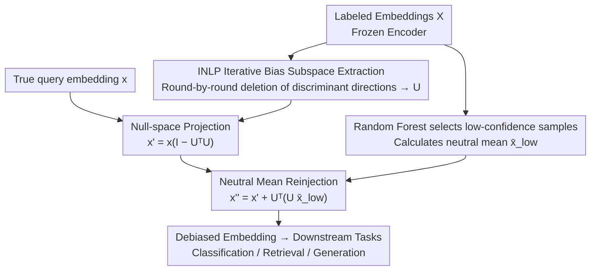

# Bias Is a Subspace, Not a Coordinate: A Geometric Rethinking of Post-hoc Debiasing in Vision-Language Models

**Conference**: CVPR 2026  
**Paper**: [CVF Open Access](https://openaccess.thecvf.com/content/CVPR2026/html/Zhao_Bias_Is_a_Subspace_Not_a_Coordinate_A_Geometric_Rethinking_CVPR_2026_paper.html)  
**Code**: https://github.com/zhendashen896/SPD  
**Area**: Multimodal VLM  
**Keywords**: Post-hoc debiasing, Subspace projection, INLP, Vision-Language Models, Fairness  

## TL;DR
Authors find that demographic bias in VLM embeddings is not concentrated on a few coordinate dimensions but rather distributed across several linear subspaces. They propose SPD: iteratively learning the entire "bias subspace" that can linearly predict sensitive attributes using INLP, projecting embeddings onto its orthogonal complement (null space) to eliminate decodable attribute signals, and then reinjecting a neutral mean to preserve semantics. Across zero-shot classification, text-to-image retrieval, and image generation, four fairness metrics improved by an average of 18.5% with negligible accuracy loss.

## Background & Motivation

**Background**: VLMs (e.g., CLIP, XVLM) have become multimodal foundations but inherit and amplify social biases (gender, race, age) from web data—e.g., "doctor" defaults to male, or retrieval results are racially skewed. Debiasing follows two paths: training-based (fine-tuning to suppress sensitive attributes, but computationally expensive and sensitive to hyperparameters) and post-hoc (modifying frozen embeddings, saving training costs). Post-hoc is currently the more practical direction.

**Limitations of Prior Work**: The most representative current post-hoc method, SFID (Jung et al.), follows a "coordinate-level" approach—using Random Forests to score each embedding dimension by its importance for attribute prediction, selecting the top-$m$ most relevant dimensions $S$, and replacing these dimensions with a neutral mean calculated from "low-confidence samples" during inference. While training-free and model-agnostic, it relies on three strong implicit assumptions.

**Key Challenge**: The authors performed a systematic reproduction (Section 3) and disproved SFID’s three assumptions—**(A1) Different attributes are encoded on disjoint dimensions**: Training three Random Forests for age/gender/race on FairFace and selecting the top-100 dimensions for each showed overlap as high as 20–37 dimensions (feature entanglement); changing gender dimensions inadvertently damages race/age representations. **(A2) The same attribute falls on the same dimensions across different datasets**: The overlap of the top-50 "gender" dimensions between FairFace and FACET is only 24 (random expectation ~4.9; though higher than random, it is far less than half); dimensions shift across datasets. **(A3) Bias is concentrated in the top-$m$ dimensions**: After replacing the top-100 dimensions (19.5% of 512 dimensions), linear probe accuracy for attributes dropped less than 1% and remained far above the random baseline, indicating that attribute signals are redundantly spread across far more than $m$ dimensions. All three assumptions fail because **SFID treats bias as a discrete "coordinate-sparse + dataset-invariant" phenomenon, whereas bias is actually a continuous "subspace-structured + entangled + distribution-dependent" phenomenon**.

**Core Idea**: Instead of discretely editing individual coordinates, model bias as several **linear directions** in the embedding space and project the entire representation onto the **orthogonal complement (null space)** of the subspace spanned by these directions. This erases all linearly decodable attribute components. Then, reinject a neutral mean along the deleted directions to stabilize semantics. In short—**replace "replacing coordinates" with "deleting the entire subspace" for debiasing**.

## Method

### Overall Architecture
SPD (Subspace Projection Debiasing) is a three-stage, training-free post-hoc workflow applicable to any frozen encoder/decoder. Given a frozen embedding matrix $X\in\mathbb{R}^{N\times D}$ and sensitive attribute labels $y\in\{1,\dots,C\}$: **① Bias Subspace Identification**—Iteratively train linear classifiers using INLP to extract directions that "best linearly predict attributes" and stack them into a bias subspace $U$; **② Null-space Projection**—During inference, project the query embedding onto the orthogonal complement of $U$ to remove components along bias directions; **③ Neutral Reinjection**—Reinject a neutral mean $\bar{x}_{\text{low}}$, calculated from low-confidence samples, along the deleted subspace to pull the embedding back to the manifold and prevent over-correction. The first two steps determine "cleanness of removal," the third determines "semantic preservation," and the projection depth $r$ (number of deleted directions kept) serves as an adjustable fairness-utility knob.

### Key Designs

**1. INLP Iterative Bias Subspace Extraction: Scooping out bias "spread across multiple directions"**

Addressing A3 (bias is not concentrated in top-$m$ coordinates but redundantly distributed), SPD stops using Random Forests to pick coordinates and instead uses Iterative Null-space Projection (INLP) to strip away "directions that linearly predict attributes" layer by layer. In round $t$, a linear classifier $f^{(t)}(x)=W^{(t)}x+b^{(t)}$ is trained on current embeddings $X^{(t)}$ to predict attribute $y$. For $C$ attribute classes, the weight matrix $W^{(t)}\in\mathbb{R}^{C\times D}$ spans the discriminant subspace for this round. QR decomposition is performed on $W^{(t)\top}$ to obtain an orthogonal basis:

$$W^{(t)\top}=Q^{(t)}R^{(t)},\qquad U^{(t)}=Q^{(t)\top}_{1:C},$$

Then, the null-space projection $P^{(t)}=I-(U^{(t)})^\top U^{(t)}$ updates the embeddings $X^{(t+1)}=X^{(t)}P^{(t)}$, removing the most informative directions from this round. This iterates $T$ times (or until linear probe accuracy drops to the random baseline $1/C$). Concatenating the orthogonal bases from each round yields the final bias subspace:

$$U=\big[U^{(1)};U^{(2)};\dots;U^{(T)}\big]\in\mathbb{R}^{d_b\times D}.$$

Why it works: A single step ($T{=}1$) only identifies one discriminant direction, whereas real embeddings encode sensitive information across **multiple correlated directions**. Multi-step INLP identifies these directions one by one for more thorough removal—directly addressing the "redundant distribution" revealed in A3. Each axis remains an explicit, human-inspectable direction, making the operation interpretable.

**2. Null-space Projection + Neutral Mean Reinjection: Clean removal without harming semantics**

Projection alone has side effects: attribute directions and semantic directions are often partially entangled, and forced deletion might remove task-relevant components. SPD pairs "deletion" with "replenishment." Projection maps the embedding onto the orthogonal complement of $U$:

$$x' = x\,(I - U^\top U),$$

erasing the component of $x$ in $\text{span}(U)$ and lowering the linear decodability of attributes. The reinjection step adds back a neutral baseline along the deleted subspace—following SFID, Random Forests estimate attribute prediction confidence for each sample, and the mean $\bar{x}_{\text{low}}$ of the lowest $\tau\%$ confidence samples is calculated. The final representation is:

$$x'' = x' + U^\top\!\big(U\,\bar{x}_{\text{low}}\big).$$

The ingenuity lies in the reinjection term being **identical for all samples**, so $Ux''=U\bar{x}_{\text{low}}$ is constant across the dataset. Thus, reinjection **uniformly re-centers** the embeddings along the deleted directions to mitigate manifold drift, **without** re-introducing "discriminatory variance" in those directions. This upgrades SFID's discrete coordinate replacement into a continuous, differentiable, and geometrically consistent transformation that preserves semantics without compromising fairness. Ablations show that removing reinjection leaves $\Delta DP$ nearly unchanged but slightly decreases accuracy, proving its role in stabilizing semantics.

**3. Projection Depth $r$ as a Fairness-Utility Knob: Letting users decide "how aggressive to be"**

Since attributes and semantics are partially entangled, deeper deletion leads to greater semantic loss. The authors explicitly turn the "number of deleted directions preserved," $r$, into a controllable knob rather than running until convergence. Experiments (Table 3) quantify this trade-off: at $r{=}1$, target attribute accuracy barely drops (indicating bias isn't in a single direction); at $r{=}5$, target attribute probe accuracy drops significantly while non-target attributes mostly change $<1\%$ (the "sweet spot" of clean removal with minimal side effects); at $r{=}10$, target accuracy continues to drop, but non-target attributes clearly follow, indicating that later directions are more entangled with semantics. Consequently, $r{=}5$ is used for all downstream tasks. This knob provides SPD with a level of continuous control between "thorough debiasing" and "semantic fidelity" that coordinate-level methods cannot offer.

### Loss & Training
SPD is entirely training-free: no gradient training, no learnable parameters to fine-tune. It only uses lightweight linear probes (INLP's round-wise classifiers) + Random Forests (for neutral mean estimation). The core consists of closed-form QR decomposition and projection. Downstream settings use $r{=}5$ and a reinjection threshold $\tau{=}0.7$ globally.

## Key Experimental Results

### Main Results
Covering three types of downstream tasks and three backbones (CLIP-ResNet50 / CLIP-ViT-B/32 / XVLM). Fairness metrics are lower-is-better ( $\Delta DP$ for classification, Skew@100 for retrieval). Gain % is calculated relative to the same backbone baseline. The table below excerpts representative results for CLIP-ViT-B/32 and XVLM.

| Task / Backbone | Method | Utility (Acc / R@1) | Fairness Metric | Gain vs. Baseline |
|------|------|------|------|------|
| Zero-shot Class. ViT-B/32 | Baseline | 52.17 | $\Delta DP$ 11.60 | — |
| Zero-shot Class. ViT-B/32 | SFID | 52.14 | $\Delta DP$ 10.15 | 12.5% |
| Zero-shot Class. ViT-B/32 | **SPD** | 51.29 | $\Delta DP$ **9.94** | **14.3%** |
| Text-to-Image Retr. ViT-B/32 | Baseline | R@1 58.91 | Skew 0.1721 | — |
| Text-to-Image Retr. ViT-B/32 | SFID | R@1 58.53 | Skew 0.0744 | 56.8% |
| Text-to-Image Retr. ViT-B/32 | **SPD** | R@1 **59.68** | Skew **0.0699** | **59.4%** |
| Text-to-Image Retr. XVLM | SFID | R@1 78.00 | Skew 0.2032 | 13.7% |
| Text-to-Image Retr. XVLM | **SPD** | R@1 **79.13** | Skew **0.1859** | **21.1%** |

Notably, in ViT-B/32 retrieval, SPD **improves fairness and R@1 simultaneously** (Skew drops, R@1 exceeds baseline), whereas SFID’s R@1 decreases—demonstrating that subspace projection is more utility-friendly. For image generation (Table 5), the Misgendered Response Compound (MRC) for gendered prompts in SDXL dropped from 4.42 (baseline) to 1.67 (SPD), and Skew for neutral prompts dropped from 83.25 to 78.66, without breaking the generation process like DeAR (where MRC spiked to 99.81).

### Ablation Study
| Configuration | Backbone | Accuracy | $\Delta DP$ | Description |
|------|------|------|------|------|
| SPD proj only (Eq. 6) | CLIP-RN50 | 50.16 | 9.61 | Without neutral reinjection |
| SPD w/ reinject (Eq. 7) | CLIP-RN50 | **51.44** | 9.55 | $\Delta DP$ stable, Accuracy +1.3 |
| SPD proj only | XVLM | 53.72 | 9.87 | — |
| SPD w/ reinject | XVLM | **54.32** | 9.85 | Reinjection stabilizes semantics |

Diagnosis of attribute decodability (Table 3, linear probe accuracy, closer to random baseline is better): Race probe on raw embeddings 0.7144; SFID (100 dims removed) still 0.7086 (barely dropped); SPD $r{=}5$ dropped to 0.2745, $r{=}10$ to 0.1913 (random baseline 14.3%)—graphically proving that coordinate removal leaves significant decodable bias, while subspace projection truly erases it.

### Key Findings
- **Bias is not in a single direction**: At $r{=}1$, target attribute accuracy barely changes; multiple directions must be removed to be effective, verifying the "bias is a subspace" thesis.
- **$r{=}5$ is the sweet spot**: Deeper deletion ($r{=}10$) starts damaging non-target attributes and semantics, reflecting the fairness-utility trade-off. Accuracy is stable and $\Delta DP$ is low at $\tau=0.7$.
- **Neutral reinjection primarily preserves accuracy**: Removing it doesn't change $\Delta DP$ but drops accuracy, showing its role is stabilizing semantics rather than debiasing.

## Highlights & Insights
- **"Bias is a subspace, not a coordinate" is a profound reframing**: Use of three clean diagnostic experiments (dimension overlap, cross-dataset drift, linear probe residue) to disprove the previous SOTA's assumptions before building the method creates a very complete logical chain.
- **The constant nature of the reinjection term is an elegant design**: Since $Ux''=U\bar{x}_{\text{low}}$ is constant, "semantic replenishment" and "no re-introduction of bias" can coexist—an observation that avoids the trap where adding back a mean typically re-introduces attribute variance.
- **$r$ as a continuous knob** can be migrated to any scenario requiring a trade-off between debiasing thoroughness and utility, offering much more flexibility than discrete top-$m$ selection.

## Limitations & Future Work
- **Only prevents linearly decodable bias**: INLP + orthogonal projection erases attribute signals in linear directions; it is powerless against non-linearly entangled bias. If attributes are encoded non-linearly, linear probes won't detect or delete them.
- **Indirect proof of cross-dataset robustness**: SPD uses "downstream cross-dataset performance" to respond to A2 (dimension drift) rather than directly proving the learned subspace is distribution-stable; authors only claim "partially mitigating A2."
- **Dependency on attribute labels**: Extracting the subspace requires sensitive attribute labels to train linear classifiers; handling unlabeled data or continuous/intersecting attributes is not explored.
- Future directions: Replace INLP with kernelized/non-linear subspace identification or explore unsupervised discovery of bias directions.

## Related Work & Insights
- **vs. SFID (Jung et al.)**: SFID replaces top-$m$ coordinates with a neutral mean; SPD deletes the entire INLP subspace and reinjects. The difference lies in upgrading "discrete coordinate editing" to "continuous subspace projection," directly addressing SFID's issues with entanglement, drift, and incomplete debiasing (fairness improved by 18.5%).
- **vs. Chuang et al. / BEND-VLM (Gerych et al.)**: The former uses contrastive prompts to find text-space bias directions and is sensitive to prompt choice; BEND-VLM orthogonalizes by attribute subspace at test time but requires per-query optimization, hindering scalability. SPD’s subspace is learned offline once, and inference is a closed-form projection.
- **vs. DeAR (Adversarial Residual) / Prompt-Debias**: Training-based or prompt-based methods can break the generation process (DeAR MRC spiked to 99.81). SPD, as a pure geometric post-hoc method, is more stable for generation quality.

## Rating
- Novelty: ⭐⭐⭐⭐⭐ Geometric reframing + migrating INLP to VLM post-hoc debiasing is clear and persuasive.
- Experimental Thoroughness: ⭐⭐⭐⭐ Three tasks, three backbones; diagnostics, main results, and ablations are complete, though cross-dataset stability is only indirectly proven.
- Writing Quality: ⭐⭐⭐⭐⭐ Refutation before proposition; diagnostic experiments and derivations are tightly linked.
- Value: ⭐⭐⭐⭐ Training-free, model-agnostic, controllable knob; very practical for real-world VLM deployment.

<!-- RELATED:START -->

## Related Papers

- [\[ICLR 2026\] Post-hoc Probabilistic Vision-Language Models](../../ICLR2026/multimodal_vlm/post-hoc_probabilistic_vision-language_models.md)
- [\[CVPR 2026\] DSCA: Dynamic Subspace Concept Alignment for Lifelong VLM Editing](dsca_dynamic_subspace_concept_alignment_for_lifelong_vlm_editing.md)
- [\[CVPR 2026\] Same or Not? Enhancing Visual Perception in Vision-Language Models](same_or_not_enhancing_visual_perception_in_vision-language_models.md)
- [\[CVPR 2026\] Rethinking VLMs for Image Forgery Detection and Localization](rethinking_vlms_for_image_forgery_detection_and_localization.md)
- [\[CVPR 2026\] Diagnosing and Repairing Unsafe Channels in Vision-Language Models via Causal Discovery and Dual-Modal Safety Subspace Projection](diagnosing_and_repairing_unsafe_channels_in_vision-language_models_via_causal_di.md)

<!-- RELATED:END -->
