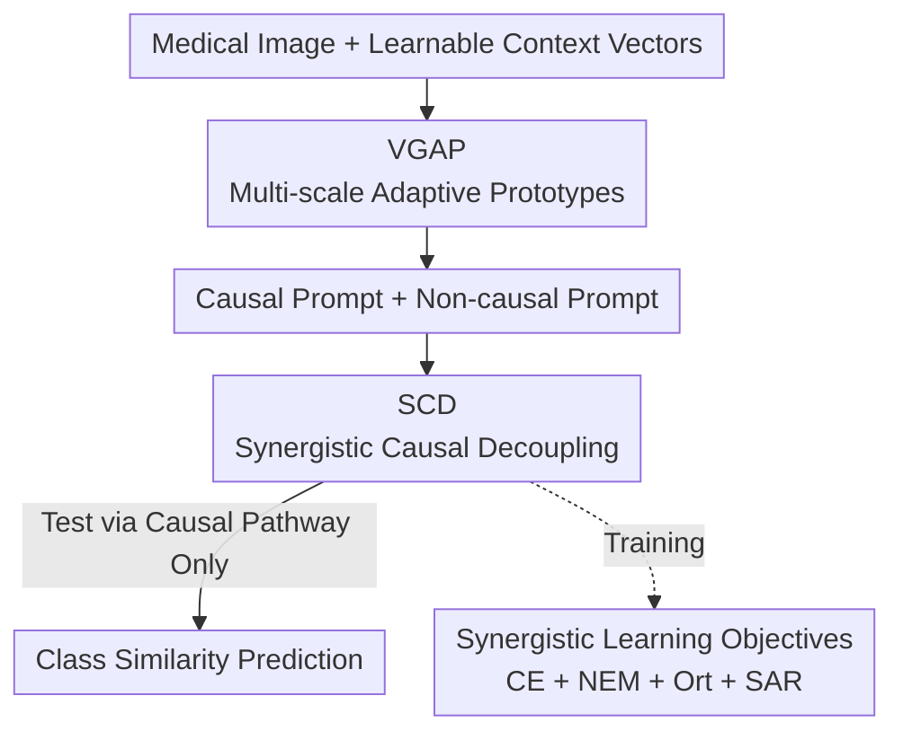

# BiomedCCPL: Causal Conditional Prompt Learning for Biomedical Vision-Language Models

**Conference**: CVPR 2026  
**Paper**: [CVF Open Access](https://openaccess.thecvf.com/content/CVPR2026/html/Cui_BiomedCCPL_Causal_Conditional_Prompt_Learning_for_Biomedical_Vision-Language_Models_CVPR_2026_paper.html)  
**Code**: https://github.com/burgers0708/BiomedCCPL  
**Area**: Multimodal VLM  
**Keywords**: Prompt Learning, Causal Inference, Biomedical VLM, Unseen Class Generalization, Front-door Adjustment  

## TL;DR
Addressing the poor generalization of biomedical VLMs on "unseen classes within the same dataset," BiomedCCPL employs a VGAP module to dynamically generate image-conditional prompts from multi-scale adaptive visual prototypes and an SCD module to decouple prompts into causal and non-causal pathways via front-door adjustment for deconfounding. On 11 datasets across 9 modalities, the average HM for Base-to-Novel tasks is improved from 73.53% to 79.98% (+6.45%).

## Background & Motivation
**Background**: Vision-Language Models like CLIP demonstrate strong zero-shot capabilities on natural images. Consequently, prompt/adapter methods such as CoOp, CoCoOp, MMA, and MMRL have been adapted to the medical domain by attaching learnable components to frozen encoders for few-shot adaptation. BiomedCLIP (pretrained on PMC-15M with a BERT text encoder) serves as a specialized backbone for the biomedical field.

**Limitations of Prior Work**: The authors illustrate in Fig. 1 that existing methods fail on medical data in distinct ways: CoOp/KgCoOp/MMRL suffer from **overfitting** after 16-shot adaptation, where accuracy on unseen classes even falls below zero-shot BiomedCLIP; CoCoOp/ProGrad mitigate overfitting but **sacrifice performance on seen classes**; MMA maintains generalization, but its gains on unseen classes are significantly lower than those on seen classes.

**Key Challenge**: The root cause is the trade-off between "adaptation and generalization," which is magnified in medical scenarios. On one hand, most methods learn **image-agnostic static prompts** (a fixed text template for each seen class) that fail to align with the visual features of unseen classes. On the other hand, a few methods generating **image-conditional dynamic prompts** (e.g., CoCoOp) are prone to learning **shortcuts**—where prompts correlate with **non-diagnostic features** (equipment watermarks, imaging artifacts) distinctive only to seen classes, failing when applied to unseen classes. Using causal inference, the authors define "causal knowledge" as the **shared and transferable** association between "prompts $\leftrightarrow$ underlying diagnostic visual features" (lesion morphology, tissue texture, abnormal density zones) across seen and unseen classes, while the rest is non-causal knowledge.

**Goal**: To enable the model to **dynamically generate** image-conditional prompts aligned with underlying diagnostic features that are shared between seen and unseen classes.

**Key Insight**: A Structural Causal Model (SCM) is used to explicitly model the "seen $\to$ unseen generalization" process. By treating non-diagnostic features as unobserved confounding variables $C$, the phenomenon of "learning shortcuts" is explained through the lens of causal intervention, and a removal scheme is proposed.

**Core Idea**: VGAP "grounds" prompts to multi-scale local diagnostic features to solve the alignment issues of static prompts, while SCD uses front-door adjustment to decouple prompts into causal and non-causal dual pathways to suppress spurious correlations. Together, they yield "causal conditional prompts" that are both accurate and generalizable.

## Method

### Overall Architecture
BiomedCCPL is built upon BiomedCLIP with fully frozen encoders, learning only lightweight prompt-related components. The process is as follows: input medical image + learnable context vectors $\to$ VGAP extracts adaptive visual prototypes across shallow, medium, and deep scales, "injecting" these prototypes into the text [CLS] token via cross-attention to generate image-conditional prompts $\to$ the same mechanism produces both **causal prompts** and **non-causal prompts** $\to$ SCD uses four synergistic losses to separate causal and non-causal information into two pathways (a practical implementation of front-door adjustment) $\to$ during training, four losses are jointly optimized; during testing, **only the causal pathway** is used to calculate class similarity for prediction.

The basis for prompt learning follows the CLIP format: for class $c$, the continuous prompt $T_c$ consists of shared context vectors concatenated with the class name embedding. The probability of image $I_j$ belonging to class $c$ is $p(y_j=c\mid F_I^j)=\dfrac{\exp(\cos(F_T^c,F_I^j)/\tau)}{\sum_{i=1}^{C}\exp(\cos(F_T^i,F_I^j)/\tau)}$. During few-shot adaptation, only context vectors are updated. VGAP and SCD focus on "how to obtain a better $F_T^c$."

### Key Designs

**1. VGAP: Grounding text prompts to diagnostic details using multi-scale adaptive prototypes**

To address the limitations where static prompts mismatch unseen classes and CoCoOp’s use of a **single global token** leads to "blurred average local features (e.g., small lung nodules) and dominance by watermarks/background artifacts," VGAP avoids global features. Instead, it extracts **adaptive visual prototypes** from multiple image scales to modulate prompts. Specifically, for $M$ patch tokens $\mathcal{V}_{j,l}$ at layer $l$, a lightweight network calculates a contribution matrix $\mathbf{A}\in\mathbb{R}^{M\times N}$:

$$\mathbf{A} = \mathrm{SoftMax}(\mathrm{ReLU}(\mathrm{LayerNorm}(\mathcal{V}_{j,l}\mathbf{W}_1))\mathbf{W}_2)$$

$A_{ij}$ denotes the contribution of the $i$-th patch to the $j$-th prototype. Prototypes are obtained via weighted aggregation of patch tokens $\mathbf{P}_l=\mathbf{A}^\top \mathcal{V}_{j,l}$ (where $N\ll M$, e.g., $N=14=\sqrt{196}$). Unlike traditional clustering based solely on visual similarity, $\mathbf{W}_1, \mathbf{W}_2$ are trained end-to-end via backpropagation, making prototypes **adaptive** to the classification objective. Subsequently, the [CLS] token $t^{i,l}_{cls}$ from the $l$-th layer of the text encoder acts as a query to cross-attend to these prototypes ($q=t^{i,l}_{cls}\mathbf{W}_q,\ \mathbf{K}=\mathbf{P}_l\mathbf{W}_k,\ \mathbf{V}=\mathbf{P}_l\mathbf{W}_v$), yielding a visually grounded representation $z^{i,l}=\mathrm{SoftMax}(q\mathbf{K}^\top/\sqrt{d_k})\mathbf{V}$, which is fused back using momentum:

$$t^{i,l,*}_{cls}=\alpha\cdot t^{i,l}_{cls}+(1-\alpha)\cdot z^{i,l}$$

$\alpha$ controls the strength of visual information injection. VGAP is performed at shallow, middle, and deep scales ($l\in\{3,7,11\}$), ensuring the final text representation is anchored to diagnostic details ranging from coarse anatomical structures to fine pathological textures. The prototypes themselves act as "semantic aggregators + noise filters," preventing the model from overfitting to hyper-fine or noisy image factors.

**2. SCD: Deconfounding via front-door adjustment by decoupling prompts into causal/non-causal pathways**

Dynamic prompts can still be biased by **non-diagnostic features** like equipment labels or imaging artifacts. The authors formalize the seen $\to$ unseen generalization using an SCM. Let the image-text alignment semantics be $X$, and the confounder $C$ be the non-diagnostic visual features in seen classes. $C$ affects both $X$ ($C\to X$) and the prediction $\hat Y$ ($C\to\hat Y$), opening the back-door path $X\leftarrow C\to\hat Y$ and injecting spurious correlations. Since $C$ is unobservable, back-door adjustment is impossible. Instead, a mediator variable "image-text alignment **causal** semantics $S$" (capturing the association between prompts and underlying diagnostic features) is introduced, utilizing front-door adjustment to estimate the causal effect:

$$P(\hat y_j=c\mid \mathrm{do}(I_j,T))=\sum_{s\in\mathcal{S}}P(s\mid I_j,T)\,P(c\mid s)$$

In practice, $S$ is estimated by VGAP and SCD, where the similarity derived from $S$ serves as differentiable logits for $P(c\mid S)$. SCD **explicitly splits** the prompt for each class into two sets: causal prompt $T^i_c=\{x^1_c,\dots,x^g_c,[\text{CLASS}]_i,\text{‘.’}\}$ and non-causal prompt $T^i_{nc}$, encoding causal/non-causal text features $F_{T_c}, F_{T_{nc}}$. This "mediator + dual-pathway" structure realizes the abstract front-door formula: the causal pathway is forced to carry only transferable diagnostic semantics, while the non-causal pathway "absorbs" shortcut signals useful only in seen classes. Generalization improves by discarding the non-causal pathway during testing.

**3. Synergistic Learning Objectives: Four losses to drive causal information into the causal pathway**

The decoupling in SCD is achieved through three synergistic losses plus one stabilization loss. **Cross-Entropy $\mathcal{L}_{\text{CE}}$**: The causal pathway performs standard classification via $\mathbf{Q}_c=\mathrm{SoftMax}(F_I F_{T_c}^\top/\tau)$, forcing it to learn discriminative diagnostic information. **Non-causal Entropy Maximization $\mathcal{L}_{\text{NEM}}$**: Pushes the non-causal prediction $\mathbf{Q}_{nc}$ toward a uniform distribution $\mathcal{U}$, $\mathcal{L}_{\text{NEM}}=D_{\text{KL}}(\mathbf{Q}_{nc}\|\mathcal{U})$, maximizing its predictive entropy to ensure the non-causal pathway **produces no deterministic discriminative signals**. **Orthogonality Constraint $\mathcal{L}_{\text{Ort}}$**: Forces orthogonality between the two pathways within each class $\mathcal{L}_{\text{Ort}}=\frac1C\|\mathrm{diag}(F_{T_c}F_{T_{nc}}^\top)\|_2^2$, separating the subspaces. **Semantic Anchor Regularization $\mathcal{L}_{\text{SAR}}$**: Uses features $T_h$ from manual templates (e.g., "a photo of a [CLASS]") as semantic anchors $\mathcal{L}_{\text{SAR}}=1-\frac1C\mathrm{Tr}(F_{T_c}F_{T_h}^\top)$ to stabilize training. The total objective is:

$$\mathcal{L}_{\text{total}}=\mathcal{L}_{\text{CE}}+\mathcal{L}_{\text{SAR}}+\lambda_1\mathcal{L}_{\text{NEM}}+\lambda_2\mathcal{L}_{\text{Ort}}$$

Without NEM or Ort, the non-causal pathway would compete with the causal one for discriminative signals; together, they cleanly drive the causal pathway toward diagnostic features.

### Loss & Training
ViT-B/16 backbone (BiomedCLIP), trained for 50 epochs. Context initialized with "a photo of a", number of prototypes $N=14$. SGD optimizer with learning rate 0.0025, batch size 1. $\lambda_1, \lambda_2, \alpha$ tuned on validation sets. Average across 3 random seeds. Single RTX 4090 used. Only the causal pathway is used for inference.

## Key Experimental Results
Evaluated on 11 biomedical datasets, 9 modalities, and 10 organs against 7 methods (CoOp/CoCoOp/KgCoOp/ProGrad/MMRL/BiomedCoOp as prompt-based + MMA as adapter-based) using the same BiomedCLIP backbone.

### Main Results
Base-to-Novel generalization (16-shot training on base classes, testing on both; 10 datasets average; HM is Harmonic Mean):

| Method | Base | Novel | HM |
|------|------|-------|----|
| BiomedCLIP (Zero-shot) | 47.87 | 65.42 | 55.28 |
| CoOp | 73.85 | 64.72 | 68.98 |
| CoCoOp | 72.26 | 67.02 | 69.54 |
| ProGrad | 71.16 | 67.38 | 69.22 |
| MMA (Sub-optimal) | 79.75 | 68.22 | 73.53 |
| BiomedCoOp | 76.10 | 70.46 | 73.17 |
| **BiomedCCPL (Ours)** | **80.78** | **79.20** | **79.98** |

HM is 6.45% higher than the second-best, MMA (73.53%). Notably, the novel class performance is 8.74% higher than BiomedCoOp (70.46%), while the base class performance remains optimal—indicating the model learns causal knowledge shared across classes rather than base-specific spurious correlations. Data efficiency is prominent: 1-shot (62.17%) outperforms 2-shot BiomedCoOp (58.55%); 8-shot (77.22%) outperforms 16-shot MMA (75.24%).

### Ablation Study
Ablation of components (SAR / VGAP / SCD, 11-dataset average; Few-shot column denotes 16-shot accuracy):

| Config | B2N Base | B2N Novel | B2N HM | Few-shot(16) |
|------|----------|-----------|--------|--------------|
| Baseline CoOp (✗✗✗) | 73.85 | 64.72 | 68.98 | 69.72 |
| +SAR | 75.78 | 65.68 | 70.37 | 68.64 |
| +VGAP | 79.08 | 73.26 | 76.06 | 79.95 |
| +SCD | 75.56 | 75.69 | 75.62 | 71.30 |
| +VGAP+SCD | 80.83 | 77.88 | 79.33 | 77.48 |
| **Full (✓✓✓)** | 80.78 | **79.20** | **79.98** | **82.25** |

### Key Findings
- **SCD targets generalization, VGAP targets few-shot**: In the B2N task, adding SCD alone boosts novel accuracy from 64.72 to 75.69 (the highest gain). In the Few-shot task, removing VGAP drops 16-shot accuracy from 82.25 to 71.13, proving adaptive visual grounding is crucial for leveraging limited supervision. SAR mainly stabilizes training.
- **Mutual Complementarity**: Any combination of two modules outperforms a single one. VGAP+SCD reaches an HM of 79.33; adding SAR pushes novel accuracy to 79.20 and 16-shot to 82.25. Note that the Full base accuracy (80.78) is slightly lower than VGAP+SCD (80.83), but novel accuracy is significantly higher—SAR trades minor base performance for more robust generalization.
- **Prototype mechanism effectiveness**: Removing prototypes in VGAP leads to overall declines in both B2N and Few-shot performance. Prototypes act as both semantic aggregators and noise filters, preventing overfitting to granular noise.
- **Explainability**: ScoreCAM visualizations show the causal pathway accurately localizes lesions, enhancing clinical acceptability.

## Highlights & Insights
- **Structuralizing Front-door Adjustment**: While many causal papers remain at the SCM diagram level, this work implements the mediator $S$ as "causal/non-causal prompt pathways + triple loss." $P(s\mid I,T)$ and $P(c\mid s)$ from the front-door formula are handled by VGAP grounding and causal pathway classification, respectively. This trainable and prunable mechanism is transferable to other prompt-learning scenarios plagued by "shortcuts."
- **"Silencing" the Non-causal Pathway**: Using entropy maximization to push $\mathbf{Q}_{nc}$ toward a uniform distribution explicitly forbids the non-causal pathway from being discriminative. Combined with orthogonality, this ensures it "absorbs" rather than "shares" shortcut signals—a more targeted approach than simple regularization.
- **Multi-scale Prototypes tailored for Medical Images**: Medical diagnosis relies on both coarse anatomy and fine textures. VGAP's layered grounding at levels $\{3,7,11\}$ covers these varying diagnostic semantics, naturally resisting artifacts better than CoCoOp's single global token.

## Limitations & Future Work
- Layer indices $\{3,7,11\}$, number of prototypes $N=14$, and $\alpha/\lambda_1/\lambda_2$ were tuned on validation sets; their robustness across wider datasets or adaptive selection methods were not fully explored in the main text (details in Supp.).
- The definition of "causal knowledge" relies on prior descriptions of diagnostic features. Simplifying all non-diagnostic features into a single confounder $C$ in the SCM is a simplification. If artifacts themselves co-vary with pathology (e.g., a specific device only used for one disease), the validity of front-door adjustment might be challenged (筆者注: this is inference, not discussed in paper).
- Evaluation focused on B2N and few-shot classification, not addressing finer-grained tasks like detection or segmentation. The scalability of the batch size=1 training on larger datasets remains unverified.

## Related Work & Insights
- **vs CoCoOp**: Both use image-conditional prompts, but CoCoOp uses **global features**, causing local diagnostic details to be blurred and dominated by artifacts. BiomedCCPL uses multi-scale local prototypes and causal decoupling, leading to vastly superior novel generalization (HM 79.98 vs 69.54).
- **vs BiomedCoOp / XCoOp**: These medical prompt methods inject domain **prior knowledge**. BiomedCCPL requires no external knowledge, learning causal representations end-to-end, with novel accuracy 8.74% higher than BiomedCoOp.
- **vs CDC (Front-door Causal Intervention)**: CDC uses multiple **global** features from data augmentation to decouple semantics. This work instead uses multi-scale **local** features + synergistic learning, which better aligns with the fine-grained diagnostic needs of medical images.

## Rating
- Novelty: ⭐⭐⭐⭐ Implementation of front-door adjustment via trainable dual-prompt pathways combined with multi-scale adaptive prototypes is solid and well-suited for medical scenarios.
- Experimental Thoroughness: ⭐⭐⭐⭐ 11 datasets, 9 modalities, 7 strong baselines, dual ablation (components/prototypes), and ScoreCAM explainability provide broad coverage.
- Writing Quality: ⭐⭐⭐⭐ The logic chain from SCM $\to$ front-door $\to$ dual-pathway is clear, with formulas aligning well with motivations.
- Value: ⭐⭐⭐⭐ Significantly mitigates the "adaptation vs generalization" trade-off in data-scarce medical VLM applications, demonstrating high practical utility.

<!-- RELATED:START -->

## Related Papers

- [\[CVPR 2026\] Towards Calibrating Prompt Tuning of Vision-Language Models](towards_calibrating_prompt_tuning_of_vision-language_models.md)
- [\[CVPR 2026\] STAR: Test-Time Adaptation Can Enhance Universal Prompt Learning for Vision-Language Models](star_test-time_adaptation_can_enhance_universal_prompt_learning_for_vision-langu.md)
- [\[CVPR 2026\] EvoPrompt: Evolving Prompt Adaptation for Vision-Language Models](evolving_prompt_adaptation_for_vision-language_models.md)
- [\[CVPR 2026\] FedMPT: Federated Multi-Label Prompt Tuning of Vision-Language Models](fedmpt_federated_multi-label_prompt_tuning_of_vision-language_models.md)
- [\[CVPR 2026\] ReBaPL: Repulsive Bayesian Prompt Learning](rebapl_repulsive_bayesian_prompt_learning.md)

<!-- RELATED:END -->
