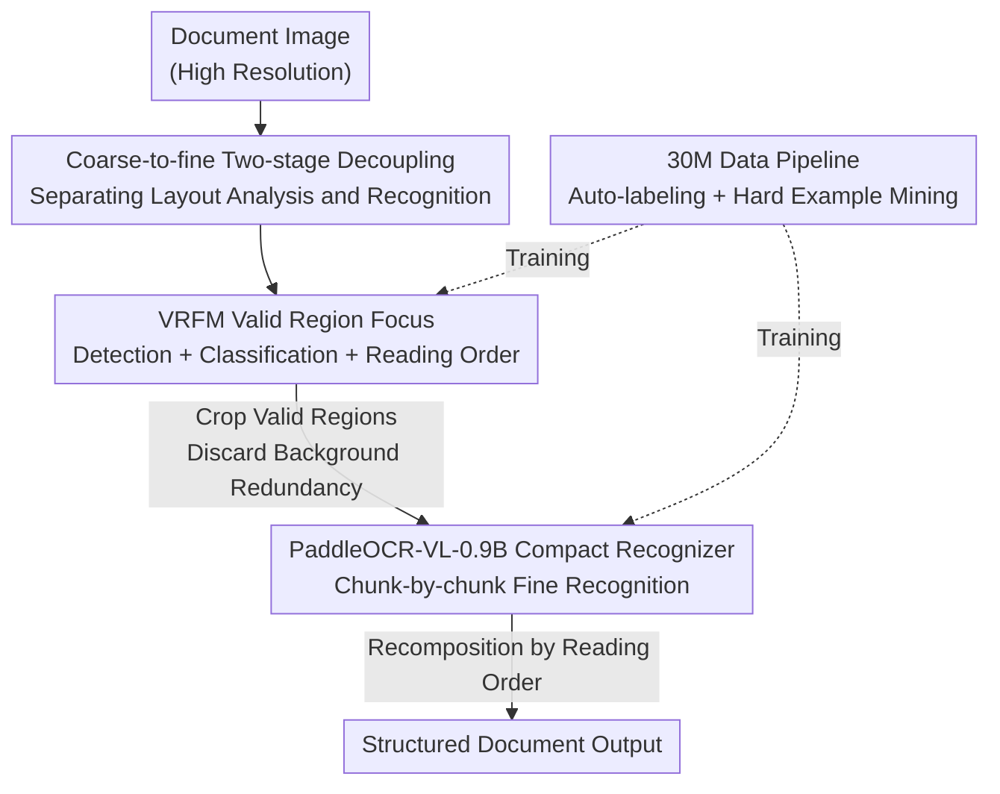

# Boosting Document Parsing Efficiency and Performance with Coarse-to-Fine Visual Processing

**Conference**: CVPR 2026  
**Paper**: [CVF Open Access](https://openaccess.thecvf.com/content/CVPR2026/html/Cui_Boosting_Document_Parsing_Efficiency_and_Performance_with_Coarse-to-Fine_Visual_Processing_CVPR_2026_paper.html)  
**Code**: https://github.com/PaddlePaddle/PaddleOCR  
**Area**: Multimodal VLM  
**Keywords**: Document parsing, coarse-to-fine, visual token compression, layout analysis, reading order  

## TL;DR
PaddleOCR-VL utilizes a lightweight "coarse-to-fine" two-stage framework that "localizes valid regions first, then identifies chunk-by-chunk," filtering out redundant backgrounds in high-resolution documents from the VLM. With only 0.9B parameters and approximately 2.5k visual tokens, it achieves a SOTA overall score of 92.62 on OmniDocBench v1.5, while delivering 50% higher throughput than the strongest baseline.

## Background & Motivation

**Background**: Document parsing (converting PDF/scans into text, formulas, tables, and charts while restoring reading order) is a critical preprocessing step for LLM training and RAG. Current mainstream approaches fall into three categories: ① pipeline methods (connecting expert models for detection, recognition, and reconstruction); ② general VLMs (directly reading full pages, e.g., GPT-4o, Qwen2.5-VL); ③ specialized document VLMs (integrating layout understanding and recognition into an end-to-end model, e.g., MinerU, dots.ocr).

**Limitations of Prior Work**: Document parsing is a fine-grained task where small text, dense tables, and formulas require **high resolution** for clarity. However, high resolution causes the number of visual tokens to expand **quadratically**, leading to soaring encoding and decoding costs. Pipeline methods are prone to error propagation and fail on complex layouts; end-to-end VLMs may lose reading order or suffer from hallucinations in long documents and require massive parameter counts. Existing token reduction techniques (e.g., DeepSeek-OCR) use **uniform compression** on the full image, which inadvertently blurs dense text regions and degrades fine-grained layout accuracy.

**Key Challenge**: The precision brought by high resolution directly conflicts with the resulting computational overhead. The root cause of high overhead is the **extremely non-uniform distribution of effective information** in document images. Quantifying this on OmniDocBench v1.5, the authors found that valid visual regions account for only ~39% in PPT-style documents and ~60% even in dense newspapers. The remainder consists of background and decorative elements that consume tokens without contributing to recognition.

**Key Insight**: Since redundancy is the primary bottleneck, the VLM should not "consume the entire large image." Instead, a extremely lightweight module can extract valid regions and determine reading order (coarse), followed by a compact VLM that performs fine-grained recognition on these compact chunks (fine). This replaces "uniform high resolution" with "regional sparsity," simultaneously boosting efficiency and precision.

## Method

### Overall Architecture

PaddleOCR-VL completely **decouples layout analysis and content recognition into two independently optimizable stages**. The input is an unstructured document image, and the output is a structured document reorganized in the correct reading order.

- **Coarse Stage**: The lightweight Valid Region Focus Module (VRFM) scans the full page to detect layout elements (text blocks/tables/formulas/charts), classifies each block, and predicts the reading order among them. This step focuses on "where, what, and in what order" without performing recognition, allowing it to remain fast and light.
- **Cropping**: Based on the valid regions identified by VRFM, corresponding image sub-blocks are cropped. Backgrounds, white space, and decorations are discarded and do not enter the downstream process.
- **Fine Stage**: Each cropped valid sub-block is fed into PaddleOCR-VL-0.9B (a 0.9B compact VLM) for element-level recognition (OCR / Table / Formula / Chart). Since inputs are clean sub-blocks, the model concentrates its full capacity on a single element.
- **Recomposition**: Recognition results from each sub-block are reassembled according to the reading order predicted by VRFM to produce the final structured document.

This design offers two direct benefits: first, it avoids processing large areas of irrelevant background, significantly reducing the visual tokens fed to the VLM; second, by specializing localization and recognition separately, both efficiency and recognition quality are improved.

### Key Designs

**1. Coarse-to-fine Decoupling: Replacing Uniform High Resolution with Regional Sparsity**

This is the core paradigm shift, directly addressing the "high resolution $\to$ quadratic token expansion" problem. End-to-end VLMs encode the entire page (including massive backgrounds), whereas valid document regions average less than 50%, meaning half the computation is wasted. The authors split the process into "localize then recognize": the coarse stage only outputs boxes and order (low computation), while the fine stage runs the VLM only on cropped compact regions. This differs fundamentally from the **uniform compression** approach of DeepSeek-OCR, which blurs dense text indiscriminately. Here, **redundancy is discarded selectively while maintaining the original resolution of salient regions**, saving tokens without sacrificing fine-grained precision. Decoupling also allows layout and recognition modules to be trained and upgraded independently.

**2. VRFM Valid Region Focus: Unified Lightweight Detection + Classification + Reading Order**

The coarse stage aims to locate valid regions and determine reading order quickly and accurately. VRFM uses **RT-DETR** as the detection backbone to localize and classify layout elements, producing region-level representations for each candidate. A **pointer network** is then attached to model reading order by characterizing pair-wise relationships between detected regions, predicting an $N\times N$ matrix that encodes relative sequence. Thus, localization, classification, and reading order are accomplished in one lightweight framework. By explicitly filtering irrelevant backgrounds, VRFM provides **compact and information-dense** inputs to the downstream VLM, eliminating redundant computation at the source while preserving structural information. Training proceeds in two steps: first, initializing with PP-DocLayout Plus-L to train the RT-DETR core for 100 epochs; then, freezing the core to train the pointer network for 200 epochs using Generalized Cross Entropy Loss for robustness against noise.

**3. PaddleOCR-VL-0.9B: Compact Recognizer with Native Dynamic Resolution**

The fine stage must balance high precision with low overhead. The model follows the LLaVA-style "Visual Encoder + MLP Projection + Language Model" structure but selects compact components. Crucially, instead of **fixed resolution or tiling**, it uses a **NaViT-style visual encoder** (initialized by Keye-VL) to process images at their **native resolutions**, avoiding distortions and hallucinations caused by scaling or slicing. The projector consists of a 2-layer MLP with GELU, and the language model is **ERNIE-4.5-0.3B** (0.3B parameters) utilizing **3D-RoPE** for positional encoding to minimize inference latency. The NaViT + ERNIE-4.5-0.3B combination provides strong recognition capability at the 0.9B scale with minimal memory footprint. Recognition tasks cover four categories: OCR, Tables (OTSL format), Formulas (LaTeX), and Charts (Markdown tables).

**4. 30M Multi-source Data Pipeline + Hard Example Mining: Enabling SOTA**

The authors identify data as a primary factor for achieving SOTA performance. Data is sourced from four streams: open-source sets, synthetic sets (low-cost synthesis for rare types), web crawls (academic papers/newspapers/handwritten scans), and in-house sets, totaling 30M+ samples. The annotation utilizes an **automated pipeline**: expert models (PP-StructureV3) generate noisy pseudo-labels, which are refined by ERNIE-4.5-VL and Qwen2.5-VL, followed by a hallucination filter to remove errors. For weaknesses, **hard example mining** is conducted: shortcomings are identified on manually annotated sets using specialized metrics (EditDist for text, TEDS for tables, RMS-F1 for charts, BLEU for formulas), and high-quality synthetic data is then generated using rendering tools like XeLaTeX or browsers with diverse fonts to reinforce these areas.

### Loss & Training

VRFM training is as described above. PaddleOCR-VL-0.9B adopts a "post-adaptation" strategy: the visual encoder uses Keye-VL and the language model uses ERNIE-4.5-0.3B for initialization. Training via ERNIEKit occurs in two stages: Stage 1 Alignment—trained on 29M image-text pairs for 1 epoch, max visual tokens $1280\times28\times28$, sequence length 16384, batch size 128, LR decaying from $5\times10^{-5}$ to $5\times10^{-6}$; Stage 2 Instruction Tuning—trained on 2.7M samples for 2 epochs, increasing max visual tokens to 2048, with LR from $5\times10^{-6}$ to $5\times10^{-7}$, covering OCR/table/formula/chart tasks.

## Key Experimental Results

### Main Results (OmniDocBench v1.5 Page-level Parsing)

1355 pages of Chinese and English documents. The overall score is a weighted combination of text, formula, and table metrics. S/M/L tiers represent different visual token budgets.

| Method | Params | Visual Tokens | Overall↑ | TextEdit↓ | FormulaCDM↑ | TableTEDS↑ | ReadOrderEdit↓ |
|------|------|-----------|----------|-----------|-------------|------------|----------------|
| Gemini-2.5 Pro | - | - | 88.03 | 0.075 | 85.82 | 85.71 | 0.097 |
| dots.ocr | 3B | 5513 | 88.41 | 0.048 | 83.22 | 86.78 | 0.053 |
| MinerU2.5 | 1.2B | 3256 | 90.67 | 0.047 | 88.46 | 88.22 | 0.044 |
| DeepSeek-OCR-Gundam-M | 3B | 1854 | 86.46 | 0.081 | 89.45 | 78.02 | 0.093 |
| **PaddleOCR-VL-S** | 0.9B | 1898 | 91.55 | 0.035 | 90.30 | 87.89 | 0.044 |
| **PaddleOCR-VL-M** | 0.9B | 2259 | 92.17 | 0.035 | 90.22 | 89.75 | 0.043 |
| **PaddleOCR-VL-L** | 0.9B | 2561 | **92.62** | **0.035** | **90.90** | **90.48** | **0.043** |

The L version achieves an overall score of 92.62 with 2561 tokens, surpassing the next best, MinerU2.5 (90.67 with 3256 tokens). Compared to DeepSeek-OCR-Gundam-M (1854 tokens) with a similar token count, it leads by over 6 points, confirming that "targeted redundancy removal" is superior to "uniform compression."

### Element-level + Inference Efficiency

| Evaluation | Metric | PaddleOCR-VL-L | Prev. SOTA |
|------|------|----------------|------|
| Table OmniDocBench-Table-block | Overall TEDS↑ | **0.9046** | MinerU2.5 0.9005 |
| Formula Formula-block | Overall CDM↑ | **0.9404** | MinerU2.5 0.9187 |
| Chart In-house (1801 samples) | RMS-F1↑ | **0.8440** | PP-StructureV3 0.8060 |
| Inference (A100, vLLM) | Pages/s↑ | **1.6192** | MinerU2.5 1.0574 |
| Inference | Tokens/s↑ | **2470.7** | MinerU2.5 1647.9 |
| Inference | VRAM (GB)↓ | 42.1 | dots.ocr 78.5 |

Text recognition achieved the lowest EditDist across almost all categories: PPT (0.049), Academic (0.021), Books (0.047), Magazines (0.020), and Newspapers (0.035). On the inference side, page throughput is **53.1%** higher and token throughput is **49.9%** higher than MinerU2.5, while VRAM usage is **46%** less than dots.ocr.

### Key Findings
- **Token efficiency is the core USP**: Surpassing overall scores while using 25%~65% fewer visual tokens than competitors indicates that the bottleneck lies in "redundant tokens" rather than "model size."
- **Decoupling empowers small models**: 0.9B parameters outperform 72B/241B general VLMs, validating that "localize then recognize" concentrates model capacity where it matters most.
- **Superior Formula Performance in Chinese** (ZH-CDM 0.9035) significantly outperforms competitors (MinerU2.5 at 0.8623), highlighting the effectiveness of hard example mining for specific types.

## Highlights & Insights
- **Upgrading "Token Reduction" from Uniform to Region-level**: By validating that valid regions occupy <50% and using a lightweight detection module for targeted cropping, this approach saves tokens without hurting precision—a "sparsity-driven computation allocation" applicable to any high-resolution vision task.
- **Pointer Network for Reading Order**: Modeling reading order as an $N\times N$ relationship matrix within the lightweight VRFM avoids the "coordinate drift and sequence confusion" common in end-to-end generative models on dense documents.
- **Native Dynamic Resolution (NaViT) over Tiling**: For text-dense documents, avoiding the distortions and hallucinations of tiling is a major source of fine-grained accuracy, providing a valuable lesson for other OCR tasks.

## Limitations & Future Work
- **Cascading Errors**: If VRFM misses or misidentifies a region, the downstream recognition cannot recover—the paper does not fully discuss end-to-end robustness when VRFM recall fails. ⚠️ Accuracy should be verified against original samples and code.
- **Data as a Hidden Barrier**: The 30M in-house and synthetic dataset is explicitly cited as a key factor for SOTA, implying that reproducibility is highly dependent on this proprietary data pipeline.
- **Cropping-Recomposition Overhead**: Splitting the process into "detect $\to$ crop $\to$ recognize $\to$ reassemble" may introduce scheduling costs when layouts are extremely dense with numerous small regions. While batch throughput is high, performance on single-page extreme cases remains to be observed.

## Related Work & Insights
- **vs DeepSeek-OCR**: Both aim to save visual tokens, but DeepSeek-OCR's uniform compression sacrifices layout precision and suffers from decoding latency; Ours uses region-level cropping and decoupled recognition, achieving higher scores with similar token counts.
- **vs MinerU2.5 / dots.ocr (Specialized VLMs)**: These integrate detection and recognition into one large model using generative outputs for coordinates, leading to drift in dense documents; Ours uses discriminative RT-DETR + Pointer Network for stable localization and better reading order with fewer parameters (0.9B vs 1.2B~3.7B).
- **vs Pipeline Methods (PP-StructureV3, etc.)**: Traditional pipelines are heavy and prone to error propagation; Ours uses only "VRFM + one compact VLM," retaining module specialization while avoiding the fragility of multi-expert cascades through a unified VLM.

## Rating
- Novelty: ⭐⭐⭐⭐ The "sparsity-driven coarse-to-fine decoupling" is clear, though components like RT-DETR, NaViT, and two-stage decoupling are high-level combinations of existing techniques.
- Experimental Thoroughness: ⭐⭐⭐⭐⭐ Covers page-level, four element types, and inference efficiency; compares against 72B general VLMs and specialized models across parameters and throughput.
- Writing Quality: ⭐⭐⭐⭐ Convincing motivation through quantification (valid region ratio); clear framework; data pipeline description is somewhat procedural.
- Value: ⭐⭐⭐⭐⭐ Achieving SOTA with 0.9B parameters + a 50% throughput Gain + open-sourcing to PaddleOCR provides significant value for practical high-throughput document parsing.

<!-- RELATED:START -->

## Related Papers

- [\[CVPR 2026\] Towards Real-World Document Parsing via Realistic Scene Synthesis and Document-Aware Training](towards_real-world_document_parsing_via_realistic_scene_synthesis_and_document-a.md)
- [\[ICLR 2026\] SigLIP-HD by Fine-to-Coarse Supervision](../../ICLR2026/multimodal_vlm/siglip-hd_by_fine-to-coarse_supervision.md)
- [\[CVPR 2026\] Boosting Visual Reprogramming for CLIP with Dual Granularity Alignment](boosting_visual_reprogramming_for_clip_with_dual_granularity_alignment.md)
- [\[CVPR 2026\] RxnCaption: Reformulating Reaction Diagram Parsing as Visual Prompt Guided Captioning](rxncaption_reformulating_reaction_diagram_parsing_as_visual_prompt_guided_captio.md)
- [\[CVPR 2026\] SEA: Evaluating Sketch Abstraction Efficiency via Element-level Commonsense Visual Question Answering](sea_evaluating_sketch_abstraction_efficiency_via_element-level_commonsense_visua.md)

<!-- RELATED:END -->
