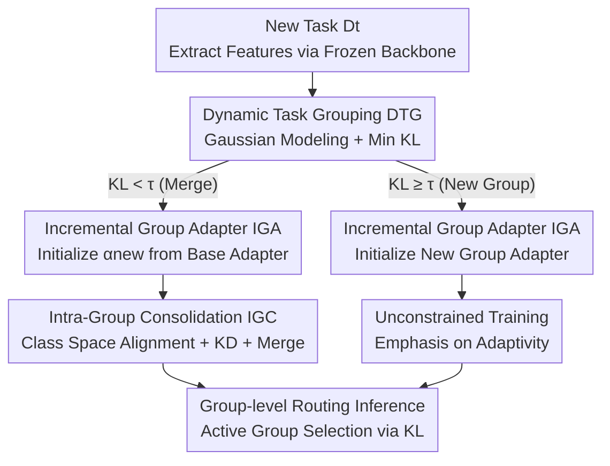

# Boosting Vision-Language Models Towards Cross-Domain Incremental Object Detection

**Conference**: CVPR 2026  
**Paper**: [CVF Open Access](https://openaccess.thecvf.com/content/CVPR2026/html/Wang_Boosting_Vision-Language_Models_Towards_Cross-Domain_Incremental_Object_Detection_CVPR_2026_paper.html)  
**Code**: https://github.com/Never-wx/dgs  
**Area**: Multi-modal VLM  
**Keywords**: Incremental Object Detection, Cross-domain Continual Learning, VLM, LoRA adapters, Task Grouping  

## TL;DR
To address the more realistic "Cross-Domain Incremental Object Detection" scenario, this paper establishes a CDIOD benchmark (involving sequential sub-tasks across natural, underwater, and remote sensing domains) and proposes the DGS framework. DGS dynamically groups tasks based on distribution similarity, shares subspaces via expandable LoRA adapters within groups, and performs inference with group-level routing. It achieves SOTA on CDIOD with +11.4 AP using only +1.2% additional parameters.

## Background & Motivation

**Background**: Incremental Object Detection (IOD) aims to enable detectors to continuously learn new categories and adapt to dynamic environments. Vision-Language Models (VLMs) like Grounding DINO and GLIP, which treat detection as a "region-text alignment" phrase grounding problem, possess inherent open-vocabulary capabilities and are considered ideal foundations for IOD. Adapting VLMs to downstream specialized scenarios typically requires fine-tuning to bridge distribution gaps.

**Limitations of Prior Work**: Most IOD research **oversimplifies** scenarios by assuming all incremental tasks come from the same generic domain. This paper highlights that under such single-domain settings, naive fine-tuning of VLMs already matches SOTA (Fig. 1(b)), suggesting existing benchmarks fail to reflect the true incremental capacity of modern VLM detectors. In real-world applications, new domains and new categories often **appear simultaneously** (e.g., shifting from Objects365 to remote sensing images).

**Key Challenge**: Under significant domain shifts, VLMs suffer from severe forgetting, which is further exacerbated by the introduction of new categories. This makes finding an optimal subspace for both old and new knowledge extremely difficult, preventing existing methods from balancing **stability (not forgetting the old) and adaptivity (learning the new)**. Full fine-tuning offers high adaptivity but suffers from domain-wise forgetting; PEFT methods (independent adapters/prompts per task) preserve stability through isolation but have two fatal flaws: ① they treat each task as independent, ignoring naturally shared semantics (objects in different tasks often co-occur); ② they rely on task-ID routing during inference, which suffers from high error rates in complex CDIOD scenarios.

**Goal**: Construct a realistic evaluation protocol for simultaneous new category and new domain learning, and design a framework capable of maintaining stability and adaptivity across task streams with drastic distribution shifts.

**Key Insight**: Rather than isolating every task in independent subspaces, tasks with **similar distributions should be assigned to the same group and share a co-evolving subspace**. CDIOD is reformulated as a "task grouping assignment" problem, where the model dynamically assigns new tasks to the most compatible group and incrementally expands that group's shared subspace.

**Core Idea**: Replace "independent adapters per task + task-level routing" with "dynamic task grouping + intra-group adapter merging" to achieve intra-group knowledge sharing and inter-group isolation.

## Method

### Overall Architecture

DGS (Dynamic Group Subspace) is built upon a frozen Grounding-DINO-T, training only LoRA adapters inserted into the FFNs of the enhancer layers. It consists of a **dynamic training pipeline** with three components: ① **Dynamic Task Grouping (DTG)** models new tasks as Gaussian distributions in feature space and determines if they should merge into an existing group or form a new one based on KL divergence; ② **Incremental Group Adapter (IGA)** maintains a set of expandable LoRA adapters for each group; ③ **Intra-Group Consolidation (IGC)** merges a task's adapter into the group's "base adapter" after training to refine the shared subspace and control parameter growth. The pipeline diverges based on DTG's assignment: tasks assigned to new groups undergo unconstrained training (emphasizing adaptivity), while those joined to existing groups trigger IGC (emphasizing stability). During inference, DTG estimates the Gaussian distribution of test samples and performs **group-level routing** to activate the corresponding group's adapters.

### Key Designs

**1. Dynamic Task Grouping (DTG): Deciding "Merge or Isolate" via Similarity**

DTG addresses the flaws of independent PEFT by avoiding wasted shared semantics and unreliable task-level routing. For each task $D_t$, features $F_t$ are extracted using a frozen image backbone to estimate the mean $\mu_t=E(F_t)$ and variance $\Sigma_t=\mathrm{Var}(F_t)$, approximating the distribution as $\mathcal{N}_t=\mathcal{N}(\mu_t,\Sigma_t)$. Similarity is determined by the **minimum KL divergence** to any task within a group $g$:

$$\mathrm{KL}(t,g)=\min_{k\in g}\left[D_{KL}(\mathcal{N}_t\|\mathcal{N}_k)\right]$$

Let $g^*=\arg\min_g \mathrm{KL}(t,g)$. If $\mathrm{KL}(t,g^*)<\tau$, it merges into $g^*$; otherwise, a new group is created. The threshold $\tau$ controls grouping granularity—too small leads to one task per group (back to task-level routing), while too large forces heterogeneous tasks together, causing interference.

**2. Incremental Group Adapter (IGA): Expandable LoRA for Group Capacity**

IGA manages the trainable capacity for each group based on DTG's mapping. Each group $g_i$ has an IGA module $\mathcal{A}_i$ containing task-level LoRA adapters $\alpha^k_{g_i}$ for each task $k$ within the group. These are inserted into the FFNs of both **text and image branches**. For an FFN input $h$, the output is:

$$\mathrm{FFN}(h)+\sum_{k\in g_i} m_k\cdot B_k A_k h$$

Where $A_k, B_k$ are low-rank matrices and $m_k$ is a one-hot mask selecting the active adapter. This group-wise expansion constrains parameter growth within groups (only 1.2% extra parameters in experiments).

**3. Intra-Group Consolidation (IGC): Safe Merging into Shared Subspaces**

IGC merges multiple task adapters into a single shared subspace to prevent linear parameter explosion. Each IGA maintains a base adapter $\alpha_g^{\text{base}}$, and after training a new task adapter $\alpha_g^{\text{new}}$, they are iteratively merged:

$$\alpha_g^{\text{base}}\leftarrow\lambda\,\alpha_g^{\text{base}}+(1-\lambda)\,\alpha_g^{\text{new}}$$

$\lambda\in[0,1]$ balances old knowledge preservation and new information absorption. To prevent merging models from falling into different loss basins, IGC employs two mechanisms: **Group Initialization** (initializing $\alpha_g^{\text{new}}$ from $\alpha_g^{\text{base}}$ to stay in the same basin) and **Group Alignment** (training $\alpha_g^{\text{new}}$ on the **entire group's class space** using pseudo-labels from $\alpha_g^{\text{base}}$ and a topological KD loss):

$$\mathcal{L}_{\text{kd}}=\mathcal{L}\left(\mathcal{M}(x;\alpha_g^{\text{new}}),\;\mathcal{M}(x;\alpha_g^{\text{base}})\right)$$

### Loss & Training

The training pipeline is driven by a binary indicator $\delta(t)$: $\delta(t)=1$ for merging (triggers IGC, stability) and $\delta(t)=0$ for new groups (unconstrained, adaptivity). The total objective is:

$$\mathcal{L}=\mathcal{L}_{\text{align}}+\mathcal{L}_{\text{reg}}+\delta(t)\mathcal{L}_{\text{kd}}$$

$\mathcal{L}_{\text{align}}$ uses focal loss for region-text alignment, and $\mathcal{L}_{\text{reg}}$ uses L1 + GIoU for box regression. The model is based on Grounding-DINO-T (Objects365 + GoldG + Cap4M pre-trained), updating only LoRA parameters (rank=16). Training uses 8×RTX 3090, batch size 16, and an initial learning rate of $1\times10^{-3}$ for 11 epochs. Hyperparameters: $\tau=150$, $\lambda=0.2$.

## Key Experimental Results

### Main Results

CDIOD comprises DIOR (Remote Sensing, 20 classes), Pascal VOC (Natural, 20 classes), and RUOD (Underwater, 10 classes), split into 50 classes for sequential training and joint task-agnostic evaluation. Metric: AP (mAP50:95).

| Dataset/Setting | Metric | DGS (Ours) | Prev. SOTA (MR-GDINO) | Gain |
|--------|------|------|----------|------|
| CDIOD 0-10 (5 steps) Avg | AP | **64.7 ±0.6** | 56.2 ±0.2 | +8.5 |
| CDIOD 0-5 (10 steps) Avg | AP | **60.2 ±0.2** | 48.8 ±0.4 | +11.4 |
| CDIOD 0-5 DIOR | AP | **58.8** | 34.4 | +24.4 |
| CDIOD 0-5 RUOD | AP | **56.7** | 48.7 | +8.0 |

DGS significantly outperforms baselines on long incremental sequences (10 steps) where domain shifts are most severe, particularly on the DIOR dataset.

### Ablation Study

Breakdown on 10-step CDIOD (EPP = Extra Parameter Percentage):

| # | Configuration | EPP | Avg AP | Note |
|------|------|---------|---------|------|
| 1 | Base Model (Zero-shot) | 0.00% | 24.7 | Frozen VLM |
| 2 | LoRA | 0.40% | 29.5 | Single adapter, severe forgetting |
| 3 | T-LoRA | 4.00% | 51.5 | Per-task LoRA, linear growth + routing errors |
| 4 | 3 + Merge | 4.00% | 43.8 | Naive merging of all LoRA, cross-domain conflict |
| 5 | G-LoRA | 1.20% | 54.3 | DTG Grouping + Merging |
| 6 | 5 + Group Init | 1.20% | 56.7 | Mitigation of forgetting |
| 7 | 6 + Group Align (Full) | 1.20% | 60.2 | Full DGS framework |

### Key Findings

- **Grouping is the Core Gain**: G-LoRA (1.2% params) outperforms T-LoRA (4% params, 51.5 AP) by achieving 54.3 AP. Grouping by distribution avoids cross-domain knowledge conflicts.
- **"Safe Merging" Steps are Essential**: Group Initialization adds +2.4 AP, and Group Alignment adds another +3.5 AP. Merging requires weights to be in the same basin and aligned via pseudo-labeling/KD.
- **Threshold $\tau$ is Robust**: Within $\tau\in[100,600]$, AP remains stable between 59.6-60.2.
- **Group-level Routing Reduces Errors**: DTG's group-level routing has much higher accuracy than per-task routing, particularly across distinct domains.

## Highlights & Insights
- **Dynamic Grouping as a Middle Ground**: Instead of choosing between "Task Independent" and "Global Shared," DGS uses KL divergence to adaptively determine merging or isolation.
- **Model Merging for Incremental Learning**: Using convex combinations of group base adapters with intra-basin initialization and KD provides a systematic solution to the loss barrier problem in model merging.
- **Group Routing > Task Routing**: The bottleneck of PEFT incremental detection is often inference-time routing. Moving from "task" to "group" granularity effectively suppresses routing errors.
- **Value of the CDIOD Benchmark**: It exposes the inadequacy of single-domain IOD benchmarks and provides a realistic testbed for compound challenges of cross-domain and new-category learning.

## Limitations & Future Work
- DTG uses a single Gaussian to approximate the entire task distribution, which might be too coarse for complex multi-modal or long-tail distributions.
- Group alignment relies on pseudo-labels from $\alpha_g^{\text{base}}$; if the base adapter is weak in a specific domain, label noise might negatively impact new task training.
- Merging factors $\lambda$ and thresholds $\tau$ are currently fixed; adaptive parameters per group could be explored.

## Related Work & Insights
- **vs MR-GDINO / ZiRa (Task-level PEFT)**: These methods suffer from high routing errors and wasted semantics in cross-domain scenarios; DGS's group-level approach leads by +11.4 AP.
- **vs GCD (Global KD)**: Global prompt/KD approaches still struggle under extreme domain shifts; DGS isolates heterogeneous groups to prevent interference.
- **vs Naive Fine-tuning**: While fine-tuning works for single-domain IOD, it fails in CDIOD (Avg AP 24.6). DGS proves structured subspace management is superior to full model updates for VLM incremental detection.

## Rating
- Novelty: ⭐⭐⭐⭐ 
- Experimental Thoroughness: ⭐⭐⭐⭐ 
- Writing Quality: ⭐⭐⭐⭐ 
- Value: ⭐⭐⭐⭐ 

<!-- RELATED:START -->

## Related Papers

- [\[CVPR 2026\] UNI-OOD: Unified Object- and Image-level Out-of-Distribution Detection via Cross-Context Attentive Vision-Language Modeling](uni-ood_unified_object-_and_image-level_out-of-distribution_detection_via_cross-.md)
- [\[CVPR 2026\] VLM4RSDet: Collaborative Optimization with Vision-Language Model for Enhancing Remote Sensing Object Detection](vlm4rsdet_collaborative_optimization_with_vision-language_model_for_enhancing_re.md)
- [\[CVPR 2026\] Mechanisms of Object Localization in Vision-Language Models](mechanisms_of_object_localization_in_vision-language_models.md)
- [\[AAAI 2026\] Cross-modal Proxy Evolving for OOD Detection with Vision-Language Models](../../AAAI2026/multimodal_vlm/cross-modal_proxy_evolving_for_ood_detection_with_vision-lan.md)
- [\[CVPR 2026\] ORIC: Benchmarking Object Recognition under Contextual Incongruity in Large Vision-Language Models](oric_benchmarking_object_recognition_under_contextual_incongruity_in_large_visio.md)

<!-- RELATED:END -->
