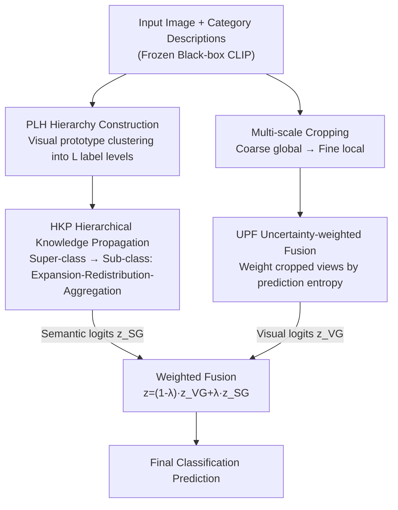

# Boosting Visual Reprogramming for CLIP with Dual Granularity Alignment

**Conference**: CVPR 2026  
**Paper**: [CVF Open Access](https://openaccess.thecvf.com/content/CVPR2026/html/Wu_Boosting_Visual_Reprogramming_for_CLIP_with_Dual_Granularity_Alignment_CVPR_2026_paper.html)  
**Code**: https://github.com/JiayangWU66/DGA  
**Area**: Multimodal VLM  
**Keywords**: Visual Reprogramming, CLIP Few-shot, Label Hierarchy, Multi-scale Alignment, Uncertainty Weighting  

## TL;DR
Addressing the flaw of "single-level alignment" in CLIP visual reprogramming (which only trains visual prompts at the input while freezing the black-box CLIP), this paper proposes DGA. DGA extracts two overlooked types of structural information—semantic granularity (label hierarchy) and visual granularity (multi-scale). It uses PLH+HKP for hierarchical semantic alignment and multi-scale cropping + UPF for uncertainty-weighted visual alignment. These two paths collaborate to achieve an average improvement of 4.5% over the previous SOTA (DVP) across 12 recognition datasets.

## Background & Motivation
**Background**: Model reprogramming is a parameter-efficient black-box adaptation paradigm that avoids modifying the internal structure or parameters of a pre-trained model, learning transformations only at the input/output. For CLIP, this manifests as **Visual Reprogramming (VR)**: freezing the CLIP image/text encoders and learning a trainable perturbation (visual prompt, VP) added to the input image to "borrow" CLIP's vision-language alignment for downstream classification. Formally, VR optimizes an input transformation $\delta$:

$$\tilde{x}_i = \mathrm{Pad}(x_i) + \delta \odot M$$

where $M$ is a binary mask (0 for the image area, 1 for the outer ring), ensuring the VP is only applied to the periphery without altering CLIP internals. This is particularly practical for data-scarce scenarios where only black-box APIs are accessible.

**Limitations of Prior Work**: Existing VR methods, from VP and AR to AttrVR and DVP, focus on **single-level alignment**—matching the "VP-augmented image" directly with the "class text description." They treat images as flat entities and classes as isolated labels, failing to utilize the structural information naturally present in the data.

**Key Challenge**: Discriminative features for different categories are distributed across **different levels of visual detail** (coarse scales for global context, fine scales for local discriminative regions), and categories share **hierarchical semantic relationships** (fine-grained classes can be grouped into superclasses). Single-level alignment flattens both "granularities," leading to insufficient alignment learned by the VP.

**Goal**: Explicitly model these two overlooked structural types during the VP training process, enabling the VP to perceive both visual granularity (multi-scale) and semantic granularity (label hierarchy).

**Key Insight**: When constructing semantic hierarchies, one **should not use text descriptions to calculate category similarity** (due to the modality gap where text similarity may not reflect visual separability). Instead, CLIP's **visual prototypes** should be used for clustering, ensuring the hierarchy is "aligned with the target modality's features."

**Core Idea**: Replace single-level alignment with dual granularity alignment (visual + semantic). Visual granularity is handled via multi-scale cropping with uncertainty-weighted fusion, while semantic granularity is managed via visual prototype clustering combined with top-down hierarchical knowledge propagation.

## Method

### Overall Architecture
DGA (Dual Granularity Alignment) is a VP training framework. The input consists of a batch of labeled downstream images and class text descriptions; the output is a set of trained visual prompts $\delta$ and final classification logits. It consists of two parallel branches and a fusion head:

- **Semantic Granularity (SG) Branch**: First uses **PLH** to cluster all categories bottom-up based on visual prototype similarity into $L$ hierarchical levels (e.g., sub-class → mid-class → super-class), where each level corresponds to a set of VPs and hierarchical descriptions. Then, **HKP** is used to let super-class knowledge constrain sub-classes top-down—super-class VPs are averaged into the global VP, and super-class logits are injected into sub-class predictions via "expansion-redistribution-aggregation."
- **Visual Granularity (VG) Branch**: Performs **multi-scale random cropping** on each image (coarse for global, fine for local), with each scale assigned its own local VP $\delta_e^{local}$. It then uses **UPF** to calculate reliability weights based on prediction entropy for each cropped view, suppressing poor predictions where key objects might be missing or view quality is low.
- **Fusion Head**: Logits from both branches are combined using a weight $\lambda$ to obtain the final prediction. The loss function supervises both sub-class and hierarchical classification.

### Key Designs

**1. PLH Hierarchy Construction: Building label hierarchies with visual prototype similarity to bypass the modality gap**

To perform semantic granularity alignment, a category hierarchy tree is required. The authors argue against using text descriptions for category distance calculations, as the modality gap makes text similarity deviate from visual separability. PLH (Prototype-guided Label Hierarchization) uses CLIP **visual features** instead: first, zero-shot CLIP extracts visual features for all samples; for each category $c$, the mean of all sample features is taken as the **visual prototype** $p_c = \frac{1}{N_c}\sum_{i\in I_c} f_i$. Then, **bottom-up agglomerative clustering** is performed: starting with each category as its own cluster, the pair with the smallest Euclidean distance $d_{ij}=\|p_i-p_j\|$ between prototypes is merged repeatedly until $L$ levels $\{H_l\}_{l=1}^L$ are constructed. The resulting super-class divisions are based on similarity in the CLIP visual space, naturally fitting the target modality of VR.

**2. HKP Hierarchical Knowledge Propagation: Top-down constraint of sub-class VPs and predictions by super-class knowledge**

The hierarchy tree alone is insufficient; knowledge from upper levels (super-classes) must "propagate" to lower levels (sub-classes). HKP (Hierarchical Knowledge Propagation) performs top-down propagation at two levels. First, at the **VP level**: the global branch VP is calculated as the average of its own VP and all $L$ super-class VPs, $\delta_{global} = \frac{1}{L+1}\left(\delta_0 + \sum_{k=1}^{L}\delta_k\right)$, letting super-class prompts constrain sub-class feature extraction. Second, at the **logits level**: for each hierarchical logit $z_i^{(l)}$, three steps are performed—**expansion** copies super-class logits to all subordinate sub-classes, $z_{i,c}^{(exp),(l)} = z_{i,s}^{(l)},\ \forall c\in S_s^{(l)}$; **redistribution** allocates the expanded values based on the sub-classes' own normalized confidence, $\tilde{z}_{i,c}^{(l)} = z_{i,c}^{(exp),(l)}\cdot \frac{\exp(z_{i,c})}{\sum_{c'}\exp(z_{i,c'})}$; and **aggregation** averages these results to obtain the semantic logits $z_i^{SG} = \frac{1}{L}\sum_{l=1}^{L}\tilde{z}_i^{(l)}$. This ensures super-class priors shape VPs and act as distribution priors for sub-class predictions.

**3. UPF Uncertainty-weighted Fusion: Multi-scale cropping + filtering bad views via entropy**

The visual granularity branch uses multi-scale sampling: given original dimensions $S_0$ and a scale decrement $\Delta$, the $e$-th scale crop size is $S_e = S_0 - \Delta\cdot e$. Crops are bilinearly interpolated back to $S_0$ and associated with scale-specific local VPs $\delta_e^{local}$. To handle cases where random cropping excludes key objects, UPF (Uncertainty-calibrated Prediction Fusion) uses **prediction entropy** as a quality metric: entropy $H_i^{(j)} = -\sum_c p_{i,c}^{(j)}\log p_{i,c}^{(j)}$ is calculated for each cropped view $j$. Views with entropy below a threshold $H_0$ (more certain) receive positive weights $w_i^{(j)} = H_0 - H_i^{(j)}$, while others are zeroed, followed by L1 normalization $\hat{w}_i = w_i/\|w_i\|_1$. The fused logits for that scale are $z_i^e = \sum_j z_i^{(j)}\cdot\hat{w}_i^{(j)}$.

### Loss & Training
Logits from both paths are fused with weight $\lambda$ as $z_i = (1-\lambda)\cdot z_i^{VG} + \lambda\cdot z_i^{SG}$. The training objective constrains both sub-class and hierarchical levels:

$$\mathcal{L}_{total} = \mathcal{L}_{sub} + \mathcal{L}_{hier}$$

The sub-class loss $\mathcal{L}_{sub} = -\log \frac{\exp(z_{i,y_i})}{\sum_j \exp(z_{i,j})}$ is standard cross-entropy, while hierarchy supervision $\mathcal{L}_{hier} = -\frac{1}{L}\sum_{l=1}^{L}\log \frac{\exp(z_{i,y_i}^{(l)})}{\sum_j \exp(z_{i,j}^{(l)})}$ uses labels $y_i^{(l)}$ for each level. Only VP parameters are updated using SGD (lr=40, momentum 0.9, cosine annealing, 200 epochs).

## Key Experimental Results

### Main Results
In a 16-shot setting using ViT-B/16 CLIP across 12 datasets:

| Dataset | VP | AttrVR | DVP-CSE | DGA (Ours) |
|--------|------|--------|---------|-----------|
| Aircraft | 32.1 | 36.6 | 40.3 | **51.8** |
| Cars | 65.5 | 68.3 | 72.5 | **84.4** |
| DTD | 61.4 | 65.6 | 66.7 | **73.9** |
| Flowers | 82.5 | 92.9 | 95.4 | **97.6** |
| SUN | 65.8 | 69.6 | 71.1 | **76.9** |
| ImageNet | 64.2 | 69.4 | 70.0 | **72.7** |
| **12-Dataset Avg** | 73.5 | 77.7 | 79.3 | **83.8** |

The average 83.8% performance exceeds DVP-CSE (79.3%) by 4.5%. Fine-grained datasets saw the largest increases (Aircraft +11.5, Cars +11.9), validating the VG module's focus on discriminative visual details.

### Ablation Study
Averaged across SUN, UCF, Pets, and Aircraft:

| Configuration | Avg Acc | Description |
|------|---------|------|
| Full Model (VG+UPF+SG+HKP) | **77.3** | Complete model |
| w/o HKP | 75.6 | Kept SG logit expansion, removed redistribution+aggregation |
| w/o SG | 76.4 | Semantic branch removed |
| w/o UPF | 75.7 | Multi-crop simplified to average |
| w/o VG | 75.5 | Visual branch removed |

### Key Findings
- **VG branch contributes more, especially on difficult datasets**: Removing VG causes Aircraft to drop from 51.0→48.4, confirming the value of multi-scale modeling for "critical discriminative details."
- **UPF/HKP are the "souls" of the branches**: Separately removing UPF or HKP leads to drops nearly as large as removing the entire branch, suggesting multi-scale/hierarchical data isn't useful without proper weight fusion or knowledge propagation.
- **Robustness and practicality**: Standard deviation for $\lambda$ across datasets is < 0.5% (optimum around 0.7), and the UPF threshold is stable. This allows a single hyperparameter set across all datasets.

## Highlights & Insights
- **The intuition that hierarchical trees should use visual prototypes instead of text is correct**: For CLIP, text similarity often deviates from visual separability due to the modality gap. Using CLIP visual prototypes for clustering ensures the hierarchy fits the target modality.
- **Entropy as a reliability weight for cropped views is simple and training-free**: UPF doesn't require extra quality assessment networks; it uses softmax entropy + a threshold to suppress poor views, making it a plug-and-play trick.
- **HKP's "expansion-redistribution-aggregation" turns hierarchical priors into soft constraints**: Unlike rigid hierarchical loss, it redistributes super-class confidence based on sub-class confidence, injecting priors without erasing sub-class discriminability.
- The method remains black-box friendly as it never touches CLIP internals; all gains come from how inputs are organized and outputs are fused.

## Limitations & Future Work
- **Computational overhead**: Dependence on multi-scale cropping and hierarchical VPs increases costs for training and inference (proportional to scale count $E$ and levels $L$).
- **Dependence on CLIP zero-shot prototypes**: In domains far from CLIP's pre-training distribution (e.g., medical imaging), zero-shot features may be inaccurate, leading to poor hierarchies.
- Future direction: Making the number of hierarchy levels or scales adaptive based on dataset complexity rather than fixed.

## Related Work & Insights
- **vs DVP**: DVP improves reliability through decoupling and reweighting multiple VPs but remains single-level. DGA's multi-level structure is why it significantly outperforms DVP on fine-grained tasks like Aircraft and Cars.
- **vs AttrVR**: AttrVR uses LLM-generated attributes to guide single VPs. DGA upgrades this to "multi-hierarchical/multi-scale VPs × hierarchical descriptions."
- **vs Prompt Learning (e.g., CoOp, VPT)**: Prompt learning requires accessing and modifying the internal architecture (inserting tokens), whereas DGA treats CLIP as a complete black box, making it suitable for restricted API scenarios.

## Rating
- Novelty: ⭐⭐⭐⭐ Explicitly introducing dual granularity structures into VR and using visual prototypes for hierarchies is novel and self-consistent.
- Experimental Thoroughness: ⭐⭐⭐⭐ 12 datasets, 4 backbones, and full ablation, though limited to 16-shot.
- Writing Quality: ⭐⭐⭐⭐ Clear formulas and logic; the pipeline diagram is dense but accurate.
- Value: ⭐⭐⭐⭐ Black-box friendly and robust; a practical step for CLIP few-shot adaptation.

<!-- RELATED:START -->

## Related Papers

- [\[CVPR 2026\] Granulon: Awakening Pixel-Level Visual Encoders with Adaptive Multi-Granularity Semantics for MLLM](granulon_awakening_pixel-level_visual_encoders_with_adaptive_multi-granularity_s.md)
- [\[CVPR 2026\] IsoCLIP: Decomposing CLIP Projectors for Efficient Intra-modal Alignment](isoclip_decomposing_clip_projectors_for_efficient_intramodal_alignment.md)
- [\[CVPR 2026\] Boosting Document Parsing Efficiency and Performance with Coarse-to-Fine Visual Processing](boosting_document_parsing_efficiency_and_performance_with_coarse-to-fine_visual_.md)
- [\[CVPR 2026\] β-CLIP: Text-Conditioned Contrastive Learning for Multi-Granular Vision-Language Alignment](b-clip_text-conditioned_contrastive_learning_for_multi-granular_vision-language_.md)
- [\[CVPR 2026\] Semantic Noise Reduction via Teacher-Guided Dual-Path Audio-Visual Representation Learning](semantic_noise_reduction_via_teacher-guided_dual-path_audio-visual_representatio.md)

<!-- RELATED:END -->
