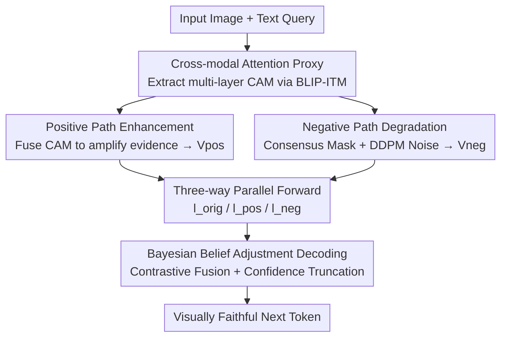

# Breaking the Illusion: When Positive Meets Negative in Multimodal Decoding

**Conference**: CVPR 2026  
**arXiv**: [2605.06679](https://arxiv.org/abs/2605.06679)  
**Code**: https://github.com/JiangYubo4399/PND (Available)  
**Area**: Multimodal VLM / Hallucination Suppression / Inference-time Decoding  
**Keywords**: Object Hallucination, Contrastive Decoding, Cross-modal Attention, Bayesian Belief Adjustment, Training-free  

## TL;DR
Addressing the "over-reliance on language priors and neglect of visual evidence" in Vision-Language Models (VLMs) that leads to object hallucinations, this paper proposes a training-free Positive-and-Negative Decoding (PND). By using an external BLIP cross-modal attention to locate visual evidence, PND constructs a "positive path" to amplify evidence and a "negative path" to erase evidence and expose priors. During each decoding step, logits from three paths are contrastively fused to pull generation toward visual facts, achieving up to a 6.5% accuracy improvement on POPE.

## Background & Motivation
**Background**: Modern VLMs (LLaVA, InstructBLIP, Qwen-VL, etc.) connect pretrained visual encoders to powerful LLMs via lightweight adapters. Through visual instruction tuning, they have gained excellent multimodal dialogue capabilities and become the mainstream paradigm.

**Limitations of Prior Work**: Such models frequently produce **object hallucinations**—describing objects absent from the image (false positive) or ignoring clearly present objects (false negative). The root cause is that these models inherit the massive parametric knowledge of LLMs, where strong language priors easily override actual visual evidence.

**Key Challenge**: The authors characterize hallucination as a **Bayesian inference imbalance**. VLM generation is determined by the competition between language prior $p(y\mid x_t)$ (learned word-concept co-occurrence bias) and visual likelihood $p(x_v\mid y)$ (image evidence constraints), i.e., $p(y\mid x_v,x_t)\propto p(y\mid x_t)\cdot p(x_v\mid y)$. Hallucination occurs when generation becomes "prior-dominated." A critical empirical finding is the **attention deficit** in cross-modal attention: visual patches receive about 13.7% of the attention budget in shallow layers, dropping to 6.2% in middle layers and only 4.9% in deep layers. Deep layers are almost entirely occupied by user instructions and system prompts, indicating that visual likelihood is systematically underestimated as depth increases.

**Limitations of Prior Work**: Inference-time contrastive decoding, represented by VCD, utilizes **single-path perturbation**—adding noise or destroying the entire image and then penalizing tokens that remain unchanged. This has two issues: excessive perturbation can remove key semantics and damage grounding; furthermore, as a unidirectional destructive path, it further suppresses naturally weak evidence for real objects (e.g., a frisbee), preventing recovery from lost evidence and causing the model to continue denying their existence. These methods neither amplify evidence nor cleanly isolate the language prior.

**Core Idea**: Instead of using only one destructive perturbation, the authors propose a **symmetrical two-pronged attack**: one path amplifies visual evidence (raising likelihood), while the other precisely erases minimal evidence (isolating the prior). By contrasting the outputs of both paths during decoding, bidirectional pressure is applied to suppress hallucinations, pushing generation toward "visual support" and away from "prior fabrication."

## Method

### Overall Architecture
PND is an inference-only, plug-and-play decoding framework requiring no retraining. Given an input image and text query, it first utilizes an external BLIP-ITM model to extract multi-layer cross-modal attention maps to estimate where "visual evidence" resides. Based on this, two modified visual representations are constructed: the **positive view** $\mathbf{V}_{\mathrm{pos}}$ (amplifying evidence) and the **negative view** $\mathbf{V}_{\mathrm{neg}}$ (erasing evidence). The original, positive, and negative views are fed into the same VLM to obtain three sets of logits ($\mathbf{l}_{\mathrm{orig}}, \mathbf{l}_{\mathrm{pos}}, \mathbf{l}_{\mathrm{neg}}$). Finally, a "belief adjustment" objective fuses the three paths to determine the final next-token distribution. The core intuition is that tokens truly dependent on visual likelihood will shift drastically between positive and negative views, while prior-dominated (hallucinated) tokens are nearly insensitive to visual perturbations—this shift serves as the signal to distinguish "visual facts" from "linguistic fabrications."

### Key Designs

**1. Cross-modal Attention Proxy: Separating "Evidence" from "Context"**
To intervene in hallucinations, one must identify "visual evidence" versus "context that reinforces language priors." However, explicitly decomposing VLM hidden features is intractable. The authors use an **external** VL模型 model (BLIP-ITM) as a differentiable, architecture-agnostic proxy: calculating attention maps $\mathbf{A}_i=\mathrm{softmax}\!\left(\mathbf{Q}_{\text{text}}(\mathbf{K}_{\text{vis}}^{(i)})^{\top}/\sqrt{d_k}\right)$ at layer $i$. These maps quantify which visual patches relate to the query. This is designed because the authors found systematic patterns across CAM layers: shallow layers focus on fine-grained object regions, while deep layers shift toward global semantics with a sharp drop in visual attention (13.7%→4.9%), corresponding to "likelihood decay and prior accumulation." Using an external model decouples the proxy from the target VLM, making it applicable to any architecture.

**2. Positive Path Enhancement: Explicitly Amplifying Underestimated Visual Likelihood**
Addressing the "attention deficit," the positive path "brightens" evidence regions. It fuses multi-layer normalized attention maps into a saliency map $\mathbf{M}_{\mathrm{fused}}=\frac{1}{L}\sum_{i=1}^{L}\hat{\mathbf{A}}_i$, highlighting regions the model implicitly associates with the query (the evidence component). It then uses multiplicative modulation: $\mathbf{V}_{\mathrm{pos}}=\mathbf{V}_{\mathrm{orig}}\odot(1+\lambda\cdot\mathbf{M}_{\mathrm{fused}})$, where $\lambda$ controls intensity. Crucially, this operation **does not change image semantics** but gradually increases the relative significance of evidence features, encouraging the model to reflect visual likelihood during decoding and countering the defect where deep visual attention is nearly zero.

**3. Negative Path Degradation: Erasing Minimal Evidence to Expose Language Priors**
The negative path creates a counterfactual visual input to **isolate** the language prior. Since deep layers only allocate ~4.9% attention to visuals, global noise is wasteful. Instead, the authors **remove only the minimal evidence identified by multi-layer CAM consensus**. By taking the pixel-wise minimum of normalized attention maps, a consensus map $\mathbf{M}_{\mathrm{consensus}}=\min(\hat{\mathbf{A}}_1,\ldots,\hat{\mathbf{A}}_L)$ is obtained (a conservative estimate), then thresholded into a binary mask $\mathbf{M}_{\mathrm{mask}}=\mathbb{I}[\mathbf{M}_{\mathrm{consensus}}\geq\tau]$. For degradation, they use **DDPM forward noise**: $\mathbf{V}_{\mathrm{noise}}=\sqrt{\bar{\alpha}_T}\,\mathbf{V}_{\mathrm{orig}}+\sqrt{1-\bar{\alpha}_T}\,\boldsymbol{\epsilon}$, as DDPM erosion yields features that are **distributionally reasonable and semantically aligned**, avoiding outlier artifacts caused by Gaussian noise. This approach preserves most visual context but severes the specific evidence the model relies on, exposing prior-driven hallucination tendencies.

**4. Bayesian Belief Adjustment Decoding: Three-way Contrast + Confidence Truncation**
With $\mathbf{l}_{\mathrm{orig}}, \mathbf{l}_{\mathrm{pos}}, \mathbf{l}_{\mathrm{neg}}$, PND synthesizes them via contrastive update: $\mathbf{l}_{\mathrm{PND}}=\mathbf{l}_{\mathrm{orig}}+\alpha\,\mathbf{l}_{\mathrm{pos}}-\gamma\,\mathbf{l}_{\mathrm{neg}}$, where $\alpha,\gamma\geq 0$. The positive term boosts candidates with visual support, while the negative term suppresses prior-driven tokens surviving without visual support. To avoid unreasonable candidates, confidence truncation is applied: $\mathbf{l}_{\mathrm{final}}=\mathbf{l}_{\mathrm{PND}}\odot\mathbb{I}[\mathbf{l}_{\mathrm{orig}}\geq\log(\beta)+\max(\mathbf{l}_{\mathrm{orig}})]$, where $\beta$ is the threshold. This step maps the constructed visual signals onto token selection.

### Loss & Training
PND is **completely training-free**, with no learnable parameters or backpropagation. The cost is the overhead of three parallel forward passes and one BLIP attention extraction. The authors argue this is much lighter than training-based methods (RLHF, dataset curation, or architectural changes) and can be enabled on-demand. Key hyperparameters include $\lambda, \alpha, \gamma, \beta, \tau$, and $T$; fixed hyperparameters were used throughout the main experiments.

## Key Experimental Results

### Main Results
Evaluation covers 4 complementary benchmarks: POPE (Yes/No object-level hallucination), MME (perception and attribute-level capability), CHAIR (open-ended description hallucination), and GCCCE (a self-constructed metric using GPT-4.1 to judge Relevancy, Accuracy, Common Sense, and Fine-grained Precision). Backbones include LLaVA, InstructBLIP, InternVL, and Qwen-VL.

POPE Main Results (selected, comparison with baseline, VCD, VAF, AGLA):

| Model | Subset | Method | Accuracy | F1 |
|------|------|------|----------|-----|
| LLaVA1.5-7B | adversarial | regular | 78.53 | 77.04 |
| LLaVA1.5-7B | adversarial | AGLA | 83.13 | 82.21 |
| LLaVA1.5-7B | adversarial | **PND** | **84.03** | **83.48** |
| LLaVA1.5-7B | popular | regular | 81.56 | 84.87 |
| LLaVA1.5-7B | popular | **PND** | **86.10** | **88.79** |
| LLaVA1.5-7B | random | **PND** | **87.33** | **93.41** |
| InstructBLIP-7B | random | regular | 81.10 | 80.70 |
| InstructBLIP-7B | random | **PND** | **87.63** | **86.73** |

The authors report an average improvement of 6.4% in Accuracy and 5.5% in F1 on POPE relative to the greedy decoding baseline. The gains are largest on the popular/adversarial subsets designed to induce hallucinations using strong but incorrect language priors.

On MME (Tab. 2), PND achieves SOTA in object-level categories (Existence, Count) and improves fine-grained attributes (Position, Color). LLaVA1.5-7B's total score rose from 531.67 (regular) to **621.67**. On CHAIR (Tab. 3), hallucination metrics dropped significantly ($\mathcal{C}_s$ 51.0 → **46.0**), while Recall actually increased (74.4→78.1).

### Ablation Study
Deconstructing the dual paths on POPE (Tab. 4, LLaVA1.5-7B adversarial):

| Configuration | Accuracy | F1 | Note |
|------|----------|-----|------|
| Baseline (Original only) | 78.53 | 77.04 | Greedy decoding |
| + Positive only | 83.14 | 82.21 | Visual likelihood amplification only |
| + Negative only | 82.23 | 80.67 | Language prior penalty only |
| Original + Positive | 83.60 | 82.35 | Dual-view combination |
| **Full PND (3-way)** | **84.03** | **83.48** | Complete model |

### Key Findings
- **Dual Paths are Synergistic, Not Redundant**: Both P-only and N-only significantly outperform the baseline, but full PND exceeds both. The positive path acts as an "enhancer" for grounded details, while the negative path acts as a "suppressor" for fabricated content.
- **Greater Gains in "Prior Traps"**: Subsets like popular/adversarial, which use plausible language priors to induce errors, see the most significant boosts from PND.
- **Hyperparameter Sensitivity**: Performance is most sensitive to the $\alpha$–$\gamma$ balance controlling Bayesian adjustment; visual grounding is strongest under near-deterministic decoding (low temperature).

## Highlights & Insights
- **Bayesian Reframing of Hallucination**: Using $p(y\mid x_v,x_t)\propto p(y\mid x_t)\cdot p(x_v\mid y)$ to explicitly separate priors from likelihood, backed by empirical data on "attention deficit," provides a clear causal narrative for the intervention.
- **Symmetrical Contrastive Decoding**: Unlike VCD-style single-path destruction which can't recover weak evidence, PND's symmetrical "amplify + precisely erase" approach applies bidirectional pressure, representing a major conceptual shift.
- **DDPM Noise as Counterfactual**: Using diffusion forward noise instead of Gaussian noise yields distributionally reasonable features, preventing the model from simply ignoring outlier artifacts and making the negative path's counterfactual effective.
- **Architecture-Agnostic via External Proxy**: By not touching the target VLM's weights and relying on an external model for evidence localization, PND is easily plug-and-play across diverse architectures (LLaVA, Qwen-VL, etc.).

## Limitations & Future Work
- **Inference Overhead**: Triple forward passes plus BLIP attention extraction introduce "modest overhead," requiring a trade-off in real-time scenarios.
- **Dependency on External Model Quality**: Evidence localization is entirely dependent on BLIP-ITM's cross-modal attention; inaccuracies there could mislead both positive and negative views.
- **Hyperparameter Sensitivity**: The $\alpha$–$\gamma$ balance is sensitive, and while fixed parameters were used, the robustness across all possible tasks remains to be fully explored.
- **GCCCE Benchmark Concerns**: The use of a self-developed benchmark and GPT-4.1 as the judge raises concerns about evaluation loops and reproducibility.

## Related Work & Insights
- **vs. VCD (Visual Contrastive Decoding)**: VCD uses single-path visual perturbation to penalize unchanged tokens but can be overly destructive. PND's dual-path approach is more precise and yields better performance on POPE/CHAIR.
- **vs. AGLA (Assembly of Global and Local Attention)**: AGLA mitigates hallucinations via attention reorganization. PND outperforms AGLA on most POPE settings and MME total scores by adding the "negative path counterfactual" channel to suppress priors.
- **vs. Training-based Methods**: While training is effective, it is computationally expensive and can damage other multimodal capabilities. PND offers a training-free, on-demand alternative.

## Rating
- Novelty: ⭐⭐⭐⭐ Bayesian framing + symmetrical contrast + DDPM counterfactuals.
- Experimental Thoroughness: ⭐⭐⭐⭐ Extensive benchmarks and backbones, though some efficiency analysis is relegated to the supplement.
- Writing Quality: ⭐⭐⭐⭐ Smooth derivation from Bayesian motivation to method, well-supported by attention deficit data.
- Value: ⭐⭐⭐⭐ Pragmatic, training-free, and cross-architecture solution for VLM object hallucination.

<!-- RELATED:START -->

## Related Papers

- [\[CVPR 2026\] Illusion-Aware Visual Preprocessing and Anti-Illusion Prompting for Classic Illusion Understanding in Vision-Language Models](illusion-aware_visual_preprocessing_and_anti-illusion_prompting_for_classic_illu.md)
- [\[CVPR 2026\] When to Think and When to Look: Uncertainty-Guided Lookback](when_to_think_and_when_to_look_uncertainty-guided_lookback.md)
- [\[CVPR 2026\] Breaking Multimodal LLM Safety via Video-Driven Prompting](breaking_multimodal_llm_safety_via_video-driven_prompting.md)
- [\[CVPR 2026\] Breaking the Regional Perception Bottleneck of Multimodal Large Language Models via External Reasoning Framework](breaking_the_regional_perception_bottleneck_of_multimodal_large_language_models_.md)
- [\[ICLR 2026\] ICYM2I: The Illusion of Multimodal Informativeness under Missingness](../../ICLR2026/multimodal_vlm/icym2i_the_illusion_of_multimodal_informativeness_under_missingness.md)

<!-- RELATED:END -->
