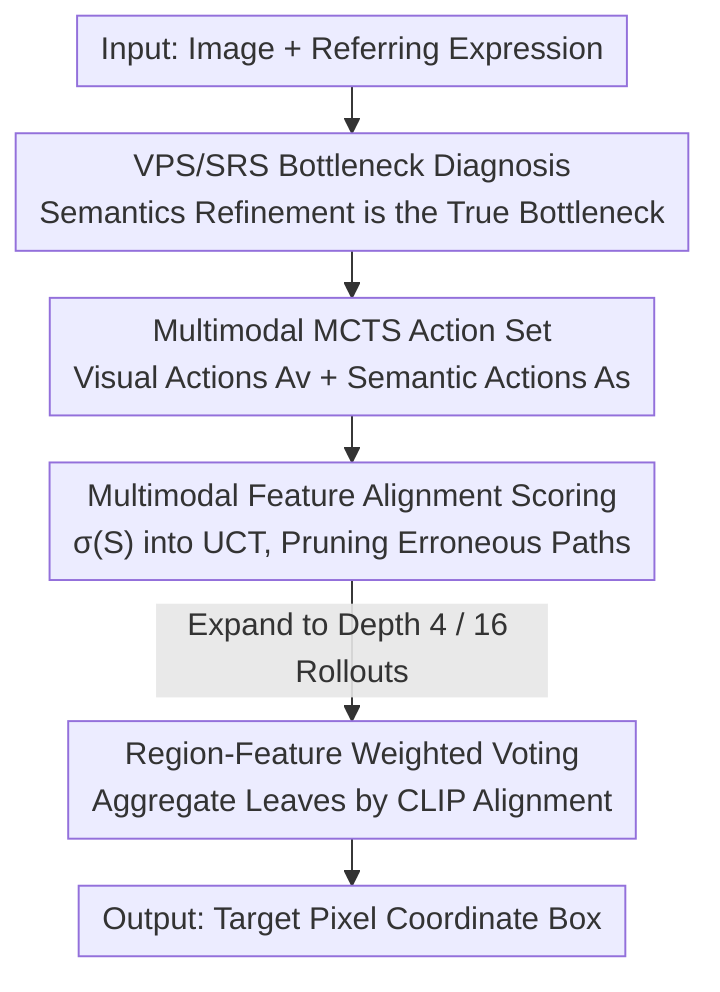

# Breaking the Regional Perception Bottleneck of Multimodal Large Language Models via External Reasoning Framework

**Conference**: CVPR 2026  
**Paper**: [CVF Open Access](https://openaccess.thecvf.com/content/CVPR2026/html/Zhang_Breaking_the_Regional_Perception_Bottleneck_of_Multimodal_Large_Language_Models_CVPR_2026_paper.html)  
**Code**: None  
**Area**: Multimodal VLM  
**Keywords**: Regional perception, visual grounding, Multimodal MCTS, reasoning scaling, feature alignment  

## TL;DR
This paper identifies that the true bottleneck for Multimodal Large Language Models (MLLMs) in pixel-level grounding lies not in "seeing the region" but in the "translating the region into coordinates" (semantics refinement) stage. It proposes R-Ground, an external reasoning framework based on Multimodal Monte Carlo Tree Search (MCTS), which directs computational power specifically to this stage, enabling a 7B model to outperform a 72B model on the RefCOCO series.

## Background & Motivation
**Background**: MLLMs have evolved from "image-level QA" to "fine-grained perception of specific regions," where grounding—outputting pixel coordinates for a given description—is the most challenging task. Mainstream approaches fall into two categories: one attaches a regression decoder to MLLM deep features (e.g., LLaVA-Grounding, GLaMM), which is accurate but breaks the end-to-end generation paradigm and requires extra training; the other uses pure MLLMs to "speak" coordinate text (e.g., Shikra, Ferret, Qwen-VL), maintaining end-to-end consistency but suffering from lower precision.

**Limitations of Prior Work**: The second approach follows the LLM tradition of scaling via parameter and data growth. However, empirical tests show that gains in grounding tasks are far smaller than in general QA: scaling Qwen2.5-VL from 7B to 72B only improves RefCOCO+ val from 84.2 to 88.9. This massive investment for marginal returns suggests that "blindly scaling the whole model" misses the mark.

**Key Challenge**: The authors perform a critical representation analysis (Section 3) and find that the LM decoder naturally splits into two phases when processing multimodal information: a shallow **Visual Perception Stage (VPS)**, which continuously strengthens regional information into hidden states, and a deep **Semantics Refinement Stage (SRS)**, which maps visual representations to coordinate text. Two phenomena are crucial: (1) **PSR (Perception-to-Semantics Refinement)**—measured by the cosine similarity between each layer’s hidden state and target regional features, similarity rises then falls; the point where it drops below the first layer defines the VPS↔SRS boundary; (2) **SDSG (Semantics-Dominated Scaling Gap)**—feeding hidden states to a DETR decoder shows that 7B and 72B models are nearly equal in VPS (best performance difference only 1.6% in a grounding setting), but the gap widens entirely in SRS (13.4% difference at the final layer).

**Goal**: Since models of different scales are comparable in "seeing the region" and only differ in "refining semantics," the objective is to avoid uniform scaling of the entire model (wasting compute on VPS) and instead perform **targeted scaling exclusively on SRS**.

**Key Insight**: Standard CoT follows fixed templates and cannot dynamically reinforce specific reasoning stages. The authors notice that "the task setting itself can guide the MLLM to direct effective compute to certain stages" (SRS starts much earlier in a REG setting than in a grounding setting). They thus assign the choice of task settings and reasoning paths to a self-evolving search algorithm.

**Core Idea**: An external, multimodal MCTS reasoning framework is used to directionally expand computation into the semantics refinement stage at test-time. Without altering MLLM weights, it pushes a 7B model's grounding capability beyond that of a 72B model via a carefully designed action set, multimodal alignment scoring, and weighted voting.

## Method

### Overall Architecture
R-Ground is an **external, test-time reasoning framework** that does not finetune the MLLM. Input consists of an image and a referring expression; output is the target's pixel coordinate box. It decomposes the grounding problem $X$ into a search tree $T$: each node is a state $S$ generated by a reasoning action $A$ under a specific task setting, forming a path $P = X \oplus S_1 \oplus S_2 \oplus \dots \oplus S_c$.

The pipeline consists of three steps: (1) expanding the search tree in MCTS using an **action set** (visual-dominated $A_v$ + semantic-dominated $A_s$), where the higher ratio of semantic actions shifts the reasoning focus toward SRS; (2) integrating a **multimodal feature alignment score** $\sigma(S)$ into the standard UCT for node selection to stabilize the search and prune erroneous paths; (3) aggregating final boxes from all valid leaf nodes using **region-feature weighted voting** once the tree is built. MCTS depth is set to 4 with 16 rollouts.

### Key Designs

**1. Multimodal MCTS Action Set: Shifting Compute to Semantics Refinement**

Addressing the root cause that standard scaling wastes compute on VPS without enhancing SRS, R-Ground designs reasoning actions that encourage the MLLM to explore semantics refinement. Actions are categorized into **Visual-dominated actions $A_v$** (grounding setting, strengthening region observation) and **Semantic-dominated actions $A_s$** (REG setting, strengthening refinement into descriptions). Five specific actions are used: $A_v^1$ Global Grounding (locating the target in the full image using path context to balance VPS/SRS); $A_v^2$ Local Grounding (re-locating only within the previous box to suppress hallucinated oversized boxes; triggered only after $A_v$); $A_s^3$ Non-spatial State Judgment (masking coordinates to judge target existence via text cues; **terminates path** if target is absent); $A_s^4$ Spatial State Judgment (verifying if the content within a box matches descriptions; terminates path on mismatch); $A_s^5$ Description Reconstruction (aggregating text/position history to rewrite a precise description for subsequent steps).

The design intentionally provides **more semantic actions than visual ones** to execute "targeted SRS enhancement." Unlike fixed CoT chains, MCTS adaptively switches between "looking again" and "refining the description."

**2. Multimodal Feature Alignment Scoring: Cross-modal Alignment instead of Repeated Sampling**

Pure text MCTS (e.g., rStar) calculates node quality $Q(S,A)$ by repeatedly sampling and checking consistency—an expensive process. R-Ground leverages the natural "image-text" reference in multimodal scenarios for alignment scoring $\sigma(S)$ within UCT:

$$UCT^{*}(S,A) = \frac{N_c(S)}{N(S)} + \varphi \cdot \sqrt{\frac{\ln N_{parent}(S)}{N(S)}} + \lambda \cdot \sigma(S)$$

where $\sigma(S)$ is defined as a piecewise function, and $Clip(v,l)$ is the CLIP-based cosine similarity between visual $v$ and text $l$:

$$\sigma(S) = \begin{cases} 1 - \dfrac{1}{1 + Clip(v,l)}, & 0 < Clip(v,l) \le 1, \\[4pt] \ln(1 + Clip(v,l)), & -1 \le Clip(v,l) \le 0. \end{cases}$$

Positive cross-modal correlation ($Clip(v,l)>0$) encourages exploration, while negative correlation causes $\sigma$ to drop sharply toward negative infinity, **truncating subsequent path generation** to prune errors and save compute.

**3. Region-Feature Weighted Voting: Multimodal Alignment over Majority Voting**

Instead of standard majority voting or external LLM scoring, R-Ground weights candidates by alignment:

$$w_i = \alpha \cdot \frac{Clip(v_i, l_i)}{\sum_j Clip(v_j, l_j)} + (1-\alpha) \cdot \frac{Clip(v_i, l_i')}{\sum_j Clip(v_j, l_i')}$$

where $w_i$ is the weight of candidate $i$, $v_i$ is the image region, $l_i$ is the original description, and $l_i'$ is the reconstructed description. $\alpha \in [0,1]$ balances the two. For abstract original descriptions (e.g., "clock closest to 1:45"), increasing the weight of $l_i'$ (reconstructed) significantly improves accuracy. Weighted voting reduces selection error—RefCOCO+ average improves from 86.36 to 91.93.

## Key Experimental Results

### Main Results
On RefCOCO / RefCOCO+ / RefCOCOg (AP@0.5), R-Ground based on Qwen2.5-VL-7B outperforms the 72B version and other reasoning frameworks.

| Method | RefCOCO+ Val | RefCOCOg Test | 8-Task Avg |
|------|------|------|------|
| Qwen2.5-VL 7B (Base) | 84.2 | 87.2 | 86.56 |
| Qwen2.5-VL 72B (Param Scaling) | 88.9 | 90.3 | 90.25 |
| InternVL3-78B | 90.1 | 91.5 | 91.41 |
| UniVG-R1 (Reasoning Framework) | 85.91 | 88.56 | 88.20 |
| **Ours (Qwen2.5-VL-7B)** | **91.67** | 93.16 | **92.93** |
| **Ours (Qwen3-VL-8B)** | **93.45** | **93.21** | **94.47** |

**Key Finding**: 7B + R-Ground (92.93) is 2.68 points higher than 72B parameter scaling (90.25), validating that targeted reasoning scaling is more efficient than parameter scaling for grounding.

### Ablation Study
Conducted on RefCOCO+ (no spatial prompts, relies heavily on multimodal alignment).

| Configuration | RefCOCO+ Val | TestB | Note |
|------|------|------|------|
| Only $A_v^1+A_v^2$ (≈Visual-CoT) | 85.63 | 75.45 | Pure visual refinement |
| Only $A_v^1+A_s^3$ (≈Semantic-CoT) | 89.47 | 82.32 | Pure semantics refinement |
| $A_v^1+A_s^3+A_s^5$ | 90.12 | 84.98 | With reconstruction |
| Full Action Set (R-Ground) | **91.67** | **89.97** | Complete |
| w/o Alignment Scoring | 90.89 | 87.02 | UCT w/o σ(S), FLOPs up to 87.23T |
| w/ Alignment Scoring | **91.67** | **89.97** | FLOPs down to 45.89T |
| Weighted Voting | **91.67** | **89.97** | Avg 91.93 (vs 86.36 for majority) |

## Highlights & Insights
- **Diagnosis-driven Design**: The PSR + SDSG analyses precisely locate the failure of grounding scaling in the SRS. The method (targeted SRS scaling) is a natural, logically sound derivation from the diagnosis.
- **Multimodal Alignment as a Resource**: Instead of viewing multimodal consistency as an overhead, the paper uses CLIP alignment as a tri-functional tool: a scorer, a pruner, and a voting weight.
- **Zero-training Plug-and-play**: Outperforming a 72B model with a 7B model using an external framework without finetuning is practically significant.

## Limitations & Future Work
- **Dependence on CLIP Quality**: The $\sigma(S)$ and voting weights rely entirely on CLIP. For fine-grained or small-scale objects where CLIP might fail, the pruning and voting could be compromised. ⚠️
- **Test-time Overhead**: While pruning reduces FLOPs to 45.89T, it still represents a significantly higher cost compared to a single forward pass, requiring a trade-off for deployment.
- **Limited Benchmarks**: Evaluations are focused on the RefCOCO series; open-vocabulary detection and dense scenes remain untested.

## Related Work & Insights
- **vs. Regression Decoders (Ferret-v2)**: Those require specialized heads and training; R-Ground achieves higher accuracy (92.93 vs. 89.58) through test-time reasoning while remaining zero-training.
- **vs. Linear Reasoning (UniVG-R1)**: Fixed CoT chains cannot adaptively balance perception and refinement. R-Ground's inclusion of semantic actions in MCTS leads to a 7.65 point lead in TestB.

## Rating
- Novelty: ⭐⭐⭐⭐⭐ Combines mechanism diagnosis with targeted Multimodal MCTS.
- Experimental Thoroughness: ⭐⭐⭐⭐ Strong on RefCOCO, but could expand to more diverse grounding tasks.
- Writing Quality: ⭐⭐⭐⭐⭐ Excellent logical flow from diagnosis to implementation.
- Value: ⭐⭐⭐⭐⭐ High practical value for achieving large-model performance with small-model compute.

<!-- RELATED:START -->

## Related Papers

- [\[CVPR 2026\] DiG: Differential Grounding for Enhancing Fine-Grained Perception in Multimodal Large Language Models](dig_differential_grounding_for_enhancing_fine-grained_perception_in_multimodal_l.md)
- [\[CVPR 2026\] Perception Programs: Unlocking Visual Tool Reasoning in Language Models](perception_programs_visual_tool_reasoning.md)
- [\[CVPR 2026\] Grounding Everything in Tokens for Multimodal Large Language Models](grounding_everything_in_tokens_for_multimodal_large_language_models.md)
- [\[CVPR 2026\] Breaking Multimodal LLM Safety via Video-Driven Prompting](breaking_multimodal_llm_safety_via_video-driven_prompting.md)
- [\[CVPR 2026\] CADFS: A Big CAD Program Dataset and Framework for Computer-Aided Design with Large Language Models](cadfs_a_big_cad_program_dataset_and_framework_for_computer-aided_design_with_lar.md)

<!-- RELATED:END -->
