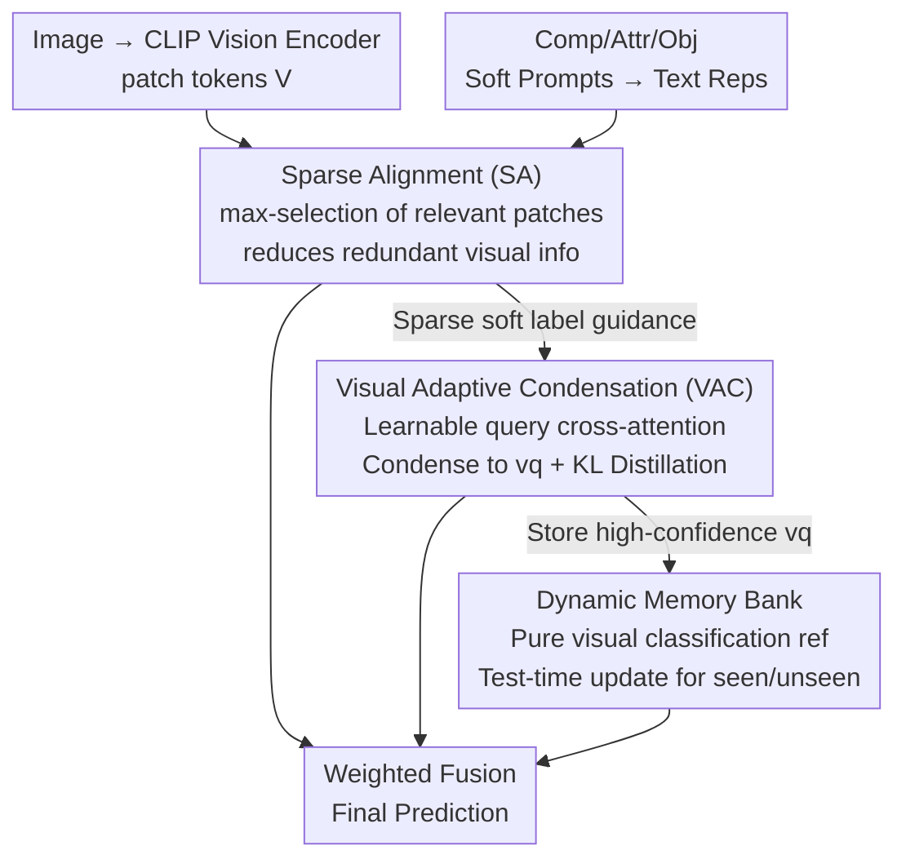

# Bridging the Modality Gap in Compositional Zero-Shot Learning via Sparse Alignment and Unimodal Memory Bank

**Conference**: CVPR 2026  
**Paper**: [CVF Open Access](https://openaccess.thecvf.com/content/CVPR2026/html/Zhang_Bridging_the_Modality_Gap_in_Compositional_Zero-Shot_Learning_via_Sparse_CVPR_2026_paper.html)  
**Code**: Not disclosed  
**Area**: Multimodal VLM  
**Keywords**: Compositional Zero-Shot Learning, Modality Gap, CLIP, Sparse Alignment, Memory Bank  

## TL;DR
Addressing the inherent "modality gap" of CLIP in Compositional Zero-Shot Learning (CZSL), this paper proposes the SAM three-stage framework: Sparse Alignment selects the image patches most relevant to the text to reduce redundant visual information; Visual Adaptive Condensation compresses key cues into a single representation; and a Dynamic Memory Bank bypasses the modality gap through pure visual classification. This approach comprehensively outpaces CLIP-based methods across three benchmarks in both closed-world and open-world settings.

## Background & Motivation
**Background**: Compositional Zero-Shot Learning requires models to learn "primitives" (attributes and objects) from seen combinations (e.g., *white swan*, *black cat*) and generalize to unseen ones (e.g., *black swan*). Recent mainstream approaches leverage CLIP's strong cross-modal alignment, improving recognition through enhanced vision-text alignment, primitive decoupling, preference calibration, and semantic mining.

**Limitations of Prior Work**: Despite strong performance, these methods inherit a fundamental flaw of CLIP: the **modality gap**. This gap refers to the geometric separation between image and text embeddings in CLIP's shared space, causing an image embedding to be "nearly as close to many text categories" rather than tightly bound to its specific description. This is particularly fatal in fine-grained tasks like CZSL, where salient attributes are easily contaminated by the environment (e.g., both "Brown bear" and "Brown platform" contain "Brown," and the model might attend to both).

**Key Challenge**: While previous studies attribute the modality gap to contrastive loss or temperature coefficients, more recent evidence points to a deeper cause: **information imbalance in training pairs**. Text captions usually describe only salient objects, while images encode significantly richer details; this mismatch weakens paired supervision signals. Furthermore, prior CZSL methods typically only use the `[CLS]` token as the visual representation and discard patch tokens, effectively forcing excessive redundant information into the `[CLS]` token.

**Key Insight**: The authors conducted a pilot experiment by randomly dropping patch tokens at the input stage to allow less visual information to aggregate into `[CLS]`. They found that a moderate dropout rate simultaneously improved AUC (from 14.3 to 14.7 on C-GQA) and narrowed the Relative Modality Gap (RMG), with AUC improvements occurring synchronously with RMG reductions. This validates that "controlled reduction of visual information" is an effective strategy for mitigating modality imbalance.

**Core Idea**: Replace the reliance on the global `[CLS]` token by "sparsely aligning text representations directly to the most semantically relevant image patches" to reduce information imbalance at the source. Then, use adaptive condensation to recover useful information that may have been erroneously discarded, and finally use a pure visual memory bank during inference to completely bypass the modality gap.

## Method

### Overall Architecture
SAM shifts the visual representation from the global `[CLS]` token to the **output patch tokens**, resolving the modality gap through three progressive stages. The input consists of a token sequence $V=[v_{\text{CLS}}, v_1, \dots, v_L]\in\mathbb{R}^{(L+1)\times D}$ obtained from image $x$ via the CLIP vision encoder, and representations $t_a, t_o, t_c$ for attributes, objects, and compositions obtained via the text encoder using learnable soft prompts. The output is the predictive distribution for the composition.

Stage I (Sparse Alignment, SA): For each composition text, a max operation selects the most semantically relevant token from all patches, forming a sparse set of selected patches. This yields an information-balanced training paradigm that quickly adapts CLIP to attribute-object recognition. Stage II (Visual Adaptive Condensation, VAC): Since the hard selection in Stage I might discard useful patches, VAC uses a learnable query to condense key information from **all** patches into a single representation $v_q$ via cross-attention. This is constrained by distillation from SA's soft labels, achieving a state where "contextual information is recovered but still governed by the reduced visual signals." Stage III (Dynamic Memory Bank): High-confidence visual representations from VAC are stored in a memory bank. During inference, this bank is continuously updated for both seen and unseen compositions, providing a **purely visual** classification reference that fundamentally bypasses the modality gap in cross-modal alignment. The final prediction is a weighted fusion of the three modules' outputs.

### Key Designs

**1. Sparse Alignment (SA): Using max-selection of patches to replace `[CLS]` to reduce visual redundancy at the source**

The problem is direct: the `[CLS]` token aggregates information from the entire image (including irrelevant context), resulting in significantly more information on the visual side than the text labels, which is the source of the modality gap. SA bypasses `[CLS]` entirely and uses all patches at the output stage. It first calculates a similarity matrix $S=VT_c^\top\in\mathbb{R}^{(L+1)\times|C_s|}$ between all tokens and the "seen composition" text representations $T_c\in\mathbb{R}^{|C_s|\times D}$ (all representations are $\ell_2$ normalized). For each composition $c$, it uses a max operation to extract the score of the most semantically relevant patch:

$$s_c = \max_{l=1}^{L+1} S_{l,c}, \quad c=1,2,\dots,|C_s|$$

The resulting sparse scores $s\in\mathbb{R}^{|C_s|}$ redefine the classification objective $p_{sa}(c_i|x)=\dfrac{\exp(s_i/\tau)}{\sum_k \exp(s_k/\tau)}$. Cross-entropy $L_{base}=L_c+L_a+L_o$ is applied to the composition, attribute, and object paths (for attributes/objects, $T_c$ is replaced by $T_a/T_o$).

Why it works: Each patch encodes a local region. Retaining only the most relevant local token for each text preserves discriminative features while suppressing redundancy, naturally forming sparse vision-text alignment. The authors further verified this by mixing SA and `[CLS]` according to $(1-W)\cdot SA + W\cdot[\text{CLS}]$, finding that increasing the `[CLS]` proportion actually degraded performance. This suggests that the excessive information introduced by `[CLS]` contaminates the alignment. Notably, SA **does not perform explicit primitive decoupling**, directly aligning text representations of primitives to retain CLIP's native cross-modal alignment capability.

**2. Visual Adaptive Condensation (VAC): Recovering semantics discarded by SA under SA's guidance**

The hard-rule selection of SA might discard semantic cues crucial to the model. VAC employs a learnable query embedding $q\in\mathbb{R}^{1\times D}$ and $K$ processing blocks (multi-head cross-attention + FFN), allowing the query to **dynamically aggregate** important information from all tokens. This condenses the representation into $v_q$ for prediction: $p_{vac}(c_i|x)=\dfrac{\exp(v_q\cdot t_c^i/\tau)}{\sum_k \exp(v_q\cdot t_c^k/\tau)}$, also paired with base losses $L^{vac}_{base}=L^{vac}_c+L^{vac}_a+L^{vac}_o$.

To prevent VAC from re-introducing redundancy, KL distillation is introduced to align the VAC distribution with the reduced distribution of SA:

$$L_{kl} = -\frac{1}{|D_{tr}|}\sum_{x\in D_{tr}} p_{vac}\log\frac{p_{vac}}{p_{sa}}$$

The total VAC loss is $L_{vac}=(1-\alpha)\cdot L^{vac}_{base}+\alpha\cdot L_{kl}$. Why it works: SA provides "information-balanced" soft labels. Under this constraint, VAC adaptively mines back context-related information without destroying the hard-won modality balance.

**3. Dynamic Memory Bank: Bypassing the modality gap with pure visual classification and test-time adaptation**

The previous stages still operate within the cross-modal space, where the modality gap cannot be entirely eliminated. The memory bank takes a different route: performing **unimodal (purely visual)** classification. It maintains $B\in\mathbb{R}^{|C|\times N\times D}$ (storing $N$ samples per composition), dynamically updating with VAC's high-confidence samples based on entropy: when $\arg\max p_{vac}=i$ and predictive entropy $H(p_{vac})<T_{i,j}$, the current sample replaces the one with the highest entropy for composition $i$. During inference, prototypes are retrieved from the bank for classification:

$$p_i=\text{softmax}\big((v_q\cdot B_{i,:}^T)/\tau_{mb}\big)B_{i,:}, \quad p_{mb}(c_i|x)=\frac{\exp(v_q\cdot p_i/\tau)}{\sum_k \exp(v_q\cdot p_k/\tau)}$$

Why it works: Unlike previous static memory banks that could not access unseen compositions, this bank **initializes unseen compositions with text representations** and continuously absorbs reliable test samples during inference. This provides a purely visual reference that avoids the modality gap and accelerates test-time adaptation for unseen combinations.

### Loss & Training
The training targets two sets of objectives: the SA module uses $L_{base}=L_c+L_a+L_o$, and the VAC module uses $L_{vac}=(1-\alpha)L^{vac}_{base}+\alpha L_{kl}$. The backbone is CLIP ViT-L/14, with the vision encoder fine-tuned using LoRA. At inference, the three modules are weighted and fused:

$$\hat{p}(c|x)=\beta\cdot\bar{p}_{sa}(c|x)+(1-\beta)\cdot\big(\bar{p}_{vac}(c|x)+\gamma\cdot p_{mb}(c|x)\big)$$

where $\bar{p}(c|x)=p(c|x)+p(a|x)\cdot p(o|x)$, combining compositional and primitive-based predictions.

## Key Experimental Results

Datasets: UT-Zappos, MIT-States, C-GQA; Metrics: Seen (S), Unseen (U), Harmonic Mean (HM), AUC.

### Main Results (Closed-world, excerpt)
| Method | UT-Zappos HM / AUC | MIT-States HM / AUC | C-GQA HM / AUC |
|------|------|------|------|
| Troika [CVPR'24] | 54.6 / 41.7 | 39.3 / 22.1 | 29.4 / 12.4 |
| LogiCzsl [CVPR'25] | 57.8 / 45.8 | 40.5 / 23.4 | 33.3 / 15.3 |
| ClusPro [ICLR'25] | 58.5 / 46.6 | 40.7 / 23.8 | 32.8 / 14.9 |
| **SAM-CZSL (Ours)** | **62.0 / 50.0** | **40.8 / 24.0** | **34.8 / 16.2** |

The AUC across the three datasets reaches 50.0 / 24.0 / 16.2. Seen accuracy is rank-one across all metrics, and Unseen is near optimal. Performance in open-world settings is similarly dominant.

### Ablation Study (Sequential addition, AUC)
| Configuration | UT-Zappos | MIT-States | C-GQA |
|------|------|------|------|
| Baseline | 37.5 | 21.2 | 14.3 |
| +$L_{base}$ (SA) | 44.4 | 22.0 | 15.2 |
| +$L^q_{base}$ (VAC Base) | 46.2 | 22.2 | 15.6 |
| +$L_{kl}$ (SA distills VAC) | 48.6 | 23.0 | 15.8 |
| +Memory Bank (Seen only) | 49.3 | 23.4 | 16.0 |
| +Dynamically Update (Seen/Unseen) | **50.0** | **24.0** | **16.2** |

### Key Findings
- **SA is the primary source of improvement**: On UT-Zappos, adding SA alone boosts AUC from 37.5 to 44.4 (+6.9), surpassing the gains of subsequent modules and confirming that reducing visual redundancy at the source is the main driver for alleviating the modality gap.
- **Modality gap and AUC are strongly correlated**: Smaller RMG leads to higher AUC. On UT-Zappos, the RMG for Base/SA/VAC decreases from 0.1825 to 0.1271 to 0.1072, while AUC increases from 37.5 to 44.4 to 48.6.
- **Max outperforms other selection operators**: Comparing Mean / Attention / Linear / Max in SA, Max performs best on C-GQA and UT-Zappos; Mean pooling is worst as it fails to focus on key patches.
- **Dynamic updates provide stable tail improvements**: Upgrading the memory bank from "seen only" to "test-time updates for both seen/unseen" adds another +0.2~0.7 to AUC across datasets.

## Highlights & Insights
- **Framing the "Modality Gap" as an Operable Information Imbalance**: Instead of modifying contrastive loss, the authors followed the causal chain that "captions contain less information than images," proving via pilot experiments that reducing visual information narrows the gap and improves performance.
- **Reverse Utilization of Patch Tokens**: While prior CZSL discarded patch tokens, this work leverages the localized nature of patch representations to suppress irrelevant information, a perspective shift applicable to other fine-grained tasks.
- **Hard Selection + Soft Compensation**: SA uses hard max-selection to tighten the balance, while VAC uses a learnable query to recover semantics under the constraint of distillation. This "constrain then relax" strategy is more robust than either alone.
- **Bypassing rather than just narrowing the gap**: While the first two stages narrow the cross-modal gap, the memory bank bypasses it via unimodal classification.

## Limitations & Future Work
- The method relies on a heavy CLIP ViT-L/14 + LoRA backbone and introduces several hyperparameters ($\beta, \gamma, \alpha, N, \tau_{mb}$). Sensitivity analysis is mostly restricted to the Supplement, suggesting high tuning costs for new datasets.
- Test-time updates mean performance could depend on the **arrival distribution of test samples**. While the authors report stability under default orders, the robustness of unimodal prototypes under highly biased test streams remains a concern. ⚠️
- Improvements on MIT-States were the smallest, attributed to high label noise causing a larger modality gap; improving noise robustness is a future direction.
- Max-selection may be too restrictive for complex compositions requiring multi-region coordination; exploring "top-k soft sparsity" could be beneficial.

## Related Work & Insights
- **vs Troika / LogiCzsl / ClusPro**: These methods focus on "using CLIP better" via enhanced alignment or logic constraints while accepting the modality gap. This work targets the root cause (information imbalance) and is therefore orthogonal to and capable of improving upon them.
- **vs Explicit Primitive Decoupling**: Unlike methods that train separate classifiers for attributes and objects, this approach maintains CLIP's native alignment by avoiding explicit decoupling, relying instead on sparse alignment and condensation.
- **Methodological Insight**: This work demonstrates a valuable research methodology: anchoring an abstract phenomenon (modality gap) to a controllable variable (visual information volume) via pilot experiments before module design.

## Rating
- Novelty: ⭐⭐⭐⭐ Innovative perspective on reducing visual redundancy at the source to mitigate the modality gap.
- Experimental Thoroughness: ⭐⭐⭐⭐ Extensive comparisons across benchmarks and settings, with synchronized verification of RMG and AUC.
- Writing Quality: ⭐⭐⭐⭐ Clear narrative flow from pilot experiments to mechanism to modules.
- Value: ⭐⭐⭐⭐ Sets a new SOTA for CZSL with insights applicable to other fine-grained CLIP-based tasks.

<!-- RELATED:START -->

## Related Papers

- [\[CVPR 2026\] FlowComposer: Composable Flows for Compositional Zero-Shot Learning](flowcomposer_composable_flows_for_compositional_zeroshot_learning.md)
- [\[CVPR 2026\] Is the Modality Gap a Bug or a Feature? A Robustness Perspective](is_the_modality_gap_a_bug_or_a_feature_a_robustness_perspective.md)
- [\[NeurIPS 2025\] TOMCAT: Test-time Comprehensive Knowledge Accumulation for Compositional Zero-Shot Learning](../../NeurIPS2025/multimodal_vlm/tomcat_test-time_comprehensive_knowledge_accumulation_for_compositional_zero-sho.md)
- [\[CVPR 2026\] DeepAlign: Mitigating Modality Conflict through Modality-Specific Alignment](deepalign_mitigating_modality_conflict_through_modality-specific_alignment.md)
- [\[CVPR 2026\] Text-Only Training for Image Captioning with Retrieval Augmentation and Modality Gap Correction](text-only_training_for_image_captioning_with_retrieval_augmentation_and_modality.md)

<!-- RELATED:END -->
