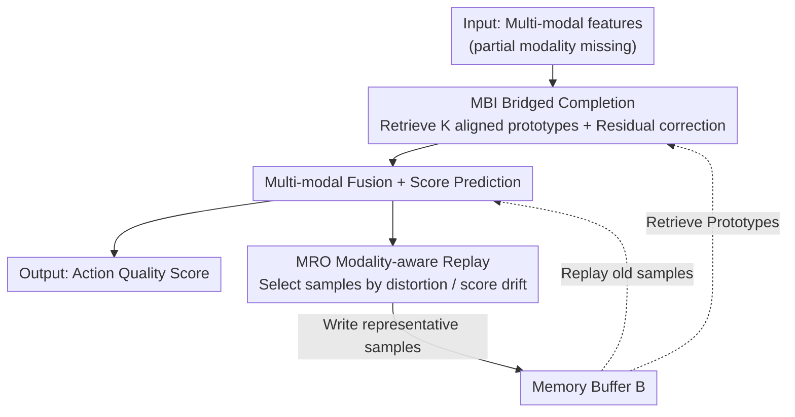

<!-- Generated automatically by src/gen_stubs.py -->
# BriMA: Bridged Modality Adaptation for Multi-Modal Continual Action Quality Assessment

**Conference**: CVPR2026  
**arXiv**: [2602.19170](https://arxiv.org/abs/2602.19170)  
**Code**: [github.com/ZhouKanglei/BriMA](https://github.com/ZhouKanglei/BriMA)  
**Area**: Multi-modal VLM  
**Keywords**: Action Quality Assessment, Continual Learning, Missing Modality, Multi-modal Fusion, Memory Replay

## TL;DR
BriMA is proposed to address non-stationary modality imbalance in multi-modal continual action quality assessment through memory-guided bridged completion and modality-aware replay mechanisms, achieving an average Gain of $6-8\%$ in correlation coefficients and a reduction of $12-15\%$ in error across three benchmarks.

## Background & Motivation
1. Action Quality Assessment (AQA) is widely applied in sports analysis, rehabilitation assessment, and skill evaluation. Multi-modal methods (visual + kinematic cues) have made significant progress.
2. In real-world deployment, sensor failures and missing labels lead to non-stationary modality imbalance—where modality availability changes over time.
3. Existing multi-modal AQA methods assume stable and complete input modalities; performance drops significantly once a modality is missing.
4. Existing continual AQA methods focus solely on task-level forgetting and do not handle dynamic changes at the modality level.
5. Simple imputation, retrieval-based completion, and generative synthesis fail to maintain the geometric structure critical for AQA scoring, leading to the destruction of ranking consistency.
6. The fine-grained scoring sensitivity of AQA makes it inherently different from general missing modality reconstruction problems.

## Method

### Overall Architecture

BriMA addresses the non-stationary modality imbalance caused by "intermittent modality presence" (sensor failures, missing labels) in multi-modal continual AQA. In each training session, it performs three tasks: first, the MBI module recovers missing modality features; then, it fuses all modal features to predict action quality scores; finally, the MRO module selects highly informative samples for the memory buffer for replay to counter distribution shifts across tasks. These modules form a closed loop via a shared memory buffer: prototypes in the buffer are used by MBI for retrieval-based completion and by MRO for replay.

### Key Designs

**1. MBI: Memory-guided Bridged Imputation, learning residuals instead of full features**

AQA scores are extremely sensitive to geometric structures. Simple imputation, retrieval, or generative synthesis can damage the scoring manifold and disrupt ranking consistency. Thus, missing modalities cannot be arbitrarily filled. MBI adopts a three-step "prototype retrieval + residual correction" approach: for missing modality $m$, use cosine similarity to retrieve $K$ structurally aligned prototype features from the previous memory buffer $\mathcal{B}_{t-1}$,

$$s_{j,t'} = \frac{\langle \mathbf{z}_{i,t}^{\mathcal{O}}, \mathbf{z}_{j,t'}^{\mathcal{O}} \rangle}{\|\mathbf{z}_{i,t}^{\mathcal{O}}\| \|\mathbf{z}_{j,t'}^{\mathcal{O}}\|}$$

A binary mask $\mathbf{r}_{i,t}$ identifies missing modalities, and learnable task embeddings $\mathbf{p}_t^m$ provide task-specific conditions. The final key step is learning **bridged residuals** rather than complete feature synthesis:

$$\tilde{\mathbf{z}}_{i,t}^m = \bar{\mathbf{z}}_{i,t}^m + \Delta\mathbf{z}_{i,t}^m = \bar{\mathbf{z}}_{i,t}^m + B_\Theta(\mathbf{z}_{i,t}^{\mathcal{O}}, \bar{\mathbf{z}}_{i,t}^m, \mathbf{c}_t^m)$$

This adds a small correction to the mean of retrieved prototypes $\bar{\mathbf{z}}_{i,t}^m$. Learning residuals is more conservative than generation from scratch, providing higher stability with limited supervision and preserving the score-sensitive feature structure.

**2. MRO: Modality-aware Replay, selecting samples by distortion and drift**

Continual learning relies on replay to counter forgetting, but random replay is unreliable under non-stationary modality imbalance—replayed samples themselves might be incomplete or have unbalanced score coverage. MRO dynamically prioritizes samples based on modality distortion and score drift, maintaining a representative memory buffer that is "modality-reliable and score-balanced." This stabilizes distribution shifts across tasks. Compared to random replay, it ensures reviewed old knowledge is both clean and representative.

### Loss & Training

$$\min_{\theta_f, \theta_g} \mathcal{L}_{score} + \lambda_{mem}\mathcal{L}_{mem} + \lambda_{rec}\mathcal{L}_{rec}$$

where $\mathcal{L}_{score}$ is the MSE scoring loss, $\mathcal{L}_{mem}$ is the memory replay regularization loss, and $\mathcal{L}_{rec} = \|\tilde{\mathbf{z}} - \mathbf{z}\|_2^2$ is the feature reconstruction loss.

## Key Experimental Results

### Main Results: RG Dataset Comparison ($\beta=10\%$ modality missing rate)

| Method | Conference | SRCC↑ Avg | MSE↓ Avg | RL2↓ Avg |
|------|------|-----------|----------|----------|
| ST-MLAVL | CVPR'25 | 0.599 | 9.94 | 3.558 |
| EWC | PNAS'17 | 0.605 | 10.26 | 3.709 |
| MER | ICLR'19 | 0.722 | 6.77 | — |
| **Ours (BriMA)** | **Ours** | **Best (~0.76+)** | **Lowest** | **Lowest** |

### Ablation Study

| Component | SRCC Change | MSE Change |
|------|----------|---------|
| w/o MBI (Zero Padding) | Significant drop | Significant increase |
| w/o MRO (Random Replay) | Drop | Increase |
| w/o Residual mechanism (Direct Generation) | Drop | Increase |
| Full BriMA | Best | Best |

### Cross-dataset Performance
Average Gain across RG, Fis-V, and FS1000 datasets:
- Rank correlation coefficient: +6.1%, +8.3%, +1.4%
- Error reduction: -12.7%, -15.3%, -6.4%
- Relative error reduction: -13.9%, -14.1%, -5.2%

### Key Findings
- Residual learning strategy is more stable than direct feature generation, especially under limited supervision.
- Modality-aware replay selection is significantly more effective than random replay.
- Both MBI and MRO components contribute significantly to the overall performance Gain.

## Highlights & Insights
- First to systematically define and solve the non-stationary modality imbalance problem in multi-modal continual AQA.
- Residual bridging is more conservative and safer than full reconstruction—crucial for score-sensitive tasks.
- Memory-guided retrieval + residual correction mechanism excels in maintaining the scoring manifold structure.

## Limitations & Future Work
- Assumes missing modality patterns are known ($\mathcal{M}_{i,t}$ is observable during training); automatic detection of missing modalities remains unexplored.
- Only validated in two-modality scenarios; scalability to three or more modalities needs confirmation.
- The impact of memory buffer size on performance is not fully discussed.

## Related Work & Insights
- Difference from general missing modality learning: BriMA is specifically designed for AQA scoring sensitivity, preventing the destruction of the scoring manifold.
- Difference from continual AQA methods like Fs-Aug / MAGR: The latter only handle task-level non-stationarity and do not resolve modality-level issues.
- Insight: The residual bridging concept is transferable to other tasks requiring modality completion where output precision is critical.

## Rating
- Novelty: ⭐⭐⭐⭐ (Novel problem definition, logical MBI design)
- Experimental Thoroughness: ⭐⭐⭐⭐ (3 datasets, multiple missing rates, comprehensive ablation)
- Writing Quality: ⭐⭐⭐⭐ (Clear problem formalization, unified notation)
- Value: ⭐⭐⭐ (Vertical application scenario, but the methodology is generalizable)

<!-- RELATED:START -->

## Related Papers

- [\[CVPR 2026\] Probabilistic Prompt Adaptation for Unified Image Aesthetics and Quality Assessment](probabilistic_prompt_adaptation_for_unified_image_aesthetics_and_quality_assessm.md)
- [\[AAAI 2026\] MCMoE: Completing Missing Modalities with Mixture of Experts for Incomplete Multimodal Action Quality Assessment](../../AAAI2026/multimodal_vlm/mcmoe_completing_missing_modalities_with_mixture_of_experts_for_incomplete_multi.md)
- [\[CVPR 2026\] HDR-VLM: HDR-Domain Adaptation of VLMs and Preference-Aligned Quality Assessment for HDR Video Color Grading](hdr-vlm_hdr-domain_adaptation_of_vlms_and_preference-aligned_quality_assessment_.md)
- [\[ICLR 2026\] VisJudge-Bench: Aesthetics and Quality Assessment of Visualizations](../../ICLR2026/multimodal_vlm/visjudge-bench_aesthetics_and_quality_assessment_of_visualizations.md)
- [\[CVPR 2026\] Decoupling Stability and Plasticity for Multi-Modal Test-Time Adaptation](decoupling_stability_and_plasticity_for_multi-modal_test-time_adaptation.md)

<!-- RELATED:END -->
