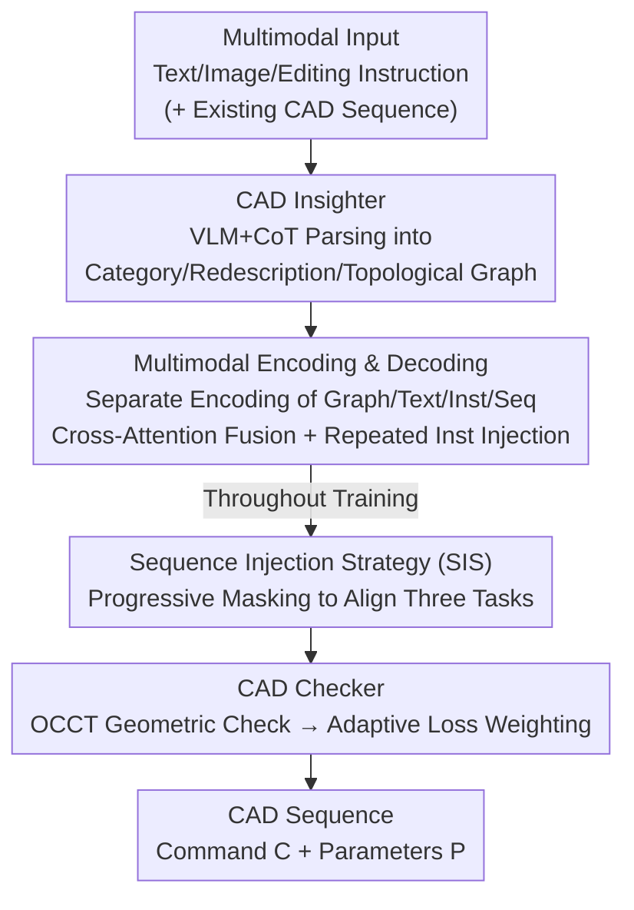

# CAD-Refiner: A Unified Framework for CAD Generation and Iterative Editing

**Conference**: CVPR 2026  
**Paper**: [CVF Open Access](https://openaccess.thecvf.com/content/CVPR2026/html/Yuan_CAD-Refiner_A_Unified_Framework_for_CAD_Generation_and_Iterative_Editing_CVPR_2026_paper.html)  
**Code**: Not publicly available  
**Area**: CAD Generation and Editing / Multimodal  
**Keywords**: CAD sequence generation, topological graph, iterative editing, curriculum masking, geometric checking  

## TL;DR
CAD-Refiner utilizes a VLM agent to parse text, images, or editing instructions into a "topological graph" as a unified condition. Combined with a "Sequence Injection Strategy," it aligns generation, completion, and editing tasks into a single decoder. It corrects geometric errors using adaptive loss weighting based on OCCT geometric validation, completing a full CAD modeling workflow from initial generation to multi-round iterative editing within a unified framework.

## Background & Motivation

**Background**: The mainstream approach in CAD modeling is to represent models as construction sequences composed of "commands + parameters" (e.g., DeepCAD, SkexGen, Mamba-CAD). Recently, multimodal conditions such as point clouds, text, and images have been integrated to enhance controllability.

**Limitations of Prior Work**: Existing methods typically treat "generation" and "editing" as two independent tasks. Generative models only produce models from scratch, while editing models (like CAD-Editor) require separate sub-tasks for localization and filling, necessitating specialized data formats and training pipelines. However, the real design process is iterative—"generate a draft first, then refine it over rounds." These separate systems are difficult to adapt to iterative scenarios. Furthermore, most methods are "geometry-driven," fitting shapes under external conditions while ignoring the explicit semantic topological dependencies of CAD models (e.g., "face-loop-curve"), making it easy to break structural consistency during editing.

**Key Challenge**: There are significant differences in input modalities and target behaviors between generation and editing (generation uses only prompts, while editing also requires an existing sequence). Integrating them into a single model lacks a "shared structural semantic representation" across tasks. Additionally, without explicit modeling of topological relations between geometric elements, the model cannot capture inter-element dependencies.

**Goal**: To unify CAD generation, completion, and editing within a single model, enabling it to produce outputs directly from multimodal inputs and perform multi-round refinements on existing results.

**Key Insight**: The authors observe that any task or modality can be abstracted as "an operation on the CAD topology." Consequently, they use a VLM to parse arbitrary inputs into a unified topological graph, serving as both a "bridge across tasks" and a "domain-invariant representation."

**Core Idea**: By using the "topological graph parsed by the VLM" as a unified condition, "progressive masking sequence injection" to smooth input differences between tasks, and "geometric validation-driven adaptive loss" for error correction, the framework integrates generation and iterative editing.

## Method

### Overall Architecture
The input to CAD-Refiner is a free-form multimodal prompt (text, image, and during editing, an existing CAD sequence with an instruction). The output is a CAD construction sequence $S$ (each token containing command $C$ and parameters $P$). The pipeline follows four steps: First, the **CAD Insighter** (a VLM agent) parses the input into three components—instruction category, text redescription, and topological graph. Multimodal encoders then encode the graph, text, instruction, and sequence separately. The decoder processes CAD features via self-attention, then uses cross-attention layers to fuse graph and text features while repeatedly injecting instruction features to predict the refined sequence. Finally, the **CAD Checker** provides feedback via geometric validation, converted into loss weights for training. The **Sequence Injection Strategy (SIS)** operates throughout the training phase, using dynamic masking to align the input requirements of generation, completion, and editing to a single learning objective.

### Key Designs

**1. CAD Insighter: Translating Arbitrary Inputs into a Unified Topological Graph as a Shared Semantic Layer**

Addressing the conflict between varying modalities and behaviors in generation versus editing, the authors employ a VLM (Qwen-VL-Max) to perform structural parsing via a one-shot Chain-of-Thought (CoT) prompt. The CoT template guides the VLM to identify the prompt and instruction, redescribe the text, construct a hierarchical structure tree, perform pre-order traversal, and extract adjacency relations. The output includes the instruction category, text redescription, the pre-order traversal list of topological nodes, and adjacency triplets.

The "hierarchical structure tree" follows CAD conventions: CAD model → Sketch-Extrusion → Sketch/Extrude → Face → Loop → Curve. Explicitly constructing this tree models topology. The final output is parsed into a topological graph $G=(N,R)$, where $N$ represents nodes and $R$ represents relations. This graph bridges high-level semantic instructions with low-level geometric relations and provides domain invariance, bridging semantic gaps across different modalities.

**2. Multimodal Encoder and Decoder: Separate Encoding + Cross-Attention Fusion + Repeated Instruction Injection**

To handle heterogeneous information, the authors use a four-way encoder: a Graph Encoder (GraphGPS) for node embeddings and relations; a Text Encoder (DistilBERT) for semantic features; an Instruction Encoder mapping scalar types to high-dimensional embeddings; and a CAD Sequence Encoder following DeepCAD. The decoder uses self-attention on CAD features, cross-attention for text and graph fusion, and repeats instruction injection to guide refinement.

**3. Sequence Injection Strategy (SIS): Curriculum with Progressive Masking to Align Generation/Completion/Editing**

Generation depends only on prompts, completion requires partial sequences, and editing requires full pre-edit sequences. SIS starts by training on complete CAD sequences for $t_w$ epochs. From epoch $t_w+1$, it introduces `[MASK]` tokens, where the mask rate $\gamma_T$ increases smoothly from 0 to 1 according to:

$$\gamma_T = \begin{cases} 0, & 0 \le T \le t_w \\ \sin\!\left(\dfrac{T-t_w}{t-t_w}\cdot\dfrac{\pi}{2}\right), & t_w < T \le t \end{cases}$$

This curriculum allows the model to learn reconstruction (completion) during the middle phase and full sequence generation from prompts alone when $\gamma_T$ reaches 1. For editing tasks, $\gamma_T$ is set to 0 to retain the full input sequence while focusing on the transformation to the target sequence.

**4. CAD Checker: Adaptive Loss Weighting via OCCT Geometric Validation for Targeted Error Correction**

Standard losses use fixed weights for commands and parameters:

$$L = \alpha\sum_{j=1}^{C_N} l(C_j,\hat C_j) + \beta\sum_{j=1}^{C_N}\sum_{k=1}^{P_N} l(P_{j,k},\hat P_{j,k})$$

Traditionally, $\alpha=1, \beta=2$. However, different samples have different weak points. The CAD Checker uses Open CASCADE Technology (OCCT) to validate sequences and detect three error types: unclosed loops, self-intersecting geometry, and parameter inconsistencies. It then adjusts weights dynamically: unclosed loops increase command supervision ($\alpha=2, \beta=2$); self-intersection or parameter mismatch increase parameter supervision ($\alpha=1.5, \beta=2.5$). This acts as a form of deterministic reward shaping.

### Loss & Training
The total loss follows the equation above, but $\alpha$ and $\beta$ are determined per-sample by the CAD Checker. Training utilizes the MMCAD dataset (based on DeepCAD, filtered to 80K generation samples + 20K editing pairs), including rendered images, real 3D print photos, text descriptions, CAD sequences, and editing instructions.

## Key Experimental Results

### Main Results (Generation Task, Multimodal Input Comparison)

| Input | Method | Accc↑ | Accp↑ | VR↑ | MMD↓ | JSD↓ | Inference (s)↓ |
|------|------|-------|-------|-----|------|------|----------|
| Text | LLaMA3.1-8B | 52.13 | 42.09 | 52.08 | 1.05 | 12.65 | 15.96 |
| Text | FreeCAD (MM'25) | 74.81 | 50.20 | 42.83 | 10.01 | 48.08 | 0.89 |
| Text | **Ours** | **83.78** | **57.06** | 51.80 | 3.99 | 16.99 | 1.13 |
| Image | GenCAD (TMLR'25) | 70.70 | 29.91 | 62.43 | 3.14 | 12.06 | 1.09 |
| Image | **Ours** | **83.94** | **57.85** | 51.66 | 3.38 | 16.86 | 1.21 |
| Multimodal | FreeCAD (MM'25) | 75.44 | 50.52 | 44.44 | 7.23 | 42.11 | 1.35 |
| Multimodal | **Ours** | **84.66** | **59.48** | **52.91** | 3.30 | 17.51 | 1.56 |

Command accuracy (Accc) improved by approximately 35.56% over LLaMA with a 92.91% reduction in inference time. Multimodal inputs outperformed single-modal versions. While GenCAD shows lower MMD/JSD, the authors note these metrics reflect coarse-grained point cloud statistics; diffusion models tend to generate simple shapes (cubes/cylinders) which benefit these distribution metrics despite limited geometric fidelity.

### Main Results (Editing Task Comparison)

| Method | Accc↑ | Accp↑ | VR↑ | MMD↓ | JSD↓ |
|------|-------|-------|-----|------|------|
| LLaMA3.1-8B | 80.92 | 64.45 | 77.60 | 5.89 | 16.24 |
| Qwen2.5-7B | 82.67 | 65.71 | 78.00 | 6.30 | 17.82 |
| **Ours** | **88.91** | **82.55** | 70.69 | **3.30** | **9.42** |

Parameter accuracy (Accp) reached 82.55%, significantly higher than LLaMA and Qwen2.5, though LLM baselines were faster and showed higher VR.

### Ablation Study (Generation Task)

| Config | Accc↑ | Accp↑ | VR↑ | JSD↓ | Note |
|------|-------|-------|-----|------|------|
| Decoder (text) | 83.01 | 55.99 | 51.01 | 26.61 | Text only |
| Decoder (graph) | 83.58 | 57.78 | 51.80 | 14.21 | Graph only |
| SIS† (fixed $\gamma_T$=0.5) | 60.19 | 51.83 | 18.71 | 30.61 | Fixed mask rate; significant performance drop |
| w/o CoT | 82.75 | 53.93 | 50.55 | 29.34 | Without Chain-of-Thought |
| w/o Checker | 83.98 | 58.18 | 52.19 | 17.53 | Without geometric validation |
| **Full Model** | **84.66** | **59.48** | **52.91** | 17.51 | Complete model |

### Key Findings
- **Dynamic Masking in SIS is Essential**: Switching to a fixed $\gamma_T$ caused Accc to plummet, as progressive curricula are necessary to unify completion and generation.
- **Graph Modality Supports Geometry Better**: Graph-only (JSD 14.21) significantly outperformed text-only (JSD 26.61), confirming that topological graphs capture essential geometric dependencies.
- **CoT and Checker Have Distinct Roles**: CoT primarily improves parsing accuracy, while the Checker enhances geometric validity.
- **Robust Generalization**: The model maintains leading accuracy across Fusion 360 and sim2real datasets without fine-tuning.

## Highlights & Insights
- **Unified Intermediate Representation**: The "topological graph" elegantly bridges semantic instructions and geometric operations while handling domain generalization (sim2real).
- **Task Alignment via Masking**: Aligning generation, completion, and editing along a single progressive masking curve is a highly effective way to unify tasks.
- **Feedback from Non-Differentiable Checkers**: The CAD Checker allows non-differentiable geometric validity signals to influence training through loss weighting, providing a lightweight form of reward shaping.

## Limitations & Future Work
- **Dependency on Closed-Source VLM APIs**: CAD Insighter relies on Qwen-VL-Max, making it slower than DeepCAD or MambaCAD and limited in offline scenarios.
- **Valid Ratio (VR) is Not Peer-Leading**: In editing tasks, VR was lower than LLM baselines, partly because baselines tend toward simpler, valid shapes.
- **Code and Data are Not Open-Source**: MMCAD and model weights are currently private, hindering reproducibility.
- **Error Coverage**: The CAD Checker currently covers only three error types; it could be expanded to include more complex manufacturing constraints.

## Related Work & Insights
- **vs. DeepCAD / Mamba-CAD**: These focus on unconditional generation and do not perceive user intent or support interaction.
- **vs. CAD-Assistant**: While CAD-Assistant uses tool-calling VLLMs requiring high-end hardware, this method uses a universal CAD representation and CoT for task unification without specialized environments.
- **vs. LLM Baselines**: LLMs are faster but significantly larger (8B params vs. 47M total/4.14M trainable) and show much lower geometric quality.

## Rating
- Novelty: ⭐⭐⭐⭐⭐ 
- Experimental Thoroughness: ⭐⭐⭐⭐⭐ 
- Writing Quality: ⭐⭐⭐⭐ 
- Value: ⭐⭐⭐⭐ 

<!-- RELATED:START -->

## Related Papers

- [\[CVPR 2026\] CADFS: A Big CAD Program Dataset and Framework for Computer-Aided Design with Large Language Models](cadfs_a_big_cad_program_dataset_and_framework_for_computer-aided_design_with_lar.md)
- [\[ICLR 2026\] CAD-Tokenizer: Towards Text-Based CAD Prototyping via Modality-Specific Tokenization](../../ICLR2026/multimodal_vlm/cad-tokenizer_towards_text-based_cad_prototyping_via_modality-specific_tokenizat.md)
- [\[CVPR 2026\] Unified Personalized Understanding, Generating and Editing](unified_personalized_understanding_generating_and_editing.md)
- [\[AAAI 2026\] ReCAD: Reinforcement Learning Enhanced Parametric CAD Model Generation with Vision-Language Models](../../AAAI2026/multimodal_vlm/recad_reinforcement_learning_enhanced_parametric_cad_model_generation_with_visio.md)
- [\[ICCV 2025\] CAD-Assistant: Tool-Augmented VLLMs as Generic CAD Task Solvers](../../ICCV2025/multimodal_vlm/cad-assistant_tool-augmented_vllms_as_generic_cad_task_solvers.md)

<!-- RELATED:END -->
