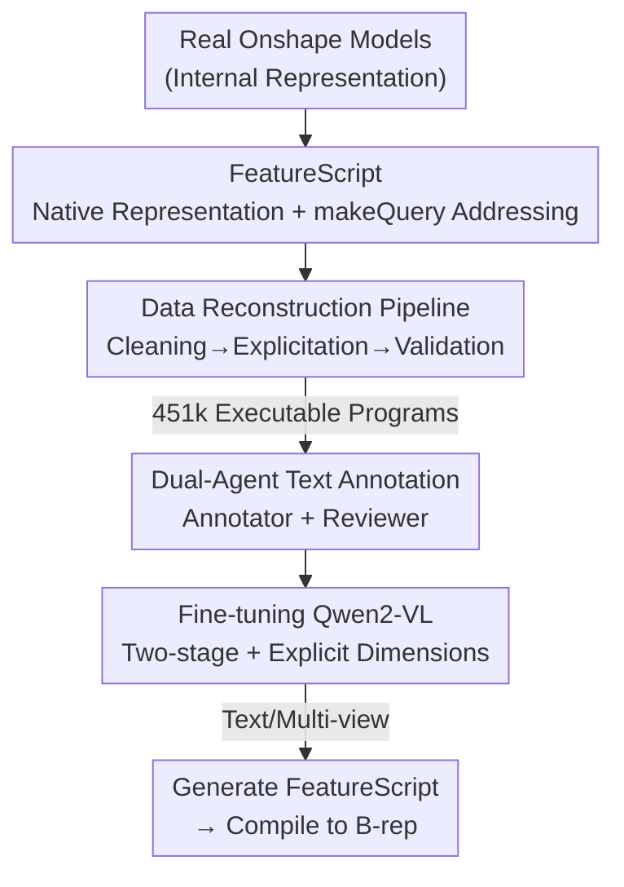

# CADFS: A Big CAD Program Dataset and Framework for Computer-Aided Design with Large Language Models

**Conference**: CVPR 2026  
**arXiv**: [2605.01925](https://arxiv.org/abs/2605.01925)  
**Code**: https://voyleg.github.io/cadfs (Project Page)  
**Area**: Multimodal VLM / Generative CAD / Dataset  
**Keywords**: Generative CAD, FeatureScript, Design History, VLM Code Generation, Multimodal Annotation

## TL;DR
CADFS reconstructs 450,000 real-world CAD models created by engineers on the Onshape platform into clean, executable FeatureScript code. Supplemented with automatically generated text and multi-view annotations, it enables VLMs to generate complex design histories beyond simple "sketch+extrude" for the first time—including 15 types of operations such as fillet, loft, and revolve—setting new SOTA results in both text-to-CAD and multi-view reconstruction tasks.

## Background & Motivation

**Background**: The goal of generative CAD is shifting from direct B-rep surface generation to generating "design history"—the sequence of editable parameterized modeling operations (sketching, extrusion, filleting, etc.) actually used by engineers. Recent mainstream approaches leverage the code-understanding capabilities of pre-trained LLMs/VLMs to directly output CAD construction scripts.

**Limitations of Prior Work**: Regardless of model strength, generated designs remain simplistic. The bottleneck lies in training data; major large-scale design history datasets (e.g., DeepCAD, Text2CAD) only contain two operations: sketch and extrude. Consequently, models never encounter features like fillet, chamfer, revolve, or loft and cannot generate them.

**Key Challenge**: Why has the operation set been locked to only two? The root cause is the **representation method**. In early token sequence representations (DeepCAD), a new operation can only reference a "previously emitted operation" but cannot reference a specific geometric entity (e.g., a newly extruded edge or face) produced by that operation. However, operations like fillet, loft, or pattern must act on "specific entities of the evolving geometry," which token representations cannot express. Later Python script representations (based on CadQuery), while more natural, use topology-dependent indirect references (e.g., "the third edge of the final entity"). These references break if the model is slightly modified, failing to robustly express complex features. Furthermore, translating from Onshape's native representation to these custom formats is often a **lossy translation**, losing geometric and parametric fidelity.

**Goal**: (1) Find a design history representation that robustly references geometric entities and is suitable for LLM generation; (2) Build a large-scale real-world dataset covering diverse operations; (3) Verify that VLMs can generate complex designs using this representation.

**Core Idea**: Instead of inventing simplified representations, use the **native language** of the CAD system—Onshape's FeatureScript. Its syntax is structured, its semantics are interpretable, and it naturally supports "locating geometric entities by source/semantic role" through the `makeQuery` mechanism. This preserves full fidelity and is LLM-friendly. Building a data pipeline to reconstruct Onshape internal representations into clean FeatureScript is the foundation of the framework.

## Method

### Overall Architecture

CADFS is a **data-centric** framework consisting of three core steps: defining a new representation (FeatureScript code), constructing data (reconstruction pipeline + text annotation), and fine-tuning a VLM to generate this representation.

Specifically: ① A **reconstruction pipeline** converts the "internal representation" stored by Onshape for each model (which is neither executable nor readable, containing implicit parameters, redundant expressions, and random naming) into clean, compact FeatureScript programs that can be compiled back to B-rep. After filtering the ~15% that fail validation, 451,000 real designs covering 15 modeling operations are obtained. ② An **Annotator + Reviewer dual-LLM** system automatically generates text descriptions for each model, paired with rendered images and point clouds for multimodal annotation. ③ **Qwen2-VL-2B** is fine-tuned in two stages (first on DeepCAD's sketch+extrude for foundation, then on the full dataset for all operations). It supports text-conditioned generation and multi-view reconstruction, with explicit bounding box centers and sizes provided in prompts to ensure models output designs at the real scales specified by engineers.

### Key Designs

**1. FeatureScript Native Representation + makeQuery Structured Addressing: Robust Geometric Entity Referencing**

The obstacle for complex operations is "how to point to a specific edge or face created during construction." Old token representations reference operations, not entities; Python representations use topological indices like "the third edge," which break upon modification. FeatureScript solves this with the `makeQuery` function, which receives four elements: **Operation Identifier** (limiting the query to a specific operation, e.g., Extrude F5), **Query Type** (the topological role of the entity, e.g., `SWEPT_EDGE`), **Entity Type** (Vertex/Edge/Face/Body), and **Disambiguation Data** (using original-sets or topology to specify ancestors or neighbors). These four elements form a compact and expressive addressing scheme that robustly points to any geometric entity in the CAD history. Crucially, it mimics how humans verbally describe features—"the edge produced by that extrusion connecting two sketch arcs"—making it ideal for LLM generation. This capability allows operations like fillet, loft, circular pattern, and transient body deletion to be expressed and learned for the first time.

**2. FeatureScript Reconstruction Pipeline: Cleaning "Dirty" Internal Representations into Executable Training Code**

Choosing the right language is not enough—Onshape does not expose clean FeatureScript for human-created models. It only provides internal representations filled with implicit parameters, redundant expressions, inconsistent units, and random identifiers. The pipeline cleans this step-by-step: extracting operation sequences and parameters; replacing platform-dependent parameters with explicit ones (e.g., changing a line defined by "point + direction" to "start-end"); unifying units to millimeters; resolving numerical expressions to two decimal places; replacing dummy queries with meaningful references; and renaming random entities/variables with compact, ordered identifiers. Finally, it performs **closed-loop validation**: executing the generated code and checking if it reproduces the original model. Failed cases (~15%) are discarded. This pipeline allows for continuous data expansion as new designs are added to Onshape.

**3. Annotator–Reviewer Dual-Agent Text Annotation: Aligning Descriptions with Code Logic**

Text-to-CAD requires clear, unambiguous descriptions of construction steps, but public CAD libraries lack text, and manual annotation is not scalable. This work uses two LLMs: the **Annotator** takes FeatureScript source and few-shot examples to produce a structured draft of the construction process, ensuring global coherence; the **Reviewer** checks the operation sequence, resolves ambiguities, corrects terminology, and validates numerical parameters to ensure technical consistency with the code. Both models are fed FeatureScript documentation; without it, LLMs often misidentify entities (e.g., confusing inner/outer loops). Because the underlying FeatureScript is semantically clear, the annotation becomes reliable and naturally aligned with the design logic.

**4. Explicit Dimensions + Two-Stage Fine-Tuning: Turning General VLMs into CAD Generators**

Qwen2-VL-2B is used as the backbone. Unlike previous methods that normalize CAD models to a zero-centered fixed scale, this approach enables the model to generate **real-world dimensions**. The prompt includes the bounding box center and extent for the design. Fine-tuning occurs in two SFT stages: first on ~170,000 DeepCAD designs (sketch+extrude only) to establish core geometric reasoning, then on the full ~405,000 samples to generalize to all 15 operations. Inputs can be text descriptions or 2×2 multi-view grid images.

### Comprehensive Example

Taking a toy rocket model: (a) Use splines to draw the rocket body profile and **revolve** it; (b) Draw tail fin profiles using arcs and text primitives and **extrude** them; (c) Use `makeQuery` to identify the "tip of the fin" as the edge produced by that extrusion connecting two arcs; (d) Apply a **fillet** to the tip and use **circular pattern** to duplicate the fin; (e) Use **loft** to smoothly connect a rectangular fin face to a circular base to create a bracket, then delete the intermediate fin body. Throughout this process, operations like revolve, fillet, pattern, and loft rely on `makeQuery` to robustly select entities produced in previous steps—something previous representations could not achieve.

## Key Experimental Results

The backbone is Qwen2-VL-2B, compared against two routes: token sequences (Text2CAD, 360M Transformer) and Python code (Cadrille, Qwen2-VL-2B). Benchmarks include the DeepCAD test set (7278 samples, sketch+extrude only) and a new test set (~9k samples, 15 operations). Metrics include geometric accuracy (CD/ECD/NC), distribution fidelity (MMD), diversity (COV/JSD), and invalid rate (IR).

### Main Results

| Task / Test Set | Key Metric | Ours vs. Cadrille |
|--------------|---------|------------------|
| Text-to-CAD / DeepCAD | Chamfer Distance (CD) | ↓ 40% (More accurate) |
| Text-to-CAD / DeepCAD | Edge Chamfer Distance (ECD) | ↓ 64% (Sharper edges) |
| Text-to-CAD / DeepCAD | MMD / COV / JSD | Superior |
| Text-to-CAD / DeepCAD | Invalid Rate (IR) | Comparable to Text2CAD, slightly higher than Cadrille |
| Multi-view / New Test Set (15 ops) | Accuracy & Diversity | Outperforms Cadrille |

Note: The slightly higher IR compared to Cadrille is attributed to the scarcity of FeatureScript in pre-training data compared to Python.

### Ablation Study

| Config (per Table 3) | Representation / Ops / Annotation | Conclusion |
|------------------------------|--------------------|------|
| Cadrille (Baseline) | Python / DeepCAD(2) / T2C | Trained on 1.17M samples |
| (a) FeatureScript | FS / DeepCAD(2) / T2C | Matches Cadrille with much less data |
| (b) + New Annotation | FS / DeepCAD(2) / New | Significant gains in accuracy and diversity |
| (c)/(e) + Extended Ops | FS / Full(15) | Massive improvement over (a)/(d) |

### Key Findings
- **Representation Feasibility**: FeatureScript with DeepCAD data matches the performance of Python-based models trained on much larger datasets, proving it as a viable alternative.
- **Extended Operation Set as Main Driver**: The gap is truly widened by expanding training to real-world complex designs with 15 operations, a capability unlocked by the FeatureScript representation.
- **Annotation Alignment**: Replacing old annotations with new ones (a to b) consistently improves performance, confirming that text must align with the underlying design history.
- **Explicit Dimensions**: Providing the bounding box in the prompt improves generation precision.
- **Image Reconstruction is Harder**: Both models perform worse on multi-view reconstruction than text-conditioned generation, highlighting the difficulty of recovering history from images.

## Highlights & Insights
- **Native over Custom**: The biggest takeaway is that instead of inventing lossy token syntaxes for autoregressive convenience, it is better to adopt the languages engineers already use. LLMs are naturally adept at structured code.
- **makeQuery as Linguistic Isomorphism**: Addressing entities by source, role, and category mirrors human verbal description. This makes the representation inherently compatible with LLM generation and transferable to other code tasks requiring robust entity referencing.
- **Pipeline as a Moat**: The closed-loop validation ensures high data fidelity. The ability to continuously ingest new designs from Onshape means the dataset has long-term viability.
- **Compatibility**: The dataset is a subset of ABC and a superset of DeepCAD/Text2CAD, allowing direct geometric comparisons across different representation methods.

## Limitations & Future Work
- **Higher IR**: FeatureScript is rare in VLM pre-training compared to Python. This could be improved via continued pre-training or reinforcement learning with execution feedback.
- **Ecosystem Lock-in**: The framework is tied to Onshape/FeatureScript. Porting to SolidWorks or Fusion would require significant pipeline redevelopment.
- **Data Bias**: The ~15% of models discarded during validation may include systematically complex designs, risking distribution bias.
- **Model Scale**: Experiments used 2B parameters; the potential of larger models with this representation remains unexplored.

## Related Work & Insights
- **vs. DeepCAD / Text2CAD (Tokens)**: Those quantize history into tokens, but cannot reference generated entities, limiting operations to sketch+extrude. CADFS uses robust `makeQuery` to expand operations from 2 to 15 without loss.
- **vs. Cadrille / CAD-Recode (Python)**: Python is natural but topological indices are brittle. FeatureScript's "source+role" addressing is more robust and preserves history.
- **vs. B-rep Diffusion (e.g., TRELLIS)**: Diffusion models generate surfaces but lack the editability of construction history, which is critical for engineering.

## Rating
- Novelty: ⭐⭐⭐⭐⭐ First to use native FeatureScript to expand generative CAD operations from 2 to 15.
- Experimental Thoroughness: ⭐⭐⭐⭐ Extensive cross-dataset and multi-task comparisons; detailed ablation.
- Writing Quality: ⭐⭐⭐⭐⭐ Clearly explains the link between representation and operation diversity.
- Value: ⭐⭐⭐⭐⭐ Providing the dataset, pipeline, and models is a fundamental contribution to the generative CAD community.

<!-- RELATED:START -->

## Related Papers

- [\[CVPR 2026\] SldprtNet: A Large-Scale Multimodal Dataset for CAD Generation in Language-Driven 3D Design](sldprtnet_a_large-scale_multimodal_dataset_for_cad_generation_in_language-driven.md)
- [\[CVPR 2026\] LVLM-Aided Alignment of Task-Specific Vision Models](lvlm-aided_alignment_of_task-specific_vision_models.md)
- [\[CVPR 2026\] Dr. Seg: Revisiting GRPO Training for Visual Large Language Models through Perception-Oriented Design](dr_seg_revisiting_grpo_training_for_visual_large_language_models_through_percept.md)
- [\[CVPR 2026\] R4-CGQA: Retrieval-based Vision Language Models for Computer Graphics Image Quality Assessment](r4-cgqa_retrieval-based_vision_language_models_for_computer_graphics_image_quali.md)
- [\[CVPR 2026\] Breaking the Regional Perception Bottleneck of Multimodal Large Language Models via External Reasoning Framework](breaking_the_regional_perception_bottleneck_of_multimodal_large_language_models_.md)

<!-- RELATED:END -->
