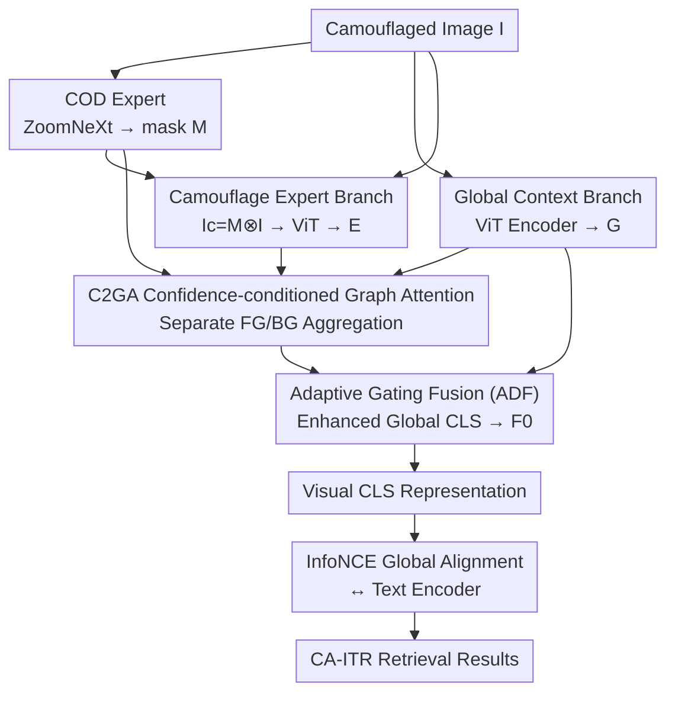

# Camouflage-aware Image-Text Retrieval via Expert Collaboration

**Conference**: CVPR 2026  
**Paper**: [CVF Open Access](https://openaccess.thecvf.com/content/CVPR2026/html/Jiang_Camouflage-aware_Image-Text_Retrieval_via_Expert_Collaboration_CVPR_2026_paper.html)  
**Code**: https://github.com/jiangyao-scu/CA-ITR  
**Area**: Multimodal VLM  
**Keywords**: Camouflaged Scene Understanding, Image-Text Retrieval, Cross-modal Alignment, Confidence-conditioned Graph Attention, Expert Collaboration  

## TL;DR
This paper introduces "Image-Text Retrieval" (ITR) to camouflaged scenes for the first time, constructing the CamoIT dataset with 10.5k samples. It proposes CECNet, featuring a dual-branch architecture and Confidence-conditioned Graph Attention (C2GA). By utilizing a Camouflaged Object Detection (COD) expert to "extract" and independently encode camouflaged targets before selectively fusing them back into global representations, CECNet improves retrieval accuracy by approximately 29%, outperforming seven mainstream models in Camouflage-aware ITR (CA-ITR).

## Background & Motivation
**Background**: Camouflaged Scene Understanding (CSU) has advanced rapidly, but most work is confined to Camouflaged Object Detection (COD) or segmentation yielding pixel-level masks. Recent works using MLLMs for VQA and grounding in camouflaged scenes focus primarily on "generative" perspectives.

**Limitations of Prior Work**: Cross-modal alignment—accurately matching text descriptions to camouflaged targets in images—lacks systematic research. SOTA retrieval models like CLIP, AVSE, and D2S-VSE often fail on camouflaged images, frequently matching text to the background rather than the target that "looks identical" to its surroundings (Fig. 1), leading to misalignments with similar classes (e.g., crab vs. lizard).

**Key Challenge**: The essence of camouflage is that "target visual features are highly similar to the background, but semantics are distinct." Mainstream retrieval models are trained on datasets with clear foreground-background separation (MS-COCO/Flickr30K). Global encoding in architectures like ViT entangles target signals with the background; simply adjusting region weights cannot suppress background interference, and directly masking images compromises fidelity and introduces semantic misalignment.

**Goal**: (1) Formalize camouflaged cross-modal alignment as a new task (CA-ITR) with a corresponding dataset; (2) Develop a baseline model capable of perceiving camouflaged targets.

**Key Insight**: Rather than using a single encoder to adjust weights or "capping and then encoding," this work adopts parallel encoding paths. One branch preserves global context, while the other specialized branch independently encodes the isolated camouflaged target. The latter is then intelligently integrated into the former to prevent feature pollution at the source.

**Core Idea**: Integrate a COD expert as a "magnifier" to purify camouflaged target representations. Use Confidence-conditioned Graph Attention (C2GA) to aggregate foreground and background information into two separate graphs, selectively injecting target information into the global CLS representation.

## Method

### Overall Architecture
CECNet is built on the standard VSE (Visual-Semantic Embedding) global alignment framework. Given a camouflaged image $I$, a COD expert (ZoomNeXt) first generates a mask $M$. The **Global Context Branch** uses a standard ViT to encode the original image into $G^l$, preserving the entire scene's context. The **Camouflage Expert Branch** first masks the image ($I_c = M \otimes I$) and then utilizes a ViT (sharing parameters with the global branch) to encode purified target features $E^l$. Features from both branches interact after **every block** of the global branch via the **C2GA** module. C2GA utilizes the camouflage confidence of each patch to split features into "foreground" and "background" graphs for separate aggregation. Finally, Adaptive Gating (ADF) fuses the enhanced features back into the global representation. The CLS token from the global branch serves as the final visual representation for InfoNCE alignment with the text encoder.

### Key Designs

**1. CamoIT Dataset & Three-stage Progressive Labeling: Enabling GPT-4o to "See" Camouflage**

As no CA-ITR data existed, the authors selected high-quality samples from four COD datasets (CHAMELEON/CAMO/COD10K/NC4K) and used GPT-4o for multi-granularity annotation, resulting in 10,464 samples across ~237 categories. To overcome GPT-4o's inability to see camouflaged targets, a three-step process was designed: ① **Camouflage Disruption**: Highlighting target contours in red on the original image to improve visibility, with prompts instructing the model to "ignore red markers." ② **Evolutionary Annotation**: Progressive description generation (Category → Target Description → Global Caption) to handle complex scenes. ③ **Human Refinement**: 16 annotators conducted three rounds of review to correct hallucinations and redundancy.

**2. Camouflage Expert Dual-branch Encoder: Avoiding "Feature Pollution" via Independent Encoding**

To solve the dilemma where single encoders cannot suppress backgrounds and pre-masked encoding loses fidelity, CECNet splits the perception task. The Global Context Branch processes the original image $I$, while the Camouflage Expert Branch processes the isolated target $I_c = M \otimes I$ to produce a "purified" representation $E$. These branches do not pollute each other during encoding—the expert branch is not distracted by the background, and the global branch retains context.

**3. Confidence-conditioned Graph Attention (C2GA): Grouping FG/BG by Confidence**

Linear fusion is suboptimal as dominant background features contaminate purified target representations. C2GA explicitly constructs a foreground graph $G_F$ and a background graph $G_B$. It uses the mask $M$ to determine camouflage confidence for each patch. Global features $G$ and expert features $E$ are projected into foreground/background subspaces ($G_{obj}/G_{env}$ and $E_{obj}/E_{env}$). For $G_{F}$, edge weights are determined by similarity and confidence:

$$W^F_{i,j} = M_{v_i}\cdot M_{v_j}\cdot \frac{v_i v_j^\top}{|v_i||v_j|},\quad v_i,v_j\in V_F$$

Background nodes with low confidence automatically receive lower weights. Aggregation focuses on the CLS token $G_{obj}_0$: $\dot v_i = \sum_{v_j\in V_F} W^F_{i,j} v_j$, yielding an enhanced foreground representation $A^{obj}_0$. $G_B$ is constructed symmetrically. Finally, Adaptive Gating (ADF) integrates the information:

$$F_0 = \mathrm{sum}\big(\sigma(f([A_0,E_0,G_0]))\cdot[A_0,E_0,G_0]\big)$$

### Loss & Training
The text side uses a standard Transformer, and cross-modal alignment utilizes InfoNCE: $L = L_{T2I}+L_{I2T}$, where

$$L_{T2I} = -\frac{1}{n}\sum_{i=1}^{n}\log\frac{e^{(T_i V_i^\top/\tau)}}{\sum_{j=1}^{n} e^{(T_i V_j^\top/\tau)}}$$

Training proceeds in two stages: first training the C2GA module with frozen CLIP weights, then end-to-end fine-tuning (freezing the COD model).

## Key Experimental Results

### Main Results
Evaluated on 3,000 test samples from CamoIT. CECNet out-performs all models, with an average R@1 8.9% higher than D2S-VSE and ~4% higher than fine-tuned CLIP.

| Model | I2T R@1 | I2T R@5 | I2T R@10 | T2I R@1 | T2I R@5 | T2I R@10 |
|------|---------|---------|----------|---------|---------|----------|
| CUSA | 23.9 | 53.5 | 66.7 | 23.5 | 51.3 | 64.3 |
| D2S-VSE (Best General) | 37.1 | 68.4 | 79.5 | 35.5 | 67.5 | 78.4 |
| CLIP (Fine-tuned) | 41.3 | 69.2 | 79.0 | 41.1 | 67.7 | 78.4 |
| **CECNet (Ours)** | **45.8** | **74.5** | **83.5** | **44.6** | **73.9** | **83.1** |

### Ablation Study

Impact of branch configuration and C2GA (on CamoIT):

| Config | I2T R@1 | I2T R@5 | T2I R@1 | T2I R@5 | Description |
|------|---------|---------|---------|---------|------|
| Baseline | 41.3 | 69.2 | 41.1 | 67.7 | Standard CLIP |
| A1 | 28.5 | 58.3 | 30.0 | 58.0 | Conv modulation of input via mask (Fail) |
| B1 | 42.5 | 71.7 | 42.9 | 71.1 | Summation of two branches |
| B3 | 42.9 | 70.7 | 42.3 | 68.9 | Standard Graph Attention |
| **CECNet** | **45.8** | **74.5** | **44.6** | **73.9** | Dual-branch + C2GA |

### Key Findings
- **C2GA is the primary driver**: Replacing C2GA with summation or linear fusion results in a significant drop, proving that grouping FG/BG by confidence prevents background pollution.
- **Linear transfer of expert capability**: Improved COD accuracy ($S_\alpha$ 0.44 → 0.91) correlates directly with higher retrieval R@1 (41.6 → 45.8).
- **BUTD outperforms some ViT methods**: Object-level models (CFM/HREM) exceed some ViT-based ones, suggesting that explicit object modeling is effective for camouflage.

## Highlights & Insights
- **The "Purify-then-Selectively-Fuse" Paradigm**: Rather than forcing a single encoder to change weights, it uses a structural guarantee to isolate and then selectively inject target information.
- **Confidence as Graph Modulator**: The $W^F_{i,j}$ mechanism allows background nodes to naturally disconnect, which is transferable to other fine-grained tasks where signals are submerged in noise.
- **Bridging COD and Retrieval**: Provides a template for using low-level perception (segmentation masks) to improve high-level cross-modal alignment.

## Limitations & Future Work
- **Dependency on COD Experts**: Performance is strictly bound to COD mask quality; it may fail in scenes where the COD expert is ineffective.
- **Computational Overhead**: Each block incorporates C2GA; the impact of masking errors propagating through layers requires further analysis.
- **Text-side Optimization**: Current text encoding and loss strategies are standard; there is room for specialized improvements.

## Related Work & Insights
- **vs. Global Alignment (D2S-VSE/CLIP)**: While these work for clear images, they entangle camouflaged targets with backgrounds. CECNet "purifies" the global CLS token.
- **vs. Camouflaged MLLMs**: Prior works focus on generative tasks (VQA); this work addresses the underlying "alignment foundation."

## Rating
- Novelty: ⭐⭐⭐⭐⭐ 
- Experimental Thoroughness: ⭐⭐⭐⭐ 
- Writing Quality: ⭐⭐⭐⭐ 
- Value: ⭐⭐⭐⭐⭐ 

<!-- RELATED:START -->

## Related Papers

- [\[CVPR 2026\] EagleNet: Energy-Aware Fine-Grained Relationship Learning Network for Text-Video Retrieval](eaglenet_energy-aware_fine-grained_relationship_learning_network_for_text-video_.md)
- [\[CVPR 2026\] STiTch: Semantic Transition and Transportation in Collaboration for Training-Free Zero-Shot Composed Image Retrieval](stitch_semantic_transition_and_transportation_in_collaboration_for_training-free.md)
- [\[CVPR 2026\] Text-Only Training for Image Captioning with Retrieval Augmentation and Modality Gap Correction](text-only_training_for_image_captioning_with_retrieval_augmentation_and_modality.md)
- [\[CVPR 2026\] Text-Printed Image：把文本「印」成图片来弥合图文模态鸿沟](text-printed_image_bridging_the_image-text_modality_gap_for_text-centric_trainin.md)
- [\[CVPR 2026\] Gravitation-Driven Semantic Alignment for Text Video Retrieval](gravitation-driven_semantic_alignment_for_text_video_retrieval.md)

<!-- RELATED:END -->
