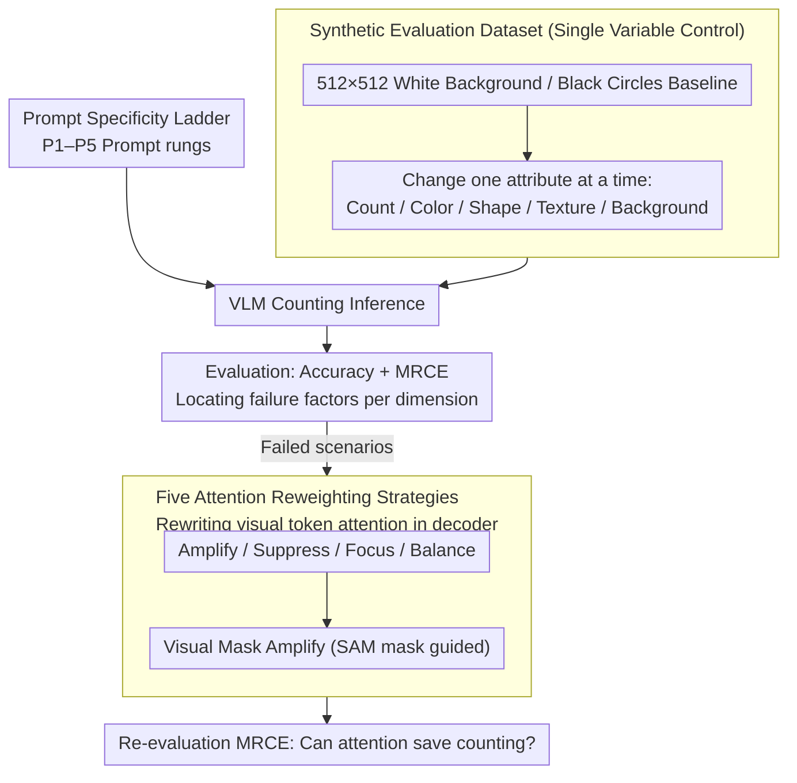

# Can Vision-Language Models Count? A Synthetic Benchmark and Analysis of Attention-Based Interventions

**Conference**: CVPR 2026  
**arXiv**: [2511.17722](https://arxiv.org/abs/2511.17722)  
**Code**: [GitHub](https://github.com/ssen7/vlm-count-analysis)  
**Area**: Multimodal/VLM  
**Keywords**: VLM, counting capability, attention mechanism, synthetic benchmark, visual attention intervention

## TL;DR

A synthetic counting benchmark dataset is constructed to systematically evaluate the counting capabilities of open-source VLMs under different image/prompt conditions. The mechanism for improving counting behavior is explored through decoder-level visual attention reweighting experiments.

## Background & Motivation

**Background**: VLMs have been widely applied to tasks like Visual Question Answering (VQA), but perform poorly in precise counting (enumeration), lagging far behind specialized counting methods (e.g., PseCo, CountGD, CrowdDiff).

**Limitations of Prior Work**: Most existing evaluations use natural image datasets where variables are highly coupled (occlusion, texture, density, etc.), making it difficult to isolate specific failure factors. Current research lacks a systematic diagnostic framework to analyze the root causes of counting failures.

**Key Challenge**: VLMs acquire strong prior biases during training. When facing counting tasks that require precise visual attention, they tend to rely on memorized patterns rather than object-by-object analysis. This aligns closely with enumeration limits and cognitive load effects in human cognition.

**Goal**: Construct a controllable synthetic benchmark to precisely isolate influencing factors by varying image/prompt attributes one by one, and explore whether attention intervention can improve counting.

**Key Insight**: Approach the problem from the perspectives of cognitive science (Cognitive Load Theory) and model explainability (attention analysis).

**Core Idea**: An explainable diagnostic framework using precise variable control via synthetic data + attention reweighting intervention.

## Method

### Overall Architecture

This paper seeks to answer a seemingly simple question: why exactly do VLMs fail to count objects accurately? The approach decomposes the "diagnosis" into two steps. First, a **completely controllable synthetic image set** is used to isolate variables affecting counting—using black circles on a white background as a baseline and changing only one attribute at a time (count, color, shape, texture, background). If the model miscounts, the error can be precisely attributed to the specific factor. Second, for cases where the model fails, the researchers intervene within the language decoder to **rewrite attention allocation to visual tokens**, examining whether forcing attention toward objects can recover counting performance. The entire pipeline, from synthetic data to multi-dimensional evaluation and attention intervention, follows the central theme of "isolating variables and locating root causes."

### Key Designs

**1. Synthetic Evaluation Dataset: Isolate failure factors via single-variable control**

The primary issue with natural image benchmarks is that variables are confounded—occlusion, texture, and density change simultaneously. This study abandons natural images in favor of 512×512 white backgrounds with black circles, decomposing all attributes that might affect counting into independent dimensions: object count (0–50, step 10), object color/shape/texture, and background color/texture. Each generated dataset varies only one attribute while freezing the rest. Thus, if a model fails on the "checkerboard background" set, it can be directly concluded that high-frequency background textures interfere with object detection. This strict variable control is the prerequisite for all subsequent attribution conclusions.

**2. Prompt Specificity Ladder: Treating linguistic description detail as a controllable knob**

Controlling images is insufficient; prompt phrasing also influences counting. The authors designed a five-level progressive prompt ladder: P1 is the simplest "count the number of objects," while P5 adds detailed descriptions like "count how many Z-shaped objects there are with X texture and Y color." This turns "linguistic complexity" into an independently scannable dimension to test the intuitive hypothesis—whether providing more semantic cues helps the model count more accurately. Experiments revealed a counter-intuitive phenomenon: describing the background helps the model by simplifying segmentation, but specifically describing the objects themselves often degrades performance.

**3. Five Attention Reweighting Strategies: Direct manipulation of visual attention in the decoder**

Beyond diagnosis, the authors verified a mechanistic hypothesis: VLM counting failures are partly due to "attention sinking"—where significant attention is allocated to query-irrelevant visual tokens. Consequently, they performed "surgery" on the visual token attention weights $A_{h,i,j}$ within the language decoder using five reweighting schemes. **Amplify** increases overall visual attention, $\tilde{A}_{h,i,j} = \alpha \cdot A_{h,i,j}$ ($\alpha=2.0$); **Suppress** weakens it by $\beta=0.5$; **Focus** suppresses all non-visual token attention to $\epsilon=10^{-10}$, forcing the model to only look at the image; **Balance** sets a target visual attention ratio $r_v^{target}=0.4$ and applies corrective scaling; **Visual Mask Amplify** uses SAM segmentation masks to distinguish objects from background, amplifying object regions by $\alpha_{obj}=2.0$ and suppressing background regions by $\alpha_{bg}=0.5$. These schemes test the hypothesis that reallocating attention can improve counting. Findings suggest measurable but moderate improvements, indicating attention sinking is a partial cause rather than the full explanation.

### Loss & Training

This work involves no fine-tuning; all attention interventions occur during inference. The core focuses on evaluation metrics. In addition to **Accuracy** (exact match), the authors use **MRCE** (Mean Relative Count Error) to characterize the magnitude of errors:

$$\text{MRCE} = \frac{1}{N}\sum_{i=1}^{N}\frac{|c_{pred}^{(i)} - c_{true}^{(i)}|}{c_{true}^{(i)}}$$

This normalizes the counting error for each image by its ground truth. Lower values are better. Unlike Accuracy, MRCE reflects whether interventions bring the count "closer" to the truth.

## Key Experimental Results

### Main Results — Prompt Specificity Effect

| Feature Category | Model | P1 Acc | Best Prompt Acc | MRCE Change |
|------------------|-------|--------|-----------------|-------------|
| Background Texture | Qwen7b | 0.090 | P2: 0.168 (+0.078) | -0.433 |
| Background Texture | Kimi | 0.169 | P2: 0.264 (+0.095) | -0.355 |
| Object Texture | Qwen32b | 0.240 | P1 Best | P5: +0.172 (Worsened) |
| Object Color | Qwen7b | 0.163 | P2: 0.212 (+0.049) | -0.115 |

### Ablation Study — Visual Complexity Impact

| Configuration | Key Metrics | Description |
|---------------|-------------|-------------|
| Object Count 0-9 | Highest Accuracy | All models perform best in the low-count range |
| Object Count 40-50 | Sharp Accuracy Drop | Counting capability systematically degrades as count increases |
| Background Texture-Checkerboard | MRCE Increases | High-frequency textures interfere with object detection |
| Background Texture-Diagonal Stripes | Highest MRCE (Qwen32b: 0.308) | Directional textures are confused with object shapes |

### Key Findings

1.  **Asymmetric Effects of Prompt Specificity**: Specific descriptions of background features consistently improve performance (simplifying visual segmentation), but object texture specificity monotonically degrades accuracy (introducing "cognitive load sinking").
2.  **Cognitive Load Effect**: Under P5 high-load prompts, attention toward shapes is "suppressed" by the processing of texture and color, as confirmed by heatmaps.
3.  **Model Scale $\neq$ Robustness**: Qwen32b performed worst in the object texture dimension (Acc dropped from 0.240 to 0.132), indicating larger scale does not guarantee better counting.
4.  **Limited but Measurable Attention Reweighting Gains**: Mask-guided amplification improved MRCE in some scenarios, though overall improvements remained modest.

## Highlights & Insights

- The first framework to systematically diagnose VLM counting via cognitive science, mapping human cognitive load theory to VLM failure modes.
- Discovery of the "P1 Optimality Phenomenon": Simplest generic prompts often yield the best results by bypassing cognitive sinking caused by specific semantic cues.
- Cross-modal binding is identified as a fundamental cause of counting failure, a problem not easily isolated by natural image benchmarks.
- Trends were qualitatively validated on the FSC-147 real-world counting benchmark, proving findings are not artifacts of synthetic images.

## Limitations & Future Work

- Attention intervention is only applied during inference; training-stage guidance (e.g., attention loss) was not considered.
- While controllable, synthetic data lacks the complexity of real-world scenes; intervention effects may be weaker in real applications.
- Only three open-source VLMs were tested; analysis of closed-source models (GPT-4V, Gemini) is missing.
- Scenarios with counts exceeding 50 were not explored.

## Related Work & Insights

- Vo et al. found strong prior biases in o3/Gemini 2.5 Pro, consistent with these findings.
- Research on visual attention sinks by Kang et al. directly inspired the attention intervention strategies.
- The controllable diagnostic framework can be extended to systematic testing of other VLM visual reasoning capabilities.

## Rating

- Novelty: ⭐⭐⭐⭐ Innovative diagnostic framework, though intervention strategies are straightforward.
- Experimental Thoroughness: ⭐⭐⭐⭐⭐ Extremely thorough systematic evaluation across models and dimensions.
- Writing Quality: ⭐⭐⭐⭐ Clear structure with apt cognitive science analogies.
- Value: ⭐⭐⭐⭐ Provides essential diagnostic tools and mechanistic explanations for VLM counting failures.

<!-- RELATED:START -->

## Related Papers

- [\[CVPR 2026\] CICA: Coupling Confidence-Aware Pretraining with Confidence-Informed Attention for Robust Multimodal Sentiment Analysis](cica_coupling_confidence-aware_pretraining_with_confidence-informed_attention_fo.md)
- [\[CVPR 2026\] VL-RouterBench: A Benchmark for Vision-Language Model Routing](vl-routerbench_a_benchmark_for_vision-language_model_routing.md)
- [\[ICML 2026\] Large Vision-Language Models Get Lost in Attention](../../ICML2026/multimodal_vlm/large_vision-language_models_get_lost_in_attention.md)
- [\[CVPR 2026\] STAR: Test-Time Adaptation Can Enhance Universal Prompt Learning for Vision-Language Models](star_test-time_adaptation_can_enhance_universal_prompt_learning_for_vision-langu.md)
- [\[CVPR 2026\] SpatiaLQA: A Benchmark for Evaluating Spatial Logical Reasoning in Vision-Language Models](spatialqa_a_benchmark_for_evaluating_spatial_logical_reasoning_in_vision-languag.md)

<!-- RELATED:END -->
