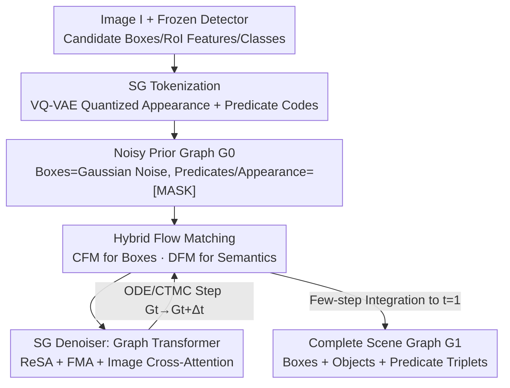

# Can We Build Scene Graphs, Not Classify Them? FlowSG: Progressive Image-Conditioned Scene Graph Generation with Flow Matching

**Conference**: CVPR 2026  
**Paper**: [CVF Open Access](https://openaccess.thecvf.com/content/CVPR2026/html/Hu_Can_We_Build_Scene_Graphs_Not_Classify_Them_FlowSG_Progressive_CVPR_2026_paper.html)  
**Code**: Not disclosed  
**Area**: Multimodal VLM / Scene Graph Generation  
**Keywords**: Scene Graph Generation, Flow Matching, Discrete-Continuous Hybrid Generation, Graph Transformer, Open-Vocabulary  

## TL;DR
FlowSG reformulates Scene Graph Generation (SGG) from "one-shot classification" into "progressive generation." By using hybrid discrete-continuous flow matching, a noise-polluted graph gradually evolves into object boxes (via continuous CFM) and predicate labels (via discrete DFM) over time. It outperforms the SOTA (USG-Par) by an average of 3 points across closed-set and open-vocabulary settings on VG and PSG datasets.

## Background & Motivation

**Background**: Scene Graph Generation (SGG) aims to parse an image into a structural graph consisting of "object nodes + subject-predicate-object triplets." This requires both localizing object boxes and reasoning about their visual relationships. Current approaches generally follow two categories: two-stage (enumerating object pairs with a detector, then classifying predicates with a relationship head) and one-shot (outputting all triplets in a single forward pass with matching).

**Limitations of Prior Work**: The authors argue that both categories are essentially **one-shot, deterministic classification** tasks—mapping visual features directly to a final graph without an explicit generative process. This leads to three issues: ① **Lack of error correction**: once a relationship is determined in a single pass, misaligned entities or misclassified predicates cannot be revised using "graph-level evidence"; ② **Semantic and geometric features treated as static inputs**: object boxes and predicate labels are computed independently and cannot refine each other iteratively; ③ **Difficulty in imposing graph-level constraints**: when relations are scored independently, global consistency constraints like "spatial transitivity" are nearly impossible to implement, resulting in globally inconsistent graphs.

**Key Challenge**: Without a "truly generative, progressive" graph construction process, models must "bet it all" on a single forward pass, failing to produce coherent and globally consistent scene graphs.

**Key Insight**: Drawing inspiration from advances in Flow Matching for graph generation (e.g., molecular graphs), where iterative denoising of node/edge states produces high-fidelity constrained graphs, the authors ask: Can SGG be reformulated as "continuous-time transport over a hybrid state space"?

**Core Idea**: Construct the scene graph as a **hybrid graph**—where each node carries discrete labels and continuous box parameters, and each edge carries discrete predicates. Then, use flow matching to transport a noisy prior graph ($G_0$, where boxes are Gaussian noise and predicates are [MASK]) over time to a clean, image-conditioned scene graph. In short: **replace "one-shot classification" with "progressive denoising generation" to solve global inconsistency.**

## Method

### Overall Architecture

The input to FlowSG is an image $I$, and the output is a complete scene graph $G_1$ (boxes + object classes + predicates). The workflow consists of three stages: first, candidate objects are obtained using a frozen detector, and visual appearance features/predicate phrases are **discretized into compact tokens** (continuous boxes remain continuous); second, starting from a "noisy prior graph $G_0$," **hybrid flow matching** is used to iteratively denoise from $t=0 \to 1$; third, each denoising step is performed by a **Graph Transformer denoiser**, which is conditioned on frozen image features and outputs both the velocity field for continuous boxes and the clean posterior for discrete tokens.

Critically, this is a **discrete-continuous coupled** transport process: continuous boxes $\mathbf{g}$ follow probability paths via Continuous Flow Matching (CFM) and ODEs, while discrete semantics $\mathbf{s}=(c,r,a)$ (classes/predicates/appearance codes) evolve via discrete flow (DFM) under a Continuous-Time Markov Chain (CTMC). Both paths are tightly coupled at every step through a shared Graph Transformer. Object classes $c$ are not modified by noise to stabilize training; predicates and appearance codes are initialized as [MASK], while boxes start from $\mathcal{N}(0,I_4)$.

### Key Designs

**1. Scene Graph Tokenization: Compressing Semantics into Language-Aligned Codes**

Generating directly in the raw $\mathbb{R}^d$ visual feature space is expensive and unstable. The authors first make the "discrete parts" predictable. Appearance is quantized via VQ-VAE: a CLIP image encoder encodes crop regions $\mathbf{u}_i = \mathrm{CLIP_{img}}(\Phi_{crop}(I, \mathbf{b}_i))$, which are quantized to the codebook neighbor $a^\star_i = \arg\min_k \lVert \mathbf{u}_i - \mathbf{e}_k\rVert_2^2$. Predicates are quantized into a predicate codebook using a CLIP text encoder with relational phrases (including augmentations from ConceptNet). This is clever because: the codebook is learned in **language space**, meaning semantically similar predicates map to adjacent or identical codes, providing natural "semantic smoothing." During inference, codes can be mapped back to the CLIP space for **open-vocabulary decoding**, which drives the performance gains in open-vocabulary experiments. The resulting node token is $\mathbf{n}_i=(a^\star_i, c^\star_i, \mathbf{b}^\star_i)\in[K_a]\times[C_{obj}]\times\mathbb{R}^4$.

**2. Hybrid Flow Matching: Coupled Evolution of Boxes (CFM) and Semantics (DFM)**

This is the core mechanism of FlowSG, addressing the issue where geometry and semantics cannot refine each other. For continuous boxes, a linear interpolation path $\mathbf{g}_t=(1-\kappa_t)\mathbf{g}_0+\kappa_t\mathbf{g}_1$ is used with target velocity $\mathbf{u}^\star_g=\dot\kappa_t(\mathbf{g}_1-\mathbf{g}_0)$. A velocity field is trained to match this:

$$\mathcal{L}_{CFM}=\mathbb{E}_{t\sim U[0,1]}\big\lVert v_\theta(\mathbf{g}_t,t,c)-\dot\kappa_t(\mathbf{g}_1-\mathbf{g}_0)\big\rVert_2^2$$

Inference starts from $\mathbf{g}_0\sim\mathcal{N}(0,I)$, using a few ODE integration steps $\frac{d}{dt}\mathbf{g}_t=v_\theta(\mathbf{g}_t,t,c)$. For discrete semantics, a two-point conditional path $p_t=(1-\kappa_t)\delta_{s_0}+\kappa_t\delta_{s_1}$ ($s_0$ is the [MASK] prior) evolves via CTMC. To solve numerical challenges, instead of directly regressing the rate matrix $R_\theta$, the **network predicts the "clean posterior" $q_1$**. During sampling, a valid rate matrix is assembled from the posterior and $\kappa_t$. Training thus reduces to a time-conditioned cross-entropy:

$$\mathcal{L}_{DFM}=-\sum_i\sum_m\log p_{1|t}(a^1_{i,m}\mid G_t,\mathbf{C})-\sum_{(i,j)}\sum_m\log p_{1|t}(r^1_{ij,m}\mid G_t,\mathbf{C})$$

Total objective: $\mathcal{L}=\mathcal{L}_{CFM}+\lambda\mathcal{L}_{DFM}$. Since both paths share the same image-conditioned graph encoder $\mathbf{C}$, geometric updates of boxes and semantic updates of predicates observe each other's current state at every step—this "coupling" allows them to be **jointly evolving states** rather than isolated components. The scheduler uses $\kappa_t=1-\cos(\frac{\pi t}{2})$.

**3. SG Denoiser: Relation-modulated Attention + Flow-conditioned Message Aggregation**

Scene graphs are typically sparse with heavy-tailed degree distributions. Standard message passing lacks expressivity and is sensitive to degrees. The denoiser is a DiT-style Graph Transformer with three components per block: Image-conditioned Cross-Attention, Relation-modulated Self-Attention (ReSA), and Flow-conditioned Message Aggregation (FMA). **ReSA** uses FiLM to inject predicate semantics into the attention bias—$\alpha_{ij}(t)=\mathrm{softmax}_j\big(\frac{q_i^\top k_j}{\sqrt d}+\mathrm{FiLM}(e^{(\ell)}_{ij})\big)$—selectively amplifying "relationally consistent neighbors." **FMA** addresses degree sensitivity by concatenating time, degree, and local context into $\zeta_i(t)=[\phi(t)\oplus\log(1+\deg(i,t))\oplus\bar r_i(t)]$. It maintains permutation-invariant moment operators (mean, variance, skewness, kurtosis) weighted by a learned $\mathrm{softmax}(W_\beta\zeta_i)$. The intuition is specific: early in denoising ($t\approx1$), when the graph is noisy, it relies on robust low-order statistics; late in denoising ($t\to0$), it shifts to sharper high-order moments. This "stage-adaptive aggregation" is why FMA outperforms fixed PNA.

### Loss & Training
Total loss is $\mathcal{L}=\mathcal{L}_{CFM}+\lambda\mathcal{L}_{DFM}$. The model uses 5 Transformer blocks, 8 heads, 512-dim hidden size, and dropout 0.1. A frozen CLIP ViT-B/16 extracts image features. Codebooks consist of 64 entries with 512 dimensions, with 4 ordered slots each for appearance and predicates. A **random edge-only refine mode** (probability 0.2) is used during training to fix node attributes and only generate relations, enhancing robustness. Trained for 500K steps using AdamW with lr $1\times10^{-4}$ on 4 A100 GPUs.

## Key Experimental Results

Datasets: Visual Genome (VG150, 150 objects/50 predicates) and PSG (Panoptic Scene Graph, 56 predicates). Tasks: Predicate Classification (PredCls) and Scene Graph Detection (SGDet). Metrics: R@K and mR@K in closed-set and open-vocabulary (base:novel = 7:3) settings.

### Main Results (Two-stage, Closed-set)

| Dataset | Task/Metric | Prev. SOTA (USG-Par) | FlowSG |
|--------|-----------|-------------------|--------|
| PSG | SGDet R/mR@100 | 51.3 / 42.7 | **53.3 / 48.3** |
| PSG | PredCls R/mR@100 | 72.3 / 57.8 | **74.3 / 61.3** |
| VG | SGDet R/mR@100 | 38.5 / 17.3 (DSGG) | **42.4 / 21.6** |
| VG | PredCls R/mR@100 | 67.4 / 50.3 (OpenPSG) | **68.8 / 53.3** |

On VG SGDet, FlowSG achieves a ~3–4 point gain in R@50/100 over two-stage methods and outperforms strong one-stage models (e.g., HRTrans) by ~2 points. In open-vocabulary settings, it generalizes better to unseen predicates, exceeding VL-IRM by ~4/2 points in mR@50/100 on PSG.

### Ablation Study

| Configuration | R@50 | mR@50 | Description |
|------|------|-------|------|
| FlowSG (full) | 46.3 | 42.7 | Full model |
| w/o FMA | 40.5 | 37.1 | Removes flow-conditioned aggregation; significant drop |
| w/o EdgeMA | 43.1 | 38.5 | Removes edge-level aggregation |
| w/o NodeMA | 42.8 | 38.9 | Removes node-level aggregation |
| w/o Cross-attn | 39.2 | 34.3 | Removes image cross-attention; largest drop (7-11 pts) |

Tokenization Ablation: Increasing the codebook size from 32×256 to 64×256 yields double-digit gains (indicating small codebooks are bottlenecks). Slot number $M=4$ is optimal; too few lacks expressivity, too many increases description complexity. Initialization: **Marginal initialization (matching data priors)** is superior, especially in mR, confirming that a reasonable starting point is crucial for long-tail recognition.

### Key Findings
- **Image Cross-Attention is Vital**: Removing it causes a 7–11 point drop, significantly more than any aggregation module. This confirms that image-conditioned disambiguation is the core of progressive generation gains.
- **FMA is the Most Significant Contributor**: Removing FMA leads to a general performance collapse. The node-level and edge-level aggregations are complementary.
- **Gains are Concentrated in mR (Long-tail)**: The combination of language-aligned codebook smoothing and Marginal initialization improves recall for rare predicates without sacrificing head-class accuracy.

## Highlights & Insights
- **Elegant Paradigm Rewrite**: Reformulating SGG from classification to time-transport in a hybrid state space allows boxes (continuous) and predicates (discrete) to refine each other—a "correctable" property missing in one-shot methods.
- **Clever DFM Training**: Predicting the "clean posterior" instead of regressing the rate matrix reduces discrete flow training to a simple cross-entropy task—a trick applicable to any discrete sequence/graph flow matching.
- **Language-Space Codebook Unlocks Open-Vocab**: Quantizing predicates into CLIP text space allows semantically similar predicates to share codes. This "compression" design naturally yields open-vocabulary generalization.
- **Stage-Adaptive Aggregation in FMA**: Using robust low-order moments early and sharp high-order moments late provides a strategy for aggregation that adapts to denoising time, an insight transferable to any graph diffusion task.

## Limitations & Future Work
- **Reliance on a Frozen Detector**: FlowSG relies on a detector for object priors; object classes are not noise-refined. This means detection errors propagate, and the generative process does not directly improve detection quality.
- **Iterative Inference Latency**: While it uses few-step ODE/CTMC, it is still slower than one-shot classification. The paper lacks a detailed latency-accuracy trade-off curve.
- **Absolute OV Metrics remain Low**: For example, VG OV mR@50 is only 9.7. Generalization still relies heavily on codebook smoothing rather than fundamental zero-shot reasoning.

## Related Work & Insights
- **vs. Two-stage SGG (MOTIF, VCTree, USG-Par)**: These perform classification on predefined pairs. FlowSG allows predicates to be "generated" from noise, enabling error correction and resulting in superior long-tail mR.
- **vs. One-shot Set Prediction (SGTR, HRTrans, DSGG)**: These are still deterministic. FlowSG uses iterative denoising + image conditioning to lead in VG SGDet metrics.
- **vs. Graph Flow Matching (e.g., Molecular Graph FM)**: Most prior graph FMs are unconditional or weakly conditioned. FlowSG introduces **strong image conditioning** and tight coupling of discrete semantics with continuous geometry.

## Rating
- Novelty: ⭐⭐⭐⭐⭐ Transforming SGG into hybrid discrete-continuous flow matching is a genuine paradigm innovation.
- Experimental Thoroughness: ⭐⭐⭐⭐ Extensive coverage of VG/PSG and open-vocab settings, although missing inference cost curves.
- Writing Quality: ⭐⭐⭐⭐ Clear motivation and illustrations, though some duplicated equation numbers are confusing.
- Value: ⭐⭐⭐⭐ The combination of progressive generation and language-aligned codebooks offers significant insights for the SGG community.

<!-- RELATED:START -->

## Related Papers

- [\[CVPR 2026\] Scene-VLM: Multimodal Video Scene Segmentation via Vision-Language Models](scene-vlm_multimodal_video_scene_segmentation_via_vision-language_models.md)
- [\[CVPR 2026\] HOG-Layout: Hierarchical 3D Scene Generation, Optimization and Editing via Vision-Language Models](hog_layout_hierarchical_3d_scene_generation_optimization_and_editing.md)
- [\[CVPR 2026\] P-Flow: Prompting Visual Effects Generation](p-flow_prompting_visual_effects_generation.md)
- [\[ACL 2026\] Response-G1: Explicit Scene Graph Modeling for Proactive Streaming Video Understanding](../../ACL2026/multimodal_vlm/response-g1_explicit_scene_graph_modeling_for_proactive_streaming_video_understa.md)
- [\[CVPR 2026\] RE-VLM: Event-Augmented Vision-Language Model for Scene Understanding](re-vlm_event-augmented_vision-language_model_for_scene_understanding.md)

<!-- RELATED:END -->
