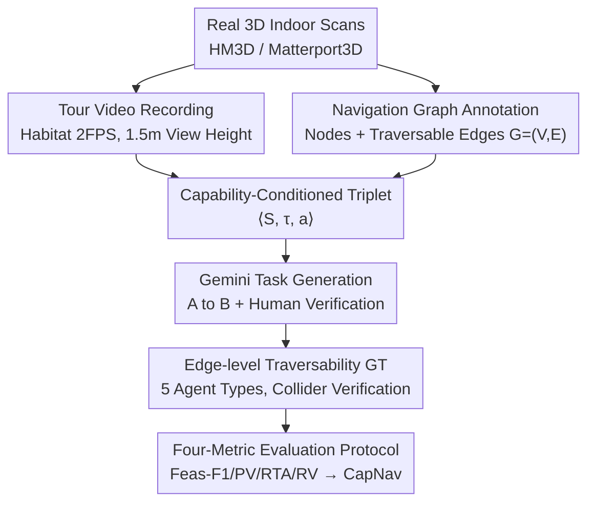

# CapNav: Benchmarking Vision Language Models on Capability-conditioned Indoor Navigation

**Conference**: CVPR 2026  
**Paper**: [CVF Open Access](https://openaccess.thecvf.com/content/CVPR2026/html/Su_CapNav_Benchmarking_Vision_Language_Models_on_Capability-conditioned_Indoor_Navigation_CVPR_2026_paper.html)  
**Code**: https://makeabilitylab.github.io/CapNav/ (Dataset + Annotation tools)  
**Area**: Multi-modal VLM / Vision-Language Navigation / Benchmark  
**Keywords**: Capability-conditioned navigation, VLM evaluation, Indoor navigation, Traversability, Embodied spatial reasoning

## TL;DR
CapNav proposes a "capability-conditioned navigation" benchmark: given an indoor tour video, a navigation graph, an agent profile with physical/operational capabilities, and a "go from A to B" task, VLMs must determine if and how the agent can navigate the space. Experiments on 13 mainstream VLMs show that navigation performance drops significantly once mobility constraints (e.g., inability to climb stairs, narrow corridors) are introduced.

## Background & Motivation
**Background**: VLMs are increasingly used in Vision-Language Navigation (VLN) as "navigation assistants" or robotic planning modules to provide directions or make movement decisions. Existing VLN benchmarks (e.g., R2R, RxR, REVERIE) mostly evaluate "embodiment-agnostic target reaching" in simulators or graph-structured environments, or simplify navigation into VQA-style spatial reasoning.

**Limitations of Prior Work**: Real-world navigation is inherently constrained by the agent's mobility—vacuum robots cannot bypass stairs, quadruped robots can climb stairs but cannot operate elevators, and wheelchair users require sufficient turning/passage clearance. Existing benchmarks generally ignore this: they either perform "embodiment-agnostic" reaching evaluations or use a single ground truth path to measure trajectory fidelity (e.g., SPL), completely neglecting that the same task has different feasibility for different agents and often involves multiple feasible paths.

**Key Challenge**: There is a fundamental mismatch between the "capability-conditioned validity" and "diversity of solutions" in real-world navigation and the "single embodiment + single ground truth path" assumption of existing evaluation paradigms. When VLMs are deployed in embodied control or assistive scenarios, a route suggestion that ignores capabilities could be infeasible or even dangerous.

**Goal**: To construct a navigation benchmark that explicitly characterizes mobility constraints, allows multiple feasible solutions, and enables fine-grained edge-level traversability assessment to answer: "Is the navigation plan provided by the VLM effective under specific capability constraints?"

**Key Insight**: The authors adopt a **passive global observation** setting—providing the entire scene as a tour video + navigation graph to the model at once, rather than interactive step-by-step exploration. This decouples "embodied constraint reasoning" from "exploration noise/low-level control," purely examining high-level route planning and feasibility judgment.

**Core Idea**: Navigation queries are defined as ⟨Space, Task, Capability⟩ triplets. **Edge-level traversability** ground truth is annotated for 5 representative agent types, testing VLMs across four dimensions: "feasibility judgment / path selection / edge validity / failure reasoning."

## Method
CapNav is a benchmark paper where the core is the **task definition + ground truth annotation + data construction + evaluation protocol**. Overall: each query is a ⟨S, τ, a⟩ triplet, and the VLM outputs $(\hat{y}, \hat{P}, \hat{\rho})$—feasibility, path, and reasoning; CapNav uses four complementary metrics to align and score the output against edge-level ground truth.

### Overall Architecture
On the input side, space $S$ is represented by a tour video + a manually annotated connectivity graph $G=(V,E)$; task $\tau$ is a natural language instruction "from source node to target node"; capability $a=(\phi,\kappa,\mu)$ encodes the agent's physical dimensions $\phi$, vertical traversal capability $\kappa$ (e.g., step height, stair climbing), and manipulation capability $\mu$ (e.g., opening doors/operating elevators). The VLM processes the triplet to produce $(\hat{y},\hat{P},\hat{\rho})=f_\theta(S,\tau,a)$, where $\hat{y}\in\{0,1\}$ is task feasibility, $\hat{P}=[v_0,\dots,v_m]$ is the node sequence path, and $\hat{\rho}$ is a short reason for infeasibility.

On the data side, a hybrid human + Gemini annotation pipeline is used (see below): starting from real 3D scans, videos are recorded and navigation graphs are annotated manually. Gemini generates tasks, followed by manual traversability labeling for each task and agent.

### Key Designs

**1. Capability-Conditioned Triplets and 5 Representative Agents: Explicitly Injecting "Who is Moving"**

To address the embodiment-agnostic nature of prior work, CapNav makes agent capability a first-class citizen of the query. Each capability is described by a JSON profile $a=(\phi,\kappa,\mu)$: $\phi$ for physical footprint (H/W/D), $\kappa$ for vertical limits (max step height, stairs), and $\mu$ for manipulation (doors, elevators). Five profiles are defined: **Non-disabled Adult** (default), **Wheelchair User** (no stairs, requires clearance), **Humanoid Robot** (no stairs, 0.9m clearance), **Sweeper Robot** (smooth floors only), and **Quadrupedal Robot** (stairs okay, no manipulation). These attributes determine the traversability of each edge $E$ and task $\tau$—a "basement to top floor" task may require an elevator for a wheelchair but stairs for a quadruped, leading to different paths.

**2. Edge-level Traversability GT and Feasibility Definition: Supporting Multiple Solutions and Interpretability**

To address the "single GT path" limitation, CapNav provides binary labels at the **edge level**. For each task $\tau$ and embodiment $a$, annotators traverse every simple path between $v_{\mathrm{src}}$ and $v_{\mathrm{tgt}}$, assigning $g_e^{(a)}\in\{0,1\}$ to each edge $e$ based on local geometry and agent capability. Infeasible edges include text reasons (e.g., "cannot climb stairs"). The UI visualizes 3D colliders matching $\phi$ to verify clearances. Task-level feasibility $\hat{y}^\star$ is defined as "whether there exists at least one simple path where all edges are traversable":

$$\hat{y}^\star = \mathbb{I}\big[\exists\, P(v_{\mathrm{src}}, v_{\mathrm{tgt}}):\ \forall (u,v)\in P,\ g^{(a)}_{(u,v)}=1\big]$$

This allows multiple equivalent feasible paths and provides precise "where and why" information when a route fails.

**3. Human + Gemini Hybrid Pipeline: From 3D Scans to 5k+ Traversability Annotations**

To ensure realism, control, and scalability, the authors designed a hybrid pipeline. 3D scenes are sourced from HM3D and Matterport3D. Videos are recorded in Habitat at 1.5m height, 75° FOV, and 2FPS to simulate casual handheld walkthroughs. Navigation graphs include semantic labels $c(v)$ and 3D positions. Tasks are generated by Gemini 1.5 Pro (given video + nodes) and verified by humans. After filtering, the final set includes **45 indoor scenes** (avg. 160.38s video, 13.8 nodes, 14.5 edges), resulting in **2,365 navigation tasks** and **5,075 traversability annotations** (3,945 positive / 1,130 negative). ⚠️ Note: There is a discrepancy between the abstract (473 tasks) and the dataset section (2,365 tasks); the latter is used here.

**4. Four-Metric Protocol and CapNav Composite Score: Multi-dimensional Quantization**

CapNav uses four complementary metrics:
- **Feasibility Classification (Feas-F1)**: F1 score of binary feasibility prediction.
- **Path Validity (PV)**: Whether the path $\hat{P}$ involves valid nodes/edges and correct start/end points.
- **Route Traversability Accuracy (RTA)**: For feasible predictions with valid paths, the ratio of truly traversable edges in the suggested path.
- **Reasoning Validity (RV)**: For infeasible predictions, uses LLM-as-judge to verify if the VLM's reason $\hat{\rho}$ matches the GT reason.

The **CapNav Score** is a weighted average: $\mathrm{CapNav}=\lambda_c F_1+\lambda_p \mathrm{PV}+\lambda_t \overline{\mathrm{RTA}}+\lambda_r \overline{\mathrm{RV}}$ (default weights 0.25 each). Random walk serves as a lower bound (29.35), while human performance serves as an upper bound (Avg: 60.59, Max: 74.77).

## Key Experimental Results

### Main Results
Evaluation of 13 VLMs (as of Nov 2024), including Gemini 1.5, GPT-4o, Doubao-Seed, Qwen2-VL, and spatial-specific models like Spatial-MLLM and Video-R1.

| Model | Mode | Feas-F1 | PV | RTA | RV | CapNav |
|------|------|---------|-----|-----|-----|--------|
| Gemini-1.5-pro | thinking | 84.30 | 73.00 | 79.15 | 32.29 | **67.18** |
| GPT-4o | thinking | 86.87 | 67.90 | 75.89 | 34.81 | 66.37 |
| Doubao-Seed-1.6 | thinking | 76.16 | 61.94 | 71.93 | 38.44 | 62.12 |
| Human Avg | — | — | — | — | — | 60.59 |
| Spatial-MLLM-4B | thinking | 75.27 | 5.04 | 10.16 | - | 30.15 |
| Random Walk | — | — | — | — | — | 29.35 |

**Key Observation**: Most models exceed the random walk lower bound. Top models (Gemini-1.5-pro, GPT-4o) surpass the average human score but remain below the human maximum. **Spatial-specific models (Spatial-MLLM, Video-R1) significantly underperform**, suggesting current spatial reasoning training is insufficient for CapNav.

### Analysis by Embodiment and Obstacles
Task difficulty varies wildly by agent type:

| Agent | Feasible Task Prop. | Edge Traversable Prop. | Avg CapNav Score |
|--------|------------|------------|---------------|
| Human (Adult) | 1.00 | 1.00 | 57.83 |
| Quadrupedal | 0.97 | 0.96 | High |
| Humanoid | 0.22 | 0.43 | **39.12 (Lowest)** |

The humanoid robot is the most difficult embodiment due to its dual constraints (no stairs + 0.9m clearance). Failure modes include: **Path Hallucination** (invalid connectivity), **Obstacle Hallucination** (non-existent blockages), **Size Neglect** (ignoring narrow clearances), and **Capability Hallucination** (reasons contradicting agent profile).

### Key Findings
- **Systemic Degradation under Constraints**: Performance drops from 57.83% (Human) to 39.12% (Humanoid). Success in unconstrained settings does not transfer to constrained ones.
- **Vision Bottleneck**: "Thinking" mode improves CapNav by ~6.87% but increases latency 8x. Increasing frame counts only helps strong models; weak models suffer from increased obstacle hallucinations.
- **Size Neglect**: Models handle visible obstacles (stairs, thresholds) better than implicit geometric constraints (narrow clearances, turning radii).

## Highlights & Insights
- **Capability as a First-class Citizen**: Explicitly modeling 5 agent types exposes the blind spots of embodiment-agnostic benchmarks and aligns with real-world deployment needs.
- **Edge-level Binary Truth**: Defining feasibility via path existence supports multiple solutions and enables precise error localization, making the RTA metric more informative than SPL.
- **Counter-intuitive Performance Gap**: The failure of spatial-specific MLLMs suggests a gap between their architectural priors and real-world multi-frame geometric reasoning.
- **Transferability**: The annotation UI (using colliders) and the hybrid pipeline can be adapted for other embodied evaluation tasks requiring fine-grained geometry.

## Limitations & Future Work
- **Passive vs. Active**: Global observation decouples exploration noise but does not directly measure interactive navigation.
- **Sim-to-Real**: Dependence on Habitat-rendered videos and Gemini-generated tasks (despite verification) leaves a domain gap.
- **Data Discrepancy** ⚠️: Note the conflicting task counts in the paper text.
- **Future Directions**: Planning to use embodiment-constrained task-level rewards for RL finetuning and injecting explicit spatial priors (depth, topology) to mitigate size neglect.

## Related Work & Insights
- **vs. Traditional VLN (R2R, etc.)**: CapNav moves beyond embodiment-agnostic reaching with a single path, focusing on "can this specific agent pass?"
- **vs. Passive Benchmarks (VideoNavQA, etc.)**: CapNav adds graph abstraction and capability conditioning to evaluate cross-frame geometric reasoning.
- **vs. Constrained Navigation**: Unlike prior work on simulator-specific physics, CapNav focuses on validating route feasibility across diverse agents in complex, multi-floor indoor spaces.

## Rating
- Novelty: ⭐⭐⭐⭐⭐ First benchmark to treat embodiment mobility as a primary query dimension with multi-solution support.
- Experimental Thoroughness: ⭐⭐⭐⭐ Extensive analysis across 13 VLMs, 5 agents, and various failure modes; minor deduction for data discrepancy.
- Writing Quality: ⭐⭐⭐⭐ Clear motivation and metric definitions; rich visualizations.
- Value: ⭐⭐⭐⭐⭐ High value for safety-critical embodied AI deployment; open-source tools provided.

<!-- RELATED:START -->

## Related Papers

- [\[CVPR 2026\] β-CLIP: Text-Conditioned Contrastive Learning for Multi-Granular Vision-Language Alignment](b-clip_text-conditioned_contrastive_learning_for_multi-granular_vision-language_.md)
- [\[CVPR 2026\] GraphVLM: Benchmarking Vision Language Models for Multimodal Graph Learning](graphvlm_benchmark_vlm_graph_learning.md)
- [\[CVPR 2026\] Unleashing the Intrinsic Visual Representation Capability of Multimodal Large Language Models](unleashing_the_intrinsic_visual_representation_capability_of_multimodal_large_la.md)
- [\[CVPR 2026\] SVHalluc: Benchmarking Speech-Vision Hallucination in Audio-Visual Large Language Models](svhalluc_benchmarking_speech-vision_hallucination_in_audio-visual_large_language.md)
- [\[CVPR 2026\] From Indoor to Open World: Revealing the Spatial Reasoning Gap in MLLMs](from_indoor_to_open_world_revealing_the_spatial_reasoning_gap_in_mllms.md)

<!-- RELATED:END -->
