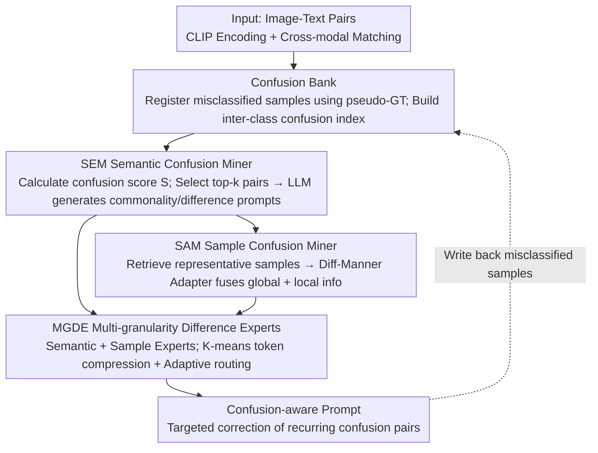

# CAPT: Confusion-Aware Prompt Tuning for Reducing Vision-Language Misalignment

**Conference**: CVPR2026  
**arXiv**: [2603.02557](https://arxiv.org/abs/2603.02557)  
**Code**: [github.com/greatest-gourmet/CAPT](https://github.com/greatest-gourmet/CAPT)  
**Area**: Multimodal VLM  
**Keywords**: prompt tuning, vision-language alignment, confusion-aware, CLIP, few-shot, fine-grained classification

## TL;DR
The CAPT (Confusion-Aware Prompt Tuning) framework is proposed to explicitly model systematic misalignment patterns in VLMs through a Semantic Confusion Miner (SEM) and a Sample Confusion Miner (SAM). By integrating different levels of confusion information via Multi-Granularity Difference Experts (MGDE), it achieves a state-of-the-art HM of 83.90% across 11 benchmarks.

## Background & Motivation

**Background**: Vision-language models like CLIP exhibit systematic misalignments—confusions between specific category pairs are not random but occur as persistent patterns. For instance, in the OxfordPets dataset, a terrier might be misclassified as a bulldog 30 times, while almost never being mistaken for other classes.

**Limitations of Prior Work**: Existing prompt tuning methods (e.g., MaPLe, PromptSRC) only optimize global image-text feature alignment and ignore these fixed confusion patterns. The root of misalignment lies in ambiguous semantic boundaries and local representation similarities between highly similar categories, which global alignment fails to resolve.

**Key Insight**: Models should learn from their own misalignments. By explicitly modeling and correcting confusion relationships while mining discriminative fine-grained clues from confused samples, the model can address issues that previous methods overlooked.

## Method

### Overall Architecture

CAPT transforms "learning from misalignment" into a closed loop: built upon CLIP prompt tuning, it utilizes a **Confusion Bank** to record misclassified samples. The **Semantic Confusion Miner** (SEM) extracts the most critical confusion pairs at the semantic level, while the **Sample Confusion Miner** (SAM) supplements these with fine-grained sample clues. Finally, the **Multi-Granularity Difference Experts** (MGDE) fuse semantic and sample-based information into the prompts to specifically correct recurring category confusions. New predictions then update the Confusion Bank with misclassified samples, forming a continuous learning loop.

### Key Designs

**1. Confusion Bank: Storing Systematic Errors as Training Signals**

To learn from misalignment, the model must identify which category pairs it repeatedly confuses. The Confusion Bank records the misclassified category for each sample, maintaining an inter-class confusion relationship index. It uses pseudo-GT (the class with the highest model confidence) rather than ground truth (GT) for registration, as the former more accurately reflects the model's inherent "perceived" confusion tendencies, aggregating scattered errors into mineable patterns.

**2. SEM: Mining Critical Confusion Pairs via Semantics**

Not all relationships in the Confusion Bank are equally significant. SEM identifies the most critical semantic confusion pairs. It calculates a confusion score $S_i = (1 + \frac{n_i}{\sum n_i}) C_i$ using historical confusion statistics $n_i$ and current sample confidence $C_i$. After selecting the top-$k$ semantic confusion pairs, an LLM (using CoT) generates "commonality" and "difference" prompts for each pair—commonality helps the model understand why confusions occur, while difference teaches the model how to distinguish them.

**3. SAM: Mining Fine-grained Discriminative Clues via Samples**

While the semantic level provides global context, distinguishing between two similar classes often relies on local details. SAM retrieves a set of confused samples $U \in \mathbb{R}^{c \times l}$ from the Confusion Bank and selects representative samples $I_c^* = \arg\max \cos(E_I(I), E_I(U_j^i))$ most similar to the current instance. A Diff-Manner Adapter then fuses the global attention of the ViT with the local details captured by 2D depth-wise separable convolutions:

$$[X] \leftarrow [X] + \alpha \cdot DWConv2D(\hat{[X]})$$

This preserves global semantics while recovering local discriminative information typically lost during global alignment.

**4. MGDE: Adaptive Fusion via MoE**

Semantic and sample confusions have different focuses, and hard fusion may lead to interference. MGDE employs a Mixture-of-Experts (MoE) architecture with semantic experts (initialized by text difference/commonality prompts) and sample experts (initialized by CLIP FFN). It uses K-means clustering to compress prompt tokens and remove low-discriminative features. Finally, a routing network adaptively determines the output weights for each expert, allowing the model to dynamically balance "global confusion patterns" and "fine-grained differences" based on sample difficulty.

### Loss & Training

$$\mathcal{L} = \mathcal{L}_{ori} + \mathcal{L}_{confuse}$$

- $\mathcal{L}_{ori}$: Standard cross-entropy alignment loss.
- $\mathcal{L}_{confuse}$: InfoNCE-style contrastive loss applied to confused sample features and prompts.

## Key Experimental Results

### Main Results: Base-to-New Generalization (16-shot)

| Method | Base | Novel | HM |
|------|------|-------|-----|
| CoOp (IJCV'22) | 82.69 | 63.22 | 71.66 |
| MaPLe (CVPR'23) | 82.28 | 75.14 | 78.55 |
| PromptKD (CVPR'24) | 86.96 | 80.73 | 83.73 |
| TAC (CVPR'25) | 85.42 | 77.60 | 81.24 |
| 2SFS (CVPR'25) | 85.55 | 75.48 | 80.20 |
| **Ours (CAPT)** | **87.41** | **80.90** | **83.90** |

### Confusion Sample Recovery Rate

| Metric | Value |
|------|------|
| Confusion Pair Recovery Rate | 50.72% |
| Base Accuracy | 87.41% |
| Novel Accuracy | 80.90% |

### Key Findings
- CAPT outperforms all prior methods in HM, showing significant gains in both Base and Novel categories.
- A 50.72% recovery rate for confused sample pairs validates the effectiveness of confusion-aware learning.
- SEM and SAM provide complementary contributions: the semantic level captures global confusion patterns, while the sample level captures fine-grained differences.

## Highlights & Insights
- Unique Perspective: Mining improvement signals from the model's own misalignments effectively turns a "bug" into a "feature."
- The Confusion Bank design is simple yet effective, providing a reusable tool for subsequent research.
- The Diff-Manner Adapter’s approach to fusing ViT globality with CNN locality has broad applicability.

## Limitations & Future Work
- The quality of pseudo-GT depends on the initial predictive capability of the model; weak models might generate a noisy Confusion Bank.
- The quality and consistency of semantic prompts generated by the LLM have not been fully analyzed.
- Increased model complexity (SEM+SAM+MGDE) may result in higher training costs compared to simple prompt tuning.

## Related Work & Insights
- Fundamental difference from PromptSRC/MaPLe: The focus is not on how to align better, but how to learn from misalignment.
- The Confusion Bank concept can be transferred to hard negative mining in contrastive learning.
- Insight: Systematic error patterns in models are valuable signals that deserve utilization across more tasks.

## Rating
- Novelty: ⭐⭐⭐⭐⭐ (Very innovative perspective; learning from misalignment)
- Experimental Thoroughness: ⭐⭐⭐⭐ (11 datasets with extensive ablation and visualization)
- Writing Quality: ⭐⭐⭐⭐ (Clear framework diagrams and systematic methodology description)
- Value: ⭐⭐⭐⭐ (A new direction for prompt tuning; the confusion recovery metric is insightful)

<!-- RELATED:START -->

## Related Papers

- [\[CVPR 2026\] Towards Calibrating Prompt Tuning of Vision-Language Models](towards_calibrating_prompt_tuning_of_vision-language_models.md)
- [\[CVPR 2026\] Improving Calibration in Test-Time Prompt Tuning for Vision-Language Models via Data-Free Flatness-Aware Prompt Pretraining](improving_calibration_in_test-time_prompt_tuning_for_vision-language_models_via_.md)
- [\[CVPR 2026\] Cluster-Aware Neural Collapse Prompt Tuning for Long-Tailed Generalization of Vision-Language Models](cluster-aware_neural_collapse_prompt_tuning_for_long-tailed_generalization_of_vi.md)
- [\[ICML 2025\] Understanding and Mitigating Miscalibration in Prompt Tuning for Vision-Language Models](../../ICML2025/multimodal_vlm/understanding_and_mitigating_miscalibration_in_prompt_tuning_for_vision-language.md)
- [\[CVPR 2026\] CF-IPT: Cross-Modal Fusion Interactive Prompt Tuning of Vision-Language Pre-Trained Model for Multisource Remote Sensing Data Classification](cf-ipt_cross-modal_fusion_interactive_prompt_tuning_of_vision-language_pre-train.md)

<!-- RELATED:END -->
