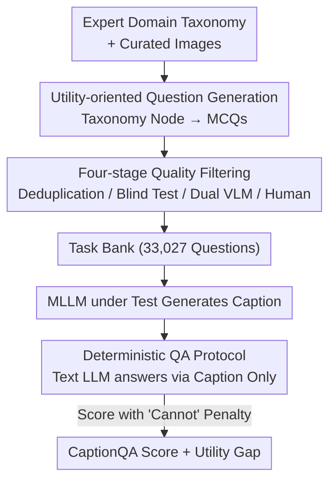

# CaptionQA: Is Your Caption as Useful as the Image Itself?

**Conference**: CVPR 2026  
**Paper**: [CVF Open Access](https://openaccess.thecvf.com/content/CVPR2026/html/Yang_CaptionQA_Is_Your_Caption_as_Useful_as_the_Image_Itself_CVPR_2026_paper.html)  
**Code**: https://captionqa.github.io/website/ (Project page with open-source construction pipeline)  
**Area**: Multimodal VLM  
**Keywords**: Image Caption Evaluation, Downstream Utility, QA-on-caption, Multimodal Benchmark, Domain Taxonomy  

## TL;DR
CaptionQA redefines "caption quality" as "whether the caption can substitute for the image in downstream tasks." By using a text-only LLM to answer 33,027 dense multiple-choice questions based solely on captions, it measures exactly how much usable information is lost relative to the original image. Results show even the strongest closed-source models suffer a 9–16% utility drop, while open-source models drop over 40% in Embodied AI scenarios.

## Background & Motivation
**Background**: In retrieval, recommendation, and agent/embodied pipelines, captions are increasingly used as "cheap proxies" for images—converting unstructured visual input into searchable, analyzable text signals for long-term memory. However, academic evaluation of captions remains stuck in two old paradigms: 1) n-gram overlap metrics like BLEU/CIDEr/SPICE/CHAIR, or 2) "VLM-as-a-Judge" prompts where a large model scores long captions (e.g., CapArena, CAPability).

**Limitations of Prior Work**: n-gram metrics are proven to fail at capturing factual errors and correlate poorly with human judgment. Object-centric parsing (extracting facts for precision/recall) depends on complex LLM judges or graph matching, which are inconsistent and difficult to reproduce, often only covering natural images. VLM-as-Judge patterns outsource scoring to a black-box model where scores drift with prompt and API versions. Worse, they often conflate "utility" with "verbosity," encouraging models to produce long, noisy captions for the sake of "exhaustiveness." QA benchmarks like MMBench/MMMU measure "passive answering while looking at an image" with only 1–2 questions per image, failing as a proxy for the "active generation of complete descriptions."

**Key Challenge**: Current evaluations ask "how similar/complete is the caption," whereas the critical question should be "can the caption replace the image in practical scenarios." The amount of detail is secondary to whether the caption preserves the **details useful for the target application**. These are not identical—verbose captions can have lower utility.

**Goal**: To build a caption benchmark based on "downstream utility" as the first principle, where caption quality is measured by the degree to which it supports downstream tasks across multiple high-value professional domains.

**Key Insight**: Utility is domain-dependent (object attributes for natural images, layout for documents, product features for e-commerce, affordances for embodied AI). Therefore, experts should design fine-grained taxonomies for each domain to identify information truly needed for downstream tasks, which are then converted into "image-dependent" multiple-choice questions.

**Core Idea**: Replace "reference-based comparison" with "QA-on-caption." If a text-only LLM can answer these questions using only the caption (without seeing the image), the accuracy directly reflects the preserved image-level utility. Comparing this against "QA-on-image" results provides the "utility gap."

## Method

### Overall Architecture
CaptionQA is essentially a **benchmark and evaluation protocol** rather than a trained model. It consists of two tracks: 1) **Offline question generation** (deriving a high-quality question bank from domain taxonomies through four filtering stages), and 2) **Online MLLM scoring** (generating captions from the model under test and using a fixed text QA model to answer questions based on those captions, using a scoring rule with "cannot answer" penalties).

The question bank construction follows the same pipeline for all domains, with the taxonomy being the only domain-specific component. The evaluation protocol decouples the "tested model" from the "QA judge"—the former can be any MLLM, while the latter is a fixed text-only LLM to ensure horizontal comparability.

### Key Designs

**1. Utility-oriented Question Generation: Mapping Questions to Downstream Needs**

To address the sparsity of existing benchmarks (1–2 questions per image), CaptionQA grows questions from domain taxonomies. Taxonomies were drafted by GPT-5 and iteratively refined by experts into a two-level structure (e.g., Level 1: "Object Presence / Attribute / Spatial Relation / Action / Scene Attribute / Hallucination"; Level 2 under Attribute: "Color, Shape, Size, Text, Material, State"). Across four domains, there are 25 Level 1 and 69 Level 2 categories. For each image and taxonomy node, three generators (GPT-5, 4o, o4-mini) produce multiple-choice questions. Each question is tagged with its taxonomy node for granular analysis. This results in a dense annotation of 50.3 questions per image, acting as a probe for all useful content.

**2. Four-stage Quality Filtering: Eliminating Scrutiny-free and Redundant Questions**

The validity of this utility measure hinges on questions being "image-dependent." If a text QA model can guess the answer using world knowledge, the score is contaminated. The authors used four stages: ① **Blind Test Filtering**: Qwen2.5-72B attempts to answer without the image 10 times with shuffled options; questions exceeding a near-random accuracy threshold are discarded. ② **Embedding Deduplication**: Qwen3-Embedding-8B encodes questions; semantic sets are identified via mutual k-NN graphs, and only the medoid of each cluster is kept. ③ **Dual VLM Quality Control**: GPT-5 and Gemini 2.5 Pro review the image-question pair with meta-flags (Ambiguous / Unanswerable / Unsuitable / None). Only high-confidence agreements are kept. ④ **Human Refinement**: Annotators fix remaining labels or discard poor questions. Table 2 shows accuracy improved from 86–88% to 95–100% post-filtering, while reducing human workload by 90%.

**3. Deterministic Scoring with "Cannot Answer" Penalty: Prioritizing Precision over Hallucination**

To prevent models from gaining scores through hallucinated details or non-reproducible shifts, an additional option "Cannot answer from the caption" is added to every question. The score $s$ for each question is defined as:
$$ s = \begin{cases} 1, & \text{Correct choice} \\ 0, & \text{Incorrect choice} \\ \tfrac{1}{K}+0.05, & \text{Selected "Cannot answer"} \end{cases} $$
where $K$ is the number of semantic options. The final score is the average of $s$ across all questions. This design rewards **incomplete but non-misleading** captions more than **confident hallucinations**, placing precision over hallucinated detail.

**4. Systematic Selection of QA Judge Model: Ensuring Credible and Scalable Scoring**

The benchmark's validity relies on the text QA model's ability to interpret captions accurately. The authors compared candidates (GPT-5, Gemini 2.5 Pro, DeepSeek-R1-Llama-70B, Qwen2.5-72B) across four dimensions: **Faithfulness** (selecting "Cannot answer" for empty captions), **Efficiency** (QPS), **Performance** (accuracy on fixed captions), and **Stability** (standard deviation at temperature 0). Qwen2.5-72B was selected for its 21.14 QPS and minimal variance (±0.02%), allowing the entire bank to be evaluated in 25 minutes on a single AMD MI325 GPU.

### Mechanism Example
For an e-commerce product page: The MLLM (e.g., GPT-5) generates a caption (~317 words) using a Simple prompt. The QA model (Qwen2.5-72B) reads this text (no image) to answer questions. If asked about the "product material," the model gets 1 point if the material is specified, or $1/K+0.05$ if it correctly identifies the information is missing. GPT-5 achieves ~94.7% on the e-commerce domain, while it achieves ~96–99% when seeing the image (QA-on-image). The difference is the utility gap.

## Key Experimental Results

### Main Results
Evaluation of 24 MLLMs across 4 domains/prompts using Qwen2.5-72B as the judge. Scores represent CaptionQA totals (score %, higher is more useful):

| Prompt | Model | Size | Overall | Natural | Document | E-com. | Embodied AI |
|--------|------|------|---------|---------|----------|--------|-------------|
| Simple | GPT-5 | – | **90.29** | 88.78 | 90.81 | 94.73 | 86.82 |
| Simple | Gemini 2.5 Flash | – | 89.64 | 88.95 | 88.97 | 95.73 | 84.89 |
| Simple | Qwen3-VL | 30B-A3B | 87.02 | 86.14 | 85.89 | 93.90 | 82.15 |
| Simple | GLM-4.1V | 9B | 84.28 | 81.67 | 87.86 | 92.04 | 75.56 |
| Simple | LLaVA-OneVision | 7B | 66.03 | 66.56 | 61.45 | 75.09 | 61.01 |
| Long | Gemini 2.5 Pro | – | 90.12 | 89.44 | 88.67 | 95.60 | 86.78 |

**Utility Gap** (Drop in score from QA-on-image to QA-on-caption, lower is better):

| Model | Natural | Document | E-com. | Embodied AI |
|------|---------|----------|--------|-------------|
| GPT-5 | 11.30 | 6.72 | 4.96 | 13.81 |
| Gemini-2.5-Pro | 12.02 | 10.11 | 5.03 | 15.78 |
| Qwen3-VL-30B-A3B | 12.09 | 10.06 | 4.87 | 16.96 |
| LLaVA-OV-7B | 34.14 | 28.73 | 24.97 | 41.81 |

While QA-on-image performance is nearly perfect (~98%), simply switching to the model's own caption causes a 9.2–16.4% drop in top models and over 40% in LLaVA-OV for Embodied AI, indicating nearly half of useful visual signals are lost.

### Ablation Study
Analysis of whether complex prompts or increased length can close the gap:

| Config Change | Avg. Effect | Note |
|----------|---------|------|
| Long → Taxonomy-Hinted | **−10.8%** | Complex prompts performed worse; Document domain dropped −33.1%. |
| Short → Simple | **+33.8%** | Moving from 21 to 317 words captured 99% of total potential gains. |
| Simple → Long | +0.35% | Increasing from 317 to 471 words yielded almost no utility gain (<2% across categories). |

### Key Findings
- **Small Appearance, Large Reality**: Models with similar QA-on-image scores differ wildly in caption utility. Claude Sonnet 4.5 and LLaVA-OV-7B differ by 1.1% on images but 17.2% on captions.
- **Heterogeneous Domain Gaps**: E-commerce has the smallest gap (textualizable metadata), while Embodied AI has the largest (bottleneck in robot-related spatial/action descriptions).
- **Prompt Backfire**: Taxonomy-Hinted prompts cause models to follow templates like "forms," mentioning concepts without describing them, shifting from "content grounding" to "format imitation."
- **Verbalization vs. Information Bottlenecks**: Document/E-commerce gains from Short to Simple are "verbalization bottlenecks" (info was seen but not said). Embodied AI gains are lower, indicating "information bottlenecks" (info was never perceived).

## Highlights & Insights
- **From Similarity to Utility**: Using a text LLM as a "downstream proxy" bypasses the black-box nature of VLM judges and the superficiality of n-grams.
- **Incentivizing Honesty**: The "Cannot answer" scoring mechanism ($1/K+0.05$) ensures that "not knowing" is better than "hallucinating," addressing a fundamental flaw in caption evaluation.
- **Judge Calibration**: Showing that a slightly weaker but highly stable and efficient model (Qwen2.5-72B) is superior to the "strongest available model" for large-scale, reproducible benchmarking.
- **Pluggable Taxonomy**: The domain-agnostic pipeline ensures the benchmark can be easily extended to new areas simply by defining a new taxonomy.

## Limitations & Future Work
- **QA Model Dependence**: Scores depend on the judge's behaviors. A 92.61% faithfulness rate implies some "guessing" in 7% of cases.
- **Generation Bias**: Questions are generated by top models (GPT-5/4o), potentially inheriting their blind spots.
- **Image Scale**: 657 images is relatively small. Diversity, especially in Embodied AI (200 images), could be expanded.
- **Future Work**: Evaluating correlation between CaptionQA scores and end-to-end task performance in real-world retrieval/agent systems.

## Related Work & Insights
- **vs n-gram / Object-centric**: Metrics like BLEU/SPICE capture overlaps but not factual utility and are restricted to natural images.
- **vs VLM-as-Judge**: Metrics like CapArena are black-boxes and drift with API versions. CaptionQA provides transparency and reproducibility.
- **vs QA benchmarks**: MMBench/MMMU evaluate "passive" perception. CaptionQA evaluates "active" generation utility with 50x higher question density.

## Rating
- Novelty: ⭐⭐⭐⭐⭐ Redefining caption evaluation as downstream utility is a robust new paradigm.
- Experimental Thoroughness: ⭐⭐⭐⭐⭐ 24 models across 4 domains and 4 prompts.
- Writing Quality: ⭐⭐⭐⭐ Clear motivation, though some scoring formulas require careful cross-referencing with the source.
- Value: ⭐⭐⭐⭐⭐ Provides a practical tool for selecting models for "image-as-proxy" workflows.

<!-- RELATED:START -->

## Related Papers

- [\[CVPR 2026\] Rethinking MLLM Itself as a Segmenter with a Single Segmentation Token](rethinking_mllm_itself_as_a_segmenter_with_a_single_segmentation_token.md)
- [\[CVPR 2026\] Learning from Itself: Mining Internal Knowledge from Vision Language Models for Continual Learning](learning_from_itself_mining_internal_knowledge_from_vision_language_models_for_c.md)
- [\[CVPR 2026\] ROSE: Rotate Your Large Language Model to See](rose_rotate_your_large_language_model_to_see.md)
- [\[CVPR 2026\] One Patch to Caption Them All: A Unified Zero-Shot Captioning Framework](one_patch_to_caption_them_all_a_unified_zero-shot_captioning_framework.md)
- [\[NeurIPS 2025\] Unifying Vision-Language Latents for Zero-Label Image Caption Enhancement](../../NeurIPS2025/multimodal_vlm/unifying_vision-language_latents_for_zero-label_image_caption_enhancement.md)

<!-- RELATED:END -->
