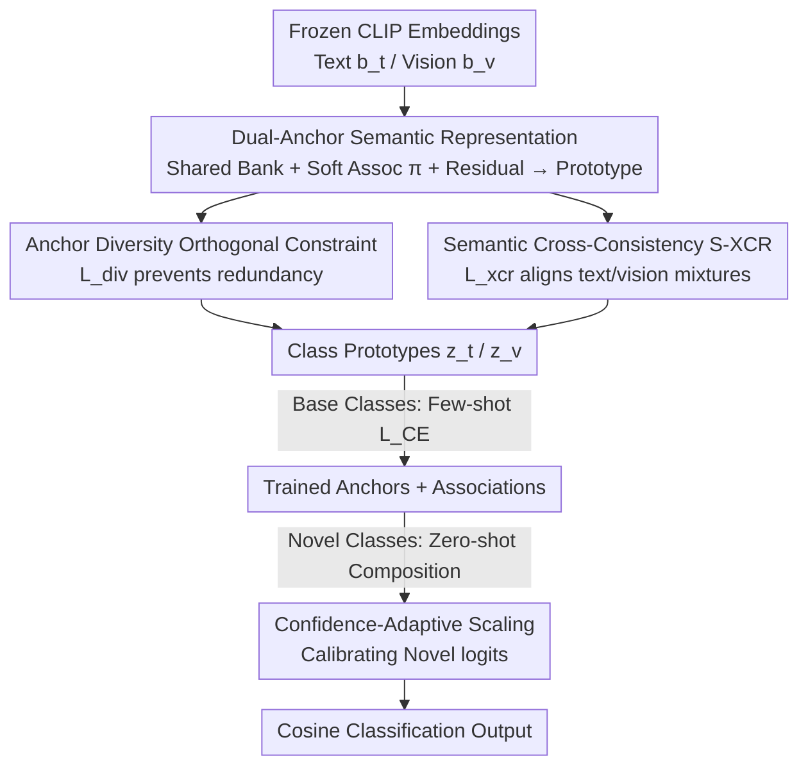

# CASPA: Graph-Structured Concept Anchors for Modality-Agnostic Adaptation in Vision-Language Models

**Conference**: CVPR 2026  
**Paper**: [CVF Open Access](https://openaccess.thecvf.com/content/CVPR2026/html/Chatterjee_CASPA_Graph-Structured_Concept_Anchors_for_Modality-Agnostic_Adaptation_in_Vision-Language_Models_CVPR_2026_paper.html)  
**Code**: https://abhiroopchatterjee123.github.io/CASPA-CVPR-2026/ (Project Page)  
**Area**: Multimodal VLM  
**Keywords**: CLIP adaptation, concept anchors, compositional generalization, cross-modal consistency, parameter-efficient fine-tuning  

## TL;DR
CASPA reformulates CLIP downstream adaptation from "learning one prompt set per class" to "sharing a set of semantic anchors across all classes, with each class learning a soft distribution over these anchors." By using cross-modal consistency regularization to align text and visual anchors while freezing the backbone, CASPA adds only 1.1M parameters (0.73% of CLIP). It achieves or exceeds SOTA across 11 datasets in four settings: Base-to-Novel, cross-dataset transfer, and few-shot learning.

## Background & Motivation

**Background**: Current methods for transferring Vision-Language Models (VLMs) like CLIP to downstream recognition tasks primarily follow three paths: prompt-tuning (e.g., CoOp/CoCoOp/MaPLe learning trainable context tokens), adapter injection (e.g., CLIP-Adapter/Tip-Adapter adding small fusion modules post-frozen backbone), and direct fine-tuning. These methods aim to enhance task discriminability while preserving CLIP's generalization.

**Limitations of Prior Work**: Existing methods are inherently **per-class**. For instance, CoOp learns independent text tokens $p_c = g_\Phi([t_c; v_c])$ for each class, and adapters update each class prompt as an isolated entity. This ignores the natural semantic correlations between classes: for example, "cats" and "tigers" or "cars" and "trucks" share many mid-level visual attributes (stripes, wheels, metallic shells). Per-class parametrization forces each class to learn independently, wasting parameters and failing to capture "reasoning-level" knowledge shareable across classes.

**Key Challenge**: Adaptation is modeled as "class-specific specialization" rather than a "shared conceptual structure." When encountering Novel classes (unseen during training), per-class parameters cannot be transferred, forcing the model to revert to zero-shot CLIP, leading to poor generalization.

**Goal**: To learn a set of **cross-class and cross-modality reusable** semantic bases while freezing CLIP encoders and avoiding MLP/LoRA/backbone fine-tuning, allowing any class (including Novel ones) to be **composed** from these bases.

**Key Insight**: The authors observe that CLIP's joint embedding space $\mathcal{E}\subset\mathbb{R}^d$ already encodes rich cross-modal semantic structures. Instead of creating new directions for each class, it is more effective to **explicitly decompose reusable "mid-level semantic primitives"** (e.g., symmetry, curvature, layered structures) within this space and let classes "route" to these primitives. Figure 1 illustrates how "nautilus" and "pagoda" are connected through a shared anchor encoding "spiral/layered geometry"—a cross-class structure invisible to per-class methods.

**Core Idea**: Replace "independent prompts per class" with "shared anchors + per-class soft association distributions." This reformulates few-shot adaptation as a **compositional reasoning** problem and uses cross-modal consistency regularization to ensure text and visual anchors represent the same concepts.

## Method

### Overall Architecture

CASPA (Concept-Anchored Semantic Prompt Adapter) takes frozen CLIP text/visual embeddings as input and outputs adapted "prototypes" for each class. Classification is performed via cosine similarity between image features and these prototypes. The adaptation involves only three trainable components: **two anchor banks** ($K$ anchors each for text and vision), **per-class association distributions** over anchors, and **per-class residual corrections**. The CLIP encoders remain frozen throughout.

The mechanism follows these steps: ① Establish text anchor bank $A_t$ and visual anchor bank $A_v$ as shared "conceptual bases" for both modalities. ② Each class $c$ learns a softmax soft distribution $\pi^{(c)}_m$ over anchors. The class prototype $z^{(c)}_m$ is synthesized by weighted anchor mixing, adding the frozen CLIP embedding and a learnable residual. ③ Orthogonal regularization $L_{div}$ prevents anchor collapse by forcing anchors toward different semantic directions. ④ Cross-modal consistency regularization $L_{xcr}$ (S-XCR) aligns the text-side and visual-side mixtures for the same class. Training uses few-shot supervision on Base classes; for **Novel class inference**, the distribution is calculated using the Novel text embedding and text anchors to compose the prototype, followed by confidence-adaptive scaling to calibrate logits.

### Key Designs

**1. Dual-Anchor Semantic Representation: Replacing per-class prompts with shared bases**

This is the foundation of CASPA, addressing the "per-class" limitation. The authors define two modality-specific anchor banks $A_m=\{a^{(k)}_m\in\mathbb{R}^d\mid k=1,\dots,K_m\}$, where $m\in\{t,v\}$. Each anchor is a latent semantic direction in CLIP space. Each class $c$ learns a probability distribution $\pi^{(c)}_m\in\Delta^{K_m-1}$ (softmax ensures non-negativity and sum-to-one). The class prototype is synthesized as:

$$z^{(c)}_m=\mathrm{Norm}\!\left(b^{(c)}_m+\sum_{k=1}^{K_m}\pi^{(c)}_{m,k}\,a^{(k)}_m+s^{(c)}_m\right),$$

where $b^{(c)}_m$ is the frozen CLIP embedding and $s^{(c)}_m$ is a **lightweight class-specific residual shift** (concept shift block) for fine-grained local correction. This reduces parameters from $O(C M_{ctx}d)$ in CoOp to $O(K_td+K_vd+C(K_t+K_v)+Cd)$. More importantly, Novel classes can "borrow" learned anchors for composition.

**2. Anchor Diversity Orthogonal Constraint: Preventing anchor collapse**

Without constraints, multiple anchors might converge to similar semantic directions. The authors use an orthogonality-based diversity loss:

$$L_{div}=\sum_{m\in\{t,v\}}\big\lVert A_m^\top A_m-I_{K_m}\big\rVert_F^2,$$

which forces the Gram matrix of anchors toward an identity matrix, ensuring each anchor encodes a **unique** semantic direction.

**3. Semantic Cross-Consistency S-XCR: Aligning text and visual concepts**

To prevent "semantic drift" between the independently learned text and visual banks, S-XCR enforces alignment. Defining class $c$ mixture as $M^{(c)}_m=\sum_k \pi^{(c)}_{m,k}a^{(k)}_m$ and constructing the cross-modal similarity matrix $S=Z_tZ_v^\top$, the loss is:

$$L_{xcr}=1-\frac{1}{C}\mathrm{Tr}(S)=\frac{1}{C}\sum_{c=1}^{C}\big(1-\cos(M^{(c)}_t,M^{(c)}_v)\big).$$

This encourages the text and visual mixtures for each class to be identical in direction, pinning both anchor sets to the same semantic structure.

**4. Confidence-Adaptive Scaling: Calibrating Novel class logits**

Novel class prototypes are composed zero-shot, while Base classes are few-shot trained, creating an inherent scale mismatch. The authors apply:

$$a_{adaptive}=a_{min}+(a_{max}-a_{min})\cdot\sigma\big(\gamma(0.5-\mathrm{conf}_{base})\big),$$

where $\mathrm{conf}_{base}$ is the max softmax confidence on Base classes. If the model is confident the sample belongs to Base classes, it scales down Novel logits; otherwise, it amplifies them.

### Loss & Training

The total objective couples classification and structural regularization:

$$L_{total}=L_{CE}+\lambda_x L_{xcr}+\lambda_d L_{div}.$$

The authors utilize ASAM (Adaptive Sharpness-Aware Minimization) to enhance generalization, denoting the ASAM version as **CASPA-G**. Training is performed on 16-shot Base classes, with $K$ typically set between 32–48.

## Key Experimental Results

Evaluation spans 11 datasets including ImageNet, Caltech, Pets, Cars, Flowers, Food, Aircraft, SUN, DTD, EuroSAT, and UCF.

### Main Results: Base-to-Novel Generalization (Average over 11 datasets, %)

| Method | Base | Novel | HM (Harmonic Mean) |
|------|------|-------|------|
| CLIP (ICML'21) | 69.34 | 74.22 | 71.70 |
| MaPLe (CVPR'23) | 82.28 | 75.14 | 78.55 |
| DPC (CVPR'25) | 86.10 | 74.78 | 80.04 |
| 2SFS (CVPR'25) | 85.55 | 75.48 | 80.20 |
| RAda (ICCV'25) | 84.32 | 76.25 | 80.08 |
| **CASPA-G (Ours)** | 85.24 | **77.18** | **81.01** |

CASPA-G achieves the highest average for Novel and HM. It shows significant gains on fine-grained datasets (Cars HM 78.81, Flowers 86.76) and EuroSAT (HM 87.64, with Novel at 82.06). DTD (texture) remains a relative weakness.

### Cross-Dataset Transfer (Trained on ImageNet 16-shot)

| Method | Source (ImageNet) | 10 Target Avg | 11 Dataset Avg |
|------|------|------|------|
| MaPLe | 70.72 | 66.30 | 66.70 |
| MMA | 71.00 | 66.61 | 67.00 |
| DeKgTCP | 72.33 | 66.64 | 67.13 |
| **CASPA-G (Ours)** | **73.24** | **66.70** | **67.30** |

CASPA-G records the highest source accuracy (73.24) and the best overall average (67.30), indicating shared anchors prevent over-specialization to the source domain.

### Efficiency Comparison

| Method | Training Time (ImageNet 16-shot) | Extra Parameters | % of CLIP |
|------|------|------|------|
| CoOp | ~17 hours | — | — |
| KgCoOp | ~4 hours | 124.32M | — |
| MaPLe | — | 3.55M | — |
| **CASPA** | **5.29 mins (A100)** | **1.1M** | **0.73%** |

Peak VRAM is only 1501 MB, and training time is reduced from hours to minutes compared to prior SOTA.

### Key Findings
- **Dual-Anchor Synergy**: t-SNE visualizations show that class clusters are only linearly separable when both text and visual anchors are active.
- **Anchor Interpretability**: Grad-CAM reveals that models with anchors focus on discriminative semantic regions (e.g., engines, lenses), whereas models without anchors show diffused attention.
- **Novel Class Benefit**: The primary advantage of CASPA-G lies in Novel/HM metrics, proving shared anchors effectively solve the "how to transfer to unseen classes" problem.
- **Texture Domain Gap**: Performance on DTD is lower, suggesting mid-level semantic primitives are less effective for capturing purely textural information.

## Highlights & Insights
- **Restructuring Adaptation as "Basis + Composition"**: Replacing independent prompts with "shared anchors + soft distribution" is the most significant contribution. It reduces parameters to near-linearity with class count while enhancing generalization.
- **Orthogonal Regularization as a Hidden Gem**: The use of $L_{div}$ to force the Gram matrix toward identity is a versatile trick for any scenario requiring non-redundant learned bases (e.g., codebooks, MoE experts).
- **Trace-based S-XCR**: Using $\mathrm{Tr}(S)$ for only diagonal cross-modal alignment is an elegant way to enforce "same-class alignment" without the instability of full contrastive loss in few-shot settings.
- **Logit Calibration**: The confidence-adaptive scaling addresses the often-ignored calibration gap between trained (Base) and zero-shot (Novel) outputs.

## Limitations & Future Work
- **Weakness in Texture/Low-Semantic Domains**: Domains like DTD lack clear "mid-level semantic primitives," leading to performance degradation.
- **Hyperparameter Sensitivity**: The anchor count $K$ and $\lambda_x$ require tuning, and the paper provides limited evidence of cross-dataset robustness for a single set of hyperparameters.
- **Dependence on Text Embedding Quality**: Novel class distributions $\pi^{(new)}_t$ rely entirely on the CLIP text encoder. If class names are ambiguous, composition fails.
- **Future Directions**: Hierarchical/dynamic anchor growth for open-vocabulary scenarios and using visual side context for Novel associations to mitigate texture issues.

## Related Work & Insights
- **vs CoOp/MaPLe**: These learn per-class context tokens (per-class specialization). CASPA uses shared anchors for inter-class structures (compositional).
- **vs 2SFS (CVPR'25)**: 2SFS uses a two-stage decoupling. CASPA is single-stage and naturally decouples "shared semantics" from "class residuals" through its architecture, being much more efficient.
- **vs KgCoOp/DeKg**: These inject external knowledge. CASPA relies on **structural constraints** (orthogonality + cross-modal consistency) to maintain generalization without external knowledge sources.

## Rating
- Novelty: ⭐⭐⭐⭐⭐ Elegant shift from per-class prompts to shared concept anchors.
- Experimental Thoroughness: ⭐⭐⭐⭐ Broad coverage of 11 datasets, though texture domain gaps need more exploration.
- Writing Quality: ⭐⭐⭐⭐ Clear alignment between formulas and visualizations. 
- Value: ⭐⭐⭐⭐⭐ Efficient paradigm (1.1M params, 5 mins) with high practical utility.

<!-- RELATED:START -->

## Related Papers

- [\[ICLR 2026\] CoMem: Compositional Concept-Graph Memory for Vision-Language Adaptation](../../ICLR2026/multimodal_vlm/comem_compositional_concept-graph_memory_for_visionlanguage_adaptation.md)
- [\[CVPR 2026\] Structural Graph Probing of Vision-Language Models](structural_graph_probing_of_vision-language_models.md)
- [\[CVPR 2026\] GraphVLM: Benchmarking Vision Language Models for Multimodal Graph Learning](graphvlm_benchmark_vlm_graph_learning.md)
- [\[CVPR 2026\] Parameter-Efficient Adaptation for MLLMs via Implicit Modality Decomposition](parameter-efficient_adaptation_for_mllms_via_implicit_modality_decomposition.md)
- [\[CVPR 2026\] DeepAlign: Mitigating Modality Conflict through Modality-Specific Alignment](deepalign_mitigating_modality_conflict_through_modality-specific_alignment.md)

<!-- RELATED:END -->
