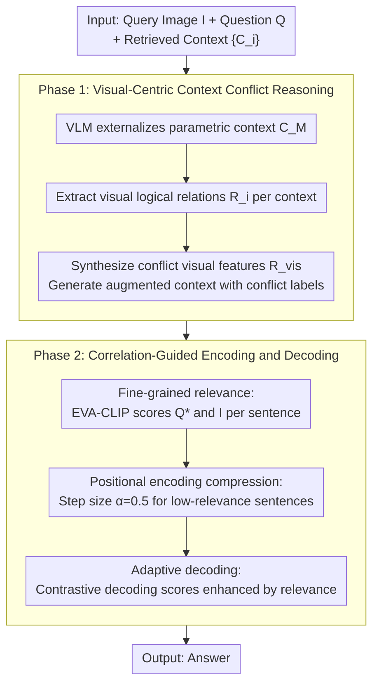

# CC-VQA: Conflict- and Correlation-Aware Method for Mitigating Knowledge Conflict in Knowledge-Based Visual Question Answering

**Conference**: CVPR2026  
**arXiv**: [2602.23952](https://arxiv.org/abs/2602.23952)  
**Code**: [github.com/cqu-student/CC-VQA](https://github.com/cqu-student/CC-VQA)  
**Area**: Information Retrieval  
**Keywords**: Knowledge Conflict, Retrieval-Augmented Generation, KB-VQA, Visual Reasoning, Contrastive Decoding, Positional Encoding Compression

## TL;DR
Ours proposes CC-VQA, a training-free method for mitigating knowledge conflict. Through a two-stage strategy involving visual-centric context conflict reasoning and correlation-guided encoding/decoding, it achieves an absolute accuracy gain of 3.3%-6.4% across E-VQA, InfoSeek, and OK-VQA benchmarks.

## Background & Motivation
1. Knowledge-based VQA (KB-VQA) introduces external knowledge via RAG, but conflicts frequently arise between external knowledge and the model's parametric knowledge.
2. Analysis shows that while RAG brings a 16.82% accuracy gain, it also introduces 10.53% new errors—where originally correct answers are misled by incorrect context.
3. Existing knowledge conflict mitigation methods (prompting/decoding) are primarily migrated from text-only scenarios, ignoring the critical role of visual information in conflict identification.
4. High redundancy exists in retrieved contexts: each context averages 107 sentences, yet 90% of correct answers are contained within only the top 25% of the most similar sentences.
5. Conflicts in multimodal RAG systems are more complex than in text-only systems, involving cross-modal retrieval limitations, complex visual understanding, and amplified model hallucinations.
6. There is a need to simultaneously utilize visual semantic features and fine-grained context correlation to mitigate knowledge conflicts.

## Method

### Overall Architecture

CC-VQA targets "knowledge conflict" in KB-VQA: while RAG-introduced external context brings an average 16.82% gain, it also misguides the model in originally correct cases (introducing 10.53% new errors) due to incorrect passages. It is a training-free approach consisting of two sequential phases—Phase 1: visual-centric context conflict reasoning, which explicitly extracts "which claims the image actually supports"; Phase 2: correlation-guided encoding and decoding, using fine-grained relevance to naturally suppress low-information or image-irrelevant sentences within the attention mechanism.

### Key Designs

**1. Visual-Centric Context Conflict Reasoning: Using images rather than pure text logic as the arbiter of conflict**

Prior conflict mitigation often migrated from text-only scenarios, overlooking that vision acts as the judge in VQA. CC-VQA first uses a VLM to generate an answer and background knowledge based on the query $(I,Q)$, externalizing it as parametric context $C_M$. It then extracts the visual logical relationship $R_i = \text{VLM}(I, Q, C_i)$ for each retrieved context $C_i$. Finally, it synthesizes all $\{R_i\}$ to abstract key visual features of the conflict $R_{vis} = \text{VLM}(I, Q, \{R_i\})$. This chain transforms "which context the image supports/refutes" into explicit signals for subsequent encoding and decoding.

**2. Fine-grained Relevance: Locating the few truly useful sentences in retrieved context**

Statistical findings show an average of 107 sentences per context, but 90% of correct answers reside in the top 25% of sentences by similarity, indicating extreme redundancy. CC-VQA uses EVA-CLIP to calculate the relevance of each sentence to the rewritten question $Q^*$ and the image $I$ simultaneously, taking the average: $r_{ij} = \frac{1}{2}(\text{EVA-CLIP}(Q^*, s_{ij}) + \text{EVA-CLIP}(I, s_{ij}))$. This provides a sentence-level basis for de-redundancy.

**3. Positional Encoding Compression: Weakening attention on low-relevance sentences without truncation**

Directly deleting sentences may lose information, while keeping them introduces noise interference. For sentences falling within the low-relevance interval (bottom $\tau$ percentile) $\mathcal{L}_\tau$, CC-VQA compresses their RoPE positional encoding step size to $\alpha=0.5$:

$$\text{pos}(t_j) = \begin{cases} \text{pos}(t_{j-1}) + \alpha & \text{if } \text{sent}(t_j) \in \mathcal{L}_\tau \\ \text{pos}(t_{j-1}) + 1 & \text{otherwise} \end{cases}$$

Low-information sentences are "squeezed" into closer positional intervals, causing their attention weights to decrease, while their content remains fully preserved in the context.

**4. Adaptive Decoding: Incorporating relevance concentration into contrastive decoding**

Building upon contrastive decoding, CC-VQA adds a relevance-enhanced conflict score $s'_t = \sigma(D_t + \Delta H_t + K + \delta)$, where $K = 1 - (\frac{1}{N}\sum r_i)(1 - \frac{H(\mathbf{r})}{\log M})$ combines both mean relevance and the concentration of relevance. When useful information is both high and concentrated, the decoder trusts the context more; otherwise, it relies more on parametric knowledge.

## Key Experimental Results

### Main Results: Three KB-VQA Benchmarks

| Method | E-VQA Single-Hop | E-VQA All | InfoSeek All |
|------|-------------------|-----------|-------------|
| Qwen2.5-VL-7B (zero-shot) | 21.7 | 20.3 | 23.7 |
| EchoSight | 26.4 | 24.9 | 30.4 |
| Wiki-LLaVA | 17.7 | 20.3 | 28.9 |
| ReflectiVA | 28.0 | 29.2 | 40.1 |
| MMKB-RAG | 39.7 | 35.9 | 36.4 |
| **CC-VQA (Ours)** | **Best** | **Best** | **Best** |

### Ablation Study

| Component | E-VQA Impact | InfoSeek Impact |
|------|-----------|--------------|
| w/o Visual Conflict Reasoning | -2-3% | -2-3% |
| w/o Positional Encoding Compression | -1-2% | -1-2% |
| w/o Adaptive Decoding | -2-3% | -2-3% |
| Full CC-VQA | **Best** | **Best** |

### Key Findings
- CC-VQA achieves a 3.3%-6.4% absolute gain across all benchmarks, completely training-free.
- The contribution of visual semantic features to identifying context conflicts is empirically validated.
- Positional encoding compression effectively reduces the attention weight of low-relevance content without destroying information integrity.

## Highlights & Insights
- First to systematically use visual information to assist in knowledge conflict detection, rather than relying solely on textual logic.
- Positional encoding compression is an elegant design—it does not require context truncation, merely weakening the attention weight of low-information sentences.
- Completely training-free, allowing for direct deployment on any VLM.

## Limitations & Future Work
- Dependency on the VLM's inherent ability for conflict reasoning and visual analysis; performance may be limited on weaker models.
- Multi-step VLM calls increase inference latency (parametric context generation + visual reasoning + conflict analysis).
- EVA-CLIP relevance estimation may be inaccurate for certain specialized domains.

## Related Work & Insights
- Difference from pure decoding methods like AdaCAD / CoCoA: CC-VQA adds encoding-side manipulation (positional compression) and visual conflict reasoning.
- Difference from FaithfulRAG: CC-VQA utilizes visual information for conflict detection rather than just text-level self-reflection.
- Insight: Manipulating positional encoding as a means to control attention allocation can be widely applied to long-context scenarios.

## Rating
- Novelty: ⭐⭐⭐⭐ (Novel combination of visual-centric conflict reasoning and positional encoding compression)
- Experimental Thoroughness: ⭐⭐⭐⭐ (Comprehensive ablation across 3 major benchmarks)
- Writing Quality: ⭐⭐⭐⭐ (Observation-driven design with detailed data analysis)
- Value: ⭐⭐⭐⭐ (Strong training-free utility; multimodal RAG conflict is a significant problem)

<!-- RELATED:START -->

## Related Papers

- [\[ACL 2026\] WikiSeeker: Rethinking the Role of Vision-Language Models in Knowledge-Based Visual Question Answering](../../ACL2026/multimodal_vlm/wikiseeker_rethinking_the_role_of_vision-language_models_in_knowledge-based_visu.md)
- [\[CVPR 2026\] DeepAlign: Mitigating Modality Conflict through Modality-Specific Alignment](deepalign_mitigating_modality_conflict_through_modality-specific_alignment.md)
- [\[ACL 2025\] MAGIC-VQA: Multimodal and Grounded Inference with Commonsense Knowledge for Visual Question Answering](../../ACL2025/multimodal_vlm/magic-vqa_multimodal_and_grounded_inference_with_commonsense_knowledge_for_visua.md)
- [\[CVPR 2026\] Conflict-Aware Adaptive Cross-Reconstruction for Multimodal Sentiment Analysis](conflict-aware_adaptive_cross-reconstruction_for_multimodal_sentiment_analysis.md)
- [\[CVPR 2026\] Uncertainty-Aware Knowledge Distillation for Multimodal Large Language Models](uncertainty-aware_knowledge_distillation_for_multimodal_large_language_models.md)

<!-- RELATED:END -->
