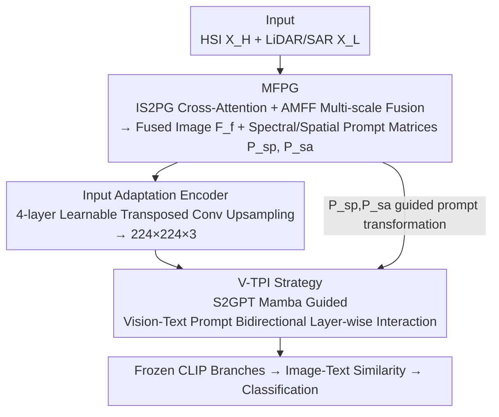

# CF-IPT: Cross-Modal Fusion Interactive Prompt Tuning of Vision-Language Pre-Trained Model for Multisource Remote Sensing Data Classification

**Conference**: CVPR 2026  
**Paper**: [CVF Open Access](https://openaccess.thecvf.com/content/CVPR2026/html/Ji_CF-IPT_Cross-Modal_Fusion_Interactive_Prompt_Tuning_of_Vision-Language_Pre-Trained_Model_CVPR_2026_paper.html)  
**Code**: https://github.com/Jiahuiqu/CF-IPT  
**Area**: Multimodal VLM / Remote Sensing Classification / Prompt Tuning  
**Keywords**: Prompt Tuning, CLIP, Multisource Remote Sensing Classification, Cross-modal Fusion, Mamba

## TL;DR
CF-IPT proposes a prompt tuning framework that fuses Hyperspectral (HSI) and LiDAR/SAR data into a single image to generate spectral-spatial prompt matrices. These matrices guide the bidirectional interactive alignment between CLIP's vision and text prompts. By tuning only 0.76% of CLIP's parameters, it transfers the natural-image pre-trained model to multisource remote sensing classification, achieving OA gains of 1.38%/2.27%/1.38% over SOTA on Houston, MUUFL, and Augsburg datasets respectively.

## Background & Motivation
**Background**: Multisource remote sensing joint classification (e.g., combining rich spectral data from HSI with spatial structures from LiDAR/SAR) has traditionally relied on dual-stream fusion networks like CNN, Transformer, or Mamba (e.g., MFT, MCFT, MSFMamba) trained from scratch. Recently, researchers have begun adapting Large Vision-Language Models (VLMs) like CLIP using prompt tuning, Adapters, or LoRA, as these methods only tune a small set of learnable vectors while keeping the backbone frozen, saving parameters and computation.

**Limitations of Prior Work**: Direct transfer of CLIP to remote sensing faces two major barriers. First, at the **Data Level**, the imaging characteristics of HSI/LiDAR/SAR differ significantly from natural images (hundreds of narrow spectral bands, vertical structures, and topography). The visual representations learned by CLIP on natural images cannot capture these spectral-spatial features. Furthermore, CLIP only accepts a single RGB image, making the input of multisource data a challenge. Second, at the **Task Level**, existing prompt injection is mostly "unilateral" (inserting prompts only in the vision or text branch). This fails to learn complex visual representations in depth or achieve alignment between vision and text prompts, which contradicts CLIP's core principle of contrastive alignment.

**Key Challenge**: There is a structural mismatch between the rich spectral-spatial information of multisource remote sensing and CLIP's single-source natural image prior. Simultaneously, unilateral prompts fail to activate CLIP's cross-modal alignment mechanism.

**Goal**: To enable CLIP to overcome both barriers simultaneously—adapting to multisource remote sensing data and shifting the text-branch alignment target from natural images to remote sensing—while adding minimal parameters.

**Key Insight**: Instead of forcing multisource data into CLIP, the authors observe that it is better to **transform the products of multisource fusion (spectral and spatial matrices) into "prompts."** These matrices, carrying native remote sensing features, then guide the bidirectional interaction of CLIP’s internal vision and text prompts.

**Core Idea**: Use "spectral-spatial prompt matrices generated from cross-modal fusion" as a medium to guide the bidirectional transformation and alignment of CLIP’s vision and text prompts, unifying data adaptation and task adaptation into a single prompt tuning framework.

## Method

### Overall Architecture
Given multisource remote sensing data $D_t=\{X_H, X_L, c\}$ (where $X_H$ is spectral-rich like HSI, $X_L$ is spatial-rich like LiDAR/SAR, and $c$ is the class label), the CLIP parameters $\phi$ are frozen. CF-IPT introduces a small set of learnable parameters $\theta_f$ (approx. 0.76% of CLIP) to perform the downstream classification. The workflow consists of two phases: **Phase 1: Data Pre-processing** for "multisource-to-single-image" data adaptation, and **Phase 2: Fine-tuning** for "unilateral-to-cross-modal" task adaptation.

In Phase 1, the MFPG module uses cross-attention for interaction, outputting a compact fused image $F_f$ and prompt matrices $P_{sp}, P_{sa}$ that retain native spectral/spatial styles. The fused image is then upsampled to the required $224\times224\times3$ size by the Input Adaptation Encoder (IAE). In Phase 2, the V-TPI strategy injects learnable prompts into both CLIP branches. Using $P_{sp}, P_{sa}$ as guidance, these prompts undergo layer-wise bidirectional transformation and alignment via the S2GPT Mamba module, with classification performed via image-text similarity.

### Key Designs

**1. MFPG: Transforming Fusion Products into Spectral-Spatial Prompt Matrices**

This step addresses the data-level issue where multisource data cannot fit into single-source CLIP and fusion often loses native features. MFPG consists of two sub-modules. The first, IS2PG, uses cross-attention for feature extraction: the dual branches $X_H\in\mathbb{R}^{H\times W\times C}$ and $X_L\in\mathbb{R}^{H\times W\times D}$ pass through linear layers to obtain a spectral prompt matrix $P_{sp}\in\mathbb{R}^{C\times C}$ and a spatial prompt matrix $P_{sa}\in\mathbb{R}^{HW\times HW}$, where **the two branches serve as Query and Key for each other**—

$$P_{sp}=\sigma(L_q(X_L)\odot L_k(X_H)),\quad P_{sa}=\sigma(L_q(X_H)\odot L_k(X_L))$$

The residual spectral/spatial features are extracted as $F_H=X_H+L_v([X_H,X_L])\odot P_{sp}$ and $F_L=X_L+L_v([X_H,X_L])\odot P_{sa}$, then concatenated to form $F_m$. The innovation here is that $P_{sp}$ and $P_{sa}$ are not just intermediate variables; they serve as prompt guidance signals in Phase 2, compensating for native features that might otherwise be compressed during fusion.

The second part, AMFF, performs deep fusion: global average pooling $P_{avg}$ and max pooling $P_{max}$ are used to generate channel attention $z_{avg}, z_{max}$ for recalibration $\tilde F_m=F_m\odot\sigma(z_{avg}+z_{max})$, suppressing redundant bands. Spatially, $\tilde F_m$ passes through $1\times1, 3\times3, 5\times5$ parallel convolutions to produce the multi-scale fused image $F_f=\sum_{i=1}^{3}\text{Conv}_{(2i-1)\times(2i-1)}(\tilde F_m)+F_m$.

**2. Input Adaptation Encoder: Learnable Upsampling to CLIP Input Dimensions**

Fusion patches are typically small (patch size 7–11), while CLIP requires $224\times224\times3$. Direct bilinear/bicubic interpolation causes detail loss and lacks semantic guidance. The authors use a four-layer learnable transposed convolution (Transposed Conv + BN + GeLU) to upsample $F_f$ to $F_n\in\mathbb{R}^{224\times224\times3}$. Ablation studies show this is a **critical component**—replacing it with bilinear interpolation caused OA to drop significantly (up to 8.90%).

**3. V-TPI: Bidirectional Interaction via Spectral-Spatial Guidance**

To address the task-level alignment issue, V-TPI injects learnable prompts $P_V$ and $P_T$ into both CLIP branches. At each layer $i$, the prompts **transform each other and are added back**:

$$\tilde P_{V_i},\tilde P_{T_i}=\theta_T(P_{V_i},P_{T_i}),\qquad P_{TV_i}=P_{T_i}+\tilde P_{V_i},\quad P_{VT_i}=P_{V_i}+\tilde P_{T_i}$$

The core transformation module is **S2GPT Mamba**. Chosen for its efficiency in sequence modeling, it incorporates the spectral-spatial priors from Phase 1:

$$P_{S2}=\text{S2PtTrans}(\text{SiLU}(\text{DWConv}(L(P)))),\quad P_{out}=L\big(\text{SiLU}(L(P))\odot \text{LN}(\text{SSM}_{V\text{-}T}(P_{S2}))\big)$$

The S2PtTrans module injects $P_{sp}$ and $P_{sa}$ by splitting the prompt along the channel dimension and applying spatial and spectral projections respectively. This ensures the model learns how spectral-spatial variations affect vision/text semantics.

### Loss & Training
**Text Prompt Design**: A soft prompt template "A multisource fusion patch of [CLASS]" is used, where $P_T$ is learnable and concatenated with class name embeddings.

Two losses are used: **Cross-modal Representation Consistency Loss** $L_{CRC}$ (standard contrastive cross-entropy) and **Text Representation Diversity Loss** $L_{TRD}$. The latter pushes the similarity matrix of class text embeddings toward an identity matrix $I$ to reduce confusion between similar RS classes: $L_{TRD}=\mathbb{E}\,|S_T-I|$. Total loss: $L_{total}=L_{CRC}+\lambda\cdot L_{TRD}$ ($\lambda=0.02$).

## Key Experimental Results

### Main Results
Testing on Houston (HS+LiDAR), MUUFL (HS+LiDAR), and Augsburg (HS+SAR) with 40 samples per class.

| Dataset | Method | OA(%) | AA(%) | κ | Params(M) |
|--------|------|-------|-------|------|-----------|
| Houston | DiffCLIP | 96.15 | 96.59 | 95.83 | 10.58 |
| Houston | SPT | 96.01 | 96.45 | 95.69 | 3.43 |
| Houston | M³amba | 95.93 | 96.35 | 95.60 | 70.81 |
| Houston | **Ours** | **97.89** | **98.23** | **97.72** | **1.14** |
| MUUFL | SPT | 87.69 | 86.09 | 83.88 | 1.53 |
| MUUFL | DiffCLIP | 86.98 | 85.01 | 82.81 | 10.55 |
| MUUFL | **Ours** | **89.25** | **88.42** | **85.89** | **1.03** |
| Augsburg | DiffCLIP | 88.45 | 75.34 | 83.76 | 10.60 |
| Augsburg | **Ours** | **89.83** | **80.05** | **85.64** | **0.90** |

OA is 1.38%–2.27% higher than Prev. SOTA while using roughly 10x–70x fewer parameters than large models like M³amba or DiffCLIP.

### Ablation Study

| Configuration | Houston OA | MUUFL OA | Augsburg OA | Description |
|------|-----------|----------|-------------|------|
| Full (CF-IPT) | 97.89 | 89.25 | 89.83 | Full Model |
| Variant-1 (w/o S²Prompt) | 96.74 | 83.94 | 84.56 | Prompts replaced with ones matrix |
| Variant-2 (w/o Image Fusion) | 93.28 | 86.62 | 84.62 | Fusion replaced with channel concat |
| Variant-3 (IAE replaced) | 92.49 | 80.77 | 80.60 | Upsampling replaced with bilinear |
| Variant-4a (Vision prompt only) | 96.70 | 88.02 | 86.66 | No text prompt |
| Variant-4c (w/o interaction) | 96.67 | 85.88 | 86.34 | Independent branches w/o interaction |
| Variant-4d (S2GPT to Transf.) | 96.85 | 86.37 | 86.37 | Transformer instead of Mamba |

### Key Findings
- **IAE is the most significant factor**: Replacing it with bilinear interpolation caused OA to drop by 8.48%/8.90% on MUUFL/Augsburg.
- **Image Fusion > Concatenation**: MFPG's multi-scale fusion captures significantly more discriminative features.
- **Spectral-spatial prompt matrices are essential**: Using an identity matrix instead of $P_{sp},P_{sa}$ leads to a sharp performance decline.
- **Bidirectional Interaction > Unilateral Prompting**: Interaction via S2GPT Mamba out-performs independent branch prompt tuning.

## Highlights & Insights
- **The "Fusion products as Prompts" approach**: Instead of treating fusion and prompt tuning as separate processes, the authors link them by using spectral/spatial matrices as guidance for the prompts.
- **Activating CLIP's alignment nature**: Bidirectional prompt transformation aligns both modalities toward a common RS domain, which is more effective than unilateral injection.
- **Extreme Parameter Efficiency**: Achieving SOTA performance with only ~1M trainable parameters is highly attractive for compute-constrained RS applications.

## Limitations & Future Work
- **Relatively heavy logic chain**: The model includes MFPG (IS2PG+AMFF), IAE, V-TPI (S2GPT Mamba), and dual losses, which might increase implementation complexity.
- **Focused on few-shot settings**: While performance is high with 40 samples per class, generalization to large-scale data or cross-sensor transfer is not fully explored.
- **Spectral-Spatial dichotomy**: The architecture assumes a clear split between spectral and spatial sources; its applicability to scenarios with 3+ sources or less distinct modalities remains to be verified.

## Related Work & Insights
- **vs SPT**: While SPT uses spectral prompts, it is unilateral. CF-IPT gains approx. 1.88% OA on Houston due to the bidirectional interaction.
- **vs DiffCLIP / M³amba**: These rely on larger backbones (10–70M parameters). CF-IPT proves that alignment mechanism design is more efficient than increasing parameter count.
- **vs MaPLe/CoOp**: Standard VLM prompt tuning methods are outperformed by 1.8%–3.3% on RS scene datasets, validating the RS-specific design.

## Rating
- Novelty: ⭐⭐⭐⭐ 
- Experimental Thoroughness: ⭐⭐⭐⭐ 
- Writing Quality: ⭐⭐⭐⭐ 
- Value: ⭐⭐⭐⭐

<!-- RELATED:START -->

## Related Papers

- [\[CVPR 2026\] Towards Calibrating Prompt Tuning of Vision-Language Models](towards_calibrating_prompt_tuning_of_vision-language_models.md)
- [\[CVPR 2026\] VLM4RSDet: Collaborative Optimization with Vision-Language Model for Enhancing Remote Sensing Object Detection](vlm4rsdet_collaborative_optimization_with_vision-language_model_for_enhancing_re.md)
- [\[CVPR 2026\] Improving Calibration in Test-Time Prompt Tuning for Vision-Language Models via Data-Free Flatness-Aware Prompt Pretraining](improving_calibration_in_test-time_prompt_tuning_for_vision-language_models_via_.md)
- [\[ICLR 2026\] PhysLLM: Harnessing Large Language Models for Cross-Modal Remote Physiological Sensing](../../ICLR2026/multimodal_vlm/physllm_harnessing_large_language_models_for_cross-modal_remote_physiological_se.md)
- [\[CVPR 2026\] CAPT: Confusion-Aware Prompt Tuning for Reducing Vision-Language Misalignment](capt_confusion-aware_prompt_tuning_for_reducing_vision-language_misalignment.md)

<!-- RELATED:END -->
