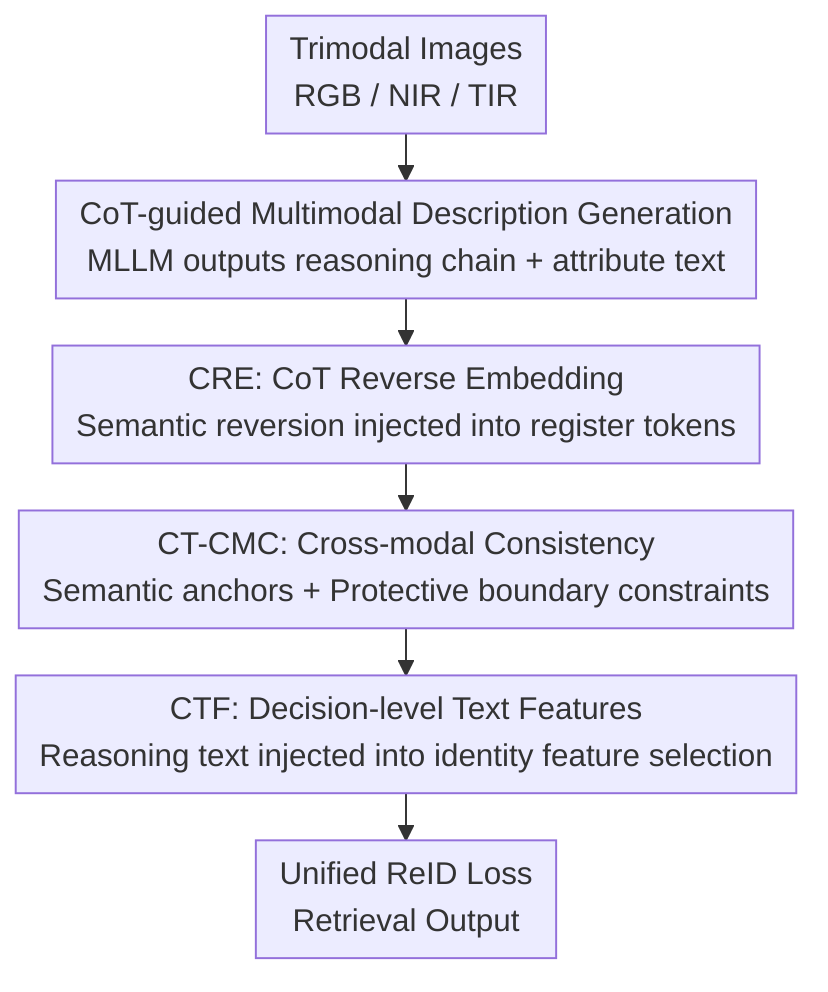

# Chain-of-Thought Guided Multi-Modal Object Re-Identification

**Conference**: CVPR 2026  
**Paper**: [CVF Open Access](https://openaccess.thecvf.com/content/CVPR2026/html/Gao_Chain-of-Thought_Guided_Multi-Modal_Object_Re-Identification_CVPR_2026_paper.html)  
**Code**: Not released  
**Area**: Multimodal VLM  
**Keywords**: Multimodal Object Re-ID, Chain-of-Thought (CoT), Cross-modal Consistency, MLLM, DINOv3  

## TL;DR
CoT-ReID enables multimodal large models to "reason while looking" at RGB/NIR/TIR trimodal objects. It decomposes reasoning chain text into three levels—early, late, and decision-making—to guide visual feature learning, setting new SOTA benchmarks (e.g., MSVR310 mAP 71.7%) across four multispectral ReID datasets.

## Background & Motivation
**Background**: Multispectral Object Re-Identification (ReID) utilizes RGB, Near-Infrared (NIR), and Thermal Infrared (TIR) spectra to address real-world challenges like darkness, occlusion, and strong lighting. Mainstream methods in recent years leverage MLLMs to generate textual attribute labels for each target (e.g., color, car model, pedestrian clothing) and design image-text alignment modules to fuse these descriptive semantics into visual features, with representative works including IDEA, DeMo, and PromptMA.

**Limitations of Prior Work**: These methods treat text merely as a "flat attribute list"—tagging targets with static, fine-grained descriptions while ignoring the **inherent hierarchical logical relationships** between visual elements. For instance, a car's "brand + model" implies its "body lines," and a pedestrian's "clothing" implies "gender." These attributes are not isolated but derived layer by layer. Relying solely on static semantic matching discards the reasoning structure actually used by humans to identify objects.

**Key Challenge**: Mining such hierarchical relationships directly in the visual domain is extremely difficult (visual features are continuous and entangled), whereas logical relationships in the semantic domain are naturally explainable and explicitly expressible. The problem is: how to inject "explainable semantic reasoning structures" back into "hard-to-decompose visual features"? Furthermore, introducing multimodality brings a dilemma—alignment that is too loose fails to learn consensus, while alignment that is too aggressive allows strong modalities to suppress weak ones, erasing modal uniqueness.

**Key Insight**: CoT (Chain-of-Thought) is a structured reasoning paradigm designed for large models that decomposes complex visual attributes into explainable reasoning sequences. The authors observe that humans "see" before they "speak," and both vision and language carry logical reasoning processes (Fig. 1). Thus, CoT reasoning text produced by MLLMs can serve as "semantic context anchors" to simulate this hierarchical logic throughout the ReID training pipeline.

**Core Idea**: Utilize CoT reasoning text (rather than static attribute labels) to guide visual feature learning across **early, late, and decision-making levels**. This upgrades cross-modal consistency constraints from "surface alignment based on static semantics" to "deep semantic binding based on dynamic reasoning + conditional boundary constraints."

## Method

### Overall Architecture
The input to CoT-ReID consists of images of the same identity under three spectra $X_i=[X_{rgb},X_{nir},X_{tir}]$, and the output is discriminative multimodal identity features for retrieval. The pipeline follows two steps: first, an MLLM (Qwen-VL) generates two types of text for each modality—**CoT reasoning text** (recording the reasoning process) and **target attribute description text**; second, this reasoning chain text guides visual learning across three sequential levels.

Specifically, trimodal images first pass through a DINOv3 visual backbone. At the **early level**, the CRE module performs semantic reversion of the CoT text and embeds it into DINOv3 register tokens to calibrate low-level visual features. After obtaining visual features, the CT-CMC module at the **late level** uses the CoT text as conditional anchors for bidirectional cross-modal alignment, employing protective boundaries to prevent over-fusion. Finally, at the **decision-making level**, the CTF module injects reasoned text attribute features into identity feature selection, optimizing jointly with visual features under a unified ReID loss. These three levels correspond to the "early / late / decision-making" end-to-end guidance emphasized in the paper.

### Key Designs

**1. CoT-guided Multimodal Description Generation: Replacing Static Labels with Reasoning Chains**

To address the issue that "existing text is a flat attribute list discarding logic," the authors no longer require the MLLM to output isolated labels. Instead, they require a reasoning process for each modality: identify the subject, verify attribute consistency, and finally weight reliable attributes. This produces two types of data—CoT reasoning text (recording the "why") and attribute descriptions. Using template $TP_i$ for modality $i\in\{rgb,nir,tir\}$, the outputs are $X_{T,i}=M(X_i,TP_i)$ and $X_{T',i}=M(X_i,TP_i)$. This text encodes both attribute definitions and logical relationships, providing a much richer semantic context.

**2. CRE (CoT-guided Reverse Embedding): Injecting Reasoning Semantics into Low-level Visual Features**

To address the difficulty of mining hierarchical logic in the visual domain, CRE intervenes at the earliest stage of feature learning. The authors use DINOv3 as the backbone, utilizing its 4 register tokens as stable carriers of global semantics. CRE embeds the **semantic reversion** of CoT reasoning text into these tokens: first, a frozen CLIP text encoder $\Phi$ encodes the text as $Q_T^T=\Phi(X_{T',i})$, which is projected to the visual dimension $Q_T^V=Q_T^T\cdot W_{proj}+b_{proj}$. The projected tokens are concatenated with visual patches and original register tokens:

$$R_{in}^{(l)}=\big[\,Z_N^{(l)}\oplus r^{(l)}\oplus Q_T^{V(l)}\,\big],\quad F_{out}^{(l)}=\alpha\big(R_{in}^{(l)};\theta_{blk}^{(l)}\big)$$

Where $Z_N$ is the visual patch sequence, $n=4$ is the number of register tokens, and $\alpha(\cdot)$ is the $l$-th Transformer block. This allows reasoning semantics to shape low-level representations from the start.

**3. CT-CMC (CoT-guided Cross-Modal Consistency): CoT Text as Anchors + Protective Boundaries**

This is the core module, addressing the multimodal fusion dilemma. CT-CMC uses semantic context as both a "conditional signal" and a "protective boundary," defining positive pairs (same ID, different modalities) and negative pairs based on joint and marginal distributions.

**Protective Boundary**: Based on the proven lower bound $I(F_i,F_j|T)\ge \log(N_1/N_0)+L_{NCE}(h)$, a margin $\Delta=\log(N_1/N_0)$ is introduced to actively control the degree of fusion and prevent over-fusion. **CoT Semantic Anchor**: Cross-modal consistency is defined under the CoT text condition $Q_{T'}^T$:

$$L_{i2j}=-\log\!\Big(\mathbb{E}_{(F_i,F_j)\sim p_{pos}^{ij}}h(F_i,F_j,Q_{T',i}^{T'})\Big)-\frac{N_1}{N_0}\log\!\Big(1-\mathbb{E}_{(F_i,F_j)\sim p_{neg}^{ij}}h(F_i,F_j,Q_{T',i}^{T'})\Big)$$

The critic function $h$ estimates the probability of a pair being positive under the context $Q_{T'}$. Bidirectional constraints are applied across all three modalities: $L_C=\sum_{i,j\in\{R,N,T\}}L_{i2j}$.

**4. CTF (CoT-guided Text Features): Injecting Reasoning Text into Decision-level Identity Selection**

CTF concludes the process at the decision-making level, injecting text attribute features after logical reasoning into the selection of discriminative identity features. During training, image and text features ($F_i^V,F_i^T$) are extracted separately, with each stream optimized using label-smoothed cross-entropy and triplet loss $L_g(F)=L_{CE}(F)+L_{Tri}(F)$, combined with CT-CMC losses for the total objective:

$$L=L_g(F_i^V)+L_g(F_i^T)+L_C(F_i^V,F_i^T,F_i^{T'})$$

## Key Experimental Results

### Main Results
Testing on three multispectral vehicle datasets (RGBNT100, WMVeID863, MSVR310) and one pedestrian dataset (RGBNT201). Comparison includes strong baselines (DeMo, IDEA) adapted to the DINOv3 backbone (denoted $\circ$).

| Dataset | Metric | Ours CoT$\circ$ | DINOv3$\circ$ baseline | Prev. SOTA | Gain |
|--------|------|-----------|------------------|----------|------|
| RGBNT100 | mAP | 89.9 | 87.0 | 88.4 (DeMo$\circ$) | +1.5 vs DeMo$\circ$ |
| WMVeID863 | mAP | 74.7 | 70.1 | 72.5 (DeMo$\circ$) | +2.2 vs DeMo$\circ$ |
| MSVR310 | mAP | 71.7 | 68.2 | 68.7 (DeMo$\circ$) | +3.0 vs DeMo$\circ$ |
| RGBNT201 | mAP | 83.3 | 77.5 | 81.3 (IDEA$\circ$) | +2.0 vs IDEA$\circ$ |

### Ablation Study
Module ablation (WMVeID863, A is baseline = DINOv3$\circ$):

| Config | CRE | CT-CMC | CTF | mAP | Rank-1 |
|------|-----|--------|-----|-----|-----|
| A (baseline) | × | × | × | 70.1 | 80.8 |
| G (Full) | ✓ | ✓ | ✓ | **74.7** | **82.0** |

CT-CMC component ablation (WMVeID863):

| Config | CoT Anchor | Bi-Cross | Pro.Margin | mAP | Rank-1 |
|------|---------|----------|-----------|-----|-----|
| Full | ✓ | ✓ | ✓ | **74.7** | **82.0** |
| w/o CoT Anchor | × | ✓ | ✓ | 73.2 | 80.9 |

### Key Findings
- **All modules are complementary**: Adding any single module improves the baseline, and the full configuration (G) reaches 74.7 mAP, validating the three-level guidance.
- **CoT Text > Static Attribute Text**: Replacing CoT text with IDEA's static text leads to significant performance drops (e.g., RGBNT201 mAP drops 83.3 → 80.1), proving the value of reasoning over simple lists.
- **CT-CMC > Traditional Multimodal Losses**: Replacing CT-CMC with 3M Loss results in a drop of 1.8% mAP and 1.2% Rank-1.
- **Retrieval Visualization**: CoT semantics help filter mismatched candidates. While the baseline might mix silver and white cars, CoT guidance ensures only "white cars" are retrieved in Top-5 results.

## Highlights & Insights
- **Migrating CoT to Visual Feature Learning**: While CoT is typically used for re-ranking or generation, this work uses it as a semantic context to enhance visual explainability, treating text logic as a "scaffolding" for hard-to-mine visual relationships.
- **Leveraging Register Tokens**: Using DINOv3 register tokens for injection utilizes their role as stable global semantic carriers without disrupting patch features.
- **Controlled Fusion via Protective Boundaries**: Using the information-theoretic lower bound $\Delta=\log(N_1/N_0)$ to quantify and control fusion is a rigorous alternative to heuristic weight tuning.

## Limitations & Future Work
- The specific contribution of individual **reasoning signals** is not yet fully understood.
- Performance relies on offline MLLM generations; errors in MLLM reasoning may act as noisy supervision.
- High computational overhead for text generation and dependency on complete trimodal availability are not fully addressed.

## Related Work & Insights
- **vs IDEA / DeMo**: Moves from static attribute lists to reasoning chains; empirical tests show reasoning chains provide superior guidance.
- **vs InfoBridge**: Extends the protective boundary concept to incorporate CoT text as a conditional anchor specifically for trimodal ReID consistency.
- **vs X-CoT**: While prior CoT works focus on prompt refinement or ranking, this is the first to use CoT for direct visual representation learning in ReID.

## Rating
- Novelty: ⭐⭐⭐⭐ Clear paradigm shift by using CoT as semantic context for visual features.
- Experimental Thoroughness: ⭐⭐⭐⭐ Extensive ablations across datasets and components, though net gain is slightly diluted by the strong DINOv3 backbone.
- Writing Quality: ⭐⭐⭐ Storytelling is strong, but some modules lack independent formal definitions.
- Value: ⭐⭐⭐⭐ Practical tricks like register-token injection and protective boundaries are highly transferable.

<!-- RELATED:START -->

## Related Papers

- [\[CVPR 2026\] When Visualizing is the First Step to Reasoning: MIRA, a Benchmark for Visual Chain-of-Thought](when_visualizing_is_the_first_step_to_reasoning_mira_a_benchmark_for_visual_chai.md)
- [\[CVPR 2026\] UniT: Unified Multimodal Chain-of-Thought Test-time Scaling](unit_unified_multimodal_chain-of-thought_test-time_scaling.md)
- [\[NeurIPS 2025\] MDReID: Modality-Decoupled Learning for Any-to-Any Multi-Modal Object Re-Identification](../../NeurIPS2025/multimodal_vlm/mdreid_modality-decoupled_learning_for_any-to-any_multi-modal_object_re-identifi.md)
- [\[CVPR 2026\] Beyond Weak Supervision: MLLMs-Guided Graded Knowledge Distillation for Unsupervised Camouflaged Object Detection](beyond_weak_supervision_mllms-guided_graded_knowledge_distillation_for_unsupervi.md)
- [\[CVPR 2026\] Fuel Gauge: Estimating Chain-of-Thought Length Ahead of Time in Large Multimodal Models](fuel_gauge_estimating_chain-of-thought_length_ahead_of_time_in_large_multimodal_.md)

<!-- RELATED:END -->
